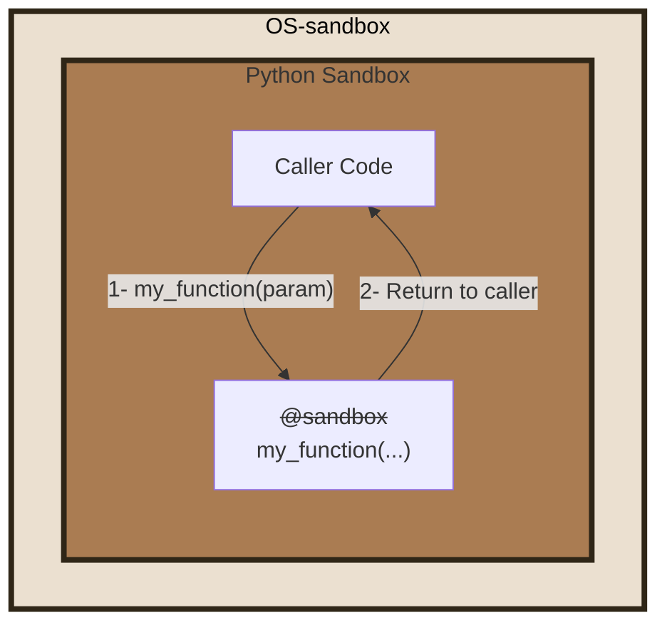
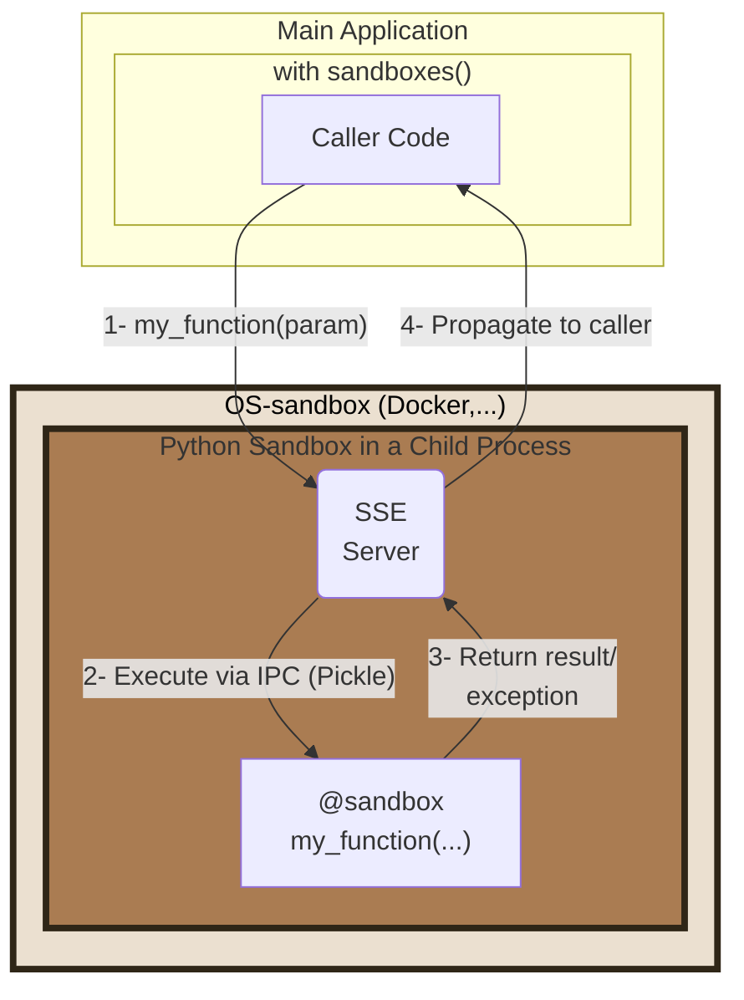
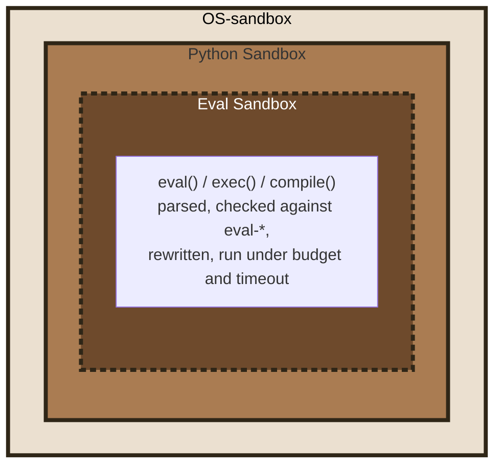

# PY-SANDBOXES

<p align="center">
  
</p>

[](https://pypi.org/project/pysandboxes/)
[](https://pypi.org/project/pysandboxes/)
[](https://pypi.org/project/pysandboxes/)
[](https://github.com/pprados/pysandboxes/blob/master/LICENSE.txt)
[](#platform-support)

> Unbeknownst protection of Python programs.

Applications increasingly run code or tools selected by an LLM. A manipulated model can cause those tools to read local files, reach internal services, or run commands ([OWASP LLM05:2025](https://genai.owasp.org/llmrisk/llm052025-improper-output-handling/), [OWASP LLM06:2025](https://genai.owasp.org/llmrisk/llm062025-excessive-agency/)). **Py-Sandboxes** is a Python security framework that applies an explicit policy to a process and can derive a starting policy by observing an application run.

[Home Page](https://www.github.com/pprados/pysandboxes/) | [API reference](https://pprados.github.io/pysandboxes/)

# Quick start

After the release is published to PyPI, run any module in a sandbox without changing the application code:

```bash
uvx python-sb -m my_module
```

Or install the package in the application environment:

```bash
pip install pysandboxes
python-sb -m my_module
```

The TestPyPI pre-release instructions above remain available for trying the current pre-release before the PyPI release. On the first run, learning mode records observed accesses in `.py-sandboxes`: every access is allowed and recorded rather than blocked, and that run has no OS boundary (it always runs under `subprocess`): only run trusted code on it. Exercise representative application paths, then review and narrow the generated policy before relying on it: behavior that was not exercised cannot be learned. Subsequent runs apply the policy, under `landlock` when the Linux kernel supports it (`subprocess` otherwise, with a warning).

[](https://github.com/pprados/pysandboxes/tree/master/samples/quick-demo)

This is complete mode: it launches the application under the sandbox. To isolate only selected functions, see [partial mode](#apply-the-sandbox-to-a-part-of-the-application-partial-mode).

To understand the design, start with [the security model](#what-it-protects-against-and-what-it-does-not), then see [provider trade-offs](#os-sandbox-vs-py-sandbox), [test coverage](https://github.com/pprados/pysandboxes/wiki/tests), and the [wiki index](https://github.com/pprados/pysandboxes/wiki).

# What it protects against, and what it does not

**Py-Sandboxes** addresses one threat model: *your application, or code it runs, using more capabilities than intended*. It offers three layers with different roles and limits:

- The **dynamic-code layer** (`eval-*`) parses, checks, rewrites, and runs source passed to `eval()`, `exec()`, or `compile()` under configured limits. It applies only to those entry points; see [the `eval-*` rules](https://github.com/pprados/pysandboxes/wiki/eval) and the [security assessment](https://github.com/pprados/pysandboxes/wiki/audit-eval-security).
- The **Python layer** (`py-sandbox`) intercepts selected Python APIs according to a policy. It improves visibility and limits accidental or ordinary misuse, but it is not an isolation boundary against hostile code: native extensions, `ctypes`, and direct system calls can bypass Python-level interception. See [known weaknesses](https://github.com/pprados/pysandboxes/wiki/weaknesses).
- The **OS isolation layer** applies Linux kernel mechanisms through `landlock`, `bwrap`, `firejail`, or `unshare`. The `qemu` provider runs the sandboxed process in a virtual machine. These providers have different capabilities and prerequisites; see [the provider comparison](https://github.com/pprados/pysandboxes/wiki/os-providers).

Learning mode can provide an initial inventory of accesses observed through supported APIs. It does not prove that the policy is complete: unexercised paths and accesses outside those APIs may be absent. Review the policy and test the application in enforcement mode before deployment.

Combine the dynamic-code and Python layers for policy checks and visibility; add an OS provider when the threat model requires isolation from compiled code. See [the provider matrix](#os-sandbox-vs-py-sandbox).

This is **not** a defense against a malicious third-party dependency that you installed yourself.

# Use cases

`python-sb` replaces `python` on a command line, so anything launched as a Python script runs with the rights
written in its `.py-sandboxes` file:

- **Agent skills, hooks and plugins**: the scripts of a skill run with all the rights of the user. A rule file
  shipped with the skill bounds them, and doubles as its permission manifest.
- **Tools, CLIs and MCP servers**: a policy can constrain supported file, network, environment, import, and sensitive-API operations to declared access.
- **AI coding agents**: the rule file is versioned, so `git diff -- '*.py-sandboxes'` shows every right the agent
  added between two commits.
- **Dependency updates**: a run without `--learn` turns a new behavior of a dependency into a visible violation.
- **Untrusted tests in CI**, **audit of an unknown script** with `--learn`, **LLM-generated code**.

See [use cases](https://github.com/pprados/pysandboxes/wiki/use-cases) for each scenario, the
protection level it needs, and what the rule file does not show.

# Platform support

The Python layer, with the `subprocess` provider, is available on Linux, macOS, and Windows. Kernel-backed OS providers (`landlock`, `bwrap`, `firejail`, `unshare`, and `qemu`) are Linux technologies and are also available through WSL where their kernel and tooling requirements are met. On macOS and Windows, Py-Sandboxes does not provide that OS isolation layer. See [provider platform requirements](https://github.com/pprados/pysandboxes/wiki/os-providers).

---

# Table of Contents

- [Quick start](#quick-start)
- [What it protects against, and what it does not](#what-it-protects-against-and-what-it-does-not)
- [Use cases](#use-cases)
- [Platform support](#platform-support)
- [Principle](#principle)
- [Usage](#usage)
  - [Apply the sandbox to the entire application  (complete mode)](#apply-the-sandbox-to-the-entire-application--complete-mode)
    - [Use with uvx](#use-with-uvx)
  - [Apply the sandbox to a part of the application (partial mode).](#apply-the-sandbox-to-a-part-of-the-application-partial-mode)
    - [Launching the Sandbox](#launching-the-sandbox)
    - [Executing a function in the sandbox (partial mode)](#executing-a-function-in-the-sandbox-partial-mode)
- [Security Filters](#security-filters)
  - [Dynamically evaluated code](#dynamically-evaluated-code)
- [OS-sandbox vs Py-sandbox](#os-sandbox-vs-py-sandbox)
- [Samples](#samples)
- [Documentation](#documentation)

# Principle

It is not easy to control the code that an LLM will execute. It can generate Python code that will be directly invoked, or describe the launch of a tool that the application will run, with parameters provided by the LLM (directly via a function or indirectly via an API or an [MCP call](https://modelcontextprotocol.io/)).

Furthermore, developers are increasingly using AI to improve code. Without rigorous verification, the generated code can open up security vulnerabilities.

**It's time to control, as much as possible, the allowed capabilities for your application.**

The **Py-Sandboxes** project proposes to add multiple layers of security to limit the actions of your application, and thus, indirectly, the actions caused by an LLM or a malicious user of your application.

For example, an MCP server that exposes a service to view a WEB page can be abused to request it to view a page on `localhost`, an address on the intranet, a swagger documentation, or `file:///` to read local files. Code generated by an LLM can generate a specially crafted regular expression invocation to cause a denial-of-service or an infinite loop. You can find some demo [here](https://github.com/pprados/pysandboxes/blob/master/samples/mcp-server-demo/README.md).

Among these risks, some can be reduced if a part of the application code is executed in one or more dedicated sandboxes.

The idea is to use a **defense-in-depth** approach, where multiple layers support each other to limit the capabilities and necessary privileges for each component as much as possible. Is it wise to allow every piece of Python code or every dependency to have access to all application files?

The **Py-Sandboxes** solution addresses these risks with a Python policy layer and optional OS isolation. This is a capability-oriented design; it is not equivalent to [AppArmor](https://apparmor.net/) or to another operating-system policy framework.

The approach consists of filtering and strengthening standard Python APIs to limit the application's action capabilities. This API interception approach is effective but cannot guarantee that there are no workarounds. This is why our solution allows the nesting of other technologies, such as **os-sandbox**. These technologies rely on the OS's ability to limit network, disk, resource, and other accesses. Nesting an **os-sandbox** with a **py-sandbox** is an interesting combination for controlling application security.

An appropriately configured policy can reduce these risks. The controls apply to supported APIs and depend on the selected OS provider; they are not unconditional guarantees. The Python layer can be bypassed by native code, and `eval-*` limits apply to dynamically evaluated source rather than to every process operation.

- **Path traversal**: guarded file APIs enforce configured path rules; use an OS provider for a boundary against native code.
- **Sensitive process execution**: registered APIs are denied by default and require explicit `python-api=` permission.
- **Reverse shells and remote access**: supported network operations can be constrained by `net=` rules and the selected OS provider.
- **Excessive permissions and token exposure**: file and environment rules limit access through supported APIs. They do not hide secrets already present in process memory from native code.
- **Dynamically evaluated code**: `eval()`, `exec()` and `compile()` are checked against the declared sub-language in the [`eval-*` rules](https://github.com/pprados/pysandboxes/wiki/eval).
- **Denial of service in evaluated strings**: iteration, recursion, allocation, and timeout limits apply to the `eval-*` runtime; these are not general process resource limits.
- **Unapproved syntax in evaluated strings**: `eval-syntax=` restricts allowed syntax constructs.

The configuration follows **least privilege** and **defense in depth**. Guarded operations are denied unless the corresponding rule permits them; this does not mean that every possible Python or native operation is intercepted.

Learning mode records supported accesses observed during a run. Exercise representative paths, then review the resulting rules; unexercised behavior cannot be learned.

# Usage

Installation is covered in [Quick start](#quick-start). To run the current source checkout during development:

```bash
uv sync --group test
uv run python-sb --help
```

We propose only four things:

- A Command Line Interface: `python-sb`
- A function: `run`
- A resource provider: `sandboxes`
- An annotation: `@sandbox`

There are two usage modes:

- Apply the sandbox to the entire application (complete mode).
- Apply the sandbox to a part of the application, with the rest being free  (partial mode).

## Apply the sandbox to the entire application  (complete mode)



This scenario is the simplest. Replace the launch of your application (`python -m my_module`) with a launch through `python-sb`. For a TestPyPI pre-release, use the command shown in [Quick start](#quick-start), followed by `-m my_module`. The `@sandbox` annotation is ignored in complete mode. You can add sandbox parameters before the module name:

```shell
python-sb --learn -m my_module
```

You can use it in interactive mode and continue to use the help shortcut.

```shell
> python-sb
SANDBOXES Python 3.13.5 | packaged by Anaconda, Inc. | [GCC 11.2.0] on linux
**APIs are LIMITED according to the rules in '.py-sandboxes'**
Type "help", "copyright", "credits" or "license" for more information.
IPython 8.37.0 -- An enhanced Interactive Python. Type '?' for help.

⚠ In [1]: import os
⚠ In [2]: os.open??
Signature: os.open(path, flags, mode=511, *, dir_fd=None)
Docstring:
Open a file for low level IO.  Returns a file descriptor (integer).

If dir_fd is not None, it should be a file descriptor open to a directory,
  and path should be relative; path will then be relative to that directory.
dir_fd may not be implemented on your platform.
  If it is unavailable, using it will raise a NotImplementedError.
Type:      function
```

If *IPython* is installed, it's used. All the standard python parameters are available.

The complete mode is recommended for launching an [MCP](https://modelcontextprotocol.io/specification/2025-06-18) server, for example. It is easy to offer a precise or symbolic mathematical calculation tool by generating code and executing it in an environment limited to [numpy](https://numpy.org/), [scipy](https://scipy.org/), and [sympy](https://www.sympy.org/).

> For more information on using sandboxes with MCP, see [the MCP integration guide](https://github.com/pprados/pysandboxes/wiki/mcp).

The first launch can run in learning mode, as described in [Quick start](#quick-start). Exercise representative application paths, then review the resulting policy; an unobserved path or access outside supported APIs may not appear in the generated rules.

If you want to restart a learning session to add missing rules:

- activate the `learn` parameter in the configuration file
- or add `--learn=.py-sandboxes` (or just `--learn`) when you start `python-sb`

Learning mode adds rules for supported accesses it observes during that run. Review each addition before relying on it.

This approach allows for application isolation, but requires granting privileges to the entire application, such as access to API tokens. It's likely that only a small part of the application needs these privileges, but not the rest.

### Use with uvx

[uvx](https://docs.astral.sh/uv/guides/tools/) is a solution for running a Python tool without installing it in the project. A temporary environment is created for the duration of the tool's execution.

The `python-sb` wrapper is a separate package that depends on `pysandboxes`. Once the final packages are available from PyPI, `uvx` can run it without installing it into the application environment:

```bash
uvx python-sb --help
```

## Apply the sandbox to a part of the application (partial mode).

Often, the application needs all privileges, has access to all API tokens, etc. Only a part of the application should be executed in a sandbox. For example, tools invoked by an LLM should not have access to all files or all environment variables. This makes it more difficult to abuse them. The granularity is finer.

In this scenario, your application will be split into two parts:

- The core of the application, with all privileges.
- A sandbox, where the code annotated with `@sandbox` will be executed.



### Launching the Sandbox

In your program, you must launch the sandbox before you can isolate certain parts of the code.

```python
# Synchronous version
from pysandboxes import sandboxes

with sandboxes(init_fn=init_sandbox):
    ...
```

```python
# Asynchronous version
from pysandboxes import sandboxes

async with sandboxes(init_fn=init_sandbox):
    ...
```

The `init_fn` parameter is optional. It can contain a function that will be invoked during the initialization of the sandbox. This is the ideal place to put:

- log level initialization
- opening database connection pools
- all important initializations that need to be done on the sandbox side.

```python
def init_log_level():
    sandboxes_level = logging.WARNING
    format = '[%(process)d] %(levelname)-5s %(name)s %(message)s'
    if is_in_sandbox():
        format = "  " + format
    logging.basicConfig(
        level=min(sandboxes_level, logging.INFO),
        format=format
    )
    logging.getLogger("Pysandboxes").setLevel(logging.INFO)
    logging.getLogger("pysandboxes").setLevel(sandboxes_level)

def init_fn():
    init_log_level()
    ...
```

For asynchronous use, you can more simply initialize your application this way:

```python
import pysandboxes
...
async def main():
    ...

if __name__ == "__main__":
  pysandboxes.run(main())  # in place of asyncio.run(main())
```

Note the following pattern, which involves calling the same initialization function in `main()` and in the sandbox.

```python
async def init_app():
    # Run in main() and in the sandbox
   ...

async def main():
    await init_app()
    ...

if __name__ == "__main__":
    pysandboxes.run(main(), init_fn=init_app)  # in place of asyncio.run(main())

```

If you want to restart a learning session to add missing rules:

- Add `learn='.py-sandboxes'` with `sandboxes()`
- Or add `learn='.py-sandboxes'` with `run()`

```python
pysandboxes.run(main(),
                learn='.py-sandboxes',
                )
```

### Executing a function in the sandbox (partial mode)

To declare that a function must run in the sandbox, simply annotate it with `@sandbox`.

```python
# file my_module.py
from pysandboxes import sandbox

@sandbox
def my_function_in_sandbox(param):
    ...
```

Once the sandbox is launched, upon invocation of this function, the component handles converting the call into a Pickle-formatted request, sending it to the sandbox, and waiting for the result or exception to be returned to the caller.

> All parameters and the return type must be Pickle-compatible. By default the return value must be a value: primitive data and containers, paths, dates and time zones, decimals, fractions, UUIDs or IP addresses. Add `remote-result-mode=objects` to the rules to return other objects (see [the transport guard](https://github.com/pprados/pysandboxes/wiki/transport-unpickle-guard)).

The sandbox receives the request, loads the corresponding module, finds the function, and invokes it. The response is then also converted into a Pickle-formatted response before being returned to the caller.

There are a few peculiarities to note:

- If an exception is raised in the sandbox, the stack trace is propagated to the main application to allow for a stack analysis as if the call had been made directly. This facilitates debugging.
- If the application writes to *stdout* or *stderr*, the stream is captured by the sandbox and returned to the caller. The caller will then write to its own *stdout* and *stderr* streams. Thus, the capture of your application's prints includes all information, without forgetting those from the sandbox or mixing the different outputs between several threads. They are executed in the correct process, in the same async loop.

---

# Security Filters

What are the security filters offered by **Py-Sandboxes**?

- **Environment variable control**: The environment variables visible in the sandbox are limited. Mapping rules allow easily forwarding sets of variables from the outside to the inside of the sandbox (e.g., `env=*_API_KEY=${*_API_KEY}`).
- **Network access control**: It is possible to control the direction, IP addresses, domain names, and ports available to the sandbox.
- **Disk access control**: It is possible to map directories to their equivalents in the sandbox. The mapping can be read-only or read and write. Finally, it is possible to specify file filters that should be ignored by the sandbox (e.g., `ignore=.*`).
- **Imported module control**: A whitelist of Python modules accessible to the sandbox must be provided. Importing other modules is rejected.
- **Sensitive API call control**: A registry of sensitive functions (`os.system`, `subprocess.Popen`, `os.kill`, ...) is denied by default, regardless of `python-import=`: an import right is not a call right. Permissions can be granted per function or category. Learning mode records supported calls it observes; it does not discover calls made through native code.
- **Dynamically evaluated code control**: a string handed to `eval()`, `exec()` or `compile()` is refused unless the profile declares the sub-language it may use. See [Dynamically evaluated code](#dynamically-evaluated-code).

Consult the [parameter file](https://github.com/pprados/pysandboxes/blob/master/pysandboxes/templates/py-sandboxes.template) generated during the first execution for more details.

For a red-team view of these filters — attack by attack, what hostile code can and cannot reach once a profile is armed, which layer stops each attempt and what the layer does not claim to cover — see the [security assessment of the Python layer](https://github.com/pprados/pysandboxes/wiki/audit-python-security).

## Dynamically evaluated code

The two diagrams above show two nested boundaries: the OS sandbox and, inside it, the Python sandbox. A string handed to `eval()`, `exec()` or `compile()` adds a third one. Unlike the first two, it is not a process boundary: the source is parsed, checked against the `eval-*` rules and rewritten inside the very process that calls `eval()`, which is why it is drawn with a dashed border.



Every rule of the `eval-*` family is described key by key, with a valid and an invalid example for each, [here](https://github.com/pprados/pysandboxes/wiki/eval). For a red-team view — attack by attack, what a hostile string can and cannot reach and which layer stops it — see the [security assessment of the `eval-*` guard](https://github.com/pprados/pysandboxes/wiki/audit-eval-security).

---

# OS-sandbox vs Py-sandbox

The Python layer (**py-sandbox**) cannot stop compiled C/C++/Rust code or direct calls to the kernel. When the threat model includes those paths, select an OS-level provider (**os-sandbox**) whose mechanism and prerequisites fit the deployment: `landlock`, `unshare`, `bwrap`, `firejail`, or `qemu`. `subprocess` provides process separation without an OS security boundary. Select a provider with the `os-sandbox` configuration parameter; `OS_SANDBOX` only takes effect where the config's `os-sandbox` line reads it, as the generated template does (`os-sandbox=${OS_SANDBOX:-auto}`). A config that must pin a provider should write it literally, e.g. `os-sandbox=bwrap` — the environment can otherwise downgrade it, and `learn=false` does not prevent that.

```shell
OS_SANDBOX=unshare python-sb -m my-module
```

The [provider comparison](https://github.com/pprados/pysandboxes/wiki/os-providers) describes enforcement mechanisms, container and Kubernetes compatibility, and the threat models each combination addresses.

---

## Samples

The [sample suite](https://github.com/pprados/pysandboxes/wiki/samples) contains framework integrations for MCP and agent libraries, with worked examples and test instructions.

---

# Documentation

The [wiki index](https://github.com/pprados/pysandboxes/wiki) groups documentation by task: getting started, configuration, security model and audits, provider selection, integrations, test coverage, and samples. For the implementation, read [the architecture page](https://github.com/pprados/pysandboxes/wiki/implementation); for reproducible security findings, start with the [Python-layer](https://github.com/pprados/pysandboxes/wiki/audit-python-security) and [`eval-*`](https://github.com/pprados/pysandboxes/wiki/audit-eval-security) assessments.
