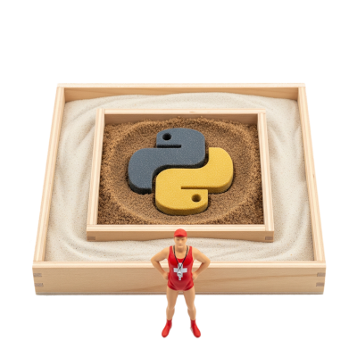
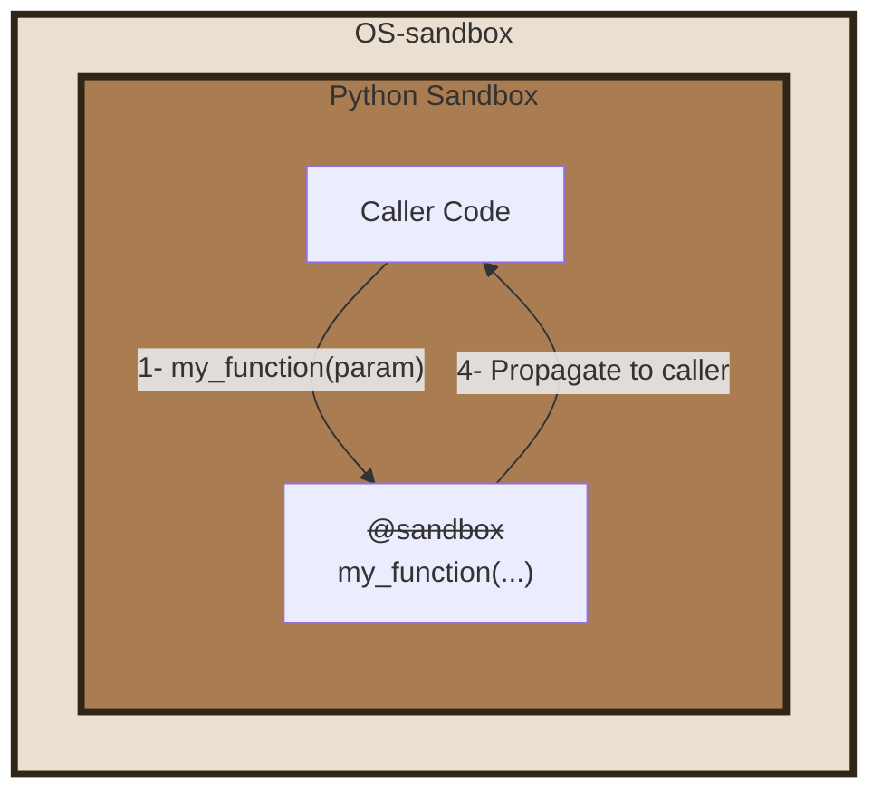
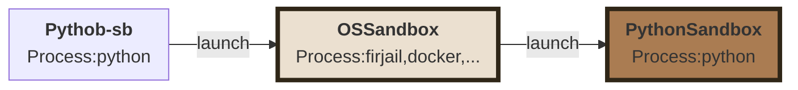
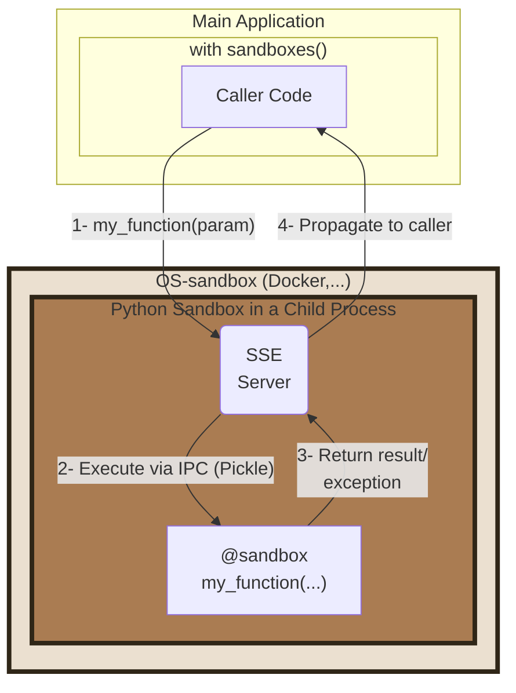
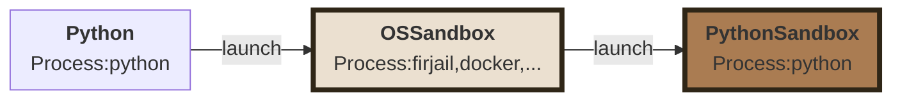

# PY-SANDBOXES


> Protect Python programs without their knowledge

[Home Page](https://www.github.com/pprados/pysandboxes/)

> If you would like to participate in the beta tests, please check out [this](wiki/beta_test.md)

Modern programming often relies on code generation or API invocation by language models (LLMs).
However, these models can be manipulated to execute malicious commands.
The [OWASP](https://genai.owasp.org/resource/owasp-top-10-for-llm-applications-2025/) provides a list of risks associated with using these models.

Among these, we find [LLM05:2025 - Improper Output Handling](https://genai.owasp.org/llmrisk/llm052025-improper-output-handling/) and [LLM06:2025 Excessive Agency](https://genai.owasp.org/llmrisk/llm062025-excessive-agency/).

Indeed, it is not easy to control the code that an LLM will execute. It can generate Python code that will be directly invoked, or describe the launch of a tool that the application will run, with parameters provided by the LLM (directly via a function or indirectly via an API or an [MCP call](https://modelcontextprotocol.io/)).

Furthermore, developers are increasingly using AI to improve code. Without rigorous verification, the generated code can open up security vulnerabilities.

It's time to control, as much as possible, the allowed capabilities for your application.

-----

# Table of Contents
- [Principle](#principle)
- [Usage](#usage)
  - [Apply the sandbox to the entire application](#apply-the-sandbox-to-the-entire-application)
  - [Apply the sandbox to a part of the application](#apply-the-sandbox-to-a-part-of-the-application)
    - [Launching the Sandbox](#launching-the-sandbox)
    - [Executing a function in the sandbox](#executing-a-function-in-the-sandbox)
- [Security Filters](#security-filters)
  - [Manage config file locations](#manage-config-file-locations)
- [OS-sandbox vs Py-sandbox](#os-sandbox-vs-py-sandbox)
- [Integration in a module](#integration-in-a-module)
- [FAQ](#faq)
  - [How to display py-sandbox logs?](#how-to-display-py-sandbox-logs)
  - [How to catch rule violation exceptions?](#how-to-catch-rule-violation-exceptions)
  - [How to activate the sandbox in a notebook?](#how-to-activate-the-sandbox-in-a-notebook)
  - [How to propagate a token to an API in the sandbox?](#how-to-propagate-a-token-to-an-api-in-the-sandbox)
  - [How to ensure a new version of a module doesn't hide new network accesses?](#how-to-ensure-a-new-version-of-a-module-doesnt-hide-new-network-accesses)
  - [Do I have any new rule violations since the update?](#do-i-have-any-new-rule-violations-since-the-update)
  - [Debugging](#debugging)
    - [OS-sandbox debugging](#os-sandbox-debugging)
    - [How to disable py-sandbox?](#how-to-disable-py-sandbox)
  - [How to package the project](#how-to-package-the-project)
  - [Implementation](#implementation)
  - [What are the weaknesses of py-sandbox?](#what-are-the-weaknesses-of-py-sandbox)
- [Samples](#samples)
- [Roadmap](#roadmap)
- [Appendix](#appendix)
  - [Databases](#databases)

The **Py-Sandboxes** project proposes to add multiple layers of security to limit the actions of your application, and thus, indirectly, the actions caused by an LLM or a malicious user of your application.

For example, an MCP server that exposes a service to view a WEB page can be abused to request it to view a page on `localhost`, an address on the intranet, a swagger documentation, or `file:///` to read local files.
Code generated by an LLM can generate a specially crafted regular expression invocation to cause a denial-of-service or an infinite loop.
You can find some demo [here](samples/mcp-server/README.md).

Among these risks, some can be reduced if a part of the application code is executed in one or more dedicated sandboxes.

The idea is to use a **defense-in-depth** approach, where multiple layers support each other to limit the capabilities and necessary privileges for each component as much as possible. Is it wise to allow every piece of Python code or every dependency to have access to all application files?

The **Py-Sandboxes** solution we propose aims to address these difficulties. The idea is to offer a *Python Sandbox* mechanism, allowing the execution of Python code, but limited in its capabilities. This is a similar approach to [AppArmor](https://apparmor.net/) or *capabilities* under Linux.

The approach consists of filtering and strengthening standard Python APIs to limit the application's action capabilities. This API interception approach is effective but cannot guarantee that there are no workarounds. This is why our solution allows the nesting of other technologies, such as **os-sandbox**. These technologies rely on the OS's ability to limit network, disk, resource, and other accesses. Nesting an **os-sandbox** with a **py-sandbox** is an interesting combination for controlling application security.

Our solution helps reduce the following risks:

  - [X] **Path Traversal**: Only authorized directories can be accessed.
  - [X] **Remote Code Execution (RCE)**: Sensitive APIs are not available.
  - [X] **Reverse Shells**: Network connections are limited.
  - [X] **Excessive Permissions**: All code is under the control of the Python sandbox.
  - [X] **Token Theft**: Accessible files and environment variables are filtered.
  - [X] **Remote Access**: Network and code actions are limited.
  - [ ] **Malicious Execution**: The invocation of sensitive APIs like `eval()` or `exec()` precisely defines valid Python syntax and a whitelist of Python modules (not yet implemented).
  - [ ] **Denial of Service**: A timeout can be added, up to killing the process if it cannot be stopped otherwise (not yet implemented).
  - [ ] **Malicious syntax**: The syntax of python code may be filtered

---
# Principle
The approach is based on the principle of **Least Privilege** and **Defense in Depth**, with an exclusively "*whitelist*" configuration. By default, everything is forbidden. You must explicitly authorize actions.

A learning mechanism allows for continuous improvement of security rules and rapid implementation.

# Usage

To install the component:

```bash
 pip install pysandboxes
```
or
```bash
pip install git+https://github.com/pprados/pysandboxes.git
```

We propose only four think:
- A Command Line Interface: `python-sb`
- A function: `run`
- A resource provider: `sandboxes`
- An annotation: `@sandbox`

There are two usage modes:

  - Apply the sandbox to the entire application (complete mode).
  - Apply the sandbox to a part of the application, with the rest being free  (partial mode).

## Apply the sandbox to the entire application  (complete mode)



This scenario is the simplest. You just need to replace the launch of your application (`python -m my_module`) with a launch in the sandbox (`python-sb -m my_module`). The `@sandbox` annotation is ignored. It's possible to add some *py-sandboxes parameters*, at the beginning:
```shell
python-sb --learn -m my_module
```
You can use it in interactive mode and continue to use the help shortcut.
```shell
> python-sb
SANDBOXES Python 3.13.5 | packaged by Anaconda, Inc. | [GCC 11.2.0] on linux
**APIs are LIMITED according to the rules in '.py-sandboxes'**
Type "help", "copyright", "credits" or "license" for more information.
IPython 8.37.0 -- An enhanced Interactive Python. Type '?' for help.

⚠ In [1]: import os
⚠ In [2]: os.open??
Signature: os.open(path, flags, mode=511, *, dir_fd=None)
Docstring:
Open a file for low level IO.  Returns a file descriptor (integer).

If dir_fd is not None, it should be a file descriptor open to a directory,
  and path should be relative; path will then be relative to that directory.
dir_fd may not be implemented on your platform.
  If it is unavailable, using it will raise a NotImplementedError.
Type:      function
```

If *IPython* is installed, it's used. All the standard python parameters are availables.

It is recommended for launching an [MCP](https://modelcontextprotocol.io/specification/2025-06-18) server, for example. It is easy to offer a precise or symbolic mathematical calculation tool by generating code and executing it in an environment limited to [numpy](https://numpy.org/), [scipy](https://scipy.org/), and [sympy](https://www.sympy.org/).

> For more information on using sandboxes with MCP, see [here](wiki/mcp.md).

During the first launch, noting that there is no `.pysandboxes` parameter file, the application starts in learning mode. Use your application in all its capacities, so that the solution learns network and disk usage, imported modules, usage of environment variables, etc.
When the application is stopped, a `.pysandboxes` file is created in the current directory. It has been populated with all the learned rules. **We invite you to review this file to make any necessary adjustments.**

From now on, during subsequent launches, the application runs by limiting the application's capabilities to the previously learned whitelist.

If you want to restart a learning session to add missing rules:
- activate the `learn` parameter in the configuration file
- or add `--learn=.py-sandboxes` (or just `--learn`) when you _start `python-sb`

This way, only the missing rules will be added to the file.

This approach allows for application isolation, but requires granting privileges to the entire application, such as access to API tokens. It's likely that only a small part of the application needs these privileges, but not the rest.

### How the python-sb work?

### Use with uvx
[uvx](https://docs.astral.sh/uv/guides/tools/) is a solution for running a Python tool without installing it in the project. A temporary environment is created for the duration of the tool's execution.

Uvx can start some tools like `python-sb`. However, since `python-sb` does not match the project name, you must proceed as follows:
```bash
uvx --from pysandboxes python-sb --help
alias python-sb='uvx --from pysandboxes python-sb'
```

## Apply the sandbox to a part of the application (partial mode).

Often, the application needs all privileges, has access to all API tokens, etc. Only a part of the application should be executed in a sandbox. For example, tools invoked by an LLM should not have access to all files or all environment variables. This makes it more difficult to abuse them. The granularity is finer.

In this scenario, your application will be split into two parts:

  - The core of the application, with all privileges.
  - A sandbox, where the code annotated with `@sandbox` will be executed.



### Launching the Sandbox

In your program, you must launch the sandbox before you can isolate certain parts of the code.

```python
# Synchronous version
from pysandboxes import sandboxes_api

with sandboxes(init_fn=init_sandbox):
    ...
```

```python
# Asynchronous version
from pysandboxes import sandboxes_api

async with sandboxes(init_fn=init_sandbox):
    ...
```

The `init_fn` parameter is optional. It can contain a function that will be invoked during the initialization of the sandbox. This is the ideal place to put:

  - log level initialization
  - opening database connection pools
  - all important initializations that need to be done on the sandbox side.

```python
def init_log_level():
    sandboxes_level = logging.WARNING
    format = '[%(process)d] %(levelname)-5s %(name)s %(message)s'
    if is_in_sandbox():
        format = "  " + format
    logging.basicConfig(
        level=min(sandboxes_level, logging.INFO),
        format=format
    )
    logging.getLogger("Pysandboxes").setLevel(logging.INFO)
    logging.getLogger("pysandboxes").setLevel(sandboxes_level)

def init_fn():
    init_log_level()
    ...
```
For asynchronous use, you can more simply initialize your application this way:

```python
import pysandboxes
...
async def main():
    ...

if __name__ == "__main__":
  pysandboxes.run(main())  # in place of asyncio.run(main())
```

Note the following pattern, which involves calling the same initialization function in `main()` and in the sandbox.

```python
async def init_app():
    # Run in main() and in the sandbox
   ...

async def main():
    await init_app()
    ...

if __name__ == "__main__":
    pysandboxes.run(main(), init_fn=init_app)  # in place of asyncio.run(main())

```

If you want to restart a learning session to add missing rules:
- Add `learn='.py-sandboxes'` with `sandboxes()`
- Or add `learn='.py-sandboxes'` with `run()`

```python
pysandboxes.run(main(),
                learn='.py-sandboxes',
                )
```

### Executing a function in the sandbox (partial mode)

To declare that a function must run in the sandbox, simply annotate it with `@sandbox`.

```python
# file my_module.py
from pysandboxes import sandbox

@sandbox
def my_function_in_sandbox(param):
    ...
```

Once the sandbox is launched, upon invocation of this function, the component handles converting the call into a Pickle-formatted request, sending it to the sandbox, and waiting for the result or exception to be returned to the caller.

> All parameters and the return type must be Pickle-compatible.

The sandbox receives the request, loads the corresponding module, finds the function, and invokes it. The response is then also converted into a Pickle-formatted response before being returned to the caller.

There are a few peculiarities to note:

  - If an exception is raised in the sandbox, the stack trace is propagated to the main application to allow for a stack analysis as if the call had been made directly. This facilitates debugging.
  - If the application writes to *stdout* or *stderr*, the stream is captured by the sandbox and returned to the caller. The caller will then write to its own *stdout* and *stderr* streams. Thus, the capture of your application's prints includes all information, without forgetting those from the sandbox or mix the different impressions between several threads. They are executed in the correct process, in the same async loop.

### How the partial mode work?


---
# Security Filters
What are the security filters offered by **Py-Sandboxes**?

  - **Environment variable control**: The environment variables visible in the sandbox are limited. Mapping rules allow easily forwarding sets of variables from the outside to the inside of the sandbox (e.g., `env=*_API_KEY=${*_API_KEY}`).
  - **Network access control**: It is possible to control the direction, IP addresses, domain names, and ports available to the sandbox.
  - **Disk access control**: It is possible to map directories to their equivalents in the sandbox. The mapping can be read-only or read and write. It is also possible to use a different directory name in the sandbox than the original name. Finally, it is possible to specify file filters that should be ignored by the sandbox (e.g., `.*`).
  - **Imported module control**: A whitelist of Python modules accessible to the sandbox must be provided. Importing other modules is rejected.

Consult the [parameter file](pysandboxes/templates/py-sandbox.template) generated during the first execution for more details.

## Manage config file locations
By default, the program looks for the file in the root directory of the **module** that launches the sandbox. Otherwise, the `./py-sandboxes` file is used. This can be modified before the program is launched.
If you package your application in a Wheel, place your parameters within your module.

To address different scenarios, parameter files can have `include` instructions. This allows you to distribute parameters across different files and locations.

By default, you'll find this:

```
include "./.local.py-sandboxes"  # May be add to .gitignore
include "~/.config/py-sandboxes/user-py-sandboxes.profile"  # For user
include "/etc/py-sandboxes/global-py-sandboxes.profile"  # For node
```

The goal is to be able to save the `./.py-sandboxes` file in the Git repository while allowing the developer to make local modifications in the `./.local.py-sandboxes` file (which should be added to `.gitignore`).

Parameters for all of the user's projects can be present in `~/.config/py-sandboxes/user-py-sandboxes.profile`, and for the entire machine in `/etc/py-sandboxes/global-py-sandboxes.profile`.

By adding or removing `include` statements, you can select the different personalization scenarios you want. Note, if the is not exist, it's just ignored.

With **python-sb**, a special parameter can be used to select the configuration.
```bash
python-sb --pysandboxes-config=./.py-sandboxes -m ...
```
---
# OS-sandbox vs Py-sandbox
Our solution offers multiple layers of security:

  - a sandbox at the Python API level (**py-sandbox**)
  - another sandbox at the OS level (**os-sandbox**)

The Python sandbox (*py-sandbox*) can limit malicious usage via Python code, but it cannot prevent access via compiled C/C++/Rust code, or via direct calls to the kernel.
For example, database access is often done via compiled C drivers (See the appendix for more details).
Similarly, a malicious code, with a little persistence, can manage to escape the Python sandbox. The goal is not to protect against a dependency imported into your project without ensuring it is safe.
**We want to prevent abusive use of our code.**

Therefore, to protect against a scenario that escapes **Py-Sandboxes**, it is possible to select a complementary technology that provides protection at the OS level. Depending on the available and selected technologies, the limitations will be more or less the same as with **py-sandbox**. You will not find specific Python limitations, such as the module whitelist.

We offer several implementations to encapsulate the Python sandbox:

| Technology                                        | Configuration            | Specifics                                                                      | Description                                                                                               |
|---------------------------------------------------|--------------------------|--------------------------------------------------------------------------------|-----------------------------------------------------------------------------------------------------------|
| subprocess                                        |                          | - no complementary security                                                    | |This is the default implementation. It is simply a child Python process that holds the sandbox. |
| [firejail](https://github.com/netblue30/firejail) | [here](wiki/firejail.md) | - Disk mapping (without rename)<br/> - File filtering<br/> - Network filtering | This is a technology that allows isolating a Linux process at the disk and network levels. |

*Other implementations will be added soon*

The features of each technology are proposed:

| Guard                     | py-sandbox | firejail  | none |
|---------------------------|:----------:|:---------:|:----:|
| Isolation                 |  Process   | Container |  ❌   |
| Python code               |     ✅      |    ❌     |  ❌   |
| Compiled code             |     ❌     |     ✅     |  ❌   |
| env                       |     ✅      |    ❌     |  ❌   |
| bind=a,a                  |     ✅      |     ✅     |  ❌   |
| bind=a,b                  |     ✅      |    ❌     |  ❌   |
| ignore=*                  |     ✅      |     ✅     |  ❌   |
| network                   |     ✅      |     ✅     |  ❌   |
| import                    |     ✅      |    ❌     |  ❌   |
| Resource limits           |     ❌     |    ✅      |  ❌   |
| OS-sandbox                |     ❌     |     ✅     |  ❌   |
| Seccomp                   |     ❌     |     ✅     |  ❌   |
| Vm compatible             |     ✅      |     ✅     |  ❌   |
| Container<br/> compatible |     ✅      |    ❌     |  ❌   |

>> During the learning phase, `os-sandbox` is forced to `subprocess`.

>> Note that a network constraint may not be detected during learning if the call is made by compiled code. The **OS-sandbox** configuration will not allow the connection. Simply add the missing rule *manually*. It will be added when the **os-sandbox** is launched.

To select the **OS-sandbox** provider, set the parameter `os-sandbox` in the config file, or set the environment variable `OS_SANDBOX`.

```shell
OS_SANDBOX=firejail python-sb -m my-module
```
---
# Integration in a module
It is possible to use the solution to integrate it into a module, when you install your *wheel*. To do this, the `.py-sandboxes` file must be placed at the root of your module, as a resource.

When the sandbox is activated, the code searches for the caller's module and checks whether the resource exists. If so, it is used to apply the security rules. Otherwise, the same file is searched for in the working directory.

If you want to allow rules from the working directory to be added when using your module, add the following instructions to your `my_module/.py-sandboxes` file

```ini
# File my_module/.py-sandboxes
include "./.py-sandboxes"
# ... specific rules
```

To create a CLI that uses **py-sanboxes**, use the following pattern:
```python
def main() -> int:
    # ...
    print("hello")
    return 99


def main_sb() -> int:
    import sys
    import os

    sys.argv = (
            [
                __file__,
                "-m", globals()['__spec__'].name
            ] +
            sys.argv[1:])
    from pysandboxes.python_sb import main
    return(main())  # Launch 'python-sb'
```

And declare it in your TOML file.
```TOML
[project.scripts]
my-script = "my_module:main_sb"
# my-script = "my_module:main"  # Without sandboxes
```

---
## Samples
You can find some samples for major framework:
- MCP Client/Server

See [here for more information](wiki/samples.md)

---
## FAQ
see [here](wiki/faq.md)

---
## Implementation
see [here](wiki/implementation.md)

## What are the weaknesses of py-sandbox?
See [here](wiki/weaknesses.md)

---
# Roadmap
See [here](wiki/roadmap.md)

---
# Appendix

1. Connection to Databases: See [here](wiki/database.md)

## CVE in relation
Some CVE in relations

### Langchain
- [CVE-2023-46229](https://nvd.nist.gov/vuln/detail/CVE-2023-46229)
- [CVE-2023-32786](https://nvd.nist.gov/vuln/detail/CVE-2023-32786)
- [CVE-2024-28088](https://nvd.nist.gov/vuln/detail/CVE-2024-28088)
- [CVE-2024-7774](https://nvd.nist.gov/vuln/detail/CVE-2024-7774)
- [CVE-2024-3571](https://nvd.nist.gov/vuln/detail/CVE-2024-3571)
- [CVE-2024-3095](https://nvd.nist.gov/vuln/detail/CVE-2024-3095)
- [CVE-2024-2057](https://nvd.nist.gov/vuln/detail/CVE-2024-2057)
- [CVE-2025-2828](https://nvd.nist.gov/vuln/detail/CVE-2025-2828)
- [CVE-2025-6985](https://nvd.nist.gov/vuln/detail/CVE-2025-6985)

### Smolagent
- [CVE-2025-5120](https://nvd.nist.gov/vuln/detail/CVE-2025-5120)
