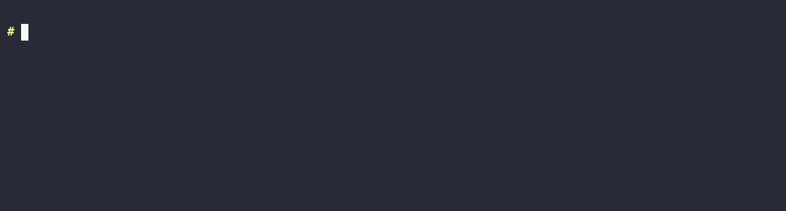
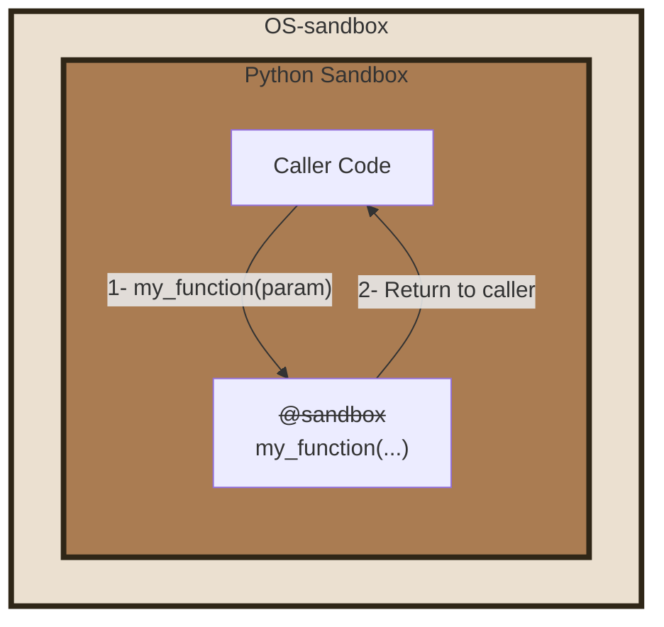
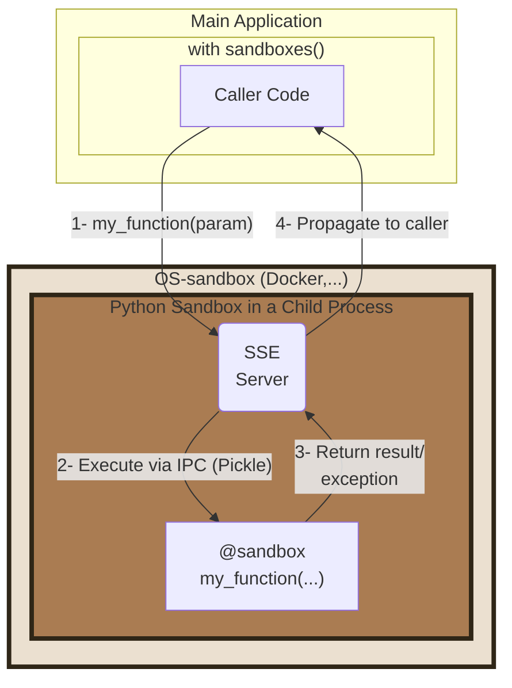

# PY-SANDBOXES

<p align="center">
  
</p>

[](https://pypi.org/project/pysandboxes/)
[](https://pypi.org/project/pysandboxes/)
[](https://pypi.org/project/pysandboxes/)
[](https://github.com/pprados/pysandboxes/blob/master/LICENSE.txt)
[](#platform-support)

> Protect Python programs without their knowledge.

Applications increasingly run code, or call tools, chosen by an LLM, and a manipulated model can make them read local files, reach the intranet or run commands ([LLM05:2025 Improper Output Handling](https://genai.owasp.org/llmrisk/llm052025-improper-output-handling/), [LLM06:2025 Excessive Agency](https://genai.owasp.org/llmrisk/llm062025-excessive-agency/)). **Py-Sandboxes** restricts what the process may actually do, from a whitelist learned by watching it run.

[Home Page](https://www.github.com/pprados/pysandboxes/) | [API reference](https://pprados.github.io/pysandboxes/)

> **Not yet on pypi.org.** Until the project is published there, `pip install pysandboxes` and
> `uvx python-sb` do not work. Install it from the sources instead:
>
> ```bash
> git clone https://github.com/pprados/pysandboxes.git
> cd pysandboxes
> pip install -e .
> ```

# Quick start

Run any module in a sandbox, without installing anything and without touching a single line of your code:

```bash
uvx python-sb -m my_module
```

Or install it:

```bash
pip install pysandboxes
python-sb -m my_module
```

The first run has no rules yet, so it starts in **learning mode**: use your application normally, and a `.py-sandboxes` file is written when it stops, populated with the network, disk, module and environment accesses it actually needed. Review that file, then every later run is restricted to that whitelist.

[](samples/quick-demo/)

That is the whole integration for *complete mode*. To sandbox only part of an application, see [partial mode](#apply-the-sandbox-to-a-part-of-the-application-partial-mode).

# What it protects against, and what it does not

**Py-Sandboxes** is built for one threat model: *your own application, or the code an LLM makes it run, doing more than it should*. It offers three layers, with deliberately different strengths:

- The **dynamic-code layer** (*the `eval-*` rules*) is the innermost and the weakest of the three, but it is the only one that looks at code arriving as a *string* — which is exactly the shape of an LLM's answer. The other two layers only see a process that has already decided to run it. A source handed to `eval()`, `exec()` or `compile()` is parsed, checked against a declared sub-language, rewritten and run under a budget and a timeout, which is what makes it possible to execute LLM-generated Python code with a stated set of capabilities. See [the `eval-*` rules](https://github.com/pprados/pysandboxes/blob/master/wiki/eval.md).
- The **Python layer** (*py-sandbox*) is a guardrail and a readability layer. It catches LLM-generated code that goes off the rails, and it states in a single file exactly what your application is allowed to touch. It is **not** a boundary against a determined attacker: `ctypes`, compiled extensions or direct syscalls can work around API interception.
- The **OS layer** (*os-sandbox*: landlock, bwrap, firejail, unshare, qemu) is the real security boundary. It is enforced by the kernel, so it also holds against compiled code.

The Python and the OS layers feed each other. Writing an OS-level policy by hand is the tedious part of any sandboxing effort: you have to know, up front, every directory, host, port and variable the process will legitimately need. The Python layer answers exactly that question, because it observes those accesses through the standard APIs while your application runs. The `.py-sandboxes` file produced by learning mode is therefore not only the Python whitelist, it is also the inventory used to configure the OS layer, from the same declarations and without a second round of trial and error.

Nest them: the dynamic-code layer for the strings an LLM produces, the Python layer for precision and legibility, the OS layer for enforcement. See [OS-sandbox vs Py-sandbox](#os-sandbox-vs-py-sandbox) for the per-technology matrix.

This is **not** a defense against a malicious third-party dependency that you installed yourself.

# Use cases

`python-sb` replaces `python` on a command line, so anything launched as a Python script runs with the rights
written in its `.py-sandboxes` file:

- **Agent skills, hooks and plugins**: the scripts of a skill run with all the rights of the user. A rule file
  shipped with the skill bounds them, and doubles as its permission manifest.
- **Tools, CLIs and MCP servers**: a tool driven by a manipulated LLM can only reach what its function needs.
- **AI coding agents**: the rule file is versioned, so `git diff -- '*.py-sandboxes'` shows every right the agent
  added between two commits.
- **Dependency updates**: a run without `--learn` turns a new behavior of a dependency into a visible violation.
- **Untrusted tests in CI**, **audit of an unknown script** with `--learn`, **LLM-generated code**.

See [use cases](https://github.com/pprados/pysandboxes/blob/master/wiki/use-cases.md) for each scenario, the
protection level it needs, and what the rule file does not show.

# Platform support

For now, **Linux and WSL only** (at this time). Every OS-level backend (landlock, bwrap, firejail, unshare) is a Linux technology. On macOS and Windows, only the Python layer is available, without the OS boundary.

---

# Table of Contents

- [Quick start](#quick-start)
- [What it protects against, and what it does not](#what-it-protects-against-and-what-it-does-not)
- [Use cases](#use-cases)
- [Platform support](#platform-support)
- [Principle](#principle)
- [Usage](#usage)
  - [Apply the sandbox to the entire application  (complete mode)](#apply-the-sandbox-to-the-entire-application--complete-mode)
    - [Use with uvx](#use-with-uvx)
  - [Apply the sandbox to a part of the application (partial mode).](#apply-the-sandbox-to-a-part-of-the-application-partial-mode)
    - [Launching the Sandbox](#launching-the-sandbox)
    - [Executing a function in the sandbox (partial mode)](#executing-a-function-in-the-sandbox-partial-mode)
- [Security Filters](#security-filters)
  - [Dynamically evaluated code](#dynamically-evaluated-code)
- [OS-sandbox vs Py-sandbox](#os-sandbox-vs-py-sandbox)
- [Samples](#samples)
- [Documentation](#documentation)

# Principle

It is not easy to control the code that an LLM will execute. It can generate Python code that will be directly invoked, or describe the launch of a tool that the application will run, with parameters provided by the LLM (directly via a function or indirectly via an API or an [MCP call](https://modelcontextprotocol.io/)).

Furthermore, developers are increasingly using AI to improve code. Without rigorous verification, the generated code can open up security vulnerabilities.

**It's time to control, as much as possible, the allowed capabilities for your application.**

The **Py-Sandboxes** project proposes to add multiple layers of security to limit the actions of your application, and thus, indirectly, the actions caused by an LLM or a malicious user of your application.

For example, an MCP server that exposes a service to view a WEB page can be abused to request it to view a page on `localhost`, an address on the intranet, a swagger documentation, or `file:///` to read local files. Code generated by an LLM can generate a specially crafted regular expression invocation to cause a denial-of-service or an infinite loop. You can find some demo [here](https://github.com/pprados/pysandboxes/blob/master/samples/mcp-server-demo/README.md).

Among these risks, some can be reduced if a part of the application code is executed in one or more dedicated sandboxes.

The idea is to use a **defense-in-depth** approach, where multiple layers support each other to limit the capabilities and necessary privileges for each component as much as possible. Is it wise to allow every piece of Python code or every dependency to have access to all application files?

The **Py-Sandboxes** solution we propose aims to address these difficulties. The idea is to offer a *Python Sandbox* mechanism, allowing the execution of Python code, but limited in its capabilities. This is a similar approach to [AppArmor](https://apparmor.net/) or *capabilities* under Linux.

The approach consists of filtering and strengthening standard Python APIs to limit the application's action capabilities. This API interception approach is effective but cannot guarantee that there are no workarounds. This is why our solution allows the nesting of other technologies, such as **os-sandbox**. These technologies rely on the OS's ability to limit network, disk, resource, and other accesses. Nesting an **os-sandbox** with a **py-sandbox** is an interesting combination for controlling application security.

Like [TypeScript Deno](https://docs.deno.com/runtime/fundamentals/security/#permissions), our solution helps reduce the following risks:

- [X] **Path Traversal**: Only authorized directories can be accessed.
- [X] **Remote Code Execution (RCE)**: Sensitive APIs are not available.
- [X] **Reverse Shells**: Network connections are limited.
- [X] **Excessive Permissions**: All code is under the control of the Python sandbox.
- [X] **Token Theft**: Accessible files and environment variables are filtered.
- [X] **Remote Access**: Network and code actions are limited.
- [X] **Malicious Execution**: `eval()`, `exec()` and `compile()` are refused unless the profile declares the sub-language they may run, via the [`eval-*` rules](wiki/eval.md).
- [X] **Denial of Service**: An evaluated string runs under an iteration budget, a recursion bound, an allocation ceiling and a timeout the caller can recover from (`eval-timeout=`, `eval-max-iterations=`).
- [X] **Malicious syntax**: The syntax of a dynamically evaluated string is filtered against a declared whitelist of constructs (`eval-syntax=`)

The approach is based on the principle of **Least Privilege** and **Defense in Depth**, with an exclusively "*whitelist*" configuration. By default, everything is forbidden. You must explicitly authorize actions.

A learning mechanism allows for continuous improvement of security rules and rapid implementation.

# Usage

Installation is covered in [Quick start](#quick-start). To track the development version instead:

```bash
pip install pysandboxes
```

We propose only four things:

- A Command Line Interface: `python-sb`
- A function: `run`
- A resource provider: `sandboxes`
- An annotation: `@sandbox`

There are two usage modes:

- Apply the sandbox to the entire application (complete mode).
- Apply the sandbox to a part of the application, with the rest being free  (partial mode).

## Apply the sandbox to the entire application  (complete mode)



This scenario is the simplest. You just need to replace the launch of your application (`python -m my_module`) with a launch in the sandbox (`uvx python-sb -m my_module`). The `@sandbox` annotation is ignored. It's possible to add some *py-sandboxes parameters*, at the beginning:

```shell
uvx python-sb --learn -m my_module
```

> Note: if you install the module with `pip install pysandboxes`, you can use `python-sb -m ...`.

You can use it in interactive mode and continue to use the help shortcut.

```shell
> uvx python-sb
SANDBOXES Python 3.13.5 | packaged by Anaconda, Inc. | [GCC 11.2.0] on linux
**APIs are LIMITED according to the rules in '.py-sandboxes'**
Type "help", "copyright", "credits" or "license" for more information.
IPython 8.37.0 -- An enhanced Interactive Python. Type '?' for help.

⚠ In [1]: import os
⚠ In [2]: os.open??
Signature: os.open(path, flags, mode=511, *, dir_fd=None)
Docstring:
Open a file for low level IO.  Returns a file descriptor (integer).

If dir_fd is not None, it should be a file descriptor open to a directory,
  and path should be relative; path will then be relative to that directory.
dir_fd may not be implemented on your platform.
  If it is unavailable, using it will raise a NotImplementedError.
Type:      function
```

If *IPython* is installed, it's used. All the standard python parameters are available.

It is recommended for launching an [MCP](https://modelcontextprotocol.io/specification/2025-06-18) server, for example. It is easy to offer a precise or symbolic mathematical calculation tool by generating code and executing it in an environment limited to [numpy](https://numpy.org/), [scipy](https://scipy.org/), and [sympy](https://www.sympy.org/).

> For more information on using sandboxes with MCP, see [here](https://github.com/pprados/pysandboxes/blob/master/wiki/mcp.md).

The first launch learns the rules, as described in [Quick start](#quick-start): exercise every feature of your application, so that nothing it legitimately needs is missing from the whitelist.

If you want to restart a learning session to add missing rules:

- activate the `learn` parameter in the configuration file
- or add `--learn=.py-sandboxes` (or just `--learn`) when you start `python-sb`

This way, only the missing rules will be added to the file.

This approach allows for application isolation, but requires granting privileges to the entire application, such as access to API tokens. It's likely that only a small part of the application needs these privileges, but not the rest.

### Use with uvx

[uvx](https://docs.astral.sh/uv/guides/tools/) is a solution for running a Python tool without installing it in the project. A temporary environment is created for the duration of the tool's execution.

The `python-sb` command is published on PyPI as its own package, which simply depends on the latest `pysandboxes` and launches it. So uvx can run it directly, with nothing to install and no `--from` to spell out:

```bash
uvx python-sb --help
```

## Apply the sandbox to a part of the application (partial mode).

Often, the application needs all privileges, has access to all API tokens, etc. Only a part of the application should be executed in a sandbox. For example, tools invoked by an LLM should not have access to all files or all environment variables. This makes it more difficult to abuse them. The granularity is finer.

In this scenario, your application will be split into two parts:

- The core of the application, with all privileges.
- A sandbox, where the code annotated with `@sandbox` will be executed.



### Launching the Sandbox

In your program, you must launch the sandbox before you can isolate certain parts of the code.

```python
# Synchronous version
from pysandboxes import sandboxes

with sandboxes(init_fn=init_sandbox):
    ...
```

```python
# Asynchronous version
from pysandboxes import sandboxes

async with sandboxes(init_fn=init_sandbox):
    ...
```

The `init_fn` parameter is optional. It can contain a function that will be invoked during the initialization of the sandbox. This is the ideal place to put:

- log level initialization
- opening database connection pools
- all important initializations that need to be done on the sandbox side.

```python
def init_log_level():
    sandboxes_level = logging.WARNING
    format = '[%(process)d] %(levelname)-5s %(name)s %(message)s'
    if is_in_sandbox():
        format = "  " + format
    logging.basicConfig(
        level=min(sandboxes_level, logging.INFO),
        format=format
    )
    logging.getLogger("Pysandboxes").setLevel(logging.INFO)
    logging.getLogger("pysandboxes").setLevel(sandboxes_level)

def init_fn():
    init_log_level()
    ...
```

For asynchronous use, you can more simply initialize your application this way:

```python
import pysandboxes
...
async def main():
    ...

if __name__ == "__main__":
  pysandboxes.run(main())  # in place of asyncio.run(main())
```

Note the following pattern, which involves calling the same initialization function in `main()` and in the sandbox.

```python
async def init_app():
    # Run in main() and in the sandbox
   ...

async def main():
    await init_app()
    ...

if __name__ == "__main__":
    pysandboxes.run(main(), init_fn=init_app)  # in place of asyncio.run(main())

```

If you want to restart a learning session to add missing rules:

- Add `learn='.py-sandboxes'` with `sandboxes()`
- Or add `learn='.py-sandboxes'` with `run()`

```python
pysandboxes.run(main(),
                learn='.py-sandboxes',
                )
```

### Executing a function in the sandbox (partial mode)

To declare that a function must run in the sandbox, simply annotate it with `@sandbox`.

```python
# file my_module.py
from pysandboxes import sandbox

@sandbox
def my_function_in_sandbox(param):
    ...
```

Once the sandbox is launched, upon invocation of this function, the component handles converting the call into a Pickle-formatted request, sending it to the sandbox, and waiting for the result or exception to be returned to the caller.

> All parameters and the return type must be Pickle-compatible.

The sandbox receives the request, loads the corresponding module, finds the function, and invokes it. The response is then also converted into a Pickle-formatted response before being returned to the caller.

There are a few peculiarities to note:

- If an exception is raised in the sandbox, the stack trace is propagated to the main application to allow for a stack analysis as if the call had been made directly. This facilitates debugging.
- If the application writes to *stdout* or *stderr*, the stream is captured by the sandbox and returned to the caller. The caller will then write to its own *stdout* and *stderr* streams. Thus, the capture of your application's prints includes all information, without forgetting those from the sandbox or mixing the different outputs between several threads. They are executed in the correct process, in the same async loop.

---

# Security Filters

What are the security filters offered by **Py-Sandboxes**?

- **Environment variable control**: The environment variables visible in the sandbox are limited. Mapping rules allow easily forwarding sets of variables from the outside to the inside of the sandbox (e.g., `env=*_API_KEY=${*_API_KEY}`).
- **Network access control**: It is possible to control the direction, IP addresses, domain names, and ports available to the sandbox.
- **Disk access control**: It is possible to map directories to their equivalents in the sandbox. The mapping can be read-only or read and write. Finally, it is possible to specify file filters that should be ignored by the sandbox (e.g., `ignore=.*`).
- **Imported module control**: A whitelist of Python modules accessible to the sandbox must be provided. Importing other modules is rejected.
- **Sensitive API call control**: A registry of sensitive functions (`os.system`, `subprocess.Popen`, `os.kill`, ...) is denied by default, whatever `python-import=` allows: an import right is not a call right. Permissions are granted per function or per category, and learning mode generates them from the application's real behaviour.
- **Dynamically evaluated code control**: a string handed to `eval()`, `exec()` or `compile()` is refused unless the profile declares the sub-language it may use. See [Dynamically evaluated code](#dynamically-evaluated-code).

Consult the [parameter file](https://github.com/pprados/pysandboxes/blob/master/pysandboxes/templates/py-sandboxes.template) generated during the first execution for more details.

For a red-team view of these filters — attack by attack, what hostile code can and cannot reach once a profile is armed, which layer stops each attempt and what the layer does not claim to cover — see the [security assessment of the Python layer](wiki/audit-python-security.md).

## Dynamically evaluated code

The two diagrams above show two nested boundaries: the OS sandbox and, inside it, the Python sandbox. A string handed to `eval()`, `exec()` or `compile()` adds a third one. Unlike the first two, it is not a process boundary: the source is parsed, checked against the `eval-*` rules and rewritten inside the very process that calls `eval()`, which is why it is drawn with a dashed border.


Every rule of the `eval-*` family is described key by key, with a valid and an invalid example for each, [here](wiki/eval.md). For a red-team view — attack by attack, what a hostile string can and cannot reach and which layer stops it — see the [security assessment of the `eval-*` guard](wiki/audit-eval-security.md).

---

# OS-sandbox vs Py-sandbox

The Python layer (**py-sandbox**) cannot stop compiled C/C++/Rust code or direct calls to the kernel. An OS-level provider (**os-sandbox**), nested around it, closes that gap: `subprocess`, `landlock`, `unshare`, `bwrap`, `firejail` or `qemu`. Select it with the `os-sandbox` parameter of the config file, or with the `OS_SANDBOX` environment variable.

```shell
OS_SANDBOX=unshare python-sb -m my-module
```

What each technology enforces, its container and Kubernetes compatibility, and the paranoia levels (which Python and OS combination for which threat): see [here](https://github.com/pprados/pysandboxes/blob/master/wiki/os-providers.md)

---

## Samples

Twelve samples, one per MCP or agent framework (LangChain, CrewAI, smolagents, ...), run the same two tools under pysandboxes: one fetches a web page, the other evaluates an expression. See [here](https://github.com/pprados/pysandboxes/blob/master/wiki/samples.md)

---

# Documentation

The [wiki](https://github.com/pprados/pysandboxes/blob/master/wiki/Home.md) holds the rest of the documentation: FAQ, configuration files and integration in a module, implementation, weaknesses, security assessments, OS providers, roadmap and related CVEs. Its index is the menu to start from.
