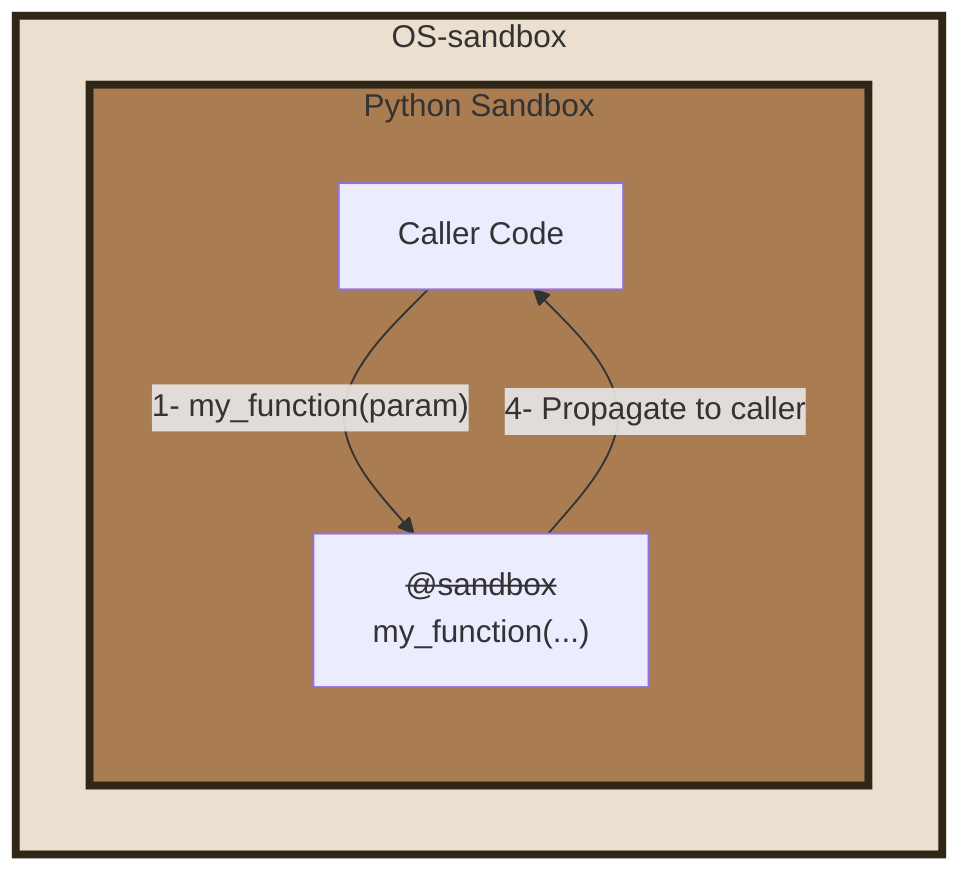
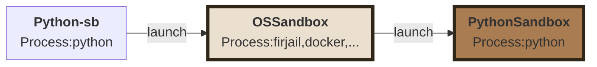
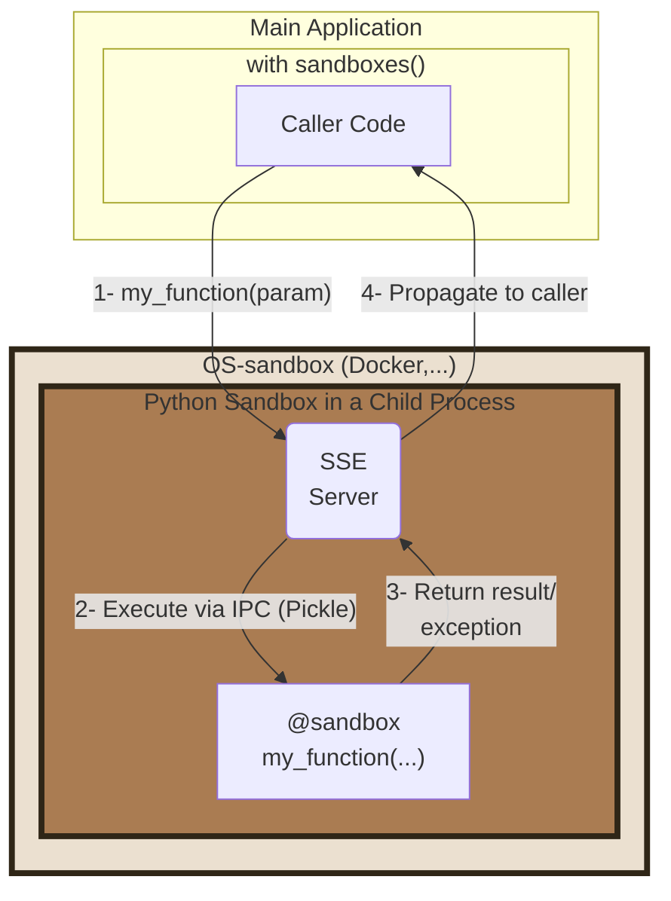
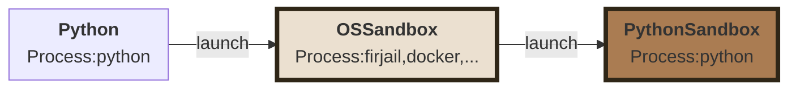

# PY-SANDBOXES


[](https://pypi.org/project/pysandboxes/)
[](https://pypi.org/project/pysandboxes/)
[](https://pypi.org/project/pysandboxes/)
[](https://github.com/pprados/pysandboxes/blob/master/LICENSE.txt)
[](#platform-support)

> Protect Python programs without their knowledge.

[Home Page](https://www.github.com/pprados/pysandboxes/) | [API reference](https://pprados.github.io/pysandboxes/)

> **Not yet on pypi.org.** Until the project is published there, `pip install pysandboxes` and
> `uvx python-sb` do not work. Install it from the sources instead:
>
> ```bash
> git clone https://github.com/pprados/pysandboxes.git
> cd pysandboxes
> pip install -e .
> ```

# Quick start

Run any module in a sandbox, without installing anything and without touching a single line of your code:

```bash
uvx python-sb -m my_module
```

The first run has no rules yet, so it starts in **learning mode**: use your application normally, and a `.py-sandboxes` file is written when it stops, populated with the network, disk, module and environment accesses it actually needed. Review that file, then every later run is restricted to that whitelist.

Or install it:

```bash
pip install pysandboxes
python-sb -m my_module
```

That is the whole integration for *complete mode*. To sandbox only part of an application, see [partial mode](#apply-the-sandbox-to-a-part-of-the-application-partial-mode).

# What it protects against, and what it does not

**Py-Sandboxes** is built for one threat model: *your own application, or the code an LLM makes it run, doing more than it should*. It offers three layers, with deliberately different strengths:

- The **dynamic-code layer** (*the `eval-*` rules*) is the innermost and the weakest of the three, but it is the only one that looks at code arriving as a *string* — which is exactly the shape of an LLM's answer. The other two layers only see a process that has already decided to run it. A source handed to `eval()`, `exec()` or `compile()` is parsed, checked against a declared sub-language, rewritten and run under a budget and a timeout, which is what makes it possible to execute LLM-generated Python code with a stated set of capabilities. See [the `eval-*` rules](https://github.com/pprados/pysandboxes/blob/master/wiki/eval.md).
- The **Python layer** (*py-sandbox*) is a guardrail and a readability layer. It catches LLM-generated code that goes off the rails, and it states in a single file exactly what your application is allowed to touch. It is **not** a boundary against a determined attacker: `ctypes`, compiled extensions or direct syscalls can work around API interception.
- The **OS layer** (*os-sandbox*: landlock, bwrap, firejail, unshare, qemu) is the real security boundary. It is enforced by the kernel, so it also holds against compiled code.

The Python and the OS layers feed each other. Writing an OS-level policy by hand is the tedious part of any sandboxing effort: you have to know, up front, every directory, host, port and variable the process will legitimately need. The Python layer answers exactly that question, because it observes those accesses through the standard APIs while your application runs. The `.py-sandboxes` file produced by learning mode is therefore not only the Python whitelist, it is also the inventory used to configure the OS layer, from the same declarations and without a second round of trial and error.

Nest them: the dynamic-code layer for the strings an LLM produces, the Python layer for precision and legibility, the OS layer for enforcement. See [OS-sandbox vs Py-sandbox](#os-sandbox-vs-py-sandbox) for the per-technology matrix.

This is **not** a defense against a malicious third-party dependency that you installed yourself.

# Platform support

For now, **Linux and WSL only** (at this time). Every OS-level backend (landlock, bwrap, firejail, unshare) is a Linux technology. On macOS and Windows, only the Python layer is available, without the OS boundary.

# Cost and compatibility

The performance impact is negligible, and nothing breaks as long as the privilege is granted. Once an access is authorized in `.py-sandboxes`, the call behaves exactly as it would outside the sandbox: the interception adds a whitelist check, not a re-implementation. What is *not* authorized raises an explicit error, which is the whole point.

Compiled extensions are a special case: since the Python layer cannot intercept them, they are neither slowed down nor restricted by it. A database driver written in C keeps working as before, and that is exactly the gap the OS layer is there to close.

---

Modern programming often relies on code generation or API invocation by language models (LLMs). However, these models can be manipulated to execute malicious commands. The [OWASP](https://genai.owasp.org/resource/owasp-top-10-for-llm-applications-2025/) provides a list of risks associated with using these models.

Among these, we find [LLM05:2025 - Improper Output Handling](https://genai.owasp.org/llmrisk/llm052025-improper-output-handling/) and [LLM06:2025 Excessive Agency](https://genai.owasp.org/llmrisk/llm062025-excessive-agency/).

Indeed, it is not easy to control the code that an LLM will execute. It can generate Python code that will be directly invoked, or describe the launch of a tool that the application will run, with parameters provided by the LLM (directly via a function or indirectly via an API or an [MCP call](https://modelcontextprotocol.io/)).

Furthermore, developers are increasingly using AI to improve code. Without rigorous verification, the generated code can open up security vulnerabilities.

**It's time to control, as much as possible, the allowed capabilities for your application.**

---

# Table of Contents

- [Table of Contents](#table-of-contents)
- [Quick start](#quick-start)
- [What it protects against, and what it does not](#what-it-protects-against-and-what-it-does-not)
- [Platform support](#platform-support)
- [Cost and compatibility](#cost-and-compatibility)
- [Principle](#principle)
- [Usage](#usage)
  - [Apply the sandbox to the entire application  (complete mode)](#apply-the-sandbox-to-the-entire-application--complete-mode)
    - [How the python-sb work?](#how-the-python-sb-work)
    - [Use with uvx](#use-with-uvx)
  - [Apply the sandbox to a part of the application (partial mode).](#apply-the-sandbox-to-a-part-of-the-application-partial-mode)
    - [Launching the Sandbox](#launching-the-sandbox)
    - [Executing a function in the sandbox (partial mode)](#executing-a-function-in-the-sandbox-partial-mode)
    - [How the partial mode work?](#how-the-partial-mode-work)
- [Security Filters](#security-filters)
  - [Dynamically evaluated code](#dynamically-evaluated-code)
- [OS-sandbox vs Py-sandbox](#os-sandbox-vs-py-sandbox)
- [Paranoia level](#paranoia-level)
- [Manage config file locations](#manage-config-file-locations)
- [Integration in a module](#integration-in-a-module)
  - [Samples](#samples)
  - [FAQ](#faq)
  - [Implementation](#implementation)
  - [What are the weaknesses of py-sandbox?](#what-are-the-weaknesses-of-py-sandbox)
- [Roadmap](#roadmap)
- [Appendix](#appendix)
  - [Related CVEs](#related-cves)
    - [Langchain](#langchain)
    - [Smolagent](#smolagent)

The **Py-Sandboxes** project proposes to add multiple layers of security to limit the actions of your application, and thus, indirectly, the actions caused by an LLM or a malicious user of your application.

For example, an MCP server that exposes a service to view a WEB page can be abused to request it to view a page on `localhost`, an address on the intranet, a swagger documentation, or `file:///` to read local files. Code generated by an LLM can generate a specially crafted regular expression invocation to cause a denial-of-service or an infinite loop. You can find some demo [here](https://github.com/pprados/pysandboxes/blob/master/samples/mcp-server-demo/README.md).

Among these risks, some can be reduced if a part of the application code is executed in one or more dedicated sandboxes.

The idea is to use a **defense-in-depth** approach, where multiple layers support each other to limit the capabilities and necessary privileges for each component as much as possible. Is it wise to allow every piece of Python code or every dependency to have access to all application files?

The **Py-Sandboxes** solution we propose aims to address these difficulties. The idea is to offer a *Python Sandbox* mechanism, allowing the execution of Python code, but limited in its capabilities. This is a similar approach to [AppArmor](https://apparmor.net/) or *capabilities* under Linux.

The approach consists of filtering and strengthening standard Python APIs to limit the application's action capabilities. This API interception approach is effective but cannot guarantee that there are no workarounds. This is why our solution allows the nesting of other technologies, such as **os-sandbox**. These technologies rely on the OS's ability to limit network, disk, resource, and other accesses. Nesting an **os-sandbox** with a **py-sandbox** is an interesting combination for controlling application security.

Like [TypeScript Deno](https://docs.deno.com/runtime/fundamentals/security/#permissions), our solution helps reduce the following risks:

- [X] **Path Traversal**: Only authorized directories can be accessed.
- [X] **Remote Code Execution (RCE)**: Sensitive APIs are not available.
- [X] **Reverse Shells**: Network connections are limited.
- [X] **Excessive Permissions**: All code is under the control of the Python sandbox.
- [X] **Token Theft**: Accessible files and environment variables are filtered.
- [X] **Remote Access**: Network and code actions are limited.
- [X] **Malicious Execution**: `eval()`, `exec()` and `compile()` are refused unless the profile declares the sub-language they may run, via the [`eval-*` rules](wiki/eval.md).
- [X] **Denial of Service**: An evaluated string runs under an iteration budget, a recursion bound, an allocation ceiling and a timeout the caller can recover from (`eval-timeout=`, `eval-max-iterations=`).
- [X] **Malicious syntax**: The syntax of a dynamically evaluated string is filtered against a declared whitelist of constructs (`eval-syntax=`)

---

# Principle

The approach is based on the principle of **Least Privilege** and **Defense in Depth**, with an exclusively "*whitelist*" configuration. By default, everything is forbidden. You must explicitly authorize actions.

A learning mechanism allows for continuous improvement of security rules and rapid implementation.

# Usage

Installation is covered in [Quick start](#quick-start). To track the development version instead:

```bash
pip install pysandboxes
```

We propose only four things:

- A Command Line Interface: `python-sb`
- A function: `run`
- A resource provider: `sandboxes`
- An annotation: `@sandbox`

There are two usage modes:

- Apply the sandbox to the entire application (complete mode).
- Apply the sandbox to a part of the application, with the rest being free  (partial mode).

## Apply the sandbox to the entire application  (complete mode)



This scenario is the simplest. You just need to replace the launch of your application (`python -m my_module`) with a launch in the sandbox (`uvx python-sb -m my_module`). The `@sandbox` annotation is ignored. It's possible to add some *py-sandboxes parameters*, at the beginning:

```shell
uvx python-sb --learn -m my_module
```

> Note: if you install the module with `pip install pysandboxes`, you can use `python-sb -m ...`.

You can use it in interactive mode and continue to use the help shortcut.

```shell
> uvx python-sb
SANDBOXES Python 3.13.5 | packaged by Anaconda, Inc. | [GCC 11.2.0] on linux
**APIs are LIMITED according to the rules in '.py-sandboxes'**
Type "help", "copyright", "credits" or "license" for more information.
IPython 8.37.0 -- An enhanced Interactive Python. Type '?' for help.

⚠ In [1]: import os
⚠ In [2]: os.open??
Signature: os.open(path, flags, mode=511, *, dir_fd=None)
Docstring:
Open a file for low level IO.  Returns a file descriptor (integer).

If dir_fd is not None, it should be a file descriptor open to a directory,
  and path should be relative; path will then be relative to that directory.
dir_fd may not be implemented on your platform.
  If it is unavailable, using it will raise a NotImplementedError.
Type:      function
```

If *IPython* is installed, it's used. All the standard python parameters are available.

It is recommended for launching an [MCP](https://modelcontextprotocol.io/specification/2025-06-18) server, for example. It is easy to offer a precise or symbolic mathematical calculation tool by generating code and executing it in an environment limited to [numpy](https://numpy.org/), [scipy](https://scipy.org/), and [sympy](https://www.sympy.org/).

> For more information on using sandboxes with MCP, see [here](https://github.com/pprados/pysandboxes/blob/master/wiki/mcp.md).

During the first launch, noting that there is no `.py-sandboxes` parameter file, the application starts in learning mode. Use your application in all its capacities, so that the solution learns network and disk usage, imported modules, usage of environment variables, etc. When the application is stopped, a `.py-sandboxes` file is created in the current directory. It has been populated with all the learned rules. **We invite you to review this file to make any necessary adjustments.**

From now on, during subsequent launches, the application runs by limiting the application's capabilities to the previously learned whitelist.

If you want to restart a learning session to add missing rules:

- activate the `learn` parameter in the configuration file
- or add `--learn=.py-sandboxes` (or just `--learn`) when you start `python-sb`

This way, only the missing rules will be added to the file.

This approach allows for application isolation, but requires granting privileges to the entire application, such as access to API tokens. It's likely that only a small part of the application needs these privileges, but not the rest.

### How the python-sb work?



### Use with uvx

[uvx](https://docs.astral.sh/uv/guides/tools/) is a solution for running a Python tool without installing it in the project. A temporary environment is created for the duration of the tool's execution.

The `python-sb` command is published on PyPI as its own package, which simply depends on the latest `pysandboxes` and launches it. So uvx can run it directly, with nothing to install and no `--from` to spell out:

```bash
uvx python-sb --help
```

## Apply the sandbox to a part of the application (partial mode).

Often, the application needs all privileges, has access to all API tokens, etc. Only a part of the application should be executed in a sandbox. For example, tools invoked by an LLM should not have access to all files or all environment variables. This makes it more difficult to abuse them. The granularity is finer.

In this scenario, your application will be split into two parts:

- The core of the application, with all privileges.
- A sandbox, where the code annotated with `@sandbox` will be executed.



### Launching the Sandbox

In your program, you must launch the sandbox before you can isolate certain parts of the code.

```python
# Synchronous version
from pysandboxes import sandboxes

with sandboxes(init_fn=init_sandbox):
    ...
```

```python
# Asynchronous version
from pysandboxes import sandboxes

async with sandboxes(init_fn=init_sandbox):
    ...
```

The `init_fn` parameter is optional. It can contain a function that will be invoked during the initialization of the sandbox. This is the ideal place to put:

- log level initialization
- opening database connection pools
- all important initializations that need to be done on the sandbox side.

```python
def init_log_level():
    sandboxes_level = logging.WARNING
    format = '[%(process)d] %(levelname)-5s %(name)s %(message)s'
    if is_in_sandbox():
        format = "  " + format
    logging.basicConfig(
        level=min(sandboxes_level, logging.INFO),
        format=format
    )
    logging.getLogger("Pysandboxes").setLevel(logging.INFO)
    logging.getLogger("pysandboxes").setLevel(sandboxes_level)

def init_fn():
    init_log_level()
    ...
```

For asynchronous use, you can more simply initialize your application this way:

```python
import pysandboxes
...
async def main():
    ...

if __name__ == "__main__":
  pysandboxes.run(main())  # in place of asyncio.run(main())
```

Note the following pattern, which involves calling the same initialization function in `main()` and in the sandbox.

```python
async def init_app():
    # Run in main() and in the sandbox
   ...

async def main():
    await init_app()
    ...

if __name__ == "__main__":
    pysandboxes.run(main(), init_fn=init_app)  # in place of asyncio.run(main())

```

If you want to restart a learning session to add missing rules:

- Add `learn='.py-sandboxes'` with `sandboxes()`
- Or add `learn='.py-sandboxes'` with `run()`

```python
pysandboxes.run(main(),
                learn='.py-sandboxes',
                )
```

### Executing a function in the sandbox (partial mode)

To declare that a function must run in the sandbox, simply annotate it with `@sandbox`.

```python
# file my_module.py
from pysandboxes import sandbox

@sandbox
def my_function_in_sandbox(param):
    ...
```

Once the sandbox is launched, upon invocation of this function, the component handles converting the call into a Pickle-formatted request, sending it to the sandbox, and waiting for the result or exception to be returned to the caller.

> All parameters and the return type must be Pickle-compatible.

The sandbox receives the request, loads the corresponding module, finds the function, and invokes it. The response is then also converted into a Pickle-formatted response before being returned to the caller.

There are a few peculiarities to note:

- If an exception is raised in the sandbox, the stack trace is propagated to the main application to allow for a stack analysis as if the call had been made directly. This facilitates debugging.
- If the application writes to *stdout* or *stderr*, the stream is captured by the sandbox and returned to the caller. The caller will then write to its own *stdout* and *stderr* streams. Thus, the capture of your application's prints includes all information, without forgetting those from the sandbox or mixing the different outputs between several threads. They are executed in the correct process, in the same async loop.

### How the partial mode work?



---

# Security Filters

What are the security filters offered by **Py-Sandboxes**?

- **Environment variable control**: The environment variables visible in the sandbox are limited. Mapping rules allow easily forwarding sets of variables from the outside to the inside of the sandbox (e.g., `env=*_API_KEY=${*_API_KEY}`).
- **Network access control**: It is possible to control the direction, IP addresses, domain names, and ports available to the sandbox.
- **Disk access control**: It is possible to map directories to their equivalents in the sandbox. The mapping can be read-only or read and write. Finally, it is possible to specify file filters that should be ignored by the sandbox (e.g., `ignore=.*`).
- **Imported module control**: A whitelist of Python modules accessible to the sandbox must be provided. Importing other modules is rejected.
- **Sensitive API call control**: A registry of sensitive functions (`os.system`, `subprocess.Popen`, `os.kill`, ...) is denied by default, whatever `python-import=` allows: an import right is not a call right. Permissions are granted per function or per category, and learning mode generates them from the application's real behaviour.
- **Dynamically evaluated code control**: a string handed to `eval()`, `exec()` or `compile()` — which is exactly the shape of a model's answer — is refused unless the profile declares the sub-language it may use. The declared source is then parsed, checked, rewritten so attribute walks and resource exhaustion are refused while it runs, and executed under a timeout the caller can recover from. See [the `eval-*` rules](https://github.com/pprados/pysandboxes/blob/master/wiki/eval.md).

Consult the [parameter file](https://github.com/pprados/pysandboxes/blob/master/pysandboxes/templates/py-sandboxes.template) generated during the first execution for more details.

For a red-team view of these filters — attack by attack, what hostile code can and cannot reach once a profile is armed, which layer stops each attempt and what the layer does not claim to cover — see the [security assessment of the Python layer](wiki/audit-python-security.md).

## Dynamically evaluated code

The two diagrams above show two nested boundaries: the OS sandbox and, inside it, the Python sandbox. A string handed to `eval()`, `exec()` or `compile()` adds a third one. Unlike the first two, it is not a process boundary: the source is parsed, checked against the `eval-*` rules and rewritten inside the very process that calls `eval()`, which is why it is drawn with a dashed border.


Every rule of the `eval-*` family is described key by key, with a valid and an invalid example for each, [here](wiki/eval.md). For a red-team view — attack by attack, what a hostile string can and cannot reach and which layer stops it — see the [security assessment of the `eval-*` guard](wiki/audit-eval-security.md).

---

# OS-sandbox vs Py-sandbox

Our solution offers multiple layers of security:

- a sandbox at the Python API level (**py-sandbox**)
- another sandbox at the OS level (**os-sandbox**)

The Python sandbox (*py-sandbox*) can limit malicious usage via Python code, but it cannot prevent access via compiled C/C++/Rust code, or via direct calls to the kernel. For example, database access is often done via compiled C drivers (See the appendix for more details). Similarly, a malicious code, with a little persistence, can manage to escape the Python sandbox. The goal is not to protect against a dependency imported into your project without ensuring it is safe. **We want to prevent abusive use of our code.**

Therefore, to protect against a scenario that escapes **Py-Sandboxes**, it is possible to select a complementary technology that provides protection at the OS level. Depending on the available and selected technologies, the limitations will be more or less the same as with **py-sandbox**. You will not find specific Python limitations, such as the module whitelist.

We offer several implementations to encapsulate the Python sandbox:

| Technology                                                      | Implementation<br/>&amp;<br/>Configuration | Specifics                                                                    | Description                                                                                                                              |
|-----------------------------------------------------------------|--------------------------------------------|------------------------------------------------------------------------------|------------------------------------------------------------------------------------------------------------------------------------------|
| subprocess                                                      |                                            | • no complementary security                                                  |                                                                                                                                          |
| [bwrap](https://github.com/containers/bubblewrap)               | [here](https://github.com/pprados/pysandboxes/blob/master/wiki/bwrap.md)                      | • Disk mapping (without rename)<br/>• File filtering<br/>• Network filtering | This is a technology that allows isolating a Linux process at the disk and network levels.                                               |
| [firejail](https://github.com/netblue30/firejail)               | [here](https://github.com/pprados/pysandboxes/blob/master/wiki/firejail.md)                   | • Disk mapping (without rename)<br/>• File filtering<br/>• Network filtering | This is a technology that allows isolating a Linux process at the disk and network levels.                                               |
| [unshare](https://man7.org/linux/man-pages/man2/unshare.2.html) | [here](https://github.com/pprados/pysandboxes/blob/master/wiki/unshare.md)                    | • Disk mapping (without rename)<br/>• File filtering<br/>• Network filtering | This is a technology that allows isolating a Linux process at the disk and network levels using `unshare`, `slirp4netns` and `iptables`. |
| [landlock](https://landlock.io/)                                | [here](https://github.com/pprados/pysandboxes/blob/master/wiki/landlock.md)                   | • Directory access<br/>• Network TCP port filtering                          | This is a technology that allows an auto isolation inside a Linux process.                                                               |
| [qemu](https://www.qemu.org/)                            | [here](https://github.com/pprados/pysandboxes/blob/master/wiki/qemu.md)                       | • Total emulation of OS and CPU                                              | No need of privilege. Use KVM if it's possible, else use the emulation.                                                                  |

*Other implementations will be added soon*

How to read the matrix below. The `none` column is the baseline: plain Python, no sandbox at all. The `py-sandbox` column is the Python layer on its own. Every other column lists what that OS technology enforces **on its own** too, whereas in practice you nest it *around* the py-sandbox instead of replacing it.

So a ❌ means "*this technology does not deal with that concern*", never "*that concern is left unprotected*". Choosing landlock, for instance, does not stop the Python guards from filtering `import` or sensitive API calls: landlock simply has no notion of Python, and in exchange it covers what the Python layer cannot reach, namely compiled code and direct syscalls. Read each OS column as what you *add* on top of the Python layer, and the union of the two as your actual protection.

| Guard                    | none | py-sandbox | landlock  |  unshare  |   bwrap   | firejail |       qemu       |
|--------------------------|:----:|:----------:|:---------:|:---------:|:---------:|:------:|:----------------:|
| Isolation                |  ❌   |  Process   | Linux ABI | Namespace | Namespace | Namespace | VM+<br/>emulator |
| Python code              |  ❌   |     ✅      |     ❌     |     ❌     |     ❌     |     ❌  |        ❌         |
| Compiled code            |  ❌   |     ❌      |     ✅     |     ✅     |     ✅     |     ✅  |        ✅         |
| env                      |  ❌   |     ✅      |     ✅     |     ✅     |     ✅     |     ✅  |        ✅         |
| import                   |  ❌   |     ✅      |     ❌     |     ❌     |     ❌     |     ❌  |        ❌         |
| expose-ro/rw=path        |  ❌   |     ✅      |     ✅     |     ✅     |     ✅     |     ✅  |        ✅         |
| ignore=*                 |  ❌   |     ✅      |     ❌     |     ✅     |     ✅     |     ✅  |        ✅         |
| python-api=*             |  ❌   |     ✅      |     ✅     |     ✅     |     ✅     |     ✅  |        ✅         |
| eval-*                   |  ❌   |     ✅      |     ❌     |     ❌     |     ❌     |     ❌  |        ❌         |
| **Network**              |      |            |           |           |           |        |                  |
| • TCP                    |  ❌   |     ✅      |     ✅     |     ✅     |     ✅     |     ✅  |        ✅         |
| • UDP                    |  ❌   |     ✅      |     ❌     |     ✅     |     ✅     |     ✅  |        ✅         |
| • host                   |  ❌   |     ✅      |     ❌     |     ✅     |     ✅     |     ✅  |        ✅         |
| • port                   |  ❌   |     ✅      |     ✅     |     ✅     |     ✅     |     ✅  |        ✅         |
| OS-sandbox               |  ❌   |     ❌      |     ✅     |     ✅     |     ✅     |     ✅  |        ✅         |
| Vm compatible            |  ❌   |     ✅      |     ✅     |     ✅     |     ✅     |     ✅  |        ✅         |
| **Container compatible** |      |            |           |           |           |        |                  |
| • Docker / Podman        |  ✅   |     ✅      |     ✅     |     ❌     |     ❌     |     ❌  |        ✅         |
| • --privileged           |  ✅   |     ✅      |     ✅     |     ✅     |     ✅     |     ❌  |        ✅         |
| **Kubernetes**           |      |            |           |           |           |        |                  |
| • kube                   |  ✅   |     ✅      |     ✅     |     ❌     |     ❌     |     ❌  |        ✅         |
| • SYS_ADMIN              |  ✅   |     ✅      |     ✅     |     ✅     |     ✅     |     ❌  |        ❌         |
| • NET_ADMIN              |  ✅   |     ✅      |     ✅     |     ✅     |     ✅     |     ❌  |        ❌         |
| **Extra**                |      |            |           |           |           |        |                  |
| • Resource limits        |  ❌   |     ❌      |     ❌     |     ❌     |     ❌     |     ✅  |        ✅         |
| • Seccomp                |  ❌   |     ❌      |     ❌     |     ❌     |     ❌     |   ✅    |        ✅         |
| • Latency                | <1s  |    <1s     |    <1s    |    <1s    |    <1s    |    <1s |      >20s        |

`ignore=` is enforced differently by each technology: **py-sandbox** and **firejail** make the path disappear (`FileNotFoundError`), **unshare** has the OS refuse it, and **bwrap** and **qemu** mask it, so a read succeeds and returns nothing. **landlock** denies access to a path but cannot hide one, so it has no equivalent: with `--py-sandbox=False` an ignored file stays readable there.

**landlock** under Kubernetes needs no capability at all, which is why its three Kubernetes rows are identical: unlike **unshare** and **bwrap**, it never asks the pod for `SYS_ADMIN` or `NET_ADMIN`, it restricts itself from the inside. Its single requirement sits elsewhere, on the *node*: the kernel must expose Landlock (5.13+ for filesystem rules, 6.7+ for network rules), and the ABI seen inside the pod is the node's, not the image's. On a managed cluster, where the node kernel is not yours to choose, verify it before relying on it.

On the **Extra** rows, **bwrap** is `❌` twice, for two different reasons. It has no resource-limit option at all, and the `bwrap.<option>=` passthrough can only forward flags bubblewrap already understands. Seccomp it *does* expose, but only as `--seccomp FD` / `--add-seccomp-fd FD`, which expect a file descriptor carrying a compiled BPF program; a textual configuration line cannot provision one, so the feature is out of reach here rather than missing from the tool.

For **qemu**, the resource that is bounded is memory: `qemu.memory` caps guest RAM (2048 MiB by default). The vCPU count is not exposed, and unlike `bwrap.*`, unknown `qemu.*` keys are not forwarded to the command line, only the documented ones are read.

A `❌` in the **py-sandbox** column is a deliberate posture, not a gap: with `py-sandbox=False` (or `--py-sandbox=False`) the Python layer is switched off on purpose, so `python-api=`, `eval-*`, `import=`, the Python-code guard and, on **landlock**, `ignore=` stop being enforced. Only the OS layer of the chosen technology remains. Use it when the sandboxed code is trusted not to attack the interpreter itself and you want the OS boundary alone; keep the Python layer on otherwise.

The parent deserializes what the sandboxed child returns over the local SSE transport. Reconstructing a returned object can run arbitrary code in the parent, outside the sandbox, so that channel is filtered by a restricted unpickler. On the result channel the guard is a fail-open denylist of dangerous gadgets, on by default; turn it off with `remote-result-guard=false` only if a legitimate return value is wrongly rejected. It affects only the result denylist: the opcode prescan, the anti-DoS budgets, and the exception-channel guard stay on regardless.

On the exception channel the guard is fail-closed, and an exception's state routinely holds a type it refuses — `httpx.ConnectError` carries the `httpx.Request` it failed on. So the child also sends a descriptor of the exception (class, message, denials), and the parent falls back to it rather than losing the refusal. An exception that crosses that way keeps its class, its message, its traceback and `sandbox_denials(e)`, but arrives **without its attributes**: `except httpx.ConnectError as e` still works, `e.request` does not. See [here](https://github.com/pprados/pysandboxes/blob/master/wiki/transport-unpickle-guard.md).


> During the learning phase, `os-sandbox` is forced to `subprocess`.

> Note that a network constraint may not be detected during learning if the call is made by compiled code. The **OS-sandbox** configuration will not allow the connection. Simply add the missing rule *manually*. It will be added when the **os-sandbox** is launched.

To select the **OS-sandbox** provider, set the parameter `os-sandbox` in the config file, or set the environment variable `OS_SANDBOX`.

```shell
OS_SANDBOX=unshare python-sb -m my-module
```

> Need help: can you propose a PR to integrate some solution for Apple OS ?

---

# Paranoia level
Depending on your level of paranoia, you can choose a suitable approach.

| Paranoia | Py-sandbox       | os-sandbox     | docker/pod | --privileged |
|:--------:|------------------|----------------|:----------:|:------------:|
|    0     | python           | None           |     No     |              |
|    1     | python-sb        | subprocess     |     No     |              |
|    2     | with sandboxes() | subprocess     |     No     |              |
|    3     | python-sb        | landlock       |     No     |              |
|    4     | with sandboxes() | landlock       |     No     |              |
|    5     | python-sb        | unshare        |     No     |              |
|    6     | with sandboxes() | unshare        |     No     |              |
|    7     | python-sb        | bwrap/firejail |     No     |              |
|    8     | with sandboxes() | bwrap/firejail |     No     |              |
|    9     | python-sb        | qemu + kvm     |     No     |              |
|    10    | with sandboxes() | qemu + kvm     |     No     |              |
|    11    | python-sb        | landlock       |    Yes     |      No      |
|    12    | with sandboxes() | landlock       |    Yes     |      No      |
|    13    | python-sb        | unshare        |    Yes     |     Yes      |
|    14    | with sandboxes() | unshare        |    Yes     |     Yes      |
|    15    | python-sb        | bwrap/firejail |    Yes     |     yes      |
|    16    | with sandboxes() | bwrap/firejail |    Yes     |     yes      |
|    17    | python-sb        | qemu           |    Yes     |      no      |
|    18    | with sandboxes() | qemu           |    Yes     |      no      |       


# Manage config file locations

By default, the program looks for the file in the root directory of the **module** that launches the sandbox. Otherwise, the `./.py-sandboxes` file is used. This can be modified before the program is launched. If you package your application in a Wheel, place your parameters within your module.

To address different scenarios, parameter files can have `include` instructions. This allows you to distribute parameters across different files and locations.

By default, you'll find this:

```text
include "./.local.py-sandboxes"  # May be added to .gitignore
include "~/.config/py-sandboxes/user-py-sandboxes.profile"  # For user
include "/etc/py-sandboxes/global-py-sandboxes.profile"  # For node
```

The goal is to be able to save the `./.py-sandboxes` file in the Git repository while allowing the developer to make local modifications in the `./.local.py-sandboxes` file (which should be added to `.gitignore`).

Parameters for all of the user's projects can be present in `~/.config/py-sandboxes/user-py-sandboxes.profile`, and for the entire machine in `/etc/py-sandboxes/global-py-sandboxes.profile`.

By adding or removing `include` statements, you can select the different personalization scenarios you want. Note: if it does not exist, it is simply ignored.

With **python-sb**, a special parameter can be used to select the configuration.

```bash
python-sb --pysandboxes-config=./.py-sandboxes -m ...
```

---

# Integration in a module

It is possible to use the solution to integrate it into a module, when you install your *wheel*. To do this, the `.py-sandboxes` file must be placed at the root of your module, as a resource.

When the sandbox is activated, the code searches for the caller's module and checks whether the resource exists. If so, it is used to apply the security rules. Otherwise, the same file is searched for in the working directory.

If you want to allow rules from the working directory to be added when using your module, add the following instructions to your `my_module/.py-sandboxes` file

```ini
# File my_module/.py-sandboxes
include "./.py-sandboxes"
# ... specific rules
```

To create a CLI that uses **py-sandboxes**, use the following pattern:

```python
def main() -> int:
    # ...
    print("hello")
    return 99

def main_sb() -> int:
    import sys
    import os

    sys.argv = (
            [
                __file__,
                "-m", globals()['__spec__'].name
            ] +
            sys.argv[1:])
    from pysandboxes.python_sb import main
    return(main())  # Launch 'python-sb'
```

And declare it in your TOML file.

```TOML
[project.scripts]
my-script = "my_module:main_sb"
# my-script = "my_module:main"  # Without sandboxes
```

---

## Samples

Twelve samples live under [`samples/`](https://github.com/pprados/pysandboxes/tree/master/samples/). They all demonstrate the **same** scenario, so that what changes from one to the next is only the framework's own way of declaring and dispatching a tool. A chat agent is given exactly two tools:

- **`fetch_webpage`** fetches a URL and returns it as markdown — pysandboxes controls which hosts it may reach;
- **`evaluate_expression`** receives a "python like" expression and computes it with a plain `eval()` — pysandboxes confines the malicious code that arrives through the argument.

Neither tool is written defensively, and there is deliberately no expression filter: whatever refuses a host or an escape is pysandboxes, and no applicative filter can take the credit.

Each sample carries **two profiles**, one per mode — `.py-sandboxes` confines only the tool bodies, `.py-sandboxes-complete` confines the whole process under `python-sb` — and each is learned in its own mode.

**MCP**

| Sample | What it shows |
|--------|---------------|
| [mcp-server-demo](https://github.com/pprados/pysandboxes/blob/master/samples/mcp-server-demo/README.md) | a FastMCP server, isolated to a greater or lesser extent, over `stdio` or `http` |
| [mcp-client-demo](https://github.com/pprados/pysandboxes/blob/master/samples/mcp-client-demo/README.md) | an MCP chat client against that server, with four sandboxing scenarios |

**Agent frameworks**, each integrating the tools its own way

| Sample | Framework |
|--------|-----------|
| [agno-demo](https://github.com/pprados/pysandboxes/blob/master/samples/agno-demo/README.md) | [Agno](https://www.agno.com/) |
| [autogen-demo](https://github.com/pprados/pysandboxes/blob/master/samples/autogen-demo/README.md) | [AutoGen AgentChat](https://microsoft.github.io/autogen/) |
| [crewai-demo](https://github.com/pprados/pysandboxes/blob/master/samples/crewai-demo/README.md) | [CrewAI](https://www.crewai.com/) |
| [google-adk-demo](https://github.com/pprados/pysandboxes/blob/master/samples/google-adk-demo/README.md) | [Google ADK](https://google.github.io/adk-docs/) |
| [langchain-demo](https://github.com/pprados/pysandboxes/blob/master/samples/langchain-demo/README.md) | [LangChain](https://www.langchain.com/) |
| [langgraph-demo](https://github.com/pprados/pysandboxes/blob/master/samples/langgraph-demo/README.md) | [LangGraph](https://langchain-ai.github.io/langgraph/) |
| [openai-agents-sdk-demo](https://github.com/pprados/pysandboxes/blob/master/samples/openai-agents-sdk-demo/README.md) | [OpenAI Agents SDK](https://openai.github.io/openai-agents-python/) |
| [pydantic-ai-demo](https://github.com/pprados/pysandboxes/blob/master/samples/pydantic-ai-demo/README.md) | [Pydantic AI](https://ai.pydantic.dev/) |
| [smolagents-demo](https://github.com/pprados/pysandboxes/blob/master/samples/smolagents-demo/README.md) | [smolagents](https://huggingface.co/docs/smolagents) |
| [strands-agents-demo](https://github.com/pprados/pysandboxes/blob/master/samples/strands-agents-demo/README.md) | [Strands Agents](https://strandsagents.com/) |

Every sample is self-contained — its own `uv` environment, its own `Makefile`, its own documentation:

```bash
cd samples/langchain-demo
make init      # uv sync
make run       # interactive chat with the framework's agent
make tests     # the sample's own suite
make learn     # relearn both profiles, one per mode
```

Ask the chat for a host the profile does not allow, or for an expression that tries to escape: the tool answers with the rule that refused it. From the repository root, `make sample-tests` runs every sample's suite.

See [here for more information](https://github.com/pprados/pysandboxes/blob/master/wiki/samples.md)

---

## FAQ

see [here](https://github.com/pprados/pysandboxes/blob/master/wiki/faq.md)

---

## Implementation

see [here](https://github.com/pprados/pysandboxes/blob/master/wiki/implementation.md)

## What are the weaknesses of py-sandbox?

See [here](https://github.com/pprados/pysandboxes/blob/master/wiki/weaknesses.md)

---

# Roadmap

See [here](https://github.com/pprados/pysandboxes/blob/master/wiki/roadmap.md)

---

# Appendix

1. Connection to Databases: See [here](https://github.com/pprados/pysandboxes/blob/master/wiki/database.md)

## Related CVEs

Some related CVEs

### Langchain

- [CVE-2023-46229](https://nvd.nist.gov/vuln/detail/CVE-2023-46229)
- [CVE-2023-32786](https://nvd.nist.gov/vuln/detail/CVE-2023-32786)
- [CVE-2024-28088](https://nvd.nist.gov/vuln/detail/CVE-2024-28088)
- [CVE-2024-7774](https://nvd.nist.gov/vuln/detail/CVE-2024-7774)
- [CVE-2024-3571](https://nvd.nist.gov/vuln/detail/CVE-2024-3571)
- [CVE-2024-3095](https://nvd.nist.gov/vuln/detail/CVE-2024-3095)
- [CVE-2024-2057](https://nvd.nist.gov/vuln/detail/CVE-2024-2057)
- [CVE-2025-2828](https://nvd.nist.gov/vuln/detail/CVE-2025-2828)
- [CVE-2025-6985](https://nvd.nist.gov/vuln/detail/CVE-2025-6985)

### Smolagent

- [CVE-2025-5120](https://nvd.nist.gov/vuln/detail/CVE-2025-5120)
