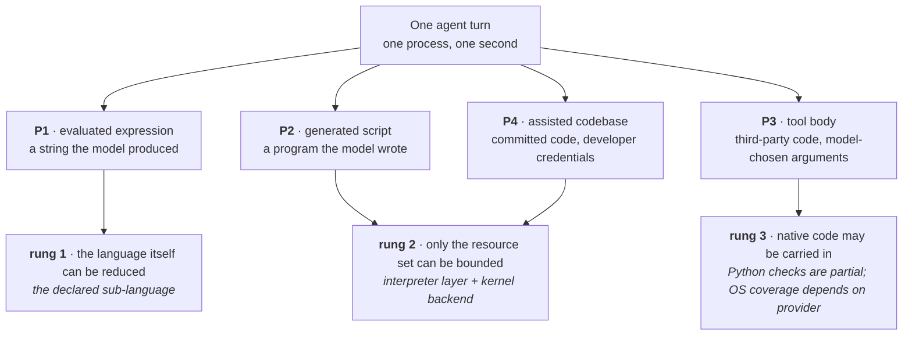
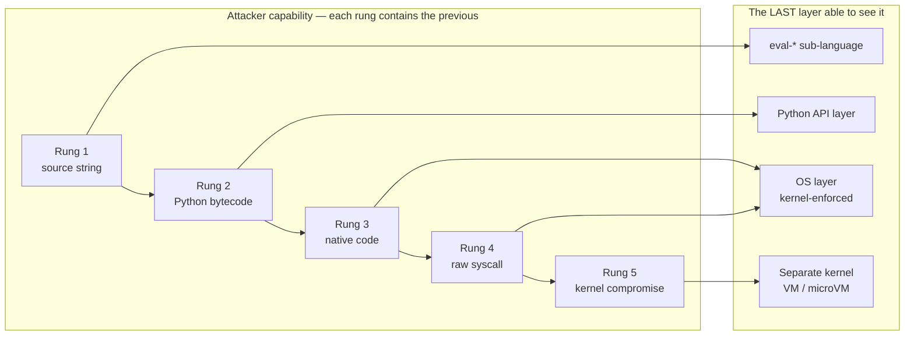
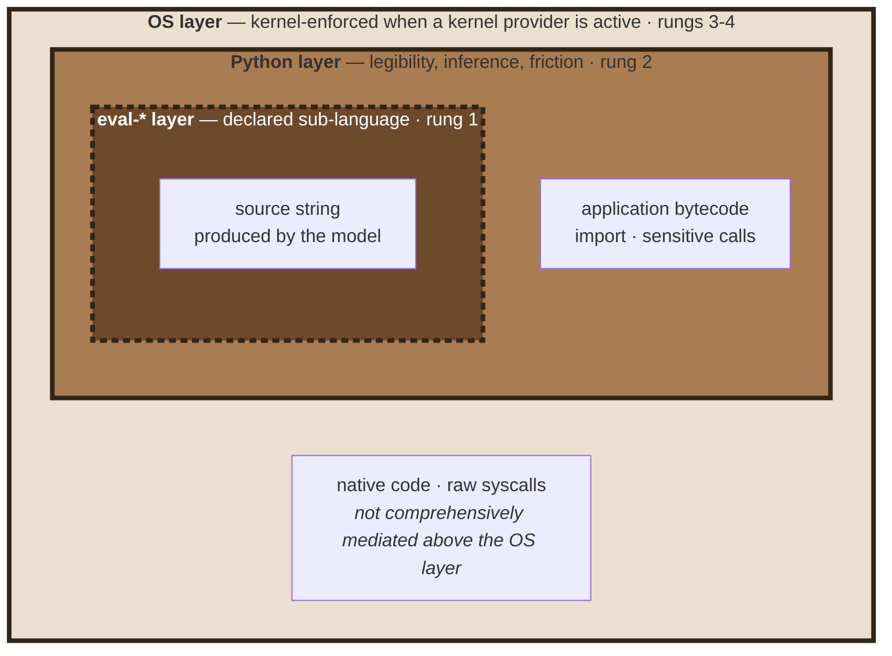
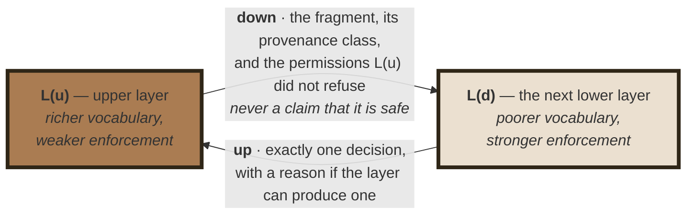
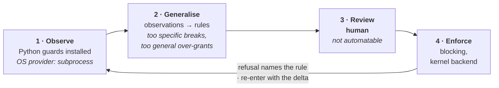
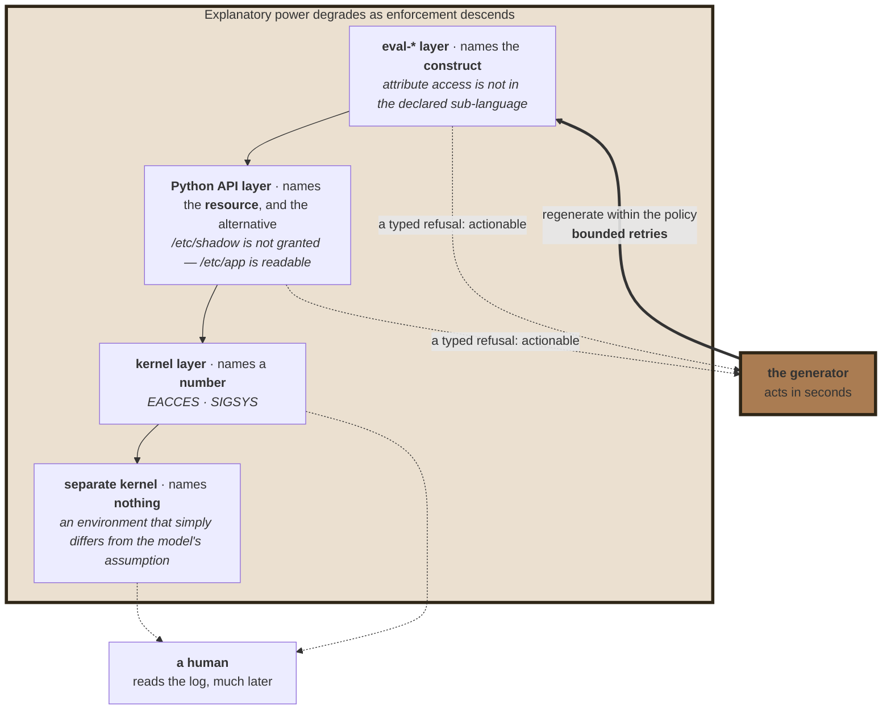
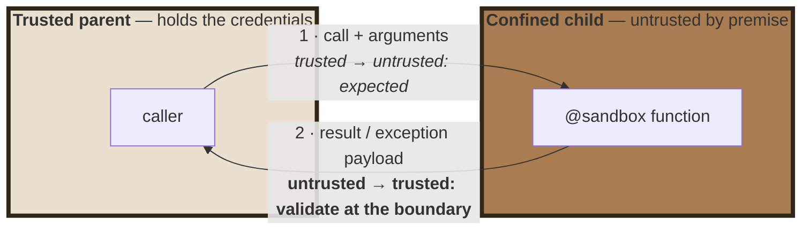

# Confining Python by Observation

### Policy Inference Across Three Layers

**Philippe PRADOS** — [github@prados.fr](mailto:github@prados.fr)

September 2026

---

## Abstract

Python-level checks alone cannot confine hostile Python code. The practical
problem is different: writing a least-privilege policy requires knowing which
files, hosts, ports, imports and environment variables an application uses.
That information is spread across the application and its dependencies.

This paper studies an alternative: observe accesses through Python APIs during
a learning run, produce one reviewable profile, then use that profile to
configure Python guards and an available OS sandbox. Observation is incomplete:
it misses unexercised paths and operations performed directly by native code.
The profile therefore needs human review, and a kernel-backed OS sandbox is
still required when code may bypass Python-level checks.

Reference implementation:
[`py-sandboxes`](https://github.com/pprados/pysandboxes) (Apache-2.0). Paper
licensed CC BY-NC-SA 4.0.

The implementation and its tests are evidence for feasibility and specific
behaviors, not a measurement of policy quality or a proof against hostile code.

## Contribution — four claims, and what would refute each

| | Claim | § | What would falsify it |
|---|---|---|---|
| **1** | A capability ladder helps identify which layer can observe or enforce each kind of operation | [3](#3-the-ladder-and-why-layers-nest) | a demonstrated interpreter-level control that reliably confines arbitrary native operations |
| **2** | A four-clause contract describes how layers should compose | [4](#4-the-composition-contract) | a tested composition that violates a clause, or evidence that the clauses do not help detect policy widening |
| **3** | One inferred profile can provide common policy inputs to several layers and backends | [5](#5-one-profile-inferred) | experiments showing that separate configurations are as accurate and easy to review, or that inferred profiles are not useful without extensive manual authoring |
| **4** | Typed refusals could help regenerate code within the existing policy | [6](#6-denial-as-a-signal) | measurement showing that feedback does not improve successful, in-policy regeneration |

## 1. Two shapes of the same problem

An agentic application runs a loop: the model produces a tool call or a source
string, the application executes it, the result returns to the model. The
artefact runs within milliseconds, without review, inside a process holding API
tokens and credentials [[OWASP-LLM]] [[CVE-LIST]].

```python
@tool
def evaluate_expression(expression: str) -> str:
    return str(eval(expression))          # the model wrote `expression`
```

```python
# added by an assistant, in response to "add a retry with backoff"
import requests, os, subprocess          # two of these were not asked for
```

The first example is code supplied as data at runtime. The second shows how
ordinary application code can gain access to capabilities its author did not
intend. Both motivate policy checks at more than one boundary.

**The primary threat model is wayward code, not a hostile attacker.** Such code
may call `open`, `requests.get` or `subprocess` while trying to complete the
wrong task. The Python layer aims to refuse and explain these calls and record
them during learning. It does not reliably stop code deliberately searching for
a way around the guards. That stronger threat requires an active OS boundary.

**Provenance is a property of a fragment, not of a program.** In one agent turn
an application may evaluate a model-written expression (**P1**), run a
model-written script (**P2**), call a third-party tool body with model-chosen
arguments (**P3**), and execute its own assisted codebase (**P4**). A single
uniform boundary, such as a fresh microVM [[ISOLATION-CMP]], can isolate the
process but does not by itself distinguish these provenance classes or explain
refusals in Python terms.



For P4 the profile can also serve as a **review artefact**: a new
`python-api=ALLOW:process-exec` permission is visible in a file that lists the
application's capabilities. Whether reviewers reliably catch inappropriate
permissions has not been measured.

## 2. Prior art, and what it leaves open

Everything cited here predates December 2025. Each entry either fixes a
constraint the design must respect, or is a direct antecedent whose limit the
design tries to move past.

| The record | What it settles | What it does not give |
|---|---|---|
| `rexec`, `Bastion`, `pysandbox` — each abandoned by its own author, the last as *broken by design* [[REXEC]] [[BASTION]] [[PYSANDBOX-REPO]] [[STINNER-2013]] | in-interpreter confinement fails; the recurring escape is an object-graph path from a permitted object back to an unrestricted one | any reason to build the interpreter layer as an **enforcer**. This paper takes the verdict as a premise, not as something to contest |
| PEP 578 audit hooks [[PEP-578]] [[PEP-551]] | the interpreter can **observe named events** | an operator-owned policy vocabulary or complete mediation; native-hook experiments and their limits are summarized in §8 |
| `simpleeval`, `asteval`, `RestrictedPython` [[SIMPLEEVAL]] [[ASTEVAL]] [[ASTEVAL-101]] | whitelisting by construction beats blacklisting by subtraction; `str.format` traverses the object graph and is therefore a capability — rediscovered three times, most recently as CVE-2025-24359 [[ASTEVAL-CVE]] [[RESTRICTEDPYTHON-CVE]] [[ACCESSCONTROL-CVE]]; an exception instance is itself a reference into that graph | anything above a single expression |
| seccomp-bpf, Landlock, namespaces, gVisor, microVMs [[SECCOMP]] [[LANDLOCK-DOC]] [[ISOLATION-CMP]] | enforcement is **mature**, and the privilege each mechanism demands is a deployment fact, not a security preference | resource *identity*: seccomp-bpf cannot dereference pointer arguments by design [[SECCOMP]], so `/etc/passwd` and a scratch file are the same `openat` |
| `aa-genprof`, `audit2allow`, *Mining Sandboxes*, *Confine* [[AA-GENPROF]] [[AUDIT2ALLOW]] [[MINING-SANDBOXES]] [[CONFINE]] | a policy **can** be learned by observation — and the dilemma is already mapped: observation under-approximates, static analysis over-approximates [[SYSCALL-LIMIT]] | a reviewable vocabulary (they learn syscalls), and an artefact not welded to one enforcement mechanism |
| E2B, Modal, the agent frameworks [[SMOLAGENTS-SEC]]; CaMeL, IsolateGPT, AgentDojo [[CAMEL]] [[AGENT-PATTERNS]] [[ISOLATEGPT]] [[AGENTDOJO]] | a fresh machine per execution is cheap; agent-level governance constrains *what the agent may decide* | any per-application least-privilege profile — *what the resulting process may touch*, once the decision has already gone wrong |

Four gaps remain, and they are exactly the four claims of this paper.

1. **The policy-authoring gap.** Enforcement is solved; least-privilege *policy*
   for a specific application is not. Nothing in the record produces the list.
   → *claim 3, and the inversion itself.*
2. **The vocabulary gap.** No layer below the interpreter can express "may
   import `json` but not `subprocess`", or "may call `eval` on arithmetic only".
   Those are language concepts, invisible to seccomp and Landlock alike — which
   is why the layers must be ordered rather than chosen between.
   → *claim 1.*
3. **The specification gap.** "Defence in depth" is an exhortation everywhere
   and a specification nowhere. What does an upper layer *hand* a lower one?
   What may the lower one assume? No cited work answers.
   → *claim 2.*
4. **The feedback gap.** Classically a denial has one consumer: a human reading
   a log, much later. When the code was generated it has a second consumer,
   acting within seconds — the generator — and no cited work addresses it.
   → *claim 4.*

## 3. The ladder, and why layers nest

Order the adversary by what they can *emit*. Each rung contains the previous, so
the question is never "which sandbox", but "which rung must be covered, and by
the last layer that can still see it".

| Rung | What the fragment can emit | Last layer able to see it | What that layer owns |
|---|---|---|---|
| **1** | a source string | the `eval-*` sub-language | which constructs exist at all |
| **2** | arbitrary Python bytecode | the Python API layer | imports and sensitive calls — and the vocabulary the profile is written in |
| **3** | native code (`ctypes`, C extension) | the OS layer, when a kernel-backed provider is active | resources exposed by that provider |
| **4** | raw syscalls | the OS layer | idem |
| **5** | kernel compromise | a separate kernel (VM / microVM) | the guest boundary, with higher startup and resource costs |



The table is a guide to where different checks can work, not a guarantee that a
particular deployment enforces every rung. The eval guard sees source before it
runs. Import and module identity belong to Python. The Python API guard can
detect or refuse selected native entry points, but cannot mediate arbitrary
native operations. Kernel-backed OS providers can restrict many such operations
at the process boundary; `none` and `subprocess` do not provide that boundary.
A shared-kernel sandbox also does not protect against kernel compromise.

Two useful design principles follow. **Upward blindness**: Python checks cannot
reliably mediate operations performed directly by native code. **Downward
silence**: a kernel policy has no concept of Python imports or syntax, so it
cannot replace the Python guards for those decisions.



Hence **compose the layers**: a kernel backend has no notion of imports, while
the Python layer cannot reliably mediate native operations. The actual coverage
depends on which provider is enabled and how it is configured.

## 4. The composition contract

The ladder says *which* layers are needed. It does not say what they owe each
other. Four clauses answer, and they are what turns a set of mechanisms into a
stack.



**C1 — monotone restriction.** A layer is configured as though it were the only
layer for the class it owns. Permitting `subprocess` at the interpreter layer
"because the kernel will catch anything dangerous" delegates to a layer that
owns resources, not modules, and is structurally incapable of accepting the
delegation. Disagreements resolve by intersection: restrictively, and loudly.

**C2 — fail-closed on the unseen.** What a layer did not explicitly permit is
refused, and an inability to decide is a refusal. This is what makes an
*incomplete* policy safe to compose.

**C3 — no upward trust.** A parent calling `pickle.loads` on a confined child's
output has negative security: the channel exists only because the boundary does.
The transport carries data, not code; tracebacks are data too.

**C4 — bounded claims.** Each layer declares the rung above which it claims
nothing, in its configuration rather than in its documentation. For the current
Python layer, the supportable claim is narrower: selected calls from wayward
code can be refused with a named rule and recorded during learning. It does not
claim that arbitrary Python bytecode cannot reach ungranted resources. The
*broken by design* verdict of 2013 [[PYSANDBOX-REPO]] applies to a layer claiming
to contain a hostile rung-2 attacker; it does not refute this narrower role.

These are proposed composition rules, not a claim that every current provider
has been proven to satisfy them. C3 remains a design goal with partial
mitigations: the transport uses a restricted unpickler, but its default result
mode is fail-open. Section 7 describes the remaining risk. Provider behavior
also differs; for example, network enforcement and filesystem masking vary
across backends. The rules are
useful review questions: does a failure remain restrictive, does an unknown
operation fail closed, and are claims limited to what the active layer can
enforce?

## 5. One profile, inferred

One declarative artefact in **resource terms rather than mechanism terms**
(`expose-ro=/etc/app`, not `--ro-bind …`), reviewable and
environment-parameterised. Seven rule families —
environment, filesystem, network, imports, sensitive calls, dynamic code,
backend selection — of which imports and dynamic code have no kernel analogue.
Its singleness is useful because it gives an operator one place to review the
application's declared capabilities. It does not mean that every rule has an
equivalent in every enforcement layer.

Hand-writing a complete profile is difficult: dependencies may access files the
application author did not consider, and some paths are computed at runtime.
Learning mode offers a starting point by recording exercised accesses through
the Python guards. The result still needs review and may need manual additions.



Learning currently runs with the `subprocess` provider. It can record operations
that pass through the Python guards, but it cannot observe all operations made
by compiled extensions or other native code. Those missing requirements may
need to be added to the profile manually. Review remains necessary because an
overly broad learned or edited rule can grant more access than intended.

**The coverage gap.** Learning is an observation of exercised behavior, not a
complete specification. It can miss unexercised paths and calls that bypass
Python wrappers. A kernel-backed provider can still deny resources absent from
its compiled policy, but rules that were not observed may also be absent from
that policy; provider coverage and configuration must be checked. Learning from
untrusted input can also record behavior the operator should not permit, so the
generated profile needs review before enforcement.

Two rules govern compilation to a backend. **Never silently downgrade**: if a
rule cannot be expressed, rely on the layer above *and say so*, or refuse the
configuration — a dropped rule reads stricter than it is. And when a rule is
stated at one level and enforced at another, **pin the translation, do not
repeat it**: resolve hostnames once at compile time and pin the mapping inside
the sandbox, or DNS and the packet filter will disagree on every load-balanced
service.

The available enforcement also depends on deployment constraints. Landlock
restricts the process without namespace capabilities but requires suitable
kernel support on the node. Namespace-based providers may need capabilities that
containers do not grant. QEMU places execution behind a separate kernel, with
different startup and resource costs. The profile can remain stable while the
operator selects a supported provider, but rule coverage is provider-specific.

## 6. Denial as a signal

A denial can be useful to both an operator and a code generator. Python guards
can attach a rule or category to some refusals; kernel errors usually expose a
lower-level reason. The proposal is to feed actionable refusals back to a
generator, with bounded retries and without widening policy automatically.
Whether this improves regeneration has not been measured, and the repository
does not implement an automatic retry loop.



The Python layer is useful because it can express rules that the kernel cannot,
record accesses for learning, and explain some refusals in Python terms. Those
benefits do not make it a security boundary against hostile bytecode.

Three cautions, in the order in which this goes wrong. A refusal must project
the **policy**, never the environment, or it is reconnaissance. Retries must be
**bounded**, since a model retrying indefinitely searches the policy boundary at
machine speed. And a policy may **never** be widened by the component that
received the refusal: inference and widening are the same operation, one
performed at development time with a human in the middle, the other at execution
time with nothing.

## 7. The boundary is a data boundary

Kernel backends confine *processes*, so partial confinement needs a child
process — which is also how an environment variable is denied properly, by never
being passed at `exec` time.



Arrow 2 is where the parent must treat child data as untrusted. PySandboxes now
uses a restricted pickle reader on both return channels, but their guarantees
differ. The exception channel is fail-closed and falls back to a plain
descriptor when an exception cannot be reconstructed. The default result mode
uses a fail-open denylist to preserve application-defined return types; the
optional `remote-result-mode=data-only` rejects object-reconstruction opcodes
and accepts only primitive values and built-in containers. The default mode
reduces risk but does not eliminate it. See [the transport guard
analysis](../wiki/transport-unpickle-guard.md).

## 8. Limits, and what is not measured

These limits qualify the composition model above. The model is a way to state
and review layer responsibilities; its clauses are not themselves proof that
every provider or configuration meets them.

**The Python layer** is bypassable by construction against hostile bytecode:
patched functions retain a reference to the original; the object graph reaches
the guards' own state; a module global cannot be made unwritable, because a
module's functions keep `__globals__` bound to the original dict; the arming
flag can be reached; and native code can call APIs outside Python wrappers.
The layer raises the cost of sensitive calls from wayward code and records
some of them in learning mode. Dynamic-code budgets bound selected operations,
but they do not provide general resource control for the process. Shared-kernel
backends do not address rung 5. A profile can also grant too much without a
visible failure, so human review remains necessary.

The current repository has roughly 1,410 unit tests, 135 integration tests, 60
container test rows and about 170 sample tests (12 sample applications), when
the sample environments are available. These are repository snapshot counts,
not a single CI run. Integration tests exercise several guard families across
the six available providers; the host matrix adds a seventh row for QEMU without
KVM.
Container tests cover filesystem, network and environment behavior; they do not
exercise the eval, API or import guards, and some provider/container
combinations are excluded or expected to fail.

Tests also pin both sides of important boundaries. For example, the native
extension import test ensures legitimate C extensions still load; separate
security assessments record that calls such as `ctypes.pythonapi` remain an
escape from Python interception. The native-guard study reports a disposable
prototype that protected selected C callables, then explains why it was not
adopted as a general layer. These results support the stated limit: native
code is not comprehensively contained by Python guards. They do not establish
that every OS provider confines every native operation.

Policy inference **coverage**, **precision**, and **reviewability** have not
been measured. In particular, the tests do not show whether reviewers notice
an intentionally planted over-grant, nor whether feeding refusals back to a
generator improves its next attempt. Those are empirical questions for future
evaluation. The falsification conditions above are research questions, not
results established by this implementation.

Implementation evidence referenced here includes the repository's [test
coverage map](../wiki/tests.md), [Python-layer security
assessment](../wiki/audit-python-security.md), [native guard study and
decision](../wiki/audit-native-guard-study.md), [known
weaknesses](../wiki/weaknesses.md), and [transport guard
analysis](../wiki/transport-unpickle-guard.md). Test counts and behavior vary
by revision.

## References

The references below provide background for the design. The implementation
evidence and its limits are documented separately in the repository links at
the end of Section 8.

**In-interpreter confinement**

- [REXEC] `rexec` — Restricted execution framework, Python Standard Library.
  Disabled in Python 2.3; deprecated 2.6; removed 3.0.
  <https://tedboy.github.io/python_stdlib_doc/30_restricted_exec/rexec.html>
- [BASTION] `Bastion` — Restricting access to objects, Python 2.7 documentation.
  <https://documentation.help/Python-2.7/bastion.html>
- [STINNER-2013] Victor Stinner, *The pysandbox project is broken*, python-dev,
  November 2013.
  <https://mail.python.org/pipermail/python-dev/2013-November/130132.html>
- [LWN-574215] *The failure of pysandbox*, LWN.net, November 2013.
  <https://lwn.net/Articles/574215/>
- [PYSANDBOX-REPO] vstinner/pysandbox — *"BROKEN BY DESIGN … run python in a
  sandbox, not the opposite!"* <https://github.com/vstinner/pysandbox>

**Observability**

- [PEP-578] PEP 578 — Python Runtime Audit Hooks (Python 3.8).
  <https://peps.python.org/pep-0578/>
- [PEP-551] PEP 551 — Security transparency in the Python runtime.
  <https://peps.python.org/pep-0551/>

**Restricted evaluators**

- [SIMPLEEVAL] danthedeckie/simpleeval — *Simple Safe Sandboxed Extensible
  Expression Evaluator for Python*. <https://github.com/danthedeckie/simpleeval>
- [ASTEVAL] *ASTEVAL: Minimal Python AST evaluator* — motivation and security
  notes, including the numpy-ufunc segfault warning.
  <https://lmfit.github.io/asteval/motivation.html>
- [ASTEVAL-101] asteval 1.0.1 release notes (2024) — security fixes from an audit
  by A. Effenhauser, A. Hammad and D. Crowley (IBM X-Force Security Research):
  `string.format()` disallowed, f-string evaluation hardened, numpy
  `polynomial`, `fft` and `linalg` removed by default.
  <https://github.com/lmfit/asteval/releases>
- [ASTEVAL-CVE] CVE-2025-24359 / GHSA-3wwr-3g9f-9gc7 (January 2025) — *ASTEVAL
  vulnerable to maliciously crafted format strings leading to sandbox escape*:
  `on_formattedvalue` used `str.format`, and a deliberately triggered
  `AttributeError` exposed the protected object via the exception's `obj`
  attribute. Fixed in 1.0.6.
  <https://osv.dev/vulnerability/CVE-2025-24359>
- [RESTRICTEDPYTHON-CVE] CVE-2023-41039 — RestrictedPython: information
  disclosure through Python's formatting functionality (`format` and
  `format_map` on `str`, and `string.Formatter`).
  <https://nvd.nist.gov/vuln/detail/CVE-2023-41039>
- [ACCESSCONTROL-CVE] CVE-2021-32807 — Zope `AccessControl`: the `string` module
  was exempted as safe, but `string.Formatter` could be subclassed within a
  restricted Script (Python) to reach unsafe libraries, yielding remote code
  execution. Fixed in AccessControl 4.3 and 5.2.
  <https://nvd.nist.gov/vuln/detail/CVE-2021-32807>

**Kernel isolation**

- [SECCOMP] `seccomp(2)` — Linux manual page. Filter mode
  (`SECCOMP_SET_MODE_FILTER`) added in Linux 3.5; the manual states that the
  filter cannot dereference pointer arguments, so syscalls can be matched on
  their scalar arguments only.
  <https://man7.org/linux/man-pages/man2/seccomp.2.html>
- [LANDLOCK-DOC] *Landlock: unprivileged access control*, Linux kernel
  documentation. Filesystem rules in 5.13, network rules in 6.7.
  <https://docs.kernel.org/userspace-api/landlock.html>
- [ISOLATION-CMP] Comparative analyses of Kata Containers, Firecracker and
  gVisor — architecture, attack surface and startup latency.
  <https://northflank.com/blog/kata-containers-vs-firecracker-vs-gvisor>

**Policy synthesis by observation**

- [AA-GENPROF] `aa-genprof(8)` — profile generation utility for AppArmor;
  complain mode, log scanning, iterative refinement via `aa-logprof`.
  <https://apparmor.net/man/3.0/aa-genprof/>
- [AUDIT2ALLOW] `audit2allow(1)` — generate SELinux policy rules from logs of
  denied operations. <https://man7.org/linux/man-pages/man1/audit2allow.1.html>
  See also Red Hat's caution on accepting generated rules without analysis.
- [MINING-SANDBOXES] Z. Wan, D. Lo, X. Xia, L. Cai, S. Li, *Mining Sandboxes for
  Linux Containers*, ICST 2017, pp. 92–102. arXiv:1712.05493.
  <https://arxiv.org/abs/1712.05493>
- [CONFINE] S. Ghavamnia, T. Palit, A. Benameur, M. Polychronakis, *Confine:
  Automated System Call Policy Generation for Container Attack Surface
  Reduction*, RAID 2020, pp. 443–458.
  <https://www.usenix.org/conference/raid2020/presentation/ghavanmnia>
- [SYSCALL-LIMIT] D. Zhan, Z. Yu, X. Yu, H. Zhang, L. Ye, *Shrinking the Kernel
  Attack Surface Through Static and Dynamic Syscall Limitation*, arXiv:2510.03720
  (October 2025). <https://arxiv.org/abs/2510.03720>

**LLM-era execution**

- [OWASP-LLM] OWASP Top 10 for LLM Applications 2025 — LLM05 Improper Output
  Handling, LLM06 Excessive Agency.
  <https://genai.owasp.org/resource/owasp-top-10-for-llm-applications-2025/>
- [SMOLAGENTS-SEC] *Secure code execution*, smolagents documentation —
  `LocalPythonExecutor` is "not a security boundary"; E2B, Modal, Docker and
  WebAssembly backends.
  <https://huggingface.co/docs/smolagents/en/tutorials/secure_code_execution>
- [CAMEL] E. Debenedetti, I. Shumailov, T. Fan, J. Hayes, N. Carlini,
  D. Fabian, C. Kern, C. Shi, A. Terzis, F. Tramèr, *Defeating Prompt Injections
  by Design*, arXiv:2503.18813 (March 2025).
  <https://arxiv.org/abs/2503.18813>
- [AGENT-PATTERNS] L. Beurer-Kellner, B. Buesser, A.-M. Creţu, E. Debenedetti,
  et al., *Design Patterns for Securing LLM Agents against Prompt Injections*,
  arXiv:2506.08837 (June 2025). <https://arxiv.org/abs/2506.08837>
- [ISOLATEGPT] Y. Wu, F. Roesner, T. Kohno, N. Zhang, U. Iqbal, *IsolateGPT: An
  Execution Isolation Architecture for LLM-Based Agentic Systems*,
  arXiv:2403.04960 (March 2024; NDSS 2025).
  <https://arxiv.org/abs/2403.04960>
- [AGENTDOJO] E. Debenedetti, J. Zhang, M. Balunović, L. Beurer-Kellner,
  M. Fischer, F. Tramèr, *AgentDojo: A Dynamic Environment to Evaluate Prompt
  Injection Attacks and Defenses for LLM Agents*, arXiv:2406.13352 (June 2024;
  NeurIPS 2024 Datasets & Benchmarks). <https://arxiv.org/abs/2406.13352>
- [CVE-LIST] Execution-surface CVEs in agent frameworks, as catalogued in this
  project's README: CVE-2023-46229, CVE-2023-32786, CVE-2024-28088,
  CVE-2024-7774, CVE-2024-3571, CVE-2024-3095, CVE-2024-2057, CVE-2025-2828,
  CVE-2025-6985 (LangChain); CVE-2025-5120 (smolagents).
