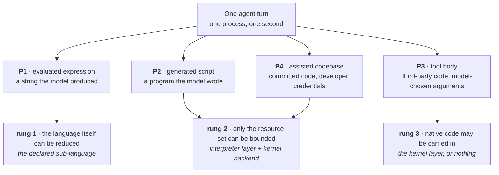
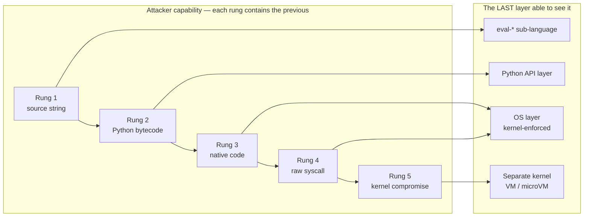
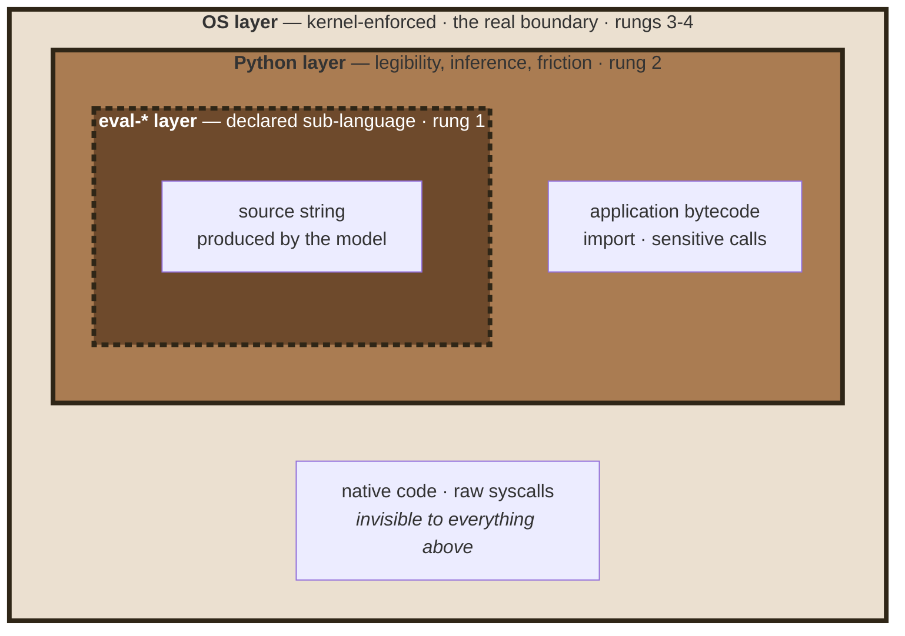
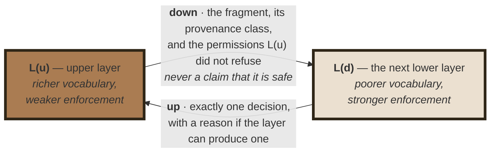
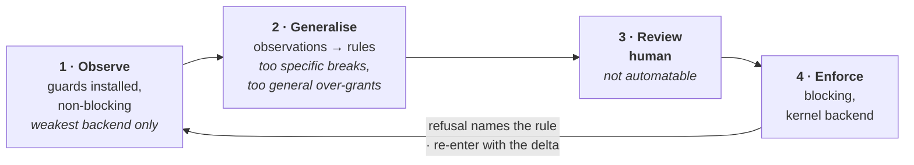
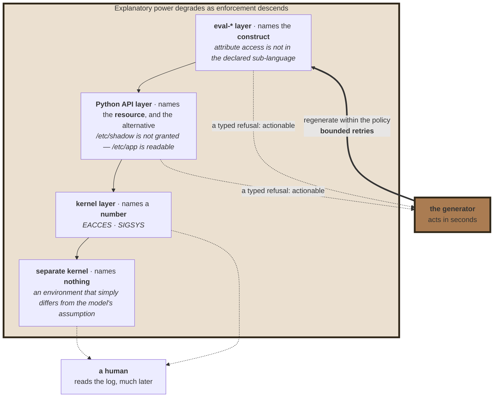
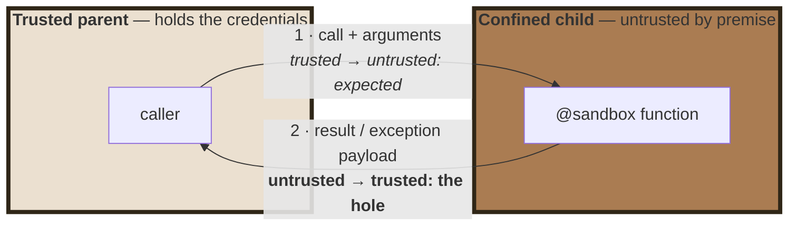

# Confining Python by Observation

### Four Layers, a Composition Contract, and a Profile Nobody Had to Write

**Philippe PRADOS** — [github@prados.fr](mailto:github@prados.fr) · Sept. 2026

Reference implementation:
[`py-sandboxes`](https://github.com/pprados/pysandboxes) (Apache-2.0). Paper
licensed CC BY-NC-SA 4.0.

---

## Abstract

Sandboxing Python fails when attempted *inside* the interpreter and succeeds
*around the process*; that was settled in 2013 [[STINNER-2013]] [[LWN-574215]]. The obstacle to OS-level
confinement is not the kernel — namespaces, seccomp-bpf [[SECCOMP]], Landlock
[[LANDLOCK-DOC]] and virtualisation have been production-hardened for years —
it is **the policy**.
A least-privilege profile requires enumerating, up front and without error,
every directory, host, port and environment variable a real application needs.
Nobody has that list, which is why teams either skip confinement or grant far
more than necessary.

Hence an inversion: the interpreter-level layer's primary job is **not
enforcement**, which is conceded to the kernel, but **policy inference**. At the
Python API boundary it observes every file, socket, import and environment
access in the operator's own terms — a path, a hostname, a module name — and
emits one declarative profile, compiled to whichever backend the deployment
allows.

## Contribution — four claims, and what would refute each

| | Claim | § | What would falsify it |
|---|---|---|---|
| **1** | A monotone **ladder of attacker capability** decides which layers are needed, because each rung has a *last* layer able to see it | [3](#3-the-ladder-and-why-layers-nest) | one layer covering two non-adjacent rungs — for instance an interpreter-level mechanism that genuinely contains native code |
| **2** | A **four-clause contract** decides what each layer owes the others, turning a set of mechanisms into a stack | [4](#4-the-composition-contract) | a stack satisfying C1–C4 in which one layer's failure widens another's policy — most plausibly where the interpreter enforces a path *as written* and the kernel *as resolved* |
| **3** | **One inferred artefact** configures every layer and outlives the choice of backend | [5](#5-one-profile-inferred) | four independently written configurations intersecting to the intended policy as reliably as a compiled profile; or inference coverage so low the loop never converges without manual authoring |
| **4** | **A refusal is a typed signal** that re-enters the loop which produced the code | [6](#6-denial-as-a-signal) | measurement: if fed-back refusals do not improve the rate at which a regenerated fragment succeeds within the policy, the upper layers' value is the vocabulary alone |

## 1. Two shapes of the same problem

An agentic application runs a loop: the model produces a tool call or a source
string, the application executes it, the result returns to the model. The
artefact runs within milliseconds, without review, inside a process holding API
tokens and credentials [[OWASP-LLM]] [[CVE-LIST]].

```python
@tool
def evaluate_expression(expression: str) -> str:
    return str(eval(expression))          # the model wrote `expression`
```

```python
# added by an assistant, in response to "add a retry with backoff"
import requests, os, subprocess          # two of these were not asked for
```

These two lines are the whole problem. The first is a string that exists only at
runtime, so no human will ever review it; the second is a module that will still
be there in a year, and a diff shows what the code *says*, not what the process
can now *reach*.

**The threat model is code that is wayward, not adversarial.** It reaches for
`open`, `requests.get` or `subprocess` *in the open*; it does not enumerate
`object.__subclasses__()` looking for a way to disable the guard, because it was
never written to escape — it was written to accomplish a task, and the task was
wrong. Three properties then matter more than absolute containment: the refusal
happens, the refusal *names the rule*, and the attempt is recorded so policy can
be built from observed rather than imagined behaviour.

**Provenance is a property of a fragment, not of a program.** In one agent turn
an application may evaluate a model-written expression (**P1**), run a
model-written script (**P2**), call a third-party tool body with model-chosen
arguments (**P3**), and execute its own assisted codebase (**P4**). A single
uniform boundary — the fresh microVM [[ISOLATION-CMP]] — treats all four as equally hostile and
equally opaque, so it can neither refuse precisely nor explain why.



For P4 the profile stops being only a runtime control and becomes a **review
artefact**: a reviewer who would miss `import subprocess` will notice
`python-api=ALLOW:process-exec` appearing in a file whose only content is
capabilities. The profile is a regression test on privilege.

## 2. Prior art, and what it leaves open

Everything cited here predates December 2025. Each entry either fixes a
constraint the design must respect, or is a direct antecedent whose limit the
design tries to move past.

| The record | What it settles | What it does not give |
|---|---|---|
| `rexec`, `Bastion`, `pysandbox` — each abandoned by its own author, the last as *broken by design* [[REXEC]] [[BASTION]] [[PYSANDBOX-REPO]] [[STINNER-2013]] | in-interpreter confinement fails; the recurring escape is an object-graph path from a permitted object back to an unrestricted one | any reason to build the interpreter layer as an **enforcer**. This paper takes the verdict as a premise, not as something to contest |
| PEP 578 audit hooks [[PEP-578]] [[PEP-551]] | the interpreter can **observe without confining** — the PEP says so in its own text | a vocabulary chosen by the operator rather than by the runtime, and integrity without a native pre-init hook |
| `simpleeval`, `asteval`, `RestrictedPython` [[SIMPLEEVAL]] [[ASTEVAL]] [[ASTEVAL-101]] | whitelisting by construction beats blacklisting by subtraction; `str.format` traverses the object graph and is therefore a capability — rediscovered three times, most recently as CVE-2025-24359 [[ASTEVAL-CVE]] [[RESTRICTEDPYTHON-CVE]] [[ACCESSCONTROL-CVE]]; an exception instance is itself a reference into that graph | anything above a single expression |
| seccomp-bpf, Landlock, namespaces, gVisor, microVMs [[SECCOMP]] [[LANDLOCK-DOC]] [[ISOLATION-CMP]] | enforcement is **mature**, and the privilege each mechanism demands is a deployment fact, not a security preference | resource *identity*: seccomp-bpf cannot dereference pointer arguments by design [[SECCOMP]], so `/etc/passwd` and a scratch file are the same `openat` |
| `aa-genprof`, `audit2allow`, *Mining Sandboxes*, *Confine* [[AA-GENPROF]] [[AUDIT2ALLOW]] [[MINING-SANDBOXES]] [[CONFINE]] | a policy **can** be learned by observation — and the dilemma is already mapped: observation under-approximates, static analysis over-approximates [[SYSCALL-LIMIT]] | a reviewable vocabulary (they learn syscalls), and an artefact not welded to one enforcement mechanism |
| E2B, Modal, the agent frameworks [[SMOLAGENTS-SEC]]; CaMeL, IsolateGPT, AgentDojo [[CAMEL]] [[AGENT-PATTERNS]] [[ISOLATEGPT]] [[AGENTDOJO]] | a fresh machine per execution is cheap; agent-level governance constrains *what the agent may decide* | any per-application least-privilege profile — *what the resulting process may touch*, once the decision has already gone wrong |

Four gaps remain, and they are exactly the four claims of this paper.

1. **The policy-authoring gap.** Enforcement is solved; least-privilege *policy*
   for a specific application is not. Nothing in the record produces the list.
   → *claim 3, and the inversion itself.*
2. **The vocabulary gap.** No layer below the interpreter can express "may
   import `json` but not `subprocess`", or "may call `eval` on arithmetic only".
   Those are language concepts, invisible to seccomp and Landlock alike — which
   is why the layers must be ordered rather than chosen between.
   → *claim 1.*
3. **The specification gap.** "Defence in depth" is an exhortation everywhere
   and a specification nowhere. What does an upper layer *hand* a lower one?
   What may the lower one assume? No cited work answers.
   → *claim 2.*
4. **The feedback gap.** Classically a denial has one consumer: a human reading
   a log, much later. When the code was generated it has a second consumer,
   acting within seconds — the generator — and no cited work addresses it.
   → *claim 4.*

## 3. The ladder, and why layers nest

Order the adversary by what they can *emit*. Each rung contains the previous, so
the question is never "which sandbox", but "which rung must be covered, and by
the last layer that can still see it".

| Rung | What the fragment can emit | Last layer able to see it | What that layer owns |
|---|---|---|---|
| **1** | a source string | the `eval-*` sub-language | which constructs exist at all |
| **2** | arbitrary Python bytecode | the Python API layer | imports and sensitive calls — and the vocabulary the profile is written in |
| **3** | native code (`ctypes`, C extension) | the OS layer, kernel-enforced | files, sockets, processes — by resource |
| **4** | raw syscalls | the OS layer | idem |
| **5** | kernel compromise | a separate kernel (VM / microVM) | everything, at an order of magnitude in startup and memory |



The column that matters is the third one, and it is forced: a source string is
visible only before it becomes a code object; `import` and module identity exist
only inside the interpreter, so no syscall trace can express "`json` yes,
`subprocess` no"; native code is invisible to the interpreter by construction;
and a kernel vulnerability is invisible to anything sharing that kernel.

Two corollaries. **Upward blindness**: a layer cannot see rungs above its own,
so hardening the interpreter layer against `ctypes` is wasted effort — the same
adversary arrives through a compiled extension. **Downward silence**: a layer
cannot see concepts below its own, so the kernel layer cannot replace the
interpreter layer either.



Hence **nest, never substitute**: a ❌ against a kernel backend for "import" does
not mean imports are unprotected, it means that technology has no notion of
imports, and the layer above does.

## 4. The composition contract

The ladder says *which* layers are needed. It does not say what they owe each
other. Four clauses answer, and they are what turns a set of mechanisms into a
stack.



**C1 — monotone restriction.** A layer is configured as though it were the only
layer for the class it owns. Permitting `subprocess` at the interpreter layer
"because the kernel will catch anything dangerous" delegates to a layer that
owns resources, not modules, and is structurally incapable of accepting the
delegation. Disagreements resolve by intersection: restrictively, and loudly.

**C2 — fail-closed on the unseen.** What a layer did not explicitly permit is
refused, and an inability to decide is a refusal. This is what makes an
*incomplete* policy safe to compose.

**C3 — no upward trust.** A parent calling `pickle.loads` on a confined child's
output has negative security: the channel exists only because the boundary does.
The transport carries data, not code; tracebacks are data too.

**C4 — bounded claims.** Each layer declares the rung above which it claims
nothing, in its configuration rather than in its documentation. The interpreter
layer's claim is: *a fragment not attempting escape cannot reach an ungranted
resource, and every attempt is named.* The *broken by design* verdict of 2013 [[PYSANDBOX-REPO]] is
true of a layer that claimed to stop a rung-2 attacker; it does not refute that
one.

Three consequences. A silent, total failure at an upper layer promotes the
attacker one rung but widens no lower policy. No layer's guarantee is
conditional on another holding. And the stack claims exactly its lowest layer's
claim — never the union, read as a maximum.

## 5. One profile, inferred

One declarative artefact in **resource terms rather than mechanism terms**
(`expose-ro=/etc/app`, not `--ro-bind …`), reviewable, composable without
ordering semantics, environment-parameterised. Seven rule families —
environment, filesystem, network, imports, sensitive calls, dynamic code,
backend selection — of which imports and dynamic code have no kernel analogue.
Its singleness is not a convenience: C1 makes the effective policy an
intersection, and an intersection across vocabularies that share no term cannot
be checked at all if each layer is configured separately.

Nobody can write such a profile by inspection: not the author, whose
dependencies read files he never considered; not an auditor, because the
accesses are spread across a dependency tree; not a static analyser, because
paths are computed at runtime. So it is not written — it is **observed**.



Learning runs with the *weakest* backend — one cannot learn through a wall. And
refusals must name the rule, or the operator guesses, and guessing over-grants.

**The soundness gap.** Inference is unsound by construction: unexercised paths
are unlearned rules; compiled extensions never cross the Python API; and
learning over hostile code learns hostile rules, so it is a development-time
activity on trusted input. None of this is fixed by observing better. It is
closed by *where enforcement sits relative to where observation happened*:
observation at the Python API layer, enforcement below it, and by C2 the kernel
denies everything the profile does not grant — including everything observation
missed. Unsound inference therefore yields a profile that is too narrow, never
too wide, and too narrow fails visibly.

Two rules govern compilation to a backend. **Never silently downgrade**: if a
rule cannot be expressed, rely on the layer above *and say so*, or refuse the
configuration — a dropped rule reads stricter than it is. And when a rule is
stated at one level and enforced at another, **pin the translation, do not
repeat it**: resolve hostnames once at compile time and pin the mapping inside
the sandbox, or DNS and the packet filter will disagree on every load-balanced
service.

Which mechanism implements the kernel layer is then a deployment decision, not a
ranking: self-restriction needs no privilege but a recent kernel *on the node*;
namespace tooling buys filesystem views for capabilities many platforms refuse;
a VM answers rung 5 and costs an order of magnitude. **More isolation does not
mean more privilege required** — which is precisely why the profile must outlive
the decision.

## 6. Denial as a signal

A denial now has two consumers, and the second one is new: the generator, acting
within seconds. What each layer can hand it degrades monotonically — the
dynamic-code layer names the construct, the interpreter layer names the resource
and the permitted alternative, the kernel offers `EACCES` or `SIGSYS`, and a
separate kernel offers only an environment that differs from the model's
assumption — because a layer can only explain a refusal in the vocabulary it
has.



This answers the question the design raises against itself. **If the interpreter
layer cannot hold, why build it?** Because some rules exist at no other
boundary; because its vocabulary is the one the profile is written in, and
therefore the only one that can infer it; and because it is the layer that can
say what happened.

Three cautions, in the order in which this goes wrong. A refusal must project
the **policy**, never the environment, or it is reconnaissance. Retries must be
**bounded**, since a model retrying indefinitely searches the policy boundary at
machine speed. And a policy may **never** be widened by the component that
received the refusal: inference and widening are the same operation, one
performed at development time with a human in the middle, the other at execution
time with nothing.

## 7. The boundary is a data boundary

Kernel backends confine *processes*, so partial confinement needs a child
process — which is also how an environment variable is denied properly, by never
being passed at `exec` time.



Arrow 2 is C3 made concrete. Deserialise the child's result with a mechanism
that instantiates arbitrary objects — `pickle` — and a crafted payload is
arbitrary code execution in the parent, outside the sandbox. The sensitive-call
registry does *not* cover the framework's own transport if it binds its
serialiser at import time, so the guard and the hole sit in the same codebase
without meeting. The fix is local: a restricted deserialiser at the boundary,
accepting only the shapes the protocol defines.

## 8. Limits, and what is not measured

Stated as declared claims rather than as a disclaimer, because C4 makes the
stack checkable only if each layer says where its own claim stops.

**The interpreter layer** is open by construction against rung 2 and above:
patched functions retain a reference to the original; the object graph reaches
the guards' own state; a module global cannot be made unwritable, because a
module's functions keep `__globals__` bound to the original dict; the arming
flag is a single point; native code is entirely outside. It *raises the cost* of
a sensitive call from non-hostile code and *makes it visible* in learning mode —
no more. **No layer above the kernel prevents denial of service.**
**Shared-kernel backends do not address rung 5.** And a misgenerated policy can
be too permissive with no visible symptom, which is what makes human review
load-bearing rather than decorative.

The implementation establishes that the architecture runs: 748 unit tests, 52
integration tests, a container suite, 14 sample applications with inferred
profiles, and — the strongest single result — the *same* profile asserted to
produce the *same* enforcement across six backends and three container
contexts. The escape corpora are pinned including the failures: 37 dynamic-code
cases, of which 29 must be refused and 8 must run, each blocked payload
asserting *which layer* caught it.

Three things are **not** measured, and they are the ones the contribution rests
on: inference **coverage**, inference **precision**, and **reviewability** —
whether reviewers actually find a planted over-grant. No test suite can answer
the third. The falsification condition for each of the four claims is given in
the table at the head of this paper; claim 4, denial-as-signal, is the one that
falls to measurement alone.

## References

Every item below was verified against a primary or well-established secondary
source. All predate December 2025.

**In-interpreter confinement**

- [REXEC] `rexec` — Restricted execution framework, Python Standard Library.
  Disabled in Python 2.3; deprecated 2.6; removed 3.0.
  <https://tedboy.github.io/python_stdlib_doc/30_restricted_exec/rexec.html>
- [BASTION] `Bastion` — Restricting access to objects, Python 2.7 documentation.
  <https://documentation.help/Python-2.7/bastion.html>
- [STINNER-2013] Victor Stinner, *The pysandbox project is broken*, python-dev,
  November 2013.
  <https://mail.python.org/pipermail/python-dev/2013-November/130132.html>
- [LWN-574215] *The failure of pysandbox*, LWN.net, November 2013.
  <https://lwn.net/Articles/574215/>
- [PYSANDBOX-REPO] vstinner/pysandbox — *"BROKEN BY DESIGN … run python in a
  sandbox, not the opposite!"* <https://github.com/vstinner/pysandbox>

**Observability**

- [PEP-578] PEP 578 — Python Runtime Audit Hooks (Python 3.8).
  <https://peps.python.org/pep-0578/>
- [PEP-551] PEP 551 — Security transparency in the Python runtime.
  <https://peps.python.org/pep-0551/>

**Restricted evaluators**

- [SIMPLEEVAL] danthedeckie/simpleeval — *Simple Safe Sandboxed Extensible
  Expression Evaluator for Python*. <https://github.com/danthedeckie/simpleeval>
- [ASTEVAL] *ASTEVAL: Minimal Python AST evaluator* — motivation and security
  notes, including the numpy-ufunc segfault warning.
  <https://lmfit.github.io/asteval/motivation.html>
- [ASTEVAL-101] asteval 1.0.1 release notes (2024) — security fixes from an audit
  by A. Effenhauser, A. Hammad and D. Crowley (IBM X-Force Security Research):
  `string.format()` disallowed, f-string evaluation hardened, numpy
  `polynomial`, `fft` and `linalg` removed by default.
  <https://github.com/lmfit/asteval/releases>
- [ASTEVAL-CVE] CVE-2025-24359 / GHSA-3wwr-3g9f-9gc7 (January 2025) — *ASTEVAL
  vulnerable to maliciously crafted format strings leading to sandbox escape*:
  `on_formattedvalue` used `str.format`, and a deliberately triggered
  `AttributeError` exposed the protected object via the exception's `obj`
  attribute. Fixed in 1.0.6.
  <https://osv.dev/vulnerability/CVE-2025-24359>
- [RESTRICTEDPYTHON-CVE] CVE-2023-41039 — RestrictedPython: information
  disclosure through Python's formatting functionality (`format` and
  `format_map` on `str`, and `string.Formatter`).
  <https://nvd.nist.gov/vuln/detail/CVE-2023-41039>
- [ACCESSCONTROL-CVE] CVE-2021-32807 — Zope `AccessControl`: the `string` module
  was exempted as safe, but `string.Formatter` could be subclassed within a
  restricted Script (Python) to reach unsafe libraries, yielding remote code
  execution. Fixed in AccessControl 4.3 and 5.2.
  <https://nvd.nist.gov/vuln/detail/CVE-2021-32807>

**Kernel isolation**

- [SECCOMP] `seccomp(2)` — Linux manual page. Filter mode
  (`SECCOMP_SET_MODE_FILTER`) added in Linux 3.5; the manual states that the
  filter cannot dereference pointer arguments, so syscalls can be matched on
  their scalar arguments only.
  <https://man7.org/linux/man-pages/man2/seccomp.2.html>
- [LANDLOCK-DOC] *Landlock: unprivileged access control*, Linux kernel
  documentation. Filesystem rules in 5.13, network rules in 6.7.
  <https://docs.kernel.org/userspace-api/landlock.html>
- [ISOLATION-CMP] Comparative analyses of Kata Containers, Firecracker and
  gVisor — architecture, attack surface and startup latency.
  <https://northflank.com/blog/kata-containers-vs-firecracker-vs-gvisor>

**Policy synthesis by observation**

- [AA-GENPROF] `aa-genprof(8)` — profile generation utility for AppArmor;
  complain mode, log scanning, iterative refinement via `aa-logprof`.
  <https://apparmor.net/man/3.0/aa-genprof/>
- [AUDIT2ALLOW] `audit2allow(1)` — generate SELinux policy rules from logs of
  denied operations. <https://man7.org/linux/man-pages/man1/audit2allow.1.html>
  See also Red Hat's caution on accepting generated rules without analysis.
- [MINING-SANDBOXES] Z. Wan, D. Lo, X. Xia, L. Cai, S. Li, *Mining Sandboxes for
  Linux Containers*, ICST 2017, pp. 92–102. arXiv:1712.05493.
  <https://arxiv.org/abs/1712.05493>
- [CONFINE] S. Ghavamnia, T. Palit, A. Benameur, M. Polychronakis, *Confine:
  Automated System Call Policy Generation for Container Attack Surface
  Reduction*, RAID 2020, pp. 443–458.
  <https://www.usenix.org/conference/raid2020/presentation/ghavanmnia>
- [SYSCALL-LIMIT] D. Zhan, Z. Yu, X. Yu, H. Zhang, L. Ye, *Shrinking the Kernel
  Attack Surface Through Static and Dynamic Syscall Limitation*, arXiv:2510.03720
  (October 2025). <https://arxiv.org/abs/2510.03720>

**LLM-era execution**

- [OWASP-LLM] OWASP Top 10 for LLM Applications 2025 — LLM05 Improper Output
  Handling, LLM06 Excessive Agency.
  <https://genai.owasp.org/resource/owasp-top-10-for-llm-applications-2025/>
- [SMOLAGENTS-SEC] *Secure code execution*, smolagents documentation —
  `LocalPythonExecutor` is "not a security boundary"; E2B, Modal, Docker and
  WebAssembly backends.
  <https://huggingface.co/docs/smolagents/en/tutorials/secure_code_execution>
- [CAMEL] E. Debenedetti, I. Shumailov, T. Fan, J. Hayes, N. Carlini,
  D. Fabian, C. Kern, C. Shi, A. Terzis, F. Tramèr, *Defeating Prompt Injections
  by Design*, arXiv:2503.18813 (March 2025).
  <https://arxiv.org/abs/2503.18813>
- [AGENT-PATTERNS] L. Beurer-Kellner, B. Buesser, A.-M. Creţu, E. Debenedetti,
  et al., *Design Patterns for Securing LLM Agents against Prompt Injections*,
  arXiv:2506.08837 (June 2025). <https://arxiv.org/abs/2506.08837>
- [ISOLATEGPT] Y. Wu, F. Roesner, T. Kohno, N. Zhang, U. Iqbal, *IsolateGPT: An
  Execution Isolation Architecture for LLM-Based Agentic Systems*,
  arXiv:2403.04960 (March 2024; NDSS 2025).
  <https://arxiv.org/abs/2403.04960>
- [AGENTDOJO] E. Debenedetti, J. Zhang, M. Balunović, L. Beurer-Kellner,
  M. Fischer, F. Tramèr, *AgentDojo: A Dynamic Environment to Evaluate Prompt
  Injection Attacks and Defenses for LLM Agents*, arXiv:2406.13352 (June 2024;
  NeurIPS 2024 Datasets & Benchmarks). <https://arxiv.org/abs/2406.13352>
- [CVE-LIST] Execution-surface CVEs in agent frameworks, as catalogued in this
  project's README: CVE-2023-46229, CVE-2023-32786, CVE-2024-28088,
  CVE-2024-7774, CVE-2024-3571, CVE-2024-3095, CVE-2024-2057, CVE-2025-2828,
  CVE-2025-6985 (LangChain); CVE-2025-5120 (smolagents).
