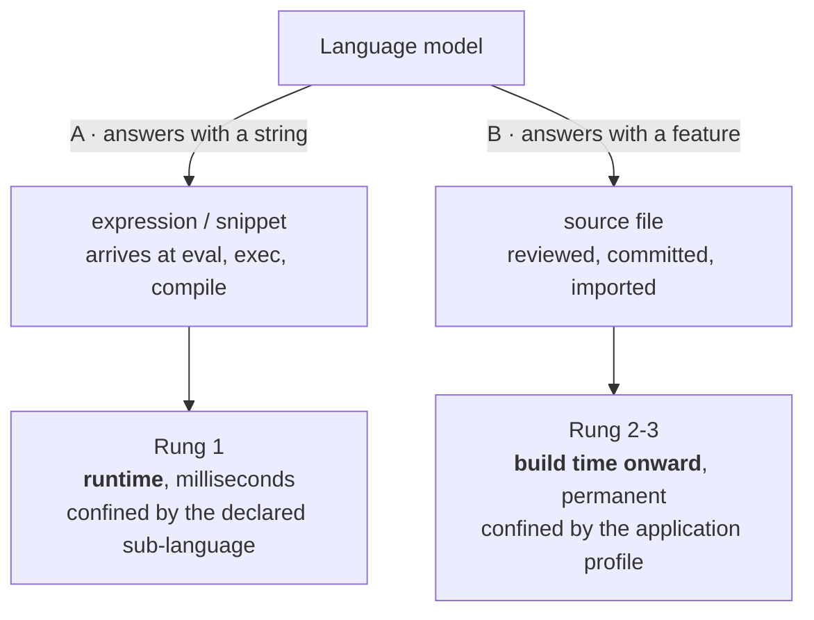
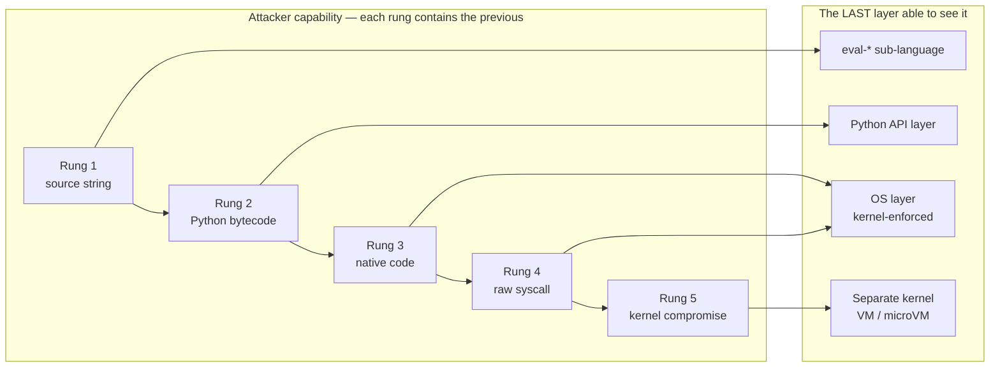
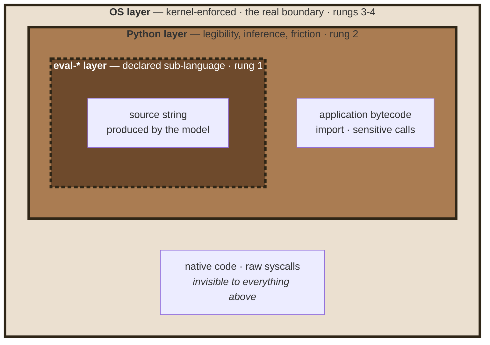
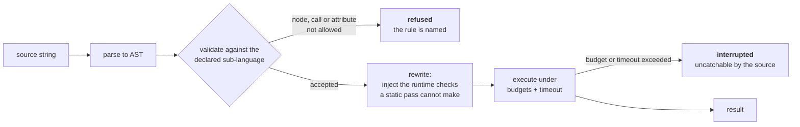
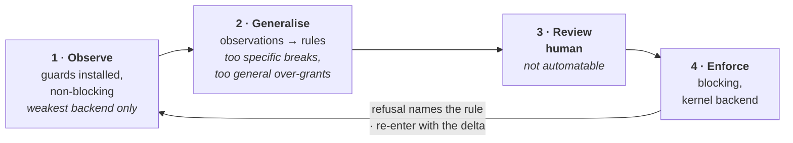
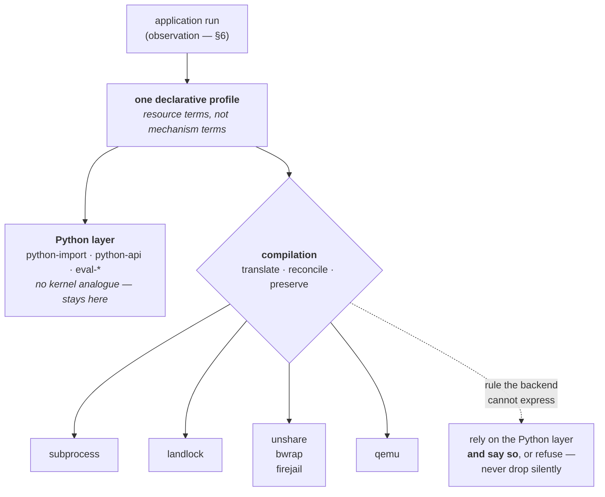
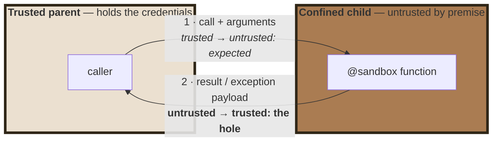

# Confining Python by Observation

### Inferred Least-Privilege Profiles Compiled to Heterogeneous Isolation Backends

**Philippe PRADOS** — [github@prados.fr](mailto:github@prados.fr) · ORCID [0009-0007-0558-9634](https://orcid.org/0009-0007-0558-9634)

**Version 1.0** — September 2026

---

**Reference implementation.** The design described here is implemented and
released as `py-sandboxes` (Apache-2.0):

> **Repository** — <https://github.com/pprados/pysandboxes>

> **Package** — <https://pypi.org/project/pysandboxes/>

**Scope of this paper.** This is a *conceptual* paper. It states the threat
model, the layering argument, the policy model and the compilation strategy at a
level that would let a second, independent implementation be built from it
without reading the reference code. Implementation specifics are deliberately
left to the repository's own documentation, and are cited rather than reproduced.

**Keywords** — sandboxing; least privilege; policy inference; dynamic analysis;
Python; LLM code execution; agent security; Landlock; namespaces; seccomp.

**License.** This paper is licensed under
[Creative Commons Attribution-NonCommercial-ShareAlike 4.0 International
(CC BY-NC-SA 4.0)](https://creativecommons.org/licenses/by-nc-sa/4.0/) —
see [`LICENSE`](https://github.com/pprados/pysandboxes/blob/master/research/LICENSE)
in this directory. The *software* it describes is separately licensed under
Apache-2.0.

---

## Table of contents

- [Abstract](#abstract)
- [1. Problem statement](#1-problem-statement)
  - [1.1 The threat that changed](#11-the-threat-that-changed)
  - [1.2 The threat model, stated precisely](#12-the-threat-model-stated-precisely)
  - [1.3 What is explicitly out of scope](#13-what-is-explicitly-out-of-scope)
  - [1.4 The two scenarios that motivate this work](#14-the-two-scenarios-that-motivate-this-work)
    - [Scenario A — the model's answer is executed directly](#scenario-a--the-models-answer-is-executed-directly)
    - [Scenario B — the augmented developer](#scenario-b--the-augmented-developer)
    - [What the two scenarios share, and where they differ](#what-the-two-scenarios-share-and-where-they-differ)
- [2. Prior art](#2-prior-art)
  - [What the prior art leaves open](#what-the-prior-art-leaves-open)
- [3. Contribution](#3-contribution)
- [4. The ladder of attacker capability](#4-the-ladder-of-attacker-capability)
  - [4.1 The five rungs](#41-the-five-rungs)
  - [4.2 Why the layers nest and do not substitute](#42-why-the-layers-nest-and-do-not-substitute)
  - [4.3 Rung 1 — the dynamic-code layer](#43-rung-1--the-dynamic-code-layer)
  - [4.4 Rung 2 — the interpreter layer](#44-rung-2--the-interpreter-layer)
  - [4.5 Rungs 3–5 — the kernel layer](#45-rungs-35--the-kernel-layer)
- [5. The profile: one declarative artefact](#5-the-profile-one-declarative-artefact)
  - [5.1 Design constraints on the language](#51-design-constraints-on-the-language)
  - [5.2 The rule families](#52-the-rule-families)
  - [5.3 Composition and resolution](#53-composition-and-resolution)
- [6. Policy inference](#6-policy-inference)
  - [6.1 Why inference rather than declaration](#61-why-inference-rather-than-declaration)
  - [6.2 The inference loop](#62-the-inference-loop)
  - [6.3 Generalisation is the hard part](#63-generalisation-is-the-hard-part)
  - [6.4 The soundness gap, stated](#64-the-soundness-gap-stated)
- [7. Compiling one profile to many backends](#7-compiling-one-profile-to-many-backends)
  - [7.1 The compilation problem](#71-the-compilation-problem)
  - [7.2 Impedance mismatches worth naming](#72-impedance-mismatches-worth-naming)
  - [7.3 The DNS/netfilter contradiction](#73-the-dnsnetfilter-contradiction)
  - [7.4 Provider selection: a decision procedure](#74-provider-selection-a-decision-procedure)
  - [7.5 Providers worth adding, and what each would buy](#75-providers-worth-adding-and-what-each-would-buy)
- [8. Process architecture](#8-process-architecture)
  - [8.1 Two granularities](#81-two-granularities)
  - [8.2 Why a process boundary at all](#82-why-a-process-boundary-at-all)
  - [8.3 The trust inversion at the IPC boundary](#83-the-trust-inversion-at-the-ipc-boundary)
- [9. Limits](#9-limits)
  - [9.1 Limits of the interpreter layer](#91-limits-of-the-interpreter-layer)
  - [9.2 Limits of the dynamic-code layer](#92-limits-of-the-dynamic-code-layer)
  - [9.3 Denial of service](#93-denial-of-service)
  - [9.4 Limits of inference](#94-limits-of-inference)
  - [9.5 Limits of the OS layer](#95-limits-of-the-os-layer)
- [10. Open design tensions](#10-open-design-tensions)
- [11. Implementation checklist](#11-implementation-checklist)
- [12. Validation, and what would falsify these claims](#12-validation-and-what-would-falsify-these-claims)
  - [12.1 What the implementation establishes](#121-what-the-implementation-establishes)
  - [12.2 What is not measured](#122-what-is-not-measured)
  - [12.3 Falsification conditions](#123-falsification-conditions)
- [Appendix A — Prior art in detail](#appendix-a--prior-art-in-detail)
  - [A.1 In-interpreter confinement, and its recorded failure](#a1-in-interpreter-confinement-and-its-recorded-failure)
  - [A.2 Observability without confinement](#a2-observability-without-confinement)
  - [A.3 Restricted evaluators for dynamic source](#a3-restricted-evaluators-for-dynamic-source)
  - [A.4 Kernel-enforced isolation](#a4-kernel-enforced-isolation)
  - [A.5 Policy synthesis by observation](#a5-policy-synthesis-by-observation)
  - [A.6 The LLM-era execution sandboxes](#a6-the-llm-era-execution-sandboxes)
- [References](#references)
- [Relationship to the implementation](#relationship-to-the-implementation)

---

## Abstract

Sandboxing Python has a thirty-year record of failure when attempted *inside*
the interpreter, and a thirty-year record of success when attempted *around the
process*. That conclusion was reached publicly and definitively in 2013, and
nothing since has overturned it. Yet the practical problem did not go away: it
got worse, because language models now write code that an application executes
immediately, and the operator must decide what that code may touch.

The obstacle to OS-level confinement is not the kernel. Every primitive needed —
namespaces, seccomp-bpf, Landlock, hardware virtualisation — has existed and
been production-hardened for years. The obstacle is **the policy**: writing a
least-privilege profile requires enumerating, up front and without error, every
directory, host, port and environment variable a real application legitimately
needs. Applications do not come with that list, developers do not have it, and
producing it by trial and error is the tedious, error-prone step that causes
teams either to skip confinement entirely or to grant far more than necessary.

This paper argues for an inversion. The interpreter-level layer's primary job is
**not enforcement** — that job is conceded to the kernel — but **policy
inference**. Because it sits at the Python API boundary, it observes every file,
socket, import and environment access an application makes, in terms the
operator already understands (a path, a hostname, a module name). It therefore
answers exactly the question that makes OS policy hard to write. The output is a
single declarative profile, which is then *compiled* to whichever of several
heterogeneous isolation backends the deployment allows.

Three consequences follow, and they are the paper's claims:

1. **A monotone ladder of attacker capability** — source string, interpreter
   bytecode, native code, raw syscall, kernel — determines which layers are
   needed and why each is the *last* one able to see its class of attacker. This
   converts "how paranoid are you" into a statement about the adversary.
2. **Policy inference by API observation** produces a profile that is *both* the
   interpreter-layer whitelist *and* the inventory used to configure the kernel
   layer — one artefact, learned once, reviewed once.
3. **Backend heterogeneity is a deployment constraint, not a security
   preference.** Whether one may use namespaces, or hardware virtualisation, or
   only in-process self-restriction, is decided by the environment (bare metal,
   container, managed Kubernetes, no privileges at all). A profile that outlives
   the choice of backend is therefore the useful unit.

The paper states what each layer does *not* claim, because a sandbox whose
limits are undocumented is worse than none.

---

## 1. Problem statement

### 1.1 The threat that changed

Executing untrusted code is an old problem. What changed between 2022 and 2025
is *who writes the code* and *how quickly it runs*.

An agentic application typically contains a loop of the shape:

```
model → produces a tool call, or a source string
application → executes it
result → returned to the model
```

The generated artefact is executed within milliseconds, without human review,
inside a process that also holds the application's API tokens, database
credentials and filesystem access. Two entries in the OWASP Top 10 for LLM
Applications name this directly: **LLM05 Improper Output Handling** and **LLM06
Excessive Agency** [[OWASP-LLM]]. The vulnerability record is not hypothetical —
the `python_repl` and related execution surfaces in mainstream agent frameworks
have produced a steady stream of CVEs [[CVE-LIST]].

Crucially, the executed artefact arrives in one of two very different shapes,
and confusing them is a common design error:

- a **source string** handed to `eval`, `exec` or `compile` — the shape of a
  model answering "compute this expression";
- an **already-running process** doing something it should not — the shape of a
  tool implementation, or of generated code that was written to a file and
  imported.

These require different mechanisms. Only a layer that sees the string can parse
it; only a layer at or below the process boundary can constrain what a running
process does.

### 1.2 The threat model, stated precisely

The design target is **code that is wayward, not adversarial**.

Concretely: code an LLM produced while solving the wrong problem, or a tool
argument crafted by an attacker via prompt injection and executed through a
narrow, well-defined entry point. Such code reaches for `open`, `requests.get`
or `subprocess` *in the open*. It does not first enumerate `object.__subclasses__()`
looking for a way to disable the guard, because it was never written to escape —
it was written to accomplish a task, and the task was wrong.

For that reader, three properties matter more than absolute containment:

- **The refusal happens**, and the operation does not.
- **The refusal names the rule** that caused it, so the operator can decide
  whether the rule is wrong or the code is.
- **The attempt is recorded**, so that a policy can be built from observed
  behaviour rather than imagined behaviour.

### 1.3 What is explicitly out of scope

Stating this is not modesty; an undocumented limit is a false guarantee.

- **Hostile bytecode running in the interpreter.** Once arbitrary Python
  executes, it can call native code. One `ctypes` call, or one compiled
  extension, steps around every interpreter-level guard, irreversibly. This is
  not a bug to be fixed; it is the property that makes the kernel layer
  mandatory rather than optional.
- **A malicious third-party dependency you installed yourself.** Confinement
  applies to what the process may *do*, not to whether its dependencies are
  trustworthy. That is a supply-chain problem, addressed by a different family
  of tools.
- **Denial of service at the interpreter layer.** Bounding CPU, memory and file
  descriptors requires a resource controller, not a function patch. See
  [§9.3](#93-denial-of-service).

---

### 1.4 The two scenarios that motivate this work

The threat of [§1.2](#12-the-threat-model-stated-precisely) reaches an
application through two quite different routes. They are worth separating,
because they differ in *what the generated artefact is*, *when it is confined*,
*who writes the profile*, and *which rung of
[§4.1](#41-the-five-rungs) they land on*. A design that serves only one of them
solves half the problem.



#### Scenario A — the model's answer is executed directly

A tool receives a question, asks a model for an expression or a short program,
and evaluates it:

```python
@tool
def evaluate_expression(expression: str) -> str:
    return str(eval(expression))          # the model wrote `expression`
```

This is the shape of a calculator tool, of an analytics agent that writes a
pandas one-liner, of an MCP server exposing symbolic mathematics, and of every
"code interpreter" feature. The application author writes the *tool*; the model
writes what the tool runs.

Four properties follow, and together they determine the answer:

- **The artefact is a string**, and it exists only at runtime. No review is
  possible, by anyone, because the artefact did not exist when the code was
  written and will not exist a second later.
- **It arrives at a known, narrow door** — `eval`, `exec`, `compile`. That is
  the one thing working in the defender's favour, and it is what makes a
  *sub-language* enforceable at all.
- **The needed capability is small and knowable in advance.** A calculator tool
  needs arithmetic and comparison; it does not need `import`, attribute access,
  or the filesystem. The author knows this when writing the tool, long before
  any model answers.
- **The prompt is attacker-controlled in practice.** Whatever reaches the model
  — a web page, a document, a ticket — reaches the expression.

So scenario A is answered at **rung 1**, by the dynamic-code layer of
[§4.3](#43-rung-1--the-dynamic-code-layer), and the profile is written **once,
by the tool author, before deployment**. It describes a *language*, not an
application. This is the only scenario where the confinement can be genuinely
tight, because the legitimate need is genuinely tiny — and it is also the only
one where nothing below the interpreter can help, since by the time a kernel
sees anything the string is already bytecode.

#### Scenario B — the augmented developer

A developer asks an assistant for a feature. The assistant writes a module, the
developer reads it with more or less attention, and it is committed. From then on
it is ordinary application code: imported, executed, shipped.

```python
# added by an assistant, in response to "add a retry with backoff"
import requests, os, subprocess          # two of these were not asked for
```

The properties are almost the inverse of scenario A:

- **The artefact is a module**, not a string. By the time it runs it is bytecode
  indistinguishable from hand-written code, so the dynamic-code layer never sees
  it. This is **rung 2**, and rung 3 as soon as a dependency is compiled.
- **Its lifetime is permanent.** A capability quietly acquired in one commit is
  still there a year later, and is never re-examined.
- **Review is possible but empirically partial.** The failure is not that
  developers do not read generated code; it is that a diff shows *what the code
  says* and not *what the process can now reach*. An added import three lines
  into a 200-line diff does not read as "this component may now execute
  processes".
- **The legitimate need is large and not knowable in advance** — the whole
  application's real surface, which is precisely what
  [§6.1](#61-why-inference-rather-than-declaration) argues nobody can write down.

So scenario B is answered at **rungs 2–3**, by the interpreter layer and the
kernel backends, and the profile is **inferred from the application's own
behaviour** ([§6](#6-policy-inference)) rather than authored.

**The consequence worth stating, because it is not obvious.** In scenario B the
profile stops being only a runtime control and becomes a **review artefact**: a
declarative, diffable statement of what the application may touch. When an
assistant adds a capability, the change surfaces as a line in a file whose entire
purpose is to list capabilities — not as an import buried in a diff. A reviewer
who would not notice `import subprocess` will notice
`python-api=ALLOW:process-exec` appearing in a file that previously did not
contain it, because that file has no other content competing for attention.

That is the sense in which the profile acts as a **regression test on
privilege**: the build fails, or the rule must be added deliberately, the first
time generated code reaches for something the application never needed before.
Nothing about this depends on the code having been written by a model; it is
simply that model-assisted development makes capability drift fast enough to
matter.

#### What the two scenarios share, and where they differ

| | **A — executed answer** | **B — augmented developer** |
|---|---|---|
| Artefact | a source string | a committed module |
| Exists at | runtime only | build time onward |
| Lifetime | milliseconds | permanent |
| Rung ([§4.1](#41-the-five-rungs)) | 1 | 2–3 |
| Enforcing layer | the declared sub-language | interpreter layer + kernel backend |
| Profile written by | the tool author, up front | inference from real behaviour |
| Profile describes | a language | an application |
| Legitimate need | tiny, knowable in advance | large, not knowable in advance |
| Review opportunity | none | the profile diff |

What they share is the reason this paper treats them together: in both, **the
capability granted has drifted away from the capability intended**, and in
neither does the code itself announce the drift. What differs is everything about
how the drift is caught — which is why the design needs both a sub-language for
strings and an inferred profile for processes, and why an implementation that
offers only one of them will leave its users exposed on the other.

A third, common configuration is simply both at once: an assistant writes the
tool (scenario B) and a model supplies the expressions that tool evaluates
(scenario A). The layers nest exactly as
[§4.2](#42-why-the-layers-nest-and-do-not-substitute) describes, with the
dynamic-code rules confining the string inside a process that the inferred
profile already confines.

---

## 2. Prior art

Everything cited here predates December 2025. Each item either establishes a
constraint the design must respect, or is a direct antecedent whose limits the
design tries to move past. This section states what the record shows and what it
leaves open; the evidence for each claim — projects, dates, CVEs, measurements —
is set out in [Appendix A](#appendix-a--prior-art-in-detail).

Six families, and what each one settles:

1. **In-interpreter confinement has a recorded failure**
   ([§A.1](#a1-in-interpreter-confinement-and-its-recorded-failure)). `rexec`,
   `Bastion` and `pysandbox` were each abandoned by their own authors, the last
   with the verdict *broken by design*; the recurring escape is an object-graph
   path from a permitted object back to an unrestricted one. This paper accepts
   that verdict as a premise rather than contesting it.
2. **The interpreter can observe without confining**
   ([§A.2](#a2-observability-without-confinement)). PEP 578 audit hooks state
   plainly that they are *not* sandboxing. They are a complementary observation
   substrate, with a vocabulary chosen by the runtime rather than by the
   operator, and no integrity without a native pre-init hook.
3. **Restricted evaluators show which constructs are capabilities**
   ([§A.3](#a3-restricted-evaluators-for-dynamic-source)). `simpleeval`,
   `asteval` and `RestrictedPython` establish that whitelisting by construction
   beats blacklisting by subtraction, that `str.format` traverses the object
   graph and is therefore a capability — rediscovered independently three times,
   most recently as CVE-2025-24359 — and that an exception instance is itself an
   object-graph reference.
4. **Kernel enforcement is mature, and blind to resource identity**
   ([§A.4](#a4-kernel-enforced-isolation)). seccomp-bpf cannot dereference
   pointer arguments by design, so it cannot tell `/etc/passwd` from a scratch
   file; Landlock, namespaces, gVisor and microVMs each trade expressiveness
   against the privilege they require and the deployment they permit.
5. **Learning a policy by observation is not new — at the syscall layer**
   ([§A.5](#a5-policy-synthesis-by-observation)). `aa-genprof`, `audit2allow`,
   *Mining Sandboxes* and *Confine* have mapped the ground thoroughly, including
   the dynamic/static dilemma: observation under-approximates, static analysis
   over-approximates. That work learns in a vocabulary an operator cannot review
   and emits an artefact bound to one enforcement mechanism.
6. **The LLM-era sandboxes isolate coarsely, over a network hop**
   ([§A.6](#a6-the-llm-era-execution-sandboxes)). E2B, Modal and the agent
   frameworks give a fresh machine with no per-application least-privilege
   profile, because nothing produced one. The agent-security literature — CaMeL,
   IsolateGPT, AgentDojo — governs *what the agent may decide*; this paper
   governs *what the resulting process may touch*, and assumes the decision has
   already gone wrong.

### What the prior art leaves open

Three gaps, and they are the paper's subject:

1. **The policy-authoring gap.** Kernel enforcement is solved; least-privilege
   *policy* for a specific application is not. Syscall-layer synthesis produces
   policies in a vocabulary operators cannot review, and tied to one enforcement
   mechanism.
2. **The vocabulary gap.** No layer below the interpreter can express "may
   import `json` but not `subprocess`", or "may call `eval` with arithmetic only".
   Those are language concepts, invisible to seccomp and Landlock alike.
3. **The portability gap.** Whether one may use namespaces, hardware
   virtualisation, or nothing but in-process self-restriction is a **deployment**
   fact — bare metal, unprivileged container, managed Kubernetes. A policy bound
   to one mechanism must be rewritten when the deployment changes, which in
   practice means it is not written at all.

---

## 3. Contribution

The design rests on one inversion and three claims.

**The inversion.** The interpreter-level layer is conventionally presented as a
weak sandbox. Treat it instead as a **policy-inference instrument that also
happens to enforce**. Its enforcement is real but bounded (it stops non-hostile
code and nothing more); its *inference* is the part that has no substitute,
because it is the only vantage point where an access is visible in the terms an
operator can review.

**Claim 1 — layer by attacker capability.** Layers are justified by the
*capability class* they are the last to see, not by a paranoia dial. Five rungs,
each strictly stronger than the last; each layer is necessary because no layer
below it can see the rung above ([§4](#4-the-ladder-of-attacker-capability)).

**Claim 2 — one inferred artefact, two consumers.** The profile learned by
observation is simultaneously the interpreter-layer whitelist *and* the resource
inventory from which the kernel-layer configuration is generated. One artefact,
learned once, reviewed once, enforced twice ([§6](#6-policy-inference)).

**Claim 3 — the profile outlives the backend.** Because the profile is expressed
in resource terms rather than mechanism terms, the same file compiles to
Landlock, to namespaces, to a VM, or to nothing — and the choice among them is
made by deployment constraints, not by rewriting the policy
([§7](#7-compiling-one-profile-to-many-backends)).

A corollary worth stating: this makes confinement **incrementally adoptable**.
An application can be run with observation only, then with the interpreter layer
enforcing, then with a kernel backend, without the policy changing at any step.
Adoption failure — not mechanism weakness — is what the prior art in
[§A.5](#a5-policy-synthesis-by-observation) most consistently ran into; whether
that generalises is an empirical question, and the adoption of sandboxing across
open-source ecosystems has been studied directly [[SANDBOX-ADOPTION]]. The
present paper does not measure it ([§12](#12-validation-and-what-would-falsify-these-claims)).

---

## 4. The ladder of attacker capability

### 4.1 The five rungs

Order the adversary by what they can *emit*, not by intent. Each rung strictly
contains the one before it.



| Rung | Attacker can emit | Example |
|---:|---|---|
| **1** | a **source string** evaluated at runtime | a model returns `"__import__('os').system('…')"` |
| **2** | arbitrary **Python bytecode** in the host interpreter | generated code written to a file and imported |
| **3** | **native code** via `ctypes`, `cffi`, or a C extension | `ctypes.CDLL("libc.so.6").system(…)` |
| **4** | **raw syscalls**, bypassing libc and the interpreter entirely | a statically linked payload |
| **5** | **kernel-level** compromise via a kernel vulnerability | a container escape through a kernel CVE |

Now observe **which layer is the last one able to see each rung**:

| Rung | Sees the string | Sees Python semantics | Sees syscalls | Sees a separate kernel |
|---:|:---:|:---:|:---:|:---:|
| 1 | ✅ **only here** | ✅ | ✅ | ✅ |
| 2 | ❌ | ✅ **only here** | ✅ | ✅ |
| 3 | ❌ | ❌ | ✅ **only here** | ✅ |
| 4 | ❌ | ❌ | ✅ | ✅ |
| 5 | ❌ | ❌ | ❌ | ✅ **only here** |

This table *is* the justification for layering. Read column-wise:

- A **source string** is visible only before it becomes a code object. Once
  compiled, no downstream layer can recover the distinction between "the
  application's own code" and "the string the model produced" — both are
  bytecode.
- **Python semantics** — `import`, module identity, which function is being
  called — exist only inside the interpreter. Below it there is no such thing as
  a module. A syscall trace cannot express "`json` yes, `subprocess` no".
- **Native code and raw syscalls** are invisible to the interpreter, by
  construction. This is not an implementation gap.
- A **kernel vulnerability** is invisible to anything sharing that kernel.

### 4.2 Why the layers nest and do not substitute

Two corollaries, both load-bearing.

**Upward blindness.** A layer cannot see rungs above its own. The interpreter
layer has no defence against rung 3 — not a weak one, *none*. Hardening it
against `ctypes` is wasted effort, because the same adversary reaches the same
place through a compiled extension, through `_ctypes`, or through a hundred other
routes. The honest response is to state the limit and place a kernel layer below.

**Downward silence.** A layer cannot see *concepts* below its own. Landlock has
no notion of a Python module; seccomp cannot read a path argument
([§A.4](#a4-kernel-enforced-isolation)). So the kernel layer cannot replace the
interpreter layer either — the substitution fails in both directions.



Hence: **nest, never substitute**. The practical reading of any per-backend
capability matrix follows from this. A ❌ against a kernel backend for "import"
does not mean imports are unprotected; it means *that technology has no notion of
imports*, and the interpreter layer above it does. Each backend column should be
read as what it **adds**, and the union as the actual posture.

### 4.3 Rung 1 — the dynamic-code layer

**Why it exists.** A tool that does

```python
result = eval(expression, {"__builtins__": {}}, {})
```

is *not* protected by the emptied builtins. The classical payload

```python
[c for c in ().__class__.__base__.__subclasses__() if c.__name__ == 'Popen'][0](['/bin/sh'])
```

reaches a subprocess without naming a single builtin, by walking the object graph
from a literal. Emptying `__builtins__` is a blacklist, and it fails the way
every blacklist in [§A.1](#a1-in-interpreter-confinement-and-its-recorded-failure)
failed.

**The principle: declare a sub-language, not a set of prohibitions.** The source
is parsed, validated against a declared subset of Python, rewritten so that
residual risks are checked *during* execution rather than only before it, and run
under explicit resource budgets and a wall-clock timeout the caller can recover
from.



**Deny-all with a non-negotiable minimal core.** The accepted language is a
whitelist, and the default is *nothing beyond a minimal core*: the parse root,
constants, name reads, container literals, and an expression used as a statement.
Nothing else. `1 + 1` is refused until arithmetic is explicitly opened. That
inversion is the design — and it is exactly the `simpleeval` argument from
[§A.3](#a3-restricted-evaluators-for-dynamic-source), generalised from
expressions to a configurable subset.

**Three states, not two.** The guard is usefully modelled as a three-valued
setting, because "off" and "unconfigured" must not be the same thing:

| Configuration | Behaviour |
|---|---|
| no dynamic-code rules, and dynamic code not explicitly allowed | **refused** — `eval` is itself a sensitive call |
| at least one dynamic-code rule | **guarded** — parsed, validated, rewritten, budgeted |
| dynamic code explicitly allowed as a sensitive-call category | **unguarded** — a deliberate, warned escape hatch |

Two properties matter here. *Unconfigured means refused*, not "allowed" — the
failure mode of a forgotten profile is a refusal, not a hole. And the explicit
escape hatch **wins** over the guarded state, because a profile asking for
pre-guard behaviour should get pre-guard behaviour rather than a third thing
nobody designed.

**The exemption that makes it usable.** Code generation performed by the runtime
itself — dataclasses, typing, named tuples, import machinery, installed
libraries — must be exempt, or no module can be imported at all. Only the
application's own call sites are guarded. This is a real trust decision, stated
rather than hidden: it assumes installed packages are not the adversary, which
[§1.3](#13-what-is-explicitly-out-of-scope) already conceded.

**The rule dimensions.** Seven independent axes proved necessary in practice. They may
be named differently, but must not be merged — each corresponds to a distinct
escape class:

| Dimension | Governs | Escape class it closes |
|---|---|---|
| **syntax** | which AST node kinds may appear | control flow, comprehensions, operators |
| **call** | which functions may be called by name | the capability builtins |
| **attribute** | which attribute names may be read | object-graph traversal — the `__subclasses__` walk |
| **import** | which modules the source may import | reaching a module the profile never granted |
| **magic** | which dunder attributes are reachable | the same walk, through its most direct door |
| **namespace** | what the evaluated code sees | ambient authority from the caller's scope |
| **budgets and timeout** | iterations, call depth, AST depth, node count, allocation, leaked threads, wall clock | resource exhaustion via *permitted* constructs |

Five observations, each otherwise rediscovered the hard way:

1. **The capability builtins are a master lever.** `getattr`, `setattr`, `open`,
   `eval`, `exec`, `compile`, `__import__`, `type`, `vars`, `globals`, `dir`,
   `breakpoint` — granting any one of these raw can be a complete escape,
   because it re-enables dynamic reach that the static AST check has no way to
   follow. They must be gated individually and, where granted, mediated rather
   than passed through.
2. **`str.format` is an attribute traversal.** It follows `{0.__class__}` without
   an `ast.Attribute` node ever appearing. A design that checks attribute access
   only in the AST has a blind spot here; the fix is to route formatting through
   the same attribute check at runtime, which is precisely why the "rewrite"
   step exists and static validation alone is insufficient. `asteval`'s 2024
   audit reached the same conclusion by a different route
   ([§A.3](#a3-restricted-evaluators-for-dynamic-source)).
3. **Namespace mode is a stated trade.** Letting the evaluated source see the
   caller's scope is convenient and is *ambient authority* — the hazard the layer
   exists to address. A closed namespace, where the caller passes exactly what the
   expression needs, is the correct default for anything handling model output.
   If a permissive mode is offered, it must be a *named* setting, because its
   price is that the profile no longer describes the whole reachable surface on
   its own: an audit must then also read the call sites.
4. **The timeout exception must not be catchable by the sandboxed code.** As soon
   as the syntax rules permit `try`/`except`, a bare `except Exception:` inside
   the evaluated source will swallow its own interruption. The interruption must
   therefore derive from a root that ordinary exception handling does not catch —
   with the documented consequence that the *caller's* generic sandbox-error
   handler will not catch a timeout either.
5. **Exceptions carry object references.** The same rule that opens `try`/`except`
   also lets the source *observe raised exception instances*, and an exception
   often holds a reference to the object that raised it. Attribute mediation must
   therefore cover objects reached through exception instances, not only those
   reached through expressions present in the parsed source — the escape behind
   CVE-2025-24359 ([§A.3](#a3-restricted-evaluators-for-dynamic-source)).

**What this layer is not.** It confines a *string* evaluated in a *bounded
namespace*. It is not a defence against rung 2: code that reaches `exec` through
a path the guard does not mediate is running as ordinary bytecode, and belongs
to the layer below.

### 4.4 Rung 2 — the interpreter layer

**Two distinct jobs, and the second is the important one.**

*Enforcement* — deny sensitive operations from non-hostile code, and name the
rule that denied them. Bounded by construction ([§9.1](#91-limits-of-the-interpreter-layer)).

*Inference* — observe every access in operator-legible terms and emit a profile
([§6](#6-policy-inference)). This has no substitute at any other layer.

**Interception strategy.** The design constraint is that one cannot import every
module up front merely to patch it — that would make startup cost proportional to
the standard library and would still miss lazily imported packages. The workable
approach is to install a **finder/loader pair in the import machinery** so that
modules are patched *as they are loaded*, on the fly. The same hook then serves
double duty as the import whitelist. Modules already imported before arming must
be reloaded or dropped, or the patches will not apply to them.

**A registry of sensitive calls, and the separation that motivates it.**

*Import rights and call rights are different rights.* A module may legitimately
need to be importable while some of its functions must stay out of reach — `os`
is the obvious case, and it is also the case where deriving call rights from
import rights silently grants `os.system`. So: a registry of sensitive functions,
**denied by default regardless of import permissions**, with permission granted
per function or per category. The durable part is the **category structure** —
in the reference implementation: `process-exec`, `process-control`, `privileges`,
`threads`, `native`, `introspection`, `dynamic-code`, `deserialization`. The
entry count is a moving target and should be read as a snapshot: 110 qualified
names across those 8 categories, counted from the source at the time of writing.
It will drift, by design, as the standard library moves ([§10](#10-open-design-tensions),
tension 6).

Five design properties of such a registry, each earned:

- **One registry as the single source of truth**, driving the patch table, the
  validation of profile targets, and the documentation. A target absent from the
  registry is a *configuration error raised at startup*, so a typo fails loudly
  instead of leaving a silent hole.
- **Low-level aliases must be registered alongside the names people write.**
  Because `os` does `from posix import *`, `os.system` *is* `posix.system`.
  Registering only the ergonomic spelling leaves the other as a bypass. The same
  applies to the `pickle` / `_pickle` pair, and generally to any stdlib module
  that re-exports from an accelerator. The same reasoning governs a second,
  distinct site: the transport's return channel, where the trusted parent
  deserializes what the untrusted child sent back. Reconstructing a returned
  object can run arbitrary code in the parent, outside the sandbox, so that
  channel is read through a restricted unpickler whose gadget denylist is keyed
  by every alias a stream can carry (`posix.system`, `_socket.socket`), not the
  ergonomic spelling. That guard is a denylist (fail-open) on the result path,
  because a return value may legitimately be any application or library type;
  the exception path, whose shape is known, is fail-closed.
- **Some functions belong to another guard instead.** `chroot` is better handled
  by the filesystem layer with a path check than by the registry with a binary
  allow/deny. Overlapping guards should be resolved by choosing the one that can
  express the finer decision.
- **Calls chain through the registry.** One high-level call may cross several
  guarded doors: a subprocess helper reaches a spawn primitive; a pty helper
  reaches `fork`; a thread start reaches a thread primitive. Granting the outer
  name alone is refused at the inner one. Each refusal must **name the door it
  stopped at**, or the operator cannot converge.
- **Interpreter versions move the primitives.** Thread-start internals changed
  name between 3.11/3.12 and 3.13. Register every applicable spelling and patch
  only those present, or profiles stop being portable across the versions a
  project supports.

**Arming, rather than exempting.** The framework's own startup necessarily makes
calls the user's profile does not grant — it reads configuration files, opens
sockets, imports modules. Three ways to handle that:

1. exempt by caller frame — forgeable from inside the sandbox;
2. keep an `original()` escape hatch — reachable by introspection;
3. **run disarmed, then arm immediately before user code takes over.**

The third is the only one that does not hand the sandboxed code a mechanism.
Wrappers pass everything through until `arm()` is called; no exemptions, no frame
inspection, no preserved originals to find. Its cost is honest and must be
documented: **the arming flag is a single point**, and resetting it disarms
everything ([§9.1](#91-limits-of-the-interpreter-layer)).

**Categories that are friction, not barriers.** The `native` and `introspection`
categories cannot contain a determined reader — that is rung 3, and rung 3 is
unreachable from here. They exist to make such calls *visible in learning mode*
and to cost a wayward program an explicit grant. Documenting them as friction is
part of the design, not an apology for it.

### 4.5 Rungs 3–5 — the kernel layer

This is where enforcement actually lives, and the choice among mechanisms is
covered in [§7.4](#74-provider-selection-a-decision-procedure). Conceptually:

- **Rungs 3–4** (native code, raw syscalls) are covered by anything the kernel
  enforces: Landlock, namespaces, seccomp. The interpreter is no longer in the
  loop, which is exactly the point.
- **Rung 5** (kernel compromise) requires a *different kernel* — a full VM, or a
  microVM where one is available. Nothing that shares the host kernel can address
  it, including gVisor, which reduces the exposed syscall surface without
  removing the shared-kernel assumption ([§A.4](#a4-kernel-enforced-isolation)).
  Both gVisor and the microVM runtimes are named here as *technology classes*;
  neither is an available backend
  ([§7.5](#75-providers-worth-adding-and-what-each-would-buy)).

One asymmetry deserves emphasis, because it drives
[§7.4](#74-provider-selection-a-decision-procedure): **the strength of a backend
and the privilege it demands are not correlated in the direction one expects.**
Landlock requires no capability at all — a process restricts *itself* — but
requires a sufficiently recent kernel *on the node*, which in a managed cluster
is not the operator's to choose. Namespace tooling requires elevated capabilities
that many container platforms refuse. A VM requires neither, but costs an order
of magnitude in startup latency. There is no single dominant choice, which is
why the profile must survive the choice.

---

## 5. The profile: one declarative artefact

### 5.1 Design constraints on the language

The profile is the interface between inference, human review, interpreter
enforcement, and backend compilation. Four constraints follow:

1. **Resource terms, not mechanism terms.** `expose-ro=/etc/app` names a
   resource; `--ro-bind /etc/app /etc/app` names a bubblewrap invocation. Only
   the first can compile to five backends, and only the first survives a change
   of deployment.
2. **Reviewable by the operator who will be blamed.** The output of inference is
   *a draft*. Red Hat's `audit2allow` caution ([§A.5](#a5-policy-synthesis-by-observation))
   applies with full force: the risk is accepting generated rules without
   understanding what is being granted. A format that is tedious to read
   guarantees it will not be read.
3. **Composable without ordering semantics.** Profiles are assembled from
   several sources — a package's own defaults, a project file, a developer's
   local overrides, a machine-wide policy. If resolution depends on textual
   order, an `include` can be defeated by where it is placed, and composition
   stops being predictable.
4. **Environment-parameterised.** The same logical policy must work across
   development, CI and production, where paths and hostnames differ. Variable
   substitution belongs in the format, not in a generation step around it.

### 5.2 The rule families

Seven families. The grouping, not the spelling, is what matters.

| Family | Governs | Rung | Compiles to a backend? |
|---|---|:---:|:---:|
| **Environment** | which variables are visible inside the sandbox; mapping and removal | 2 | ✅ — filtered at process launch |
| **Filesystem** | which paths are exposed, read-only or read-write; which are hidden | 2 | ✅ — mounts, Landlock rules |
| **Network** | direction, host, address, port, protocol | 2 | ✅ — netfilter, Landlock ports |
| **Imports** | which modules may be imported | 2 | ❌ — no kernel analogue |
| **Sensitive calls** | which registry functions may be called, per function or category | 2 | partially — the kernel blocks the *effect*, not the call |
| **Dynamic code** | the sub-language for `eval`/`exec`/`compile` and its budgets | 1 | ❌ — no kernel analogue |
| **Backend selection and passthrough** | which backend; backend-specific options | 3–5 | — |

Three structural points to preserve:

- **Filesystem rules need three verbs, not two.** *Expose read-only*, *expose
  read-write*, and *hide* are distinct. Hiding is not a weaker form of denial: a
  hidden path should ideally be **absent**, because code that discovers a file
  exists but cannot be read behaves differently — and leaks differently — from
  code that concludes the file does not exist. This is also the rule family where
  backends diverge most ([§7.2](#72-impedance-mismatches-worth-naming)).
- **Path *renaming* is an interpreter-layer capability with no kernel analogue.**
  Mapping `/real/secrets` to appear as `/app/config` is expressible when paths
  pass through an API that can rewrite them; a bind mount can relocate but the
  policy vocabulary of most backends assumes identity mapping. Where the two
  layers disagree, the interpreter layer must be the one that performs the
  rename, and the backend configuration must be generated from the *post-rename*
  view.
- **Network rules need deny-priority.** The useful policy shape is "everything
  except this range" — allow the internet, deny link-local and the cloud
  metadata endpoint. That requires broad allows with narrow denies overriding
  them, which is a different resolution rule from the allow-list families.

### 5.3 Composition and resolution

Composition is by inclusion, with missing files ignored so that a profile
referencing an optional local override still works when the override is absent.
A conventional chain is: package defaults → project profile → developer-local
overrides (git-ignored) → user profile → machine profile.

**Resolution** is where a genuine unresolved tension sits, and it is recorded
here rather than smoothed over, because the choice must be made deliberately.
The reference implementation uses **two different algebras**:

| | Sensitive-call rules | Dynamic-code rules |
|---|---|---|
| Resolution | by **specificity** — a rule on a function beats a rule on its category, wherever it appears | **unordered sets**, no specificity |
| Conflict at equal precedence | `DENY` wins | `DENY` **always** wins, everywhere |
| Consequence | a category-wide allow can be narrowed *and widened* per function | a deny can never be overridden |

Both satisfy constraint 3 in [§5.1](#51-design-constraints-on-the-language) —
neither depends on textual order. They differ in expressiveness: specificity
permits "allow the whole category **except** these two, and additionally allow
this one", which is genuinely useful for a large registry; the set model permits
only monotone narrowing, which is simpler to reason about and strictly safer.

The divergence is defensible — the registry is large and hierarchical, the
dynamic-code vocabulary is small and flat — but it is *two mental models for one
problem*, and users must hold both. The two must either unify on specificity
(accepting that a deny becomes overridable by a more specific allow, which needs
care) or unify on deny-wins sets (accepting the loss of category-with-exceptions,
which then needs an explicit "all except" form). What must not happen is adopting
both without noticing.

Two further properties worth carrying over:

- **Unknown targets are startup errors.** A rule naming a function or category
  that does not exist must fail loudly. Silent acceptance turns a typo into a
  hole that no review will catch.
- **Over-broad patterns should warn with their expansion.** A glob whose fixed
  part is very short matches far more than the author intended. The useful
  diagnostic is not "this pattern is broad" but "this pattern expands to *N*
  names on this interpreter, including *X*" — naming a dangerous member of the
  expansion is what makes the warning actionable.

---

## 6. Policy inference

### 6.1 Why inference rather than declaration

The empirical claim, and the one most worth testing: **nobody can write a
least-privilege profile for a real application by inspection.** Not the author,
because dependencies read files the author never considered; not an auditor,
because the accesses are distributed across a dependency tree; not a static
analyser, because the paths are computed at runtime from configuration.

This is why `aa-genprof` and `audit2allow` exist
([§A.5](#a5-policy-synthesis-by-observation)), and why the container-debloating
literature argues for dynamic over static analysis: static analysis
over-approximates, dynamic analysis observes actual executions and sets a lower
bound [[MINING-SANDBOXES]]. The same argument applies one layer up, with a
better vocabulary.

### 6.2 The inference loop

Four phases, and the third is the one that is usually skipped and should not be:

1. **Observe.** Run with guards installed but non-blocking. Each access that
   *would* have been refused is recorded, with enough context to name a rule.
   Accesses already permitted by an existing profile are *not* recorded, so that
   re-learning adds only what is missing and does not churn the file.
2. **Generalise.** Convert observations into rules
   ([§6.3](#63-generalisation-is-the-hard-part)).
3. **Review.** Present the draft to a human before it is enforced. This phase is
   not optional and not automatable; it is the phase where "the application read
   `~/.aws/credentials`" gets caught.
4. **Enforce.** Later runs use the reviewed profile, now blocking.



Three operational properties:

- **Learning must run with the *weakest* backend.** A kernel backend would block
  the very accesses the loop is trying to observe — one cannot learn through a
  wall. Observation therefore runs in a plain subprocess, and the kernel policy
  is generated afterwards from what was learned.
- **The loop must be re-enterable.** Coverage is never complete on the first
  pass. Re-running in learning mode against an existing profile should append
  only the delta.
- **Refusals must name the rule.** Convergence depends on it. When one call
  crosses several guarded doors
  ([§4.4](#44-rung-2--the-interpreter-layer)), a refusal that does not say
  *which* door stopped it makes the operator guess, and guessing produces
  over-broad grants.

### 6.3 Generalisation is the hard part

Recording observations is mechanical. Turning them into a *good* profile is a
design problem with a standing tension: **too specific and the profile breaks on
the next run; too general and it grants what was never observed.**

Some heuristics that proved sound:

- **Prefer directories to files** for exposures, but never widen past a boundary
  the operator would consider meaningful — the home directory, the filesystem
  root. A single observed read under `/etc/app/` justifies `/etc/app/`; it does
  not justify `/etc`.
- **Collapse to a category only when the category is covered.** If the functions
  already permitted plus those just observed cover a whole registry category,
  emit the single category rule; otherwise emit one rule per function. The two
  forms must be *exclusive*, so that least privilege is the default outcome of
  the algorithm rather than a convention the operator is asked to follow.
- **Emit hostnames, not resolved addresses**, wherever the observation carries a
  name. Addresses change; a profile of IP literals is stale the day it is
  written. This has a consequence at compile time — see
  [§7.3](#73-the-dnsnetfilter-contradiction).
- **Flag the suspicious rather than silently including it.** An observed read of
  a credentials file, or an exposure of the current working directory triggered
  by a stray `.env`, should be marked for the human, because these are exactly
  the observations that indicate the *application* is doing something the
  operator did not intend. The inference step is also a *finding* step.

### 6.4 The soundness gap, stated

Inference by observation is **unsound by construction**, in both directions.
This must be written down, because the whole design rests on how the gap is
closed.

**Under-approximation.** A path not exercised is a rule not learned. The first
production run hits an untested branch and is refused. This is the cost that
makes review and re-entry mandatory, and it is inherent to dynamic analysis —
"testing cannot guarantee the absence of malicious behaviour"
[[MINING-SANDBOXES]].

**Blindness to native code.** An access made by a compiled extension — a database
driver opening a socket, a C library reading a file — never crosses the Python
API and is therefore never observed. The profile is silent about it, and the
kernel backend generated from that profile will block it, producing a failure at
enforcement time that learning mode did not predict. The practical mitigation is
to treat such gaps as expected: the operator adds the missing rule manually, once,
and it persists.

**Poisoning.** If learning mode runs while hostile code is executing, the hostile
accesses are learned as legitimate rules. Learning is therefore a
**development-time activity performed on trusted input**, never a production mode
and never a fallback when enforcement fails.

**How the gap is closed — the structural move.** Note that none of the above is
fixed by making observation better. It is closed by *where enforcement sits*:

> Observation happens at the Python API layer. Enforcement happens **below** it,
> at the kernel. The kernel layer denies by default everything the profile does
> not grant — including everything observation failed to see.

An access missed by inference is therefore **denied**, not permitted. Unsound
inference yields a profile that is too *narrow*, never too *wide*, and a
too-narrow profile fails visibly and is fixed by adding a rule. This is the
correct failure direction, and it is the reason the architecture can tolerate an
observation layer that is admittedly incomplete. Inverting this — enforcing only
at the layer that observes — loses the property entirely.

---

## 7. Compiling one profile to many backends

### 7.1 The compilation problem

The profile is mechanism-independent. The backends are not. Compilation must:

- **translate** each rule family into the target's vocabulary;
- **reconcile** what the target cannot express — either by leaving that rule to
  the interpreter layer, or by refusing the combination outright;
- **preserve** the operator's intent when the two layers disagree about the same
  resource.



Two general principles:

1. **Never silently downgrade.** If a backend cannot express a rule, the choice
   is to rely on the interpreter layer (and say so) or to refuse the
   configuration. Quietly dropping a rule produces a profile that reads stricter
   than it is — the worst possible outcome for a security artefact.
2. **Compile from the post-transformation view.** Where the interpreter layer
   renames or hides paths, the backend must be configured against the resulting
   view, not the source one, or the two layers will disagree about what a path
   means.

### 7.2 Impedance mismatches worth naming

These recur across every backend.

**Hiding has at least three inequivalent semantics.** Asked to make a path
disappear, backends variously: make it absent so access raises *not found*; deny
it so access raises *permission denied*; mask it so access succeeds and returns
nothing; or — for an access-control mechanism like Landlock, which can deny but
cannot conceal — have no equivalent at all. These are observably different to
the running code. The profile should specify *intent* (this path is not part of
the application's world) and the documentation must state what each backend
actually does, because "hidden" is not a portable concept.

**Path renaming is usually not available.** Most backends bind or deny paths
under their real names. If renaming is offered, it is an interpreter-layer
feature ([§5.2](#52-the-rule-families)), and applying a mapping twice — once in
each layer — is a bug, not a defence.

**Protocol granularity varies.** A backend may filter TCP ports and know nothing
of UDP, or of hostnames. Where the backend covers less than the profile, the
interpreter layer retains responsibility for the difference, for rung 2 only —
and the gap against rung 3 must be stated rather than papered over.

**Passthrough is necessary and should be narrow.** Every backend has options
with no portable equivalent. A namespaced passthrough (`<backend>.<option>=`) is
the pragmatic answer. Two cautions: passthrough can only forward what the tool
already understands textually — a backend whose seccomp interface expects a file
descriptor carrying compiled BPF cannot be driven from a configuration line at
all — and whether unknown keys are forwarded or rejected should be a documented,
consistent decision per backend, not an accident.

**Resource limits are a backend property, not a profile property.** Only some
backends can bound memory, CPU or process count. Since [§9.3](#93-denial-of-service)
concedes DoS to the kernel layer, an operator who needs those bounds must choose
a backend that has them — which makes resource control a *selection criterion*
in [§7.4](#74-provider-selection-a-decision-procedure), not a rule family.

### 7.3 The DNS/netfilter contradiction

A specific, instructive case, because it is not obvious and it bites every
implementation that filters by hostname.

The profile names hosts (`api.example.com`), per
[§6.3](#63-generalisation-is-the-hard-part). Packet filters match addresses.
Compilation must therefore resolve names to addresses — *on the host, before the
sandbox starts*. But the sandboxed process will resolve the same name itself,
and for any load-balanced service it will very plausibly get a **different**
address set. The filter, built from the host's answer, then blocks a legitimate
connection to an address the sandbox believes is correct. Netfilter and DNS are
not compatible, and no amount of care with the rules fixes it.

The resolution is to make the two resolutions agree by construction: resolve once
at compile time, install the filter from that answer, and **pin the same
name→address mapping inside the sandbox** so that the process resolves to exactly
the addresses the filter permits.

The general lesson, worth extracting: **when a rule is expressed at one level of
abstraction and enforced at another, the translation must be pinned, not
repeated.** Any independently repeated translation is a divergence waiting to
happen.

### 7.4 Provider selection: a decision procedure

Not a ranking. Five axes, and the choice is usually forced by the first two.

| Axis | Question |
|---|---|
| **A. Privilege available** | What can the deployment grant? Elevated capabilities? A VM? Nothing at all? |
| **B. Nestability** | Must this run inside a container, or inside Kubernetes, and under what security context? |
| **C. Threat rung** | Highest rung to be covered ([§4.1](#41-the-five-rungs))? Stop at 3–4, or must 5 be addressed? |
| **D. Expressiveness** | Does the policy need hostname filtering, UDP, path hiding, resource limits? |
| **E. Cost** | Startup latency and memory per instance. |

**The decision procedure:**

1. **Is any isolation privilege available at all?**
   *No, and the workload runs in a locked-down container* → **in-process
   self-restriction** (Landlock-class). Requires no capability; the process
   restricts itself and its descendants. Its constraint is elsewhere: the
   *node's* kernel must expose the required ABI version, and inside a container
   the ABI seen is the node's, not the image's. On a managed cluster this is not
   the operator's to choose and **must be verified, not assumed**.
   *Yes* → continue.

2. **Must rung 5 (kernel compromise) be covered?**
   *Yes* → a **separate guest kernel**. This is the only class that answers it
   ([§4.5](#45-rungs-35--the-kernel-layer)). Budget for an order-of-magnitude
   worse startup and per-instance memory. Accept it when the workload is genuinely
   adversarial or multi-tenant. The implemented form of this is a **full VM**;
   the microVM runtimes that would make it cheaper are candidates only, not
   available ([§7.5](#75-providers-worth-adding-and-what-each-would-buy)).
   *No* → continue.

3. **Does the policy need filesystem *views* — masking, bind-mounting, a
   different root?**
   *Yes* → **namespace tooling** (bubblewrap-, firejail-, unshare-class). Richest
   expressiveness for filesystem and network shape; requires elevated
   capabilities, which is exactly what step 1 may have ruled out.
   *No, denial suffices* → self-restriction is simpler and cheaper.

4. **Are resource limits or syscall filtering required?**
   Narrow the choice within the class to backends that expose them — this varies
   sharply *within* a class and is the most common reason to prefer one namespace
   tool over another.

5. **Development or CI?**
   A **plain subprocess** with the interpreter layer only is a legitimate
   configuration: it keeps the two-process architecture and the profile honest
   while removing the kernel layer's environmental requirements. It covers rungs
   1–2 and nothing more, and the documentation must say so.

**The counter-intuitive result**, worth stating explicitly because it inverts the
usual assumption: *more isolation does not mean more privilege required*.
Self-restriction needs no capability but a modern kernel; namespace tooling needs
capabilities but runs on old kernels; a VM needs neither but costs latency. There
is no dominant option, and the deployment usually decides — which is precisely
the argument for a profile that outlives the decision.

### 7.5 Providers worth adding, and what each would buy

> **Nothing in this section is implemented, and nothing in it was evaluated.**
> These are *candidates under consideration*. Every property below is inferred
> from the vendors' and the literature's published characteristics — no
> measurement, benchmark or integration of gVisor, Firecracker, Kata,
> WebAssembly, sub-interpreters, an egress proxy or a platform sandbox was
> carried out for this paper. The table states what each *would* be expected to
> buy and cost, so that the decision procedure in
> [§7.4](#74-provider-selection-a-decision-procedure) can be extended; it is a
> design argument, not a result.
>
> The backends that *are* implemented and exercised are the ones named in
> [§7.4](#74-provider-selection-a-decision-procedure): a plain subprocess,
> in-process self-restriction, namespace tooling, and a VM.

Read each row as a hypothesis, in the conditional:

| Candidate (none implemented) | Axis it would improve | What it would be expected to buy | Cost / open question |
|---|---|---|---|
| **gVisor** | C (partial) | Syscall-surface reduction via a user-space kernel, without hardware virtualisation; ~50–100 ms class startup [[ISOLATION-CMP]] | Shared-kernel assumption remains, so **not** rung 5; syscall-compatibility gaps with native extensions |
| **Firecracker / Kata** | C (full) | A dedicated guest kernel with KVM-enforced boundaries; the honest answer to rung 5 [[ISOLATION-CMP]] | Requires nested virtualisation to run inside a cloud VM; tens of MB per instance; needs orchestration Kata already provides and raw Firecracker does not |
| **WebAssembly** (Pyodide, wasmtime) | A, B | Isolation with *no* ambient authority and no OS privilege at all; runs where every other option is refused | Native extension modules are largely unavailable — which excludes most real Python workloads |
| **Sub-interpreters** | E | Near-zero isolation cost within one process | Shares the address space entirely: covers *nothing* above rung 2, and arguably not even that. Useful for resource scoping, not confinement |
| **A brokered proxy for egress** | D | Hostname-level network policy with no packet filter, dissolving the DNS problem in [§7.3](#73-the-dnsnetfilter-contradiction) | Only covers what respects the proxy; direct socket use bypasses it unless the backend also blocks raw egress |
| **Platform sandboxes** (macOS, Windows) | A, B | The only route to non-Linux support, which is currently absent | Vocabularies differ enough that the compilation target is a genuine redesign, not a port |

The methodological point: each row is an entry in a *decision table*, not a
wishlist. A candidate earns inclusion by improving a named axis for a deployment
that the current set serves badly.

---

## 8. Process architecture

### 8.1 Two granularities

Confinement is applied at one of two scopes, and both are needed.

**Whole-process.** The entire application runs confined. Integration cost is a
changed launch command and no source modification at all. Correct when everything
the application does should be constrained — a tool server, a batch job, an
analysis script.

**Partial.** Only designated functions run confined; the rest of the application
keeps its privileges. Correct when the application legitimately holds credentials
that the confined part must not see — an agent that calls a model API with a
secret token, and separately executes model-produced code.

The distinction is not convenience. In whole-process mode, any secret the
application needs must be granted to the confined region, because there is only
one region. Partial mode is what makes it possible to hold a token *and* execute
untrusted code without the second reaching the first. The 2025 agent frameworks
reached the same two-way split independently — "run the snippet remotely" versus
"run the whole agent in the sandbox" [[SMOLAGENTS-SEC]].

### 8.2 Why a process boundary at all

Partial mode could in principle be implemented in-process. It should not be, for
three reasons:

1. **Kernel backends confine processes.** There is no way to apply a namespace or
   a Landlock ruleset to *part of* a process's execution. Without a separate
   process there is no kernel layer, and per [§4](#4-the-ladder-of-attacker-capability)
   that means no enforcement above rung 2.
2. **The environment is filtered at launch.** The cleanest way to deny an
   environment variable is for the process never to receive it. That decision is
   made by the parent, at `exec` time, and is not undoable from inside. An
   in-process approach can only hide the variable from an API, which introspection
   walks around.
3. **Failure is containable.** A confined child that dies can be restarted and
   re-initialised; in-flight calls can be retried against the new instance. An
   in-process failure takes the application with it.

The parent-child link then needs: an initialisation channel carrying
configuration and a shared secret; a request/response channel; and output
forwarding, so that what the confined code writes to standard streams surfaces in
the parent's streams, attributed correctly and without interleaving across
concurrent calls.

Two properties matter more than the choice of transport:

- **Exception fidelity.** An exception raised in the child must surface in the
  parent with the remote traceback attached, or debugging a confined application
  is intolerable and developers will disable the sandbox.
- **Lifecycle supervision.** Crash, restart, re-run of initialisation, retry of
  in-flight calls — and, for shutdown: stop accepting new requests, drain the
  in-flight ones, acknowledge, then exit.

If the channel is a local socket, it is reachable by anything on the host. A
random port plus a shared secret plus loopback-only binding is the minimum, and
should be stated as a known limitation rather than a guarantee.

### 8.3 The trust inversion at the IPC boundary

A subtle and important point, easily missed, and the sharpest single lesson in
this section.

The child is *untrusted* — that is the entire premise. The parent is trusted and
holds the credentials. The child sends the parent a **result payload** and
possibly an **exception payload**. If those are deserialised with a mechanism
that can instantiate arbitrary objects — Python's `pickle` being the obvious case
— then **a crafted payload from the confined child is arbitrary code execution in
the trusting parent**, entirely outside the sandbox.

This is not a hypothetical: it is the natural consequence of choosing a rich
serialiser for ergonomics (arbitrary argument and return types) and then pointing
it at data produced by the thing one is confining. The direction of trust across
the IPC boundary is *opposite* to the direction of data flow on the return path,
and a design that does not notice this has a hole precisely where it believes it
has a wall.



Arrow 2 is the one that matters. The data flows outward, but the *trust* flows
inward: a rich deserialiser applied to arrow 2 turns a crafted payload from the
confined child into code execution in the parent — outside the sandbox entirely.

Two observations:

- **Registry coverage does not help here.** If the framework's own transport binds
  its serialiser at import time — a reasonable choice, so that the framework's
  internal serialisation is not charged to the user's profile — then the
  sensitive-call registry does *not* cover that call site. The guard and the hole
  are in the same codebase and do not meet.
- **The fix is local, not global.** The expected payload shape at that call site
  is known. A restricted deserialiser *at the boundary* — one that accepts only
  the shapes the protocol defines — is the answer. A global deserialisation guard
  is both weaker (the confined side can reach the accelerator module directly) and
  misplaced.

The return path must be treated as **untrusted input crossing a trust boundary
inward**, and the protocol designed accordingly: prefer a schema-constrained
format, and where a rich serialiser is unavoidable, restrict it at the parsing
site.

---

## 9. Limits

A sandbox whose limits are undocumented is worse than no sandbox, because it
produces confidence without protection. This section is part of the design, not
an appendix to it.

### 9.1 Limits of the interpreter layer

Against rung 2 and above, the following are **open by construction** and are not
scheduled to be closed. The rung matters: each item is reachable only by code
*already running as bytecode in the interpreter*. The same manoeuvres written as
**dynamic source** — the `__subclasses__` walk, the introspection that recovers a
patched original, the `__globals__` write, the `ctypes` import — never get that
far when they arrive through a mediated entry point: they are refused one rung
lower by the `attribute`, `magic` and `import` dimensions of
[§4.3](#43-rung-1--the-dynamic-code-layer), whenever that layer is *guarded*
rather than opened by the explicit escape hatch. Unmediated routes are the
complement, and fall back to this section
([§9.2](#92-limits-of-the-dynamic-code-layer)). What follows is what remains
open once the attacker supplies Python directly, which is precisely why the two
layers do not substitute for one another
([§4.2](#42-why-the-layers-nest-and-do-not-substitute)):

- **Patched functions retain a reference to the original.** Introspection finds
  it. Any wrapper implementation has this property.
- **The object graph is fully reachable.** `object.__subclasses__()` reaches
  every loaded class and therefore every module, including the guards' own state.
  Rules and flags held in module globals can be found and rewritten.
- **A module global cannot be made unwritable.** This is worth stating as a
  *language* fact rather than an implementation gap: a guarded module wrapper
  does not help, because a module's functions keep `__globals__` bound to the
  original dictionary, and the bytecode that reads globals requires a real `dict`
  and ignores a subclass that guards assignment. Moving guard state out of module
  globals into an object with a guarded `__setattr__` raises the cost; it does
  not close the class.
- **The arming flag is a single point.** It is the price of the
  no-exemptions design in [§4.4](#44-rung-2--the-interpreter-layer), and the
  trade is worth making — but it should be recorded, and an accidental disarming
  ought to be *loud*.
- **Immutable C types cannot be patched.** Some sensitive entry points are
  attributes of C types that do not accept assignment, or are module-level
  instances constructed at import time so that no constructor runs to intercept.
  These remain reachable. Rebinding the module name to a wrapper is not a fix,
  because it breaks legitimate subclassing.
- **Native code is entirely outside the layer.** One `ctypes` call reaches
  everything.

The honest framing: this layer **raises the cost** of a sensitive call from
non-hostile code and **makes it visible** in learning mode. It does not contain
hostile bytecode. Hardening it further against a reader who can call native code
buys nothing, which is why effort belongs in the compilation to kernel backends
instead.

### 9.2 Limits of the dynamic-code layer

A different threat model, and therefore different limits. Here the attacker
controls a *source string* evaluated in a *bounded namespace*, and never holds an
object reference the guard did not hand out — so statements about what is
reachable can be much stronger than in [§9.1](#91-limits-of-the-interpreter-layer).

Standing limits:

- **Every granted capability is a hole in proportion to its power.** A profile
  that grants the capability builtins has disarmed the layer. Warn loudly.
- **A permissive namespace mode hands over ambient authority.** Stated in
  [§4.3](#43-rung-1--the-dynamic-code-layer); the layer cannot compensate for it.
- **Resource exhaustion is bounded, not eliminated.** Budgets make exhaustion
  *expensive*, not impossible ([§9.3](#93-denial-of-service)).
- **Only mediated entry points are guarded.** Code reaching a code object by a
  route the guard does not mediate is running as ordinary bytecode, and
  [§9.1](#91-limits-of-the-interpreter-layer) applies instead.

### 9.3 Denial of service

Exhausting CPU, memory, file descriptors or process slots is **out of scope for
every layer above the kernel**, and this follows from the ladder rather than from
a missing feature: a patch on a Python function cannot bound native resource use,
and a native allocation does not cross the API surface.

- The dynamic-code layer offers *budgets* — node count, iterations, call depth,
  allocation, wall-clock timeout — which bound a *string* but not a process.
- The interpreter layer offers nothing here.
- Real bounds come from the kernel: cgroups, rlimits, VM sizing. Which is to say,
  **from the backend**, which makes resource control a backend-selection criterion
  ([§7.4](#74-provider-selection-a-decision-procedure)).

A pathological regular expression, a deeply nested structure, or an unbounded
allocation in a compiled library will each defeat everything above the kernel.

### 9.4 Limits of inference

Covered in [§6.4](#64-the-soundness-gap-stated): under-approximation, blindness
to native code, and poisoning. The structural answer — enforcement below
observation, so a missed access is denied rather than permitted — is what makes
these tolerable, and it is the single most important property to preserve.

### 9.5 Limits of the OS layer

- **Shared-kernel backends do not address rung 5.** A kernel vulnerability
  reaches every workload on the host. Only a separate kernel answers it.
- **Kernel and platform version dependence.** Self-restriction mechanisms have
  ABI versions; capabilities differ across container runtimes and managed
  platforms. In a container, the kernel is the *node's*, not the image's, and on
  a managed cluster the node is not the operator's to choose.
- **Backends are software with their own vulnerability history.** Namespace
  tooling, container runtimes and VMMs have all had escapes. Layering is
  defence in depth, not a proof.
- **Correct configuration is a real risk.** A misgenerated policy can be too
  permissive without any visible symptom — nothing fails, so nothing is noticed.
  This is the failure mode that makes the *review* phase of
  [§6.2](#62-the-inference-loop) load-bearing, and it argues for compilation
  output that is inspectable rather than opaque.

---

## 10. Open design tensions

Recorded as open, because each is a genuine choice to be made deliberately
rather than inherited.

1. **Two resolution algebras** ([§5.3](#53-composition-and-resolution)).
   Specificity for the sensitive-call registry, deny-wins sets for dynamic code.
   Each is locally justified; together they are two mental models for one
   problem. Unify, or document the divergence prominently.

2. **Audit hooks as a second observation source**
   ([§A.2](#a2-observability-without-confinement)). They see C-level events that
   API interception misses, which directly attacks the native-code blindness in
   [§6.4](#64-the-soundness-gap-stated). Against: their vocabulary is the
   runtime's, not the operator's, and a Python-level hook confers no integrity.
   The unexplored middle is *observation only* — use audit hooks to widen what
   learning mode sees, while leaving enforcement where it is.

3. **Where guard state lives.** Module globals are reachable and rewritable
   ([§9.1](#91-limits-of-the-interpreter-layer)). Moving state into an object
   with a guarded `__setattr__` raises the cost without closing the class. Is
   partial mitigation worth the complexity, given that rung 3 is unaffected
   either way? The argument *for* is not containment but **loud failure**: an
   accidental disarming should be detectable.

4. **Hiding semantics are not portable** ([§7.2](#72-impedance-mismatches-worth-naming)).
   Absent, denied, masked, and unsupported are four observably different
   behaviours for one rule. Either narrow the profile to what all backends can
   express, or make the intended semantics explicit in the rule and refuse
   backends that cannot honour it.

5. **The IPC serialisation trade** ([§8.3](#83-the-trust-inversion-at-the-ipc-boundary)).
   A rich serialiser gives arbitrary argument and return types and creates a
   trust inversion. A schema-constrained protocol closes it and restricts what
   confined functions may accept and return. The second is more defensible; the
   first is what users expect.

6. **Sensitive-call registry maintenance.** A registry of ~110 entries is a
   living artefact: the standard library moves primitives between versions,
   re-exports from accelerators, and adds surfaces. Keeping it correct is
   ongoing work whose failure mode — a missed alias — is silent. Can any part be
   derived rather than curated?

7. **Whether the interpreter layer should enforce at all.** The sharpest form of
   the paper's own thesis. If enforcement is conceded to the kernel, is
   interpreter-level enforcement worth its cost? The argument to keep it:
   `import` and dynamic-code rules have no kernel analogue
   ([§2](#what-the-prior-art-leaves-open)), refusals in Python name the rule
   and the call site in a way a syscall denial never can, and the same
   interception serves inference. The argument to drop it: it may create
   confidence disproportionate to what it delivers. The position taken here is
   *keep it, and state its limits in the same breath* — which is what
   [§9.1](#91-limits-of-the-interpreter-layer) is for.

---

## 11. Implementation checklist

Ordered so that each step is useful on its own, and so that nothing later
invalidates anything earlier.

**Phase 1 — the profile format.** Design the rule families
([§5.2](#52-the-rule-families)) and *fix the resolution algebra first*
([§5.3](#53-composition-and-resolution)). Composition must not depend on textual
order. Unknown targets must be startup errors. Get this wrong and every later
phase inherits it.

**Phase 2 — observation.** Install interception at the API boundary and run it
*non-blocking*. Emit a profile. Do not implement enforcement yet: the loop of
[§6.2](#62-the-inference-loop) is independently valuable, and building it first
forces the vocabulary to be one an operator can read. Get generalisation
([§6.3](#63-generalisation-is-the-hard-part)) reviewed by someone who did not
write it.

**Phase 3 — the process boundary.** Parent and confined child, environment
filtered at launch, output forwarded, exceptions surfacing with remote
tracebacks. **Choose the serialisation with [§8.3](#83-the-trust-inversion-at-the-ipc-boundary)
in front of you**, because retrofitting that decision is painful.

**Phase 4 — one kernel backend.** Compile the profile to a single target.
Choose the one that fits the deployment via
[§7.4](#74-provider-selection-a-decision-procedure); self-restriction is the
usual best first choice because it needs no privilege. Refuse what cannot be
expressed rather than dropping it silently
([§7.1](#71-the-compilation-problem)). At the end of this phase the design is
already useful: rungs 3–4 are covered.

**Phase 5 — interpreter enforcement.** Add the arming model
([§4.4](#44-rung-2--the-interpreter-layer)) and the sensitive-call registry,
with aliases, with chained refusals naming the door, and with unknown targets
failing at startup. Write the limits down ([§9.1](#91-limits-of-the-interpreter-layer))
in the same commit as the feature.

**Phase 6 — the dynamic-code layer.** Only if the application evaluates source
strings. Deny-all with a minimal core; the seven dimensions of
[§4.3](#43-rung-1--the-dynamic-code-layer); an uncatchable timeout; and a test
corpus of escape payloads, each asserting *which layer* caught it. Treat
`str.format` as an attribute traversal from the start.

**Phase 7 — additional backends.** Each new target exercises
[§7.2](#72-impedance-mismatches-worth-naming) and will find an assumption the
first backend let pass.

**Throughout:**

- **Refusals name the rule.** Convergence of the learning loop depends on it.
- **Document each limit beside its feature**, not in a separate document that
  falls out of date.
- **Pin every claim to an executed test.** For escapes specifically: assert which
  layer catches each payload, and pin the *known-open* ones as expected failures
  so they are visible and cannot silently regress.
- **Never let a rule be silently dropped.** It is the only failure mode that
  makes the artefact actively misleading.

---

## 12. Validation, and what would falsify these claims

The design is not only described here: it is implemented, and the
implementation's test suite is the **proof-of-concept validation** of the
architecture. This section separates what that validation establishes
([§12.1](#121-what-the-implementation-establishes)) from what it does not
([§12.2](#122-what-is-not-measured)), and then states the conditions under which
each claim of [§3](#3-contribution) would be refuted
([§12.3](#123-falsification-conditions)).

### 12.1 What the implementation establishes

The reference implementation is exercised by a suite comprising, at the time of
writing, **748 unit tests across 60 files**, **52 integration tests across 18
files**, a container-level suite, and **14 self-contained sample applications**
each carrying its own tests and its own learned profiles. Four results follow
from it, and they are the sense in which the concept is validated.

**1. The architecture runs.** The layering of
[§4](#4-the-ladder-of-attacker-capability) is not a paper design. The
dynamic-code layer, the interpreter layer and the kernel layer compose in one
process tree, on real applications, at negligible latency for every backend but
the VM.

**2. One profile, many backends — the strongest single result.** This is the
direct test of *claim 3*. The integration suite parametrises its guard tests over
the full backend set — `subprocess`, `qemu`, `unshare`, `firejail`, `landlock`,
`bwrap` — and asserts the **same** expected behaviour for each. The container
suite then parametrises over Docker, Podman and Kubernetes, crossed with the
backend and with the privileged/unprivileged axis. A profile that produced
different enforcement per backend would fail these tests; it does not. The
claim that the profile outlives the choice of backend is therefore demonstrated
across six backends and three container contexts, not argued.

**3. The escape corpora are pinned, including the failures.** The
dynamic-code attack matrix carries 37 cases, split into **29 payloads that must
be refused** and **8 that must run** — because a sandbox that refuses legitimate
work is also broken. Separately, the interpreter-layer escape corpus pins the
*known-open* escapes of [§9.1](#91-limits-of-the-interpreter-layer) as expected
failures. This is the methodologically important part: the limits this paper
claims are not prose, they are **executed assertions**, and a limit that silently
closed or a guard that silently opened would change a test result. Each blocked
escape asserts *which layer* caught it, so the layering argument of
[§4.2](#42-why-the-layers-nest-and-do-not-substitute) is itself under test.

**4. Inference produces profiles that work.** Every sample's profile is *learned*
by the loop of [§6.2](#62-the-inference-loop), in both granularities of
[§8.1](#81-two-granularities), and the samples then run against those learned
profiles across agent frameworks nobody involved in the design wrote. That the
loop terminates on real third-party code — rather than on a benchmark chosen to
suit it — is the practical evidence for *claim 2*.

Taken together: the concept is validated in the engineering sense — it works, on
real applications, across backends, with its limits pinned. What follows is what
that does **not** establish.

**Reproducing it.** The four results above correspond to executable suites, run
from the repository root:

```bash
make unit-tests           # guards, registry, eval sub-language, escape corpora
make integration-tests    # cross-backend guard behaviour, arming, remote execution
make container-tests      # Docker / Podman / Kubernetes matrix (needs images + minikube)
make sample-tests         # each sample's own suite, against its learned profiles
make all-tests            # all four
```

The specific files behind each claim:

| Result | Where it is asserted |
|---|---|
| Cross-backend equivalence (claim 3) | [`tests/integration_tests/test_guards_with_providers.py`](https://github.com/pprados/pysandboxes/blob/master/tests/integration_tests/test_guards_with_providers.py) |
| Container / privilege matrix | [`tests/containers_tests/test_containers.py`](https://github.com/pprados/pysandboxes/blob/master/tests/containers_tests/test_containers.py) |
| Dynamic-code attack matrix (29 refused + 8 allowed) | [`tests/unit_tests/guard/test_eval_attack_matrix.py`](https://github.com/pprados/pysandboxes/blob/master/tests/unit_tests/guard/test_eval_attack_matrix.py) |
| Escape corpus, blocked and known-open | [`tests/unit_tests/test_escape_pysandbox.py`](https://github.com/pprados/pysandboxes/blob/master/tests/unit_tests/test_escape_pysandbox.py), [`tests/unit_tests/guard/test_guard_escape_fixes.py`](https://github.com/pprados/pysandboxes/blob/master/tests/unit_tests/guard/test_guard_escape_fixes.py) |
| Arming semantics ([§4.4](#44-rung-2--the-interpreter-layer)) | [`tests/integration_tests/test_guard_api_arming.py`](https://github.com/pprados/pysandboxes/blob/master/tests/integration_tests/test_guard_api_arming.py) |
| Learned profiles on third-party frameworks | [`samples/`](https://github.com/pprados/pysandboxes/tree/master/samples) |

### 12.2 What is not measured

No *quantitative* evaluation was performed. Specifically, this paper reports no
coverage study, no precision measurement, no comparative benchmark and no
human-subjects result. The tests demonstrate that the architecture behaves as
specified; they do not measure how *good* the inferred policies are, which is a
different question and the one a reviewer should press on.

Three quantities are missing, and each is a place the design could be weaker than
it looks:

- **Inference coverage.** For a corpus of real applications, what fraction of a
  hand-written correct profile does the loop recover from a representative run?
  The gap is the under-approximation of [§6.4](#64-the-soundness-gap-stated),
  and it is currently argued rather than measured.
- **Inference precision.** How much does a generated profile over-grant relative
  to a hand-written one? The generalisation heuristics of
  [§6.3](#63-generalisation-is-the-hard-part) are the variable, and an
  over-granting heuristic would undermine the least-privilege claim without
  failing a single test.
- **Reviewability.** Given a generated profile containing a deliberately planted
  over-grant — an exposed credentials directory, an unexpected host — do
  reviewers actually find it? This is the claim that distinguishes API-layer from
  syscall-layer synthesis ([§A.5](#a5-policy-synthesis-by-observation)), it is
  the one most load-bearing for the paper's contribution, and it is a
  human-subjects question that no test suite can answer.

**A shared benchmark would settle more than argument.** The container-debloating
literature converged on comparable metrics — syscalls eliminated, CVEs
neutralised, correctness preserved [[MINING-SANDBOXES]]. The equivalent here
would be *rules inferred vs. rules required*, *over-grant rate*, *escape-corpus
containment per layer*, and *startup cost per backend*. The third of those is
already partly instrumented by the escape corpora above; the first two are not.
This remains the paper's main limitation.

### 12.3 Falsification conditions

Stating these is what makes the claims of [§3](#3-contribution) more than
assertions.

**Claim 1 (layering by attacker capability)** is falsified if a single layer can
be shown to cover two non-adjacent rungs — for instance an interpreter-level
mechanism that genuinely contains native code. It is *supported* by the
recurring failure of exactly that attempt in
[§A.1](#a1-in-interpreter-confinement-and-its-recorded-failure).

**Claim 2 (inference produces reviewable, dual-use profiles)** is *partially
supported*: the samples of [§12.1](#121-what-the-implementation-establishes) show
the loop terminating on third-party code and producing profiles that then
enforce. It would be falsified by either of the two unmeasured quantities of
[§12.2](#122-what-is-not-measured) coming out badly — a coverage rate so low that
the loop never converges without manual authoring, or an over-grant rate high
enough that the inferred profile is not meaningfully least-privilege. The
reviewability sub-claim is untested in either direction.

**Claim 3 (profile portability)** is the best supported: the same profile is
asserted to produce the same enforcement across six backends and three container
contexts ([§12.1](#121-what-the-implementation-establishes)). It would be
falsified if, outside that suite, moving between backends routinely required
editing the profile rather than changing one selection line. The honest metric is
the count of rules that must change per backend switch, across a wider corpus —
with [§7.2](#72-impedance-mismatches-worth-naming) predicting that
filesystem-hiding rules would dominate the failures, since that is where the
backends genuinely disagree.

---

## Appendix A — Prior art in detail

The evidence behind [§2](#2-prior-art). Numbering follows that section's
six families.

### A.1 In-interpreter confinement, and its recorded failure

**`rexec` / `Bastion` (CPython, 1990s–2003).** CPython's own restricted-execution
framework. A supervisor created a "padded cell" with a substituted `__builtins__`;
restriction was keyed on the *identity* of that object, and enforced by denying
selected attributes. Both modules were **disabled in Python 2.3** because of
known and not readily fixable security holes, deprecated in 2.6, and removed in
3.0 [[REXEC]] [[BASTION]]. The failure mode is instructive and recurs
throughout this appendix: attackers repeatedly found object-graph paths from a
permitted object back to an unrestricted one.

**`pysandbox` (Victor Stinner, 2010–2013).** Three years of work on a
higher-quality version of the same idea, intended for eventual merge into
CPython. In November 2013 the author announced to python-dev that the project
was **broken by design**; a security challenge had found two escapes in under a
day, and the usability cost of the restrictions needed to close known holes had
become prohibitive [[STINNER-2013]] [[LWN-574215]]. The repository README still
carries the conclusion in capitals, with the recommended alternative stated as a
single sentence: *run Python in a sandbox, not the opposite* [[PYSANDBOX-REPO]].

This is the verdict the present paper takes as its starting premise
([§2](#2-prior-art)). The design proposed here does not contradict it; it asks
what an interpreter-level layer is still good for once enforcement has been
conceded to the kernel.

**PyPy's sandbox.** A structurally different and cleaner approach: a specially
built interpreter whose entire I/O is serialised over a pipe to a trusted parent,
which decides what to permit. Rather than restricting language features, it
replaces external library calls with stubs [[PYPY-SANDBOX]]. It is the strongest
in-interpreter design in the record. It is also, by PyPy's own documentation,
**unmaintained**, with a rewrite pending; lack of user interest and maintenance
cost were given as the reasons [[PYPY-2019]]. The lesson is about ecosystem
viability, not about correctness: a confinement mechanism that requires a custom
interpreter build inherits that build's adoption problem.

**edX CodeJail.** Raised in the same 2013 python-dev thread as the counterexample
that worked: rather than restricting Python, it runs untrusted Python as a
separate OS user under AppArmor confinement [[STINNER-2013]]. Structurally the
ancestor of the two-process architecture in [§8](#8-process-architecture).

### A.2 Observability without confinement

**PEP 578 — Runtime Audit Hooks** (Python 3.8, 2019), with **PEP 551** as the
deployment companion. CPython's own answer to "what is this process doing":
`sys.audit()` raises named events from the runtime and the standard library,
`sys.addaudithook()` observes them [[PEP-578]] [[PEP-551]].

The PEP is unambiguous about its scope: *"This is not sandboxing, as this
proposal does not attempt to prevent malicious behavior"*, and it points readers
at its own "Why Not A Sandbox" section, which notes that sandboxing CPython has
been attempted many times without success [[PEP-578]]. PEP 551 describes what it
takes to make auditing *trustworthy*: the hook must be written in native code and
installed before `Py_Initialize()`, which is the only point at which one can
guarantee no Python has run unaudited and that no Python can prevent
registration [[PEP-551]].

This matters to the design in [§6](#6-policy-inference) in a specific way. Audit
hooks are a legitimate *alternative substrate* for observation, with a real
advantage (they are in CPython, maintained, and fire from C code paths that
Python-level interception cannot see) and two real costs:

- *Granularity mismatch.* The event vocabulary is the runtime's, not the
  operator's. Events are emitted at points CPython chose to instrument; a
  profile expressed in those terms is not the profile an operator wants to read
  or edit.
- *Trust only under PEP 551 deployment.* A pure-Python hook installed after
  startup is removable by the code it audits — it buys no more integrity than a
  function patch. Getting real integrity requires a native pre-init hook, i.e. a
  compiled component, which changes the distribution model entirely.

Audit hooks belong in the design as a **complementary observation source** —
particularly for events raised by C code — rather than as a replacement for
API-level interception, and a Python-level audit hook must not be presented as an
integrity mechanism.

### A.3 Restricted evaluators for dynamic source

These are the direct antecedents of the dynamic-code layer in
[§4.3](#43-rung-1--the-dynamic-code-layer).

**`simpleeval`** inverts the model that killed `rexec`: instead of starting from
full `eval()` and subtracting dangerous constructs, it implements handlers only
for a small, explicit whitelist of AST node types. Anything not implemented is
unreachable *by construction* rather than by patching. It additionally caps
string length and exponent size to make trivial resource exhaustion impractical,
and denies attributes with leading underscores [[SIMPLEEVAL]].

**`asteval`** supports a materially larger subset — comprehensions, loops,
`try`/`except`, user-defined functions — which is more useful and correspondingly
harder to secure. Three findings from its history are worth carrying forward.

An independent 2024 audit by IBM X-Force Security Research led, in release 1.0.1,
to disallowing `string.format()`, hardening f-string evaluation, and removing
several numpy submodules exposed by default [[ASTEVAL-101]]. Its documentation
separately warns that exposing numpy ufuncs can segfault the interpreter from
user input [[ASTEVAL]] — a reminder that a *permitted* callable implemented in C
is a hole the AST layer cannot see.

Then, in January 2025, **CVE-2025-24359** showed the formatting problem was not
fully closed. The f-string handler evaluated `fmt.format(__fstring__=val)`; an
attacker could craft the format string to raise an `AttributeError` deliberately
and read the **exception's own `obj` attribute** to reach a protected object
[[ASTEVAL-CVE]].

That last one generalises beyond `asteval` and belongs in any design of this
kind: **an exception is an object graph reference.** Once the accepted
sub-language permits `try`/`except`, a raised exception can hand the source code
a reference to something the allow-list never granted. Attribute mediation must
therefore cover objects reached *through exception instances*, not only those
reached through expressions the parser saw.

**`RestrictedPython`** (long used by Zope and Plone) restricts via AST
transformation, blocking `import`, `exec` and dangerous builtins, and routing
attribute access through policy hooks. **CVE-2023-41039** illustrates the
residual risk precisely: information disclosure through Python's formatting
machinery — the `format` and `format_map` methods on `str`, and
`string.Formatter` [[RESTRICTEDPYTHON-CVE]]. The same family produced
**CVE-2021-32807** in the companion `AccessControl` layer, where the `string`
module was exempted as safe but `string.Formatter` could be subclassed inside a
restricted script to reach unsafe libraries [[ACCESSCONTROL-CVE]].

Both are the same escape, found twice: the restricted subset permitted a
construct whose *implementation* traverses the object graph.

Three transferable lessons:

1. **Whitelist by construction beats blacklist by subtraction** — the
   `simpleeval` argument, and the inverse of the `rexec` failure.
2. **`str.format` is a capability**, not a string operation: a format string
   traverses attributes, so it reaches the object graph without naming `getattr`.
   Any AST-level design must treat it as such. Three independent projects learned
   this the same way — RestrictedPython, `AccessControl` and `asteval` — which
   makes it the most reliably rediscovered mistake in this family.
3. **Resource bounds belong in the same layer as the syntax bounds**, because a
   permitted construct (`**`, a comprehension, a loop) is the exhaustion vector.

### A.4 Kernel-enforced isolation

The mechanisms are mature. What differs is *what they can express*, *what
privilege they require*, and *what they cost*.

**seccomp-bpf** (Linux 3.5, 2012) filters syscalls and their scalar arguments in
the kernel. Its decisive limitation is architectural: the filter **cannot
dereference pointer arguments** — deliberately, to avoid TOCTOU. A seccomp
filter therefore cannot tell whether an `open()` names `/etc/passwd` or a scratch
directory [[SECCOMP]]. It narrows the kernel's attack surface; it is not an
access-control system.

**Landlock** (proposed as an LSM in 2016–2017 [[LANDLOCK-LWN]]; filesystem rules
merged in 5.13, network rules in 6.7) is the complement: a real unprivileged
access-control system that associates rights with files and directories.
Restrictions are inherited across `clone(2)`, so a thread that sandboxes itself
binds all descendants [[LANDLOCK-DOC]] [[LANDLOCK-TALK]].
The Landlock project's own framing is that the two are complementary, not
competing, and the emerging practice is to install Landlock first and then a
seccomp filter covering syscalls Landlock has no notion of [[LANDLOCK-TALK]].

**Namespace-based tooling** — `unshare`, `bubblewrap`, `firejail`, `nsjail`,
`minijail` — composes mount, network, PID and user namespaces into a usable
confinement. These give filesystem *views* (bind mounts, masking) and network
isolation, at the cost of requiring privileges that many deployment targets
(unprivileged containers, managed Kubernetes) will not grant.

**Userspace kernels and microVMs.** **gVisor** interposes a user-space kernel
(the Sentry) between the workload and the host, shrinking syscall exposure
without hardware isolation. **Firecracker** and **Kata Containers** provide a
dedicated guest kernel with KVM-enforced memory boundaries. Reported cold-start
figures cluster around 50–100 ms for gVisor, 100–200 ms for Firecracker and
150–300 ms for Kata, though published numbers vary widely with what is measured
— benchmarks that time *full container* startup rather than VM boot put the
microVM runtimes an order of magnitude higher [[ISOLATION-CMP]]. The standing
motivation is blunt: the Linux kernel sees on the order of 300 CVEs a year, and
one kernel compromise reaches every container on the host [[ISOLATION-CMP]].

**WebAssembly** (Pyodide, wasmtime, `container2wasm`) is a different model
again: isolation by the absence of ambient authority rather than by kernel
mediation. Capabilities must be granted explicitly through the host, which is
architecturally close to the capability-passing style of `eval-namespace=closed`
in [§4.3](#43-rung-1--the-dynamic-code-layer). Its cost is ecosystem: native
extension modules are the reason most real Python workloads cannot move there.

### A.5 Policy synthesis by observation

This is the cluster the paper's central claim is positioned against
([§2](#2-prior-art)), because the idea of *learning* a policy is not new.

**AppArmor `aa-genprof` / `aa-logprof`.** A profile is put in *complain* mode,
where denials are logged rather than enforced; the operator exercises the
application; the tool parses the log and walks the operator through each
violation interactively, allow-or-deny; the profile is then switched to *enforce*
[[AA-GENPROF]]. The stated goal is to iterate until complain mode produces zero
entries.

**SELinux `audit2allow`.** The batch equivalent: read AVC denials from the audit
log, emit a Type Enforcement policy source, review it offline, compile and install
[[AUDIT2ALLOW]]. Red Hat's own guidance is notably cautious — analyse denials
first, and use `audit2allow` only as a last resort, because the risk is
*accepting whatever it generates without understanding what is being granted*
[[AUDIT2ALLOW]].

**"Mining Sandboxes for Linux Containers"** (Wan, Lo, Xia, Cai, Li; ICST 2017)
is the closest academic antecedent. It explores container behaviour by automatic
testing, extracts the set of syscalls observed, and emits that set as a Docker
seccomp profile. Its methodological argument is exactly the one made here:
static analysis over-approximates — it assumes more behaviours than actually
occur — whereas dynamic analysis observes real executions and establishes a
*lower bound* [[MINING-SANDBOXES]]. It also states the caveat honestly:
*sandboxing needs policy, dynamic analysis needs executions, and testing cannot
guarantee the absence of malicious behaviour.*

**Confine** (Ghavamnia, Palit, Benameur, Polychronakis; RAID 2020) answered the
same problem from the opposite direction: rather than observing executions, it
statically analyses the containerised application and its dependencies to derive
a *superset* of required syscalls, and emits the corresponding seccomp policy.
Its motivation is precisely the weakness of the dynamic approach — a training
workload does not exhaustively capture rare runtime conditions, so an
observation-derived policy is unsuitable as a generic solution. Evaluated over
150 public Docker images, it disabled 145 or more syscalls for over half of them
[[CONFINE]].

The two directions have since been combined. *Shrinking the Kernel Attack
Surface Through Static and Dynamic Syscall Limitation* (Zhan et al., 2025) states
the trade-off in one sentence — dynamic tracking cannot obtain the full syscall
list, while static analysis yields an over-approximated one — and builds a hybrid
[[SYSCALL-LIMIT]].

That sentence is the same dilemma this paper faces one layer up, and
[§6.4](#64-the-soundness-gap-stated) resolves it differently: not by making the
analysis complete, but by arranging that an access the analysis *missed* is
denied rather than allowed.

**Positioning.** Everything above learns at the **syscall** layer. That choice
determines both its strength and its ceiling:

| | Syscall-layer synthesis | API-layer synthesis (this paper) |
|---|---|---|
| **Completeness** | Sees *everything*, including native code and the dynamic linker | Sees only what crosses the language's own API surface |
| **Vocabulary** | `openat`, `connect`, `socket` — with, per [§A.4](#a4-kernel-enforced-isolation), no reachable path argument | `/etc/app/config.yaml`, `api.example.com:443`, `PGPASSWORD` |
| **Reviewability** | An operator cannot tell from `openat` *which file* was opened | The rule names the resource the operator recognises |
| **Portability of output** | Bound to one enforcement mechanism (a seccomp JSON profile) | Backend-independent; compiles to several ([§7](#7-compiling-one-profile-to-many-backends)) |
| **Language semantics** | None — a syscall trace cannot express "may import `json`" | Native — module, call and dynamic-source rules have no syscall analogue |

The trade is real in both directions, and must be made consciously. API-layer observation is **less complete** and **more
reviewable**. Since the profile is *meant to be read and edited by a human*
before it is enforced — the one step Red Hat's `audit2allow` guidance insists
upon — reviewability is the property being optimised for. The completeness gap
is then closed not by making observation perfect but by **placing enforcement
below the observation layer**, where it does not depend on having seen
everything. This is the key structural move and it is what
[§6.4](#64-the-soundness-gap-stated) is about.

### A.6 The LLM-era execution sandboxes

By 2025 the agent frameworks had converged on remote execution.
**smolagents** ships a `LocalPythonExecutor` its own documentation labels *not a
security boundary*, alongside E2B, Modal, Docker and WebAssembly backends;
**E2B** runs Firecracker microVMs with sub-150 ms boots [[SMOLAGENTS-SEC]].
The documented design choice is between *running the snippet remotely* and
*running the whole agent inside the sandbox* [[SMOLAGENTS-SEC]] — the same two
granularities as [§8.1](#81-two-granularities), reached independently.

Two properties of this generation are worth naming, because they define the gap
the present design aims at:

- **Isolation is coarse and uniform.** The sandbox is a fresh machine. What the
  code may reach inside it is largely "whatever is installed", constrained by
  network egress rules if any. There is no per-application least-privilege
  profile, because nothing produced one.
- **The boundary is a network hop.** That buys strong isolation and costs
  latency, a dependency on an external service, and a non-trivial story for
  getting credentials and application state across.

**The agent-security literature, and why it sits beside rather than above this
work.** A substantial 2024–2025 line of research attacks the same overall
problem from the *orchestration* side. It is worth reading alongside this paper,
because the two are complementary and neither subsumes the other.

- **CaMeL** (Debenedetti et al., 2025) builds a protective layer that extracts
  the control and data flows from the *trusted* query, so that untrusted data
  retrieved by the model can never influence program flow, and adds capabilities
  to prevent exfiltration over unauthorised channels [[CAMEL]].
- **Design Patterns for Securing LLM Agents against Prompt Injections**
  (Beurer-Kellner et al., 2025) proposes principled patterns with provable
  resistance to prompt injection, and analyses their trade-offs against agent
  utility [[AGENT-PATTERNS]].
- **IsolateGPT** (Wu, Roesner, Kohno, Zhang, Iqbal; 2024) observes that LLM app
  ecosystems resemble early computing platforms with insufficient isolation
  between apps and the system, and proposes an execution isolation architecture
  [[ISOLATEGPT]].
- **AgentDojo** (Debenedetti et al., 2024) and **ToolEmu** (Ruan et al., 2023)
  supply the evaluation side: an extensible environment for attacks and defences
  over untrusted tool output, and an LM-emulated sandbox for surfacing long-tail
  risks without implementing every tool [[AGENTDOJO]] [[TOOLEMU]].

The division of labour is clean, and stating it prevents a category error.
That literature governs **what the agent is allowed to decide** — which data may
influence control flow, which tool may be called, whether a plan is safe. This
paper governs **what the resulting process is allowed to touch**, and assumes the
decision has already gone wrong. An agent whose orchestration is perfectly
secured still runs its tool bodies as ordinary code with ambient authority; an
agent confined by a profile still benefits from not being hijacked in the first
place. Neither layer makes the other unnecessary, and the evaluation frameworks
above are the natural place to measure whether the combination holds.

---

## References

Every item below was verified against a primary or well-established secondary
source. All predate December 2025.

**In-interpreter confinement**

- [REXEC] `rexec` — Restricted execution framework, Python Standard Library.
  Disabled in Python 2.3; deprecated 2.6; removed 3.0.
  <https://tedboy.github.io/python_stdlib_doc/30_restricted_exec/rexec.html>
- [BASTION] `Bastion` — Restricting access to objects, Python 2.7 documentation.
  <https://documentation.help/Python-2.7/bastion.html>
- [STINNER-2013] Victor Stinner, *The pysandbox project is broken*, python-dev,
  November 2013.
  <https://mail.python.org/pipermail/python-dev/2013-November/130132.html>
- [LWN-574215] *The failure of pysandbox*, LWN.net, November 2013.
  <https://lwn.net/Articles/574215/>
- [PYSANDBOX-REPO] vstinner/pysandbox — *"BROKEN BY DESIGN … run python in a
  sandbox, not the opposite!"* <https://github.com/vstinner/pysandbox>
- [PYPY-SANDBOX] *PyPy's sandboxing features*, PyPy documentation (marked
  unmaintained). <https://doc.pypy.org/en/latest/sandbox.html>
- [PYPY-2019] *A second life for the Sandbox*, PyPy blog, August 2019.
  <https://pypy.org/posts/2019/08/a-second-life-for-sandbox-6848726729476245390.html>

**Observability**

- [PEP-578] PEP 578 — Python Runtime Audit Hooks (Python 3.8).
  <https://peps.python.org/pep-0578/>
- [PEP-551] PEP 551 — Security transparency in the Python runtime.
  <https://peps.python.org/pep-0551/>

**Restricted evaluators**

- [SIMPLEEVAL] danthedeckie/simpleeval — *Simple Safe Sandboxed Extensible
  Expression Evaluator for Python*. <https://github.com/danthedeckie/simpleeval>
- [ASTEVAL] *ASTEVAL: Minimal Python AST evaluator* — motivation and security
  notes, including the numpy-ufunc segfault warning.
  <https://lmfit.github.io/asteval/motivation.html>
- [ASTEVAL-101] asteval 1.0.1 release notes (2024) — security fixes from an audit
  by A. Effenhauser, A. Hammad and D. Crowley (IBM X-Force Security Research):
  `string.format()` disallowed, f-string evaluation hardened, numpy
  `polynomial`, `fft` and `linalg` removed by default.
  <https://github.com/lmfit/asteval/releases>
- [ASTEVAL-CVE] CVE-2025-24359 / GHSA-3wwr-3g9f-9gc7 (January 2025) — *ASTEVAL
  vulnerable to maliciously crafted format strings leading to sandbox escape*:
  `on_formattedvalue` used `str.format`, and a deliberately triggered
  `AttributeError` exposed the protected object via the exception's `obj`
  attribute. Fixed in 1.0.6.
  <https://osv.dev/vulnerability/CVE-2025-24359>
- [RESTRICTEDPYTHON-CVE] CVE-2023-41039 — RestrictedPython: information
  disclosure through Python's formatting functionality (`format` and
  `format_map` on `str`, and `string.Formatter`).
  <https://nvd.nist.gov/vuln/detail/CVE-2023-41039>
- [ACCESSCONTROL-CVE] CVE-2021-32807 — Zope `AccessControl`: the `string` module
  was exempted as safe, but `string.Formatter` could be subclassed within a
  restricted Script (Python) to reach unsafe libraries, yielding remote code
  execution. Fixed in AccessControl 4.3 and 5.2.
  <https://nvd.nist.gov/vuln/detail/CVE-2021-32807>

**Kernel isolation**

- [SECCOMP] `seccomp(2)` — Linux manual page. Filter mode
  (`SECCOMP_SET_MODE_FILTER`) added in Linux 3.5; the manual states that the
  filter cannot dereference pointer arguments, so syscalls can be matched on
  their scalar arguments only.
  <https://man7.org/linux/man-pages/man2/seccomp.2.html>
- [LANDLOCK-DOC] *Landlock: unprivileged access control*, Linux kernel
  documentation. Filesystem rules in 5.13, network rules in 6.7.
  <https://docs.kernel.org/userspace-api/landlock.html>
- [LANDLOCK-TALK] *Landlock: the Linux sandboxing mechanism*, 2024.
  <https://landlock.io/talks/2024-01-22_landlock-overview.pdf>
- [LANDLOCK-LWN] *Landlock LSM: Unprivileged sandboxing*, LWN.net, 2016.
  <https://lwn.net/Articles/698226/>
- [ISOLATION-CMP] Comparative analyses of Kata Containers, Firecracker and
  gVisor — architecture, attack surface and startup latency.
  <https://northflank.com/blog/kata-containers-vs-firecracker-vs-gvisor>
- [SANDBOX-ADOPTION] *Sandboxing Adoption in Open Source Ecosystems*,
  arXiv:2405.06447 (2024). <https://arxiv.org/abs/2405.06447>
  (Cited for its subject — the empirical adoption of sandboxing — not for a
  specific finding; its results were not consulted for this paper.)

**Policy synthesis by observation**

- [AA-GENPROF] `aa-genprof(8)` — profile generation utility for AppArmor;
  complain mode, log scanning, iterative refinement via `aa-logprof`.
  <https://apparmor.net/man/3.0/aa-genprof/>
- [AUDIT2ALLOW] `audit2allow(1)` — generate SELinux policy rules from logs of
  denied operations. <https://man7.org/linux/man-pages/man1/audit2allow.1.html>
  See also Red Hat's caution on accepting generated rules without analysis.
- [MINING-SANDBOXES] Z. Wan, D. Lo, X. Xia, L. Cai, S. Li, *Mining Sandboxes for
  Linux Containers*, ICST 2017, pp. 92–102. arXiv:1712.05493.
  <https://arxiv.org/abs/1712.05493>
- [CONFINE] S. Ghavamnia, T. Palit, A. Benameur, M. Polychronakis, *Confine:
  Automated System Call Policy Generation for Container Attack Surface
  Reduction*, RAID 2020, pp. 443–458.
  <https://www.usenix.org/conference/raid2020/presentation/ghavanmnia>
- [SYSCALL-LIMIT] D. Zhan, Z. Yu, X. Yu, H. Zhang, L. Ye, *Shrinking the Kernel
  Attack Surface Through Static and Dynamic Syscall Limitation*, arXiv:2510.03720
  (October 2025). <https://arxiv.org/abs/2510.03720>

**LLM-era execution**

- [OWASP-LLM] OWASP Top 10 for LLM Applications 2025 — LLM05 Improper Output
  Handling, LLM06 Excessive Agency.
  <https://genai.owasp.org/resource/owasp-top-10-for-llm-applications-2025/>
- [SMOLAGENTS-SEC] *Secure code execution*, smolagents documentation —
  `LocalPythonExecutor` is "not a security boundary"; E2B, Modal, Docker and
  WebAssembly backends.
  <https://huggingface.co/docs/smolagents/en/tutorials/secure_code_execution>
- [CAMEL] E. Debenedetti, I. Shumailov, T. Fan, J. Hayes, N. Carlini,
  D. Fabian, C. Kern, C. Shi, A. Terzis, F. Tramèr, *Defeating Prompt Injections
  by Design*, arXiv:2503.18813 (March 2025).
  <https://arxiv.org/abs/2503.18813>
- [AGENT-PATTERNS] L. Beurer-Kellner, B. Buesser, A.-M. Creţu, E. Debenedetti,
  et al., *Design Patterns for Securing LLM Agents against Prompt Injections*,
  arXiv:2506.08837 (June 2025). <https://arxiv.org/abs/2506.08837>
- [ISOLATEGPT] Y. Wu, F. Roesner, T. Kohno, N. Zhang, U. Iqbal, *IsolateGPT: An
  Execution Isolation Architecture for LLM-Based Agentic Systems*,
  arXiv:2403.04960 (March 2024; NDSS 2025).
  <https://arxiv.org/abs/2403.04960>
- [AGENTDOJO] E. Debenedetti, J. Zhang, M. Balunović, L. Beurer-Kellner,
  M. Fischer, F. Tramèr, *AgentDojo: A Dynamic Environment to Evaluate Prompt
  Injection Attacks and Defenses for LLM Agents*, arXiv:2406.13352 (June 2024;
  NeurIPS 2024 Datasets & Benchmarks). <https://arxiv.org/abs/2406.13352>
- [TOOLEMU] Y. Ruan, H. Dong, A. Wang, S. Pitis, et al., *Identifying the Risks
  of LM Agents with an LM-Emulated Sandbox*, arXiv:2309.15817 (September 2023;
  ICLR 2024). <https://arxiv.org/abs/2309.15817>
- [CVE-LIST] Execution-surface CVEs in agent frameworks, as catalogued in this
  project's README: CVE-2023-46229, CVE-2023-32786, CVE-2024-28088,
  CVE-2024-7774, CVE-2024-3571, CVE-2024-3095, CVE-2024-2057, CVE-2025-2828,
  CVE-2025-6985 (LangChain); CVE-2025-5120 (smolagents).

---

## Relationship to the implementation

This paper is the conceptual layer. The reference implementation,
`py-sandboxes`, lives at <https://github.com/pprados/pysandboxes> under
Apache-2.0. For a reader who wants the concrete form of any section, the
corresponding documentation in that repository is:

| Section | Implementation documentation |
|---|---|
| [§4.3](#43-rung-1--the-dynamic-code-layer) dynamic-code layer | [`eval.md`](https://github.com/pprados/pysandboxes/blob/master/wiki/eval.md) — every rule key with valid and invalid examples |
| [§9.2](#92-limits-of-the-dynamic-code-layer) its limits | [`audit-eval-security.md`](https://github.com/pprados/pysandboxes/blob/master/wiki/audit-eval-security.md) — attack matrix |
| [§4.4](#44-rung-2--the-interpreter-layer) interpreter layer | [`implementation.md`](https://github.com/pprados/pysandboxes/blob/master/wiki/implementation.md) |
| [§9.1](#91-limits-of-the-interpreter-layer) its limits | [`audit-python-security.md`](https://github.com/pprados/pysandboxes/blob/master/wiki/audit-python-security.md), [`weaknesses.md`](https://github.com/pprados/pysandboxes/blob/master/wiki/weaknesses.md) |
| [§7](#7-compiling-one-profile-to-many-backends) backends | [`landlock.md`](https://github.com/pprados/pysandboxes/blob/master/wiki/landlock.md), [`unshare.md`](https://github.com/pprados/pysandboxes/blob/master/wiki/unshare.md), [`bwrap.md`](https://github.com/pprados/pysandboxes/blob/master/wiki/bwrap.md), [`firejail.md`](https://github.com/pprados/pysandboxes/blob/master/wiki/firejail.md), [`qemu.md`](https://github.com/pprados/pysandboxes/blob/master/wiki/qemu.md) |
| [§7.3](#73-the-dnsnetfilter-contradiction) DNS pinning | [`dns.md`](https://github.com/pprados/pysandboxes/blob/master/wiki/dns.md) |
| [§7.5](#75-providers-worth-adding-and-what-each-would-buy) candidates | [`roadmap.md`](https://github.com/pprados/pysandboxes/blob/master/wiki/roadmap.md) |
| [§8.1](#81-two-granularities) granularities | [`../README.md`](https://github.com/pprados/pysandboxes/blob/master/README.md), [`samples.md`](https://github.com/pprados/pysandboxes/blob/master/wiki/samples.md) |

Where this paper and the implementation documentation disagree on a figure, the
implementation documentation may be stale: the registry described in
[§4.4](#44-rung-2--the-interpreter-layer) was counted from the source at the time
of writing (110 entries, 8 categories), while `implementation.md` still records
an earlier count.
