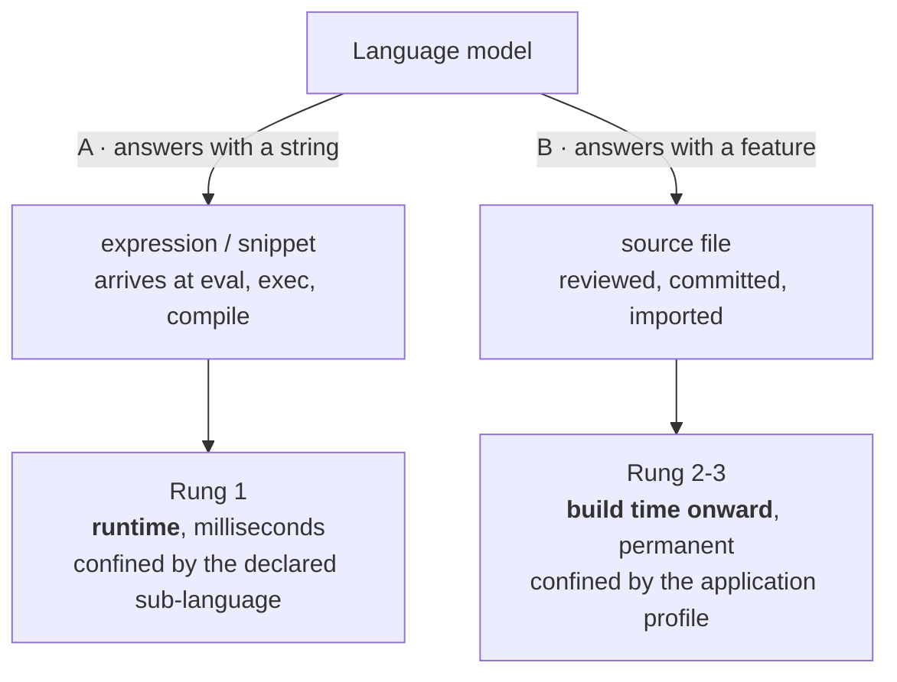
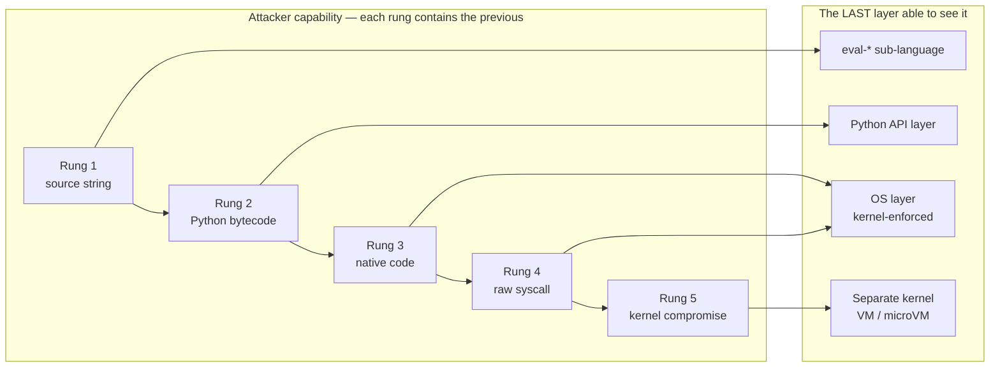
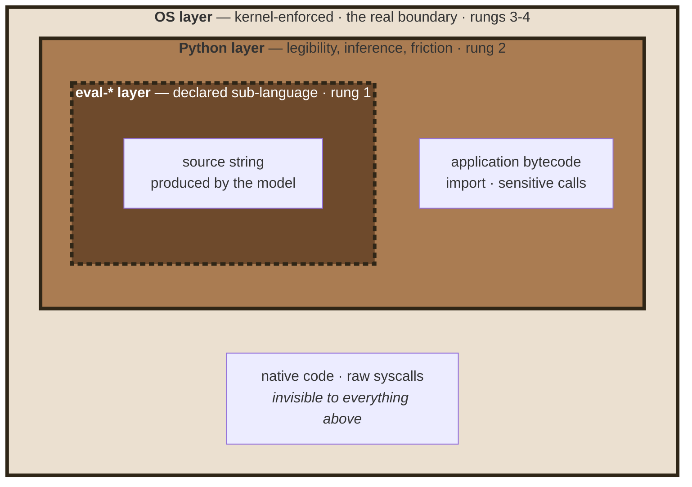
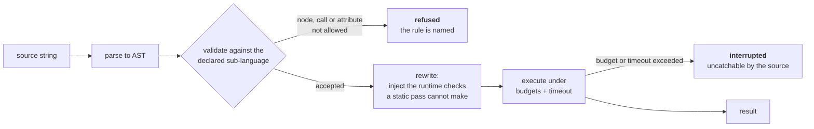
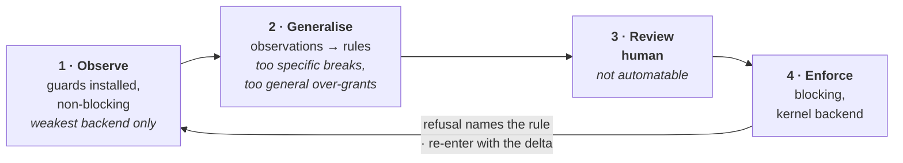
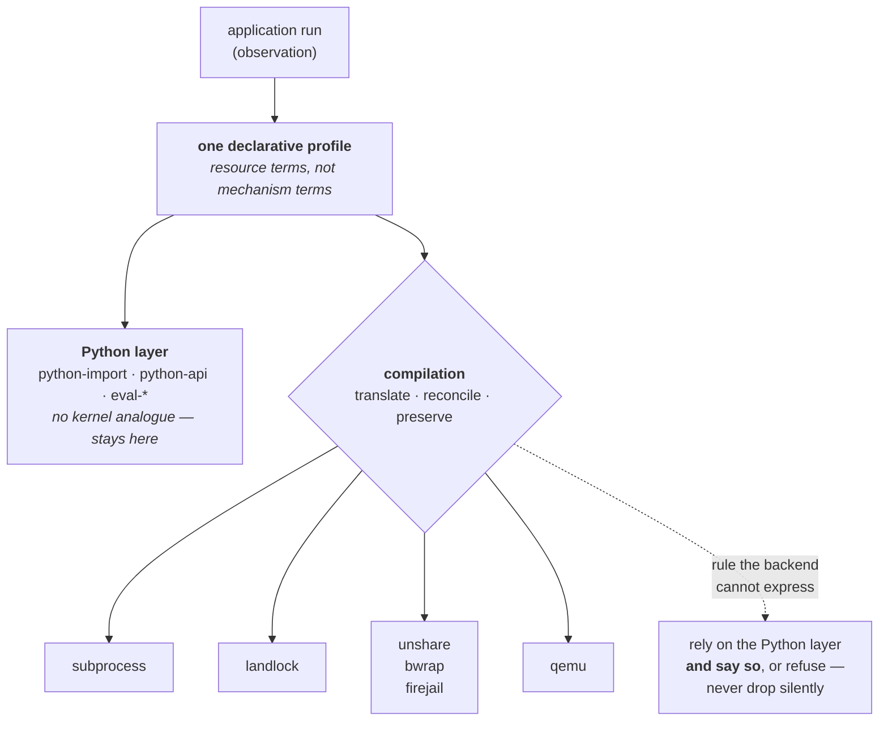
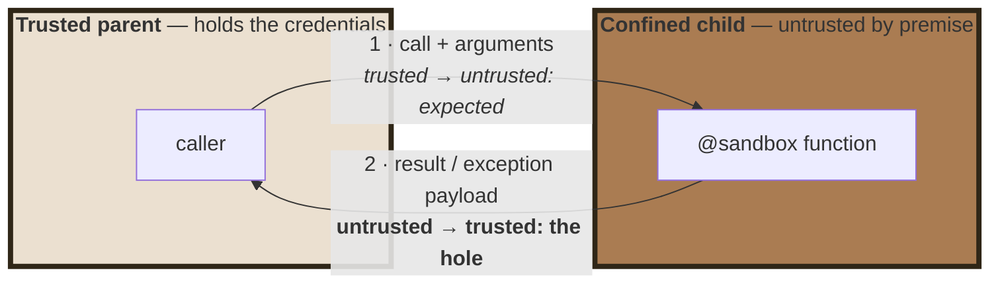

# Confining Python by Observation — short version

**Philippe PRADOS** — [github@prados.fr](mailto:github@prados.fr) · Sept. 2026

An abridgement of `research.md`, which holds the citations, the prior-art
evidence and the full argument. Reference implementation:
[`py-sandboxes`](https://github.com/pprados/pysandboxes) (Apache-2.0). Paper
licensed CC BY-NC-SA 4.0.

---

## Abstract

Sandboxing Python has a thirty-year record of failure when attempted *inside*
the interpreter, and of success when attempted *around the process*. The
practical problem only got worse, because language models now write code an
application executes immediately. The obstacle to OS-level confinement is not
the kernel — namespaces, seccomp-bpf, Landlock and virtualisation have been
production-hardened for years — it is **the policy**: a least-privilege profile
requires enumerating, up front and without error, every directory, host, port
and environment variable a real application needs. Nobody has that list.

Hence an inversion: the interpreter-level layer's primary job is **not
enforcement**, conceded to the kernel, but **policy inference**. At the Python
API boundary it observes every file, socket, import and environment access in
terms the operator already understands — a path, a hostname, a module name. The
output is one declarative profile, *compiled* to whichever backend the
deployment allows. Three claims follow: a monotone **ladder of attacker
capability** determines which layers are needed and why each is the *last* able
to see its class of attacker; **inference by API observation** produces an
artefact that is both the interpreter-layer whitelist and the inventory
configuring the kernel layer, learned once and reviewed once; and **backend
heterogeneity is a deployment constraint, not a security preference**, so a
profile that outlives the choice of backend is the useful unit.

## 1. Problem statement

An agentic application runs a loop: the model produces a tool call or a source
string, the application executes it, the result returns to the model. The
artefact runs within milliseconds, without review, inside a process holding API
tokens and credentials — OWASP's LLM05 and LLM06, with a steady CVE record on
`python_repl`-class surfaces.

**The threat model is code that is wayward, not adversarial**: code an LLM
produced while solving the wrong problem, or a tool argument crafted by prompt
injection. It reaches for `open`, `requests.get` or `subprocess` *in the open*;
it does not enumerate `object.__subclasses__()` looking for a way to disable the
guard, because it was never written to escape. Three properties then matter more
than absolute containment: the refusal happens, the refusal *names the rule*,
and the attempt is recorded so policy can be built from observed rather than
imagined behaviour. Out of scope: hostile bytecode (one `ctypes` call steps
around every interpreter-level guard — the property that makes the kernel layer
mandatory), a dependency installed deliberately, and denial of service above the
kernel.

| | **A — executed answer** | **B — augmented developer** |
|---|---|---|
| Artefact | a source string | a committed module |
| Exists at | runtime only | build time onward |
| Rung | 1 | 2–3 |
| Enforcing layer | the declared sub-language | interpreter layer + kernel backend |
| Profile written by | the tool author, up front | inference from real behaviour |
| Legitimate need | tiny, knowable in advance | large, not knowable in advance |
| Review opportunity | none | the profile diff |

In **scenario A** the artefact exists only at runtime, so no review is possible;
it arrives at a known narrow door, which is what makes a *sub-language*
enforceable. In **scenario B** an assistant writes a module that is committed
and thereafter ordinary code: review is empirically partial, because a diff
shows what the code *says*, not what the process can now *reach* — an added
import three lines into a 200-line diff does not read as "this component may now
execute processes". Hence the profile becomes a **review artefact**: a reviewer
who would miss `import subprocess` will notice `python-api=ALLOW:process-exec`
appearing in a file whose only content is capabilities. The profile is a
regression test on privilege.

## 2. Prior art, and what it leaves open

In-interpreter confinement has a recorded failure — `rexec`, `Bastion`,
`pysandbox`, the last abandoned as *broken by design*, the recurring escape an
object-graph path from a permitted object back to an unrestricted one; this
paper takes that verdict as a premise. The interpreter can nonetheless *observe*
without confining (PEP 578 says so in its own text). Restricted evaluators show
which constructs are capabilities: `str.format` traverses the object graph
(CVE-2025-24359). Kernel enforcement is mature and blind to resource identity.
Policy learning by observation exists at the syscall layer, in a vocabulary
operators cannot review and bound to one mechanism. And the LLM-era sandboxes
isolate coarsely over a network hop, with no per-application profile, because
nothing produced one.

Three gaps remain: the **policy-authoring gap** (enforcement is solved,
least-privilege policy is not); the **vocabulary gap** (no layer below the
interpreter can express "may import `json` but not `subprocess`"); and the
**portability gap** (whether one may use namespaces, virtualisation or nothing
is a deployment fact, and a policy bound to one mechanism is in practice not
written at all).

## 3. The ladder of attacker capability

Order the adversary by what they can *emit*: **1** a source string evaluated at
runtime, **2** arbitrary bytecode, **3** native code via `ctypes` or a C
extension, **4** raw syscalls, **5** kernel compromise. Each rung contains the
previous.

A source string is visible only before it becomes a code object. Python
semantics — `import`, module identity, which function is called — exist only
inside the interpreter; a syscall trace cannot express "`json` yes, `subprocess`
no". Native code is invisible to the interpreter by construction, and a kernel
vulnerability to anything sharing that kernel. Two corollaries are
load-bearing. **Upward blindness**: a layer cannot see rungs above its own, so
hardening the interpreter layer against `ctypes` is wasted effort. **Downward
silence**: a layer cannot see concepts below its own, so the kernel layer cannot
replace the interpreter layer either.

Hence **nest, never substitute**. A ❌ against a kernel backend for "import" does
not mean imports are unprotected; it means that technology has no notion of
imports, and the layer above does.

### Rung 1 — the dynamic-code layer

`eval(expression, {"__builtins__": {}}, {})` is not protected: the classical
`().__class__.__base__.__subclasses__()` walk reaches `Popen` without naming a
builtin. The principle is to **declare a sub-language**: parse, validate against
a declared subset, rewrite so residual risks are checked *during* execution, and
run under budgets and an uncatchable timeout.

The default is nothing beyond a minimal core — `1 + 1` is refused until
arithmetic is opened — and unconfigured means *refused*, not allowed. Seven
rule dimensions each close a distinct escape class: syntax, call, attribute,
import, magic, namespace, budgets. Three observations otherwise rediscovered the
hard way: the capability builtins (`getattr`, `open`, `eval`, `__import__`,
`globals`) are a master lever and must be gated individually; `str.format` is an
attribute traversal with no `ast.Attribute` node, which is why the rewrite step
exists; and exceptions carry object references, so attribute mediation must
cover objects reached through them.

### Rung 2 — the interpreter layer

Two jobs, the second being the important one: *enforcement*, bounded by
construction, and *inference*, which has no substitute anywhere else. Modules
are patched **as they are loaded**, by a finder/loader pair that doubles as the
import whitelist. Import rights and call rights are different rights — `os` may
need to be importable while `os.system` stays out of reach — so a registry of
sensitive calls is denied by default regardless of imports, with unknown targets
raising a startup error so a typo fails loudly, **low-level aliases registered
alongside ergonomic names** since `os.system` *is* `posix.system`, and chained
calls refused at the inner door, each refusal naming the door it stopped at.

**Arming, rather than exempting.** Exempting by caller frame is forgeable and an
`original()` hatch is reachable by introspection, so the layer runs disarmed and
arms immediately before user code takes over. Its honest cost: the arming flag
is a single point.

## 4. The profile, and inferring it

One declarative artefact in **resource terms rather than mechanism terms**
(`expose-ro=/etc/app`, not `--ro-bind …`), reviewable, composable without
ordering semantics, environment-parameterised. Seven rule families —
environment, filesystem, network, imports, sensitive calls, dynamic code,
backend selection — of which imports and dynamic code have no kernel analogue.
Filesystem needs three verbs (expose read-only, expose read-write, hide), since
code that finds an unreadable file behaves, and leaks, differently from code
that concludes the file is not there; network rules need deny-priority.

Nobody can write such a profile by inspection: not the author, whose
dependencies read files he never considered; not a static analyser, because
paths are computed at runtime.

Learning runs with the *weakest* backend — one cannot learn through a wall — and
the loop is re-enterable. Generalisation prefers directories to files but never
past a meaningful boundary, emits hostnames rather than addresses, and flags the
suspicious instead of including it silently.

**The soundness gap.** Inference is unsound by construction: unexercised paths
are unlearned rules; compiled extensions never cross the Python API; and
learning over hostile code learns hostile rules, so it is a development-time
activity on trusted input. None of this is fixed by observing better. It is
closed by *where enforcement sits*: observation at the Python API layer,
enforcement below it, and the kernel denies by default everything the profile
does not grant — including everything observation missed. Unsound inference
therefore yields a profile that is too narrow, never too wide, and too narrow
fails visibly.

## 5. Compiling one profile to many backends

Two principles: **never silently downgrade**, since a dropped rule reads
stricter than it is; and **compile from the post-transformation view**, or the
layers disagree about what a path means. Recurring mismatches: *hiding* has at
least three inequivalent semantics (absent, denied, masked, unsupported),
observably different to the running code; *path renaming* is an
interpreter-layer capability, and applying it twice is a bug, not a defence;
*protocol granularity* varies; *passthrough* should be narrow. Resource limits
are a backend property, hence a selection criterion.

**The DNS/netfilter contradiction.** The profile names hosts, filters match
addresses, and the sandboxed process resolves the name itself — getting, for a
load-balanced service, a different answer than the compiler did. Resolve once at
compile time and pin the mapping inside the sandbox. The lesson: when a rule is
expressed at one level and enforced at another, the translation must be pinned,
not repeated.

**Provider selection** is a decision procedure, not a ranking. No privilege
available: in-process self-restriction, whose constraint is the *node's* kernel
ABI, to be verified rather than assumed. Rung 5 to cover: a separate guest
kernel, at an order of magnitude in startup and memory. Filesystem views needed:
namespace tooling, which wants privileges many platforms refuse. Development or
CI: a plain subprocess with the interpreter layer only, covering rungs 1–2 and
saying so. The counter-intuitive result: **more isolation does not mean more
privilege required**, which is the argument for a profile that outlives the
decision.

## 6. Process architecture

Confinement applies whole-process — a changed launch command, no source
modification — or partially, to designated functions, which is what makes it
possible to hold an API token *and* execute untrusted code without the second
reaching the first. Partial mode could be implemented in-process and should not
be: kernel backends confine *processes*; the cleanest way to deny an environment
variable is for the process never to receive it, a decision the parent makes at
`exec` time; and a confined child that dies can be restarted. The link needs
exception fidelity — remote tracebacks surfacing in the parent, or developers
will disable the sandbox.

Arrow 2 is the one that matters. Deserialise the child's result with a mechanism
that instantiates arbitrary objects — `pickle` — and a crafted payload is
arbitrary code execution in the parent, outside the sandbox. The sensitive-call
registry does *not* cover the framework's own transport if it binds its
serialiser at import time, so guard and hole sit in the same codebase without
meeting. The fix is local: a restricted deserialiser at the boundary, accepting
only the shapes the protocol defines.

## 7. Limits, and open tensions

**The interpreter layer**, against rung 2 and above, is open by construction:
patched functions retain a reference to the original; the object graph reaches
every loaded class and the guards' own state; a module global cannot be made
unwritable, because a module's functions keep `__globals__` bound to the
original dict; the arming flag is a single point; some immutable C types cannot
be patched; native code is entirely outside. The honest framing: it *raises the
cost* of a sensitive call from non-hostile code and *makes it visible* in
learning mode. The same manoeuvres written as dynamic *source* are refused one
rung lower, which is exactly why the layers do not substitute.

**Denial of service** is out of scope above the kernel — real bounds come from
cgroups, rlimits and VM sizing. **The OS layer**: shared-kernel backends do not
address rung 5; kernel and platform versions are not always the operator's to
choose; backends have their own escape history; and a misgenerated policy can be
too permissive with no visible symptom, which is what makes the review phase
load-bearing.

Open tensions: two resolution algebras coexist (specificity for the registry,
deny-wins sets for dynamic code); audit hooks are an unexplored second
observation source that would attack native-code blindness at the price of the
runtime's vocabulary; hiding semantics are not portable; a registry of ~110
entries is a living artefact whose failure mode — a missed alias — is silent.
And the sharpest, the thesis turned on itself: **should the interpreter layer
enforce at all?** Keep it, because `import` and dynamic-code rules have no
kernel analogue and refusals in Python name the rule and the call site — but
state its limits in the same breath.

## 8. Validation, and what would falsify this

The implementation is exercised by 748 unit tests, 52 integration tests, a
container suite, and 14 sample applications with their own learned profiles.
**One profile, many backends** is the strongest single result and the direct
test of claim 3: the integration suite asserts the same expected behaviour over
`subprocess`, `qemu`, `unshare`, `firejail`, `landlock` and `bwrap`, and the
container suite crosses that with Docker, Podman and Kubernetes, privileged and
unprivileged. The escape corpora are pinned *including the failures*: 37
dynamic-code cases (29 refused, 8 that must run), plus the known-open
interpreter-layer escapes as expected failures, each blocked payload asserting
*which layer* caught it. And inference produces working profiles on agent
frameworks nobody involved in the design wrote.

Not measured: inference **coverage**, inference **precision**, and
**reviewability** — whether reviewers actually find a planted over-grant, the
claim most load-bearing for the contribution and the one no test suite can
answer. This is the paper's main limitation.

Falsification. Claim 1 falls if a single layer covers two non-adjacent rungs,
for instance an interpreter-level mechanism that genuinely contains native code.
Claim 2 falls if coverage is so low the loop never converges without manual
authoring, or the over-grant rate is high enough that the profile is not
meaningfully least-privilege. Claim 3, the best supported, falls if moving
between backends routinely requires editing the profile rather than changing one
selection line — with filesystem-hiding rules the predicted place to look.
