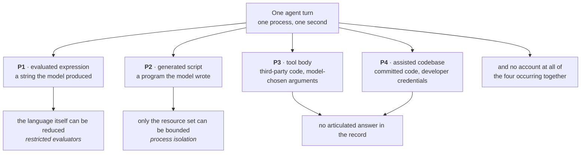
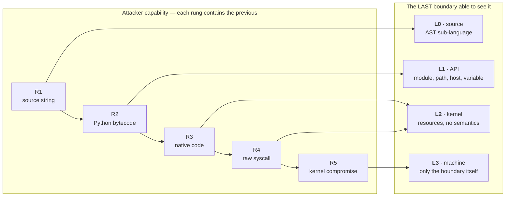
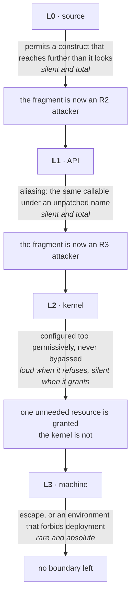
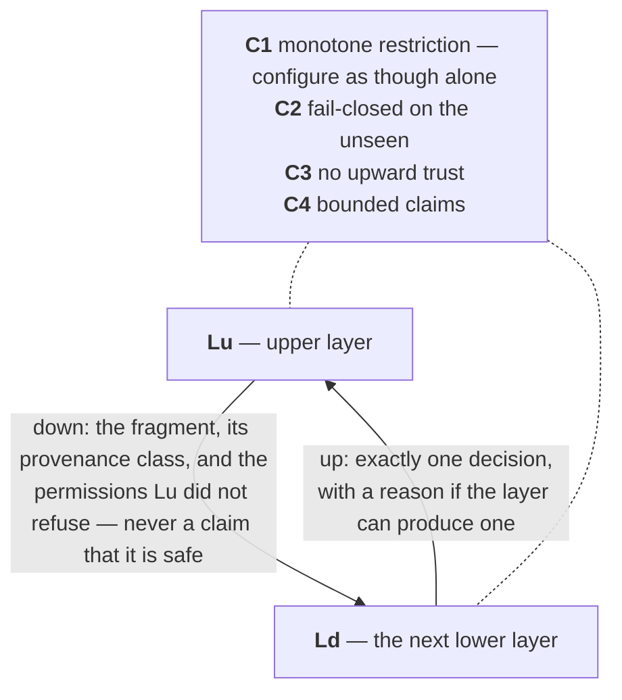
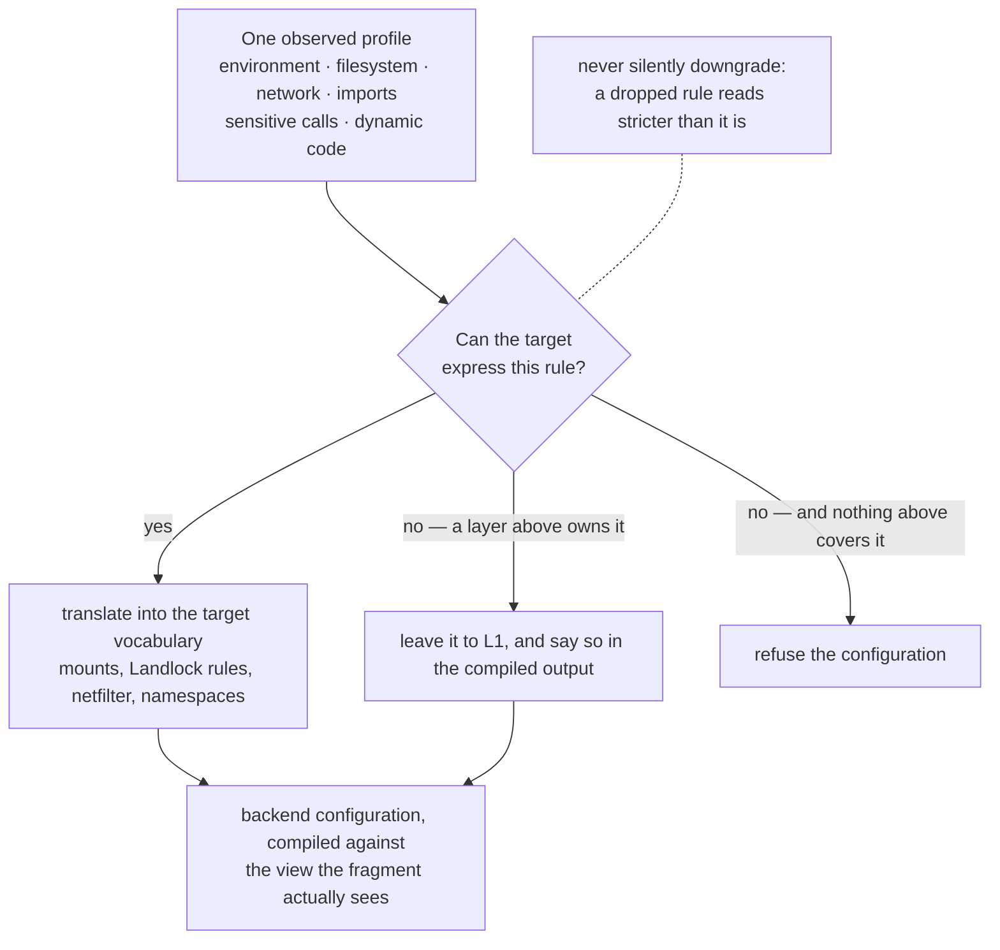
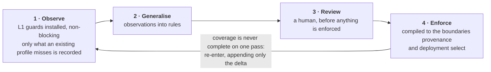
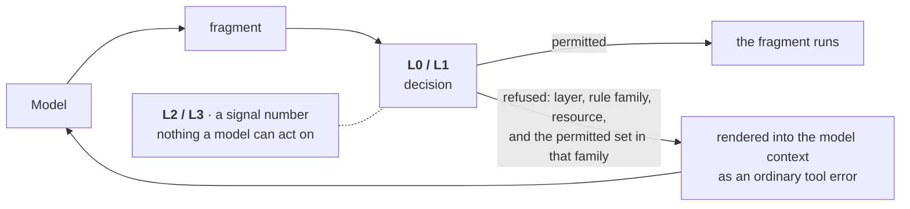

# Four Boundaries and a Contract

### Composable Confinement for Python Written by Machines

**Philippe PRADOS** — [github@prados.fr](mailto:github@prados.fr)

September 2026

---

**Reference implementation.** The design described here is implemented and
released as `py-sandboxes` (Apache-2.0):

> **Repository** — <https://github.com/pprados/pysandboxes>

> **Package** — <https://pypi.org/project/pysandboxes/>

**Scope of this paper.** This is a *conceptual* paper. It states the threat
model, the four boundaries at which Python execution can be mediated, the
contract that binds them to one another, the single artefact that configures
them all, how that artefact is obtained, and what happens to a refusal once the
code being confined was written by a generator that can rewrite it.
Implementation specifics are deliberately left to the repository's own
documentation, and are cited rather than reproduced.

**Keywords** — sandboxing; defence in depth; layer composition; code provenance;
least privilege; policy inference; Python; LLM code execution; agent security;
Landlock; namespaces; seccomp; microVM.

**License.** This paper is licensed under
[Creative Commons Attribution-NonCommercial-ShareAlike 4.0 International
(CC BY-NC-SA 4.0)](https://creativecommons.org/licenses/by-nc-sa/4.0/) —
see [`LICENSE`](https://github.com/pprados/pysandboxes/blob/master/research/LICENSE)
in this directory. The *software* it describes is separately licensed under
Apache-2.0.

---

## Table of contents

- [Abstract](#abstract)
- [1. The unit of confinement](#1-the-unit-of-confinement)
  - [1.1 What actually changed](#11-what-actually-changed)
  - [1.2 Provenance is a per-fragment property](#12-provenance-is-a-per-fragment-property)
  - [1.3 Threat model](#13-threat-model)
  - [1.4 Out of scope](#14-out-of-scope)
- [2. Prior art](#2-prior-art)
  - [2.1 What the record settles](#21-what-the-record-settles)
  - [2.2 What the record leaves open](#22-what-the-record-leaves-open)
- [3. Contribution](#3-contribution)
- [4. The stack](#4-the-stack)
  - [4.1 Four mediation boundaries](#41-four-mediation-boundaries)
  - [4.2 What each boundary is the last to see](#42-what-each-boundary-is-the-last-to-see)
  - [4.3 What each boundary can say](#43-what-each-boundary-can-say)
  - [4.4 How each boundary fails](#44-how-each-boundary-fails)
- [5. The composition contract](#5-the-composition-contract)
  - [5.1 The interface between two layers](#51-the-interface-between-two-layers)
  - [5.2 C1 — monotone restriction](#52-c1--monotone-restriction)
  - [5.3 C2 — fail-closed on the unseen](#53-c2--fail-closed-on-the-unseen)
  - [5.4 C3 — no upward trust](#54-c3--no-upward-trust)
  - [5.5 C4 — bounded claims](#55-c4--bounded-claims)
  - [5.6 Why a broken layer does not break the stack](#56-why-a-broken-layer-does-not-break-the-stack)
- [6. One artefact for four boundaries](#6-one-artefact-for-four-boundaries)
  - [6.1 Why the boundaries must share a policy](#61-why-the-boundaries-must-share-a-policy)
  - [6.2 The rule families](#62-the-rule-families)
  - [6.3 Composition and resolution](#63-composition-and-resolution)
  - [6.4 Compiling one profile to several backends](#64-compiling-one-profile-to-several-backends)
  - [6.5 The DNS/netfilter contradiction](#65-the-dnsnetfilter-contradiction)
- [7. Obtaining the profile by observation](#7-obtaining-the-profile-by-observation)
  - [7.1 Why the profile is observed rather than declared](#71-why-the-profile-is-observed-rather-than-declared)
  - [7.2 The observation loop](#72-the-observation-loop)
  - [7.3 Generalisation is the hard part](#73-generalisation-is-the-hard-part)
  - [7.4 The soundness gap, and where it is closed](#74-the-soundness-gap-and-where-it-is-closed)
- [8. Denial is a signal, not only an outcome](#8-denial-is-a-signal-not-only-an-outcome)
  - [8.1 The legibility gradient](#81-the-legibility-gradient)
  - [8.2 Feeding a refusal back into generation](#82-feeding-a-refusal-back-into-generation)
  - [8.3 Three ways this goes wrong](#83-three-ways-this-goes-wrong)
  - [8.4 Who may widen a policy](#84-who-may-widen-a-policy)
- [9. Assigning boundaries to provenance](#9-assigning-boundaries-to-provenance)
  - [9.1 The assignment table](#91-the-assignment-table)
  - [9.2 What the deployment decides, and what it does not](#92-what-the-deployment-decides-and-what-it-does-not)
- [10. Where the stack sits in an agent](#10-where-the-stack-sits-in-an-agent)
  - [10.1 Three granularities](#101-three-granularities)
  - [10.2 The boundary is a data boundary](#102-the-boundary-is-a-data-boundary)
- [11. What each layer does not claim](#11-what-each-layer-does-not-claim)
- [12. Open tensions](#12-open-tensions)
- [13. Validation, and what would falsify these claims](#13-validation-and-what-would-falsify-these-claims)
- [Appendix A — Prior art in detail](#appendix-a--prior-art-in-detail)
  - [A.1 In-interpreter confinement, and its recorded failure](#a1-in-interpreter-confinement-and-its-recorded-failure)
  - [A.2 Observability without confinement](#a2-observability-without-confinement)
  - [A.3 Restricted evaluators for dynamic source](#a3-restricted-evaluators-for-dynamic-source)
  - [A.4 Kernel-enforced isolation](#a4-kernel-enforced-isolation)
  - [A.5 Policy synthesis by observation](#a5-policy-synthesis-by-observation)
  - [A.6 The LLM-era execution sandboxes](#a6-the-llm-era-execution-sandboxes)
- [References](#references)
- [Relationship to the implementation](#relationship-to-the-implementation)

---

## Abstract

Thirty years of Python confinement have produced a clear record and a wrong
conclusion. The record is that every mechanism tried — restricted interpreters,
AST evaluators, syscall filters, namespaces, microVMs — is defeated at some
level of attacker capability, and that in-interpreter confinement is defeated at
a very low one. The wrong conclusion drawn from it is that the game is therefore
won by picking the single strongest mechanism available and running everything
inside it.

That conclusion fails against the workload of 2026. A language model does not
produce *one* piece of code of *one* provenance. In a single agent turn, an
application may evaluate a model-written expression, call a tool whose body was
written by a third party, import a package chosen by the model, and run
developer code that a coding assistant edited an hour earlier. These fragments
have different provenance, different blast radius, and different legitimate
needs. A single uniform isolation boundary — the fresh microVM of the current
generation of execution sandboxes — treats all of them as equally hostile and
equally opaque, which means it can neither refuse precisely nor explain why.

This paper argues for the opposite arrangement: **several layers, each with a
narrow and stated mandate, bound by an explicit contract, configured by one
artefact**. Four mediation boundaries are identified — the source string, the
interpreter's API surface, the kernel, and the machine. Each is characterised
three ways: the attacker capability class it is the *last* to see, the
vocabulary it can express, and the way it fails. The contract between them has
four clauses (monotone restriction, fail-closed on the unseen, no upward trust,
bounded claims), and its purpose is not to make the stack stronger than its
strongest layer — it cannot be — but to guarantee that **no layer's failure
invalidates another layer's guarantee**, and that no layer claims more than it
can hold.

Two consequences follow, and neither has an analogue in the classical
literature. First, the contract is not satisfiable by four independently written
configurations: because the boundaries speak incompatible vocabularies, the
intersection they are supposed to enforce can only be kept coherent if it is
derived from a single policy artefact, and that artefact can only be obtained by
observing what the workload actually does. Second, a denial is not only an
enforcement event: it is a **typed signal that can re-enter the loop that
produced the code**. The upper layers can name what was refused in terms a model
can act on — a module, a path, a hostname — while the lower layers can only
deliver a signal number. The legibility of a refusal is therefore a layer
property, and it is the reason the upper layers remain worth building even
though their enforcement was declared broken by design in 2013 and that verdict
still stands.

---

## 1. The unit of confinement

### 1.1 What actually changed

The classical sandboxing question is: *this program is untrusted, how do I run
it?* The answer — put it in a box — has been correct for thirty years and is not
contested here.

The question posed by LLM-driven development is different in three ways.

**The code is new every time.** There is no stable artefact to audit, sign, or
pin. A profile written for yesterday's tool body may be irrelevant today, not
because the environment changed but because the generator re-generated.

**The code arrives mid-execution, inside a process that already holds
authority.** The application that evaluates a model's answer usually holds
database credentials, cloud tokens and an open session. The interesting boundary
is therefore not between *the machine* and *the world* but between *this
fragment* and *the rest of the same application*.

**The failure is not necessarily an attack.** The dominant failure mode is a
model that confidently does the wrong thing: deletes a directory it misidentified
as scratch space, posts an internal document to a public endpoint, installs a
package whose name it hallucinated. These are not exploits. They are executed as
ordinary, syntactically innocent Python, by a component that is *supposed* to be
running code. OWASP's LLM Top 10 names the two relevant classes directly:
improper output handling and excessive agency [[OWASP-LLM]]. The agent frameworks
have already accumulated their own execution-surface CVE record, largely in the
paths where generated code meets an interpreter [[CVE-LIST]].

An attacker-driven variant exists and matters — prompt injection turning a
compliant agent into an execution vehicle — but the design does not need to
distinguish them. Both reduce to the same operational question: *when this
fragment runs, what is it allowed to touch?*

### 1.2 Provenance is a per-fragment property

The single most useful observation in this paper is that the fragments are not
interchangeable. Four classes recur, and they differ in ways that matter to
every subsequent chapter.

**P1 — the evaluated expression.** A string the model produced, evaluated now:
a filter predicate, an arithmetic formula, a data transformation, a
`pandas.query` string. Short-lived, narrow, and — crucially — *it does not need
the standard library*. This is the only class where the language itself can be
reduced.

**P2 — the generated script.** A multi-line program the model wrote to answer a
question: read these files, compute, print a result. It legitimately needs
imports, loops and exceptions, so the language cannot be reduced; what can be
bounded is the set of resources it reaches.

**P3 — the tool body.** Code the model *calls* but did not write: an MCP server,
a plugin, a library function exposed as a tool. It is third-party code of stable
provenance but unknown quality, invoked with arguments the model chose. Its
danger is not what it is but what it is *asked* to do.

**P4 — the assisted codebase.** The developer's own repository, written by a
human and a coding assistant together, running with the developer's credentials
on the developer's machine. It is trusted in the sense that it is committed and
reviewed, and untrusted in the sense that no one read every line the assistant
produced.

The classical literature has an answer for P1 (restricted evaluators,
[§A.3](#a3-restricted-evaluators-for-dynamic-source)) and an answer for P2
(isolate the process, [§A.4](#a4-kernel-enforced-isolation), and the LLM-era
sandboxes in [§A.6](#a6-the-llm-era-execution-sandboxes)). It has no articulated
answer for P3 and P4, and — the point of this paper — no account of what happens
when all four occur *in the same process, in the same second*.

### 1.3 Threat model

**Assumed.** The adversary controls the *content* of a fragment: the source
string, the arguments passed to a tool, the choice of module to import. The
adversary is competent at Python. The host kernel is not assumed hostile. The
application's own startup code, before any fragment runs, is trusted.

**Defended.** Unauthorised reads and writes of files; unauthorised network
egress; reading credentials from the environment; importing modules outside the
declared set; escaping from a fragment into the surrounding application's
objects, globals and open handles; a compromised fragment escalating from one
capability class to the next without crossing a boundary that notices.

**Not defended — stated plainly because a sandbox whose limits are undocumented
is worse than none.** A native-code exploit of the CPython interpreter is not
stopped by anything above the kernel layer. A kernel exploit is not stopped by
anything above the machine layer. Denial of service is bounded, not prevented
([§11](#11-what-each-layer-does-not-claim)). Semantic correctness of the
generated code is not addressed at all: a fragment permitted to write
`output.csv` may write nonsense into it.

### 1.4 Out of scope

Four things are deliberately outside this paper, because conflating them with
confinement is a common and costly error.

- **Prompt-injection resistance and agent orchestration.** Whether the model
  *should* have decided to run this fragment is governed by a different
  literature — CaMeL, IsolateGPT, the injection design patterns, AgentDojo
  ([§A.6](#a6-the-llm-era-execution-sandboxes)). This paper assumes that decision
  has already gone wrong.
- **Supply-chain integrity.** Whether the installed package is the one the
  author published is an artefact-provenance problem, upstream of execution.
- **Static analysis of generated code.** Useful, orthogonal, and unable to
  decide anything about a string that will only exist at runtime.
- **Non-Linux enforcement.** The kernel and machine boundaries are described in
  Linux terms throughout. The macOS and Windows sandboxing facilities have
  vocabularies different enough that targeting them is a redesign of
  [§6.4](#64-compiling-one-profile-to-several-backends), not a port.

---

## 2. Prior art

Everything cited here predates December 2025. The evidence — projects, dates,
CVEs, measurements — is set out in
[Appendix A](#appendix-a--prior-art-in-detail); this chapter states what the
record settles and what it leaves open.

### 2.1 What the record settles

**Six families, and the finding each one contributes.**

1. **A layer inside the interpreter cannot hold against a competent attacker**
   ([§A.1](#a1-in-interpreter-confinement-and-its-recorded-failure)). `rexec`,
   `Bastion` and `pysandbox` were each abandoned by their own authors, the last
   with the verdict *broken by design* after a challenge produced two escapes in
   under a day. The recurring escape is an object-graph path from a permitted
   object back to an unrestricted one. This paper accepts the verdict entirely
   and does not attempt to repair it; it asks instead what such a layer may
   legitimately *claim* ([§5.5](#55-c4--bounded-claims)).
2. **The interpreter can observe what it cannot confine**
   ([§A.2](#a2-observability-without-confinement)). PEP 578 audit hooks say so in
   their own text. Observation and enforcement are separable properties of a
   layer, and the record shows a layer can possess the first without the second.
   Everything in [§7](#7-obtaining-the-profile-by-observation) rests on that
   separation.
3. **A sub-language is definable, and its holes are in the permitted
   constructs** ([§A.3](#a3-restricted-evaluators-for-dynamic-source)).
   `simpleeval`, `asteval` and `RestrictedPython` establish that whitelisting by
   construction beats blacklisting by subtraction, and that the escapes come from
   constructs that *were* allowed: `str.format` traverses the object graph
   (rediscovered independently three times, most recently as CVE-2025-24359), and
   an exception instance is itself an object-graph reference.
4. **Kernel enforcement is mature and semantically blind**
   ([§A.4](#a4-kernel-enforced-isolation)). seccomp-bpf cannot dereference
   pointer arguments by design, so it cannot distinguish `/etc/passwd` from a
   scratch file; Landlock can, within the filesystem and the network; namespaces
   give views at the price of privilege; gVisor and microVMs move the boundary
   below the kernel API entirely.
5. **Policy can be derived from observed behaviour — at the syscall layer**
   ([§A.5](#a5-policy-synthesis-by-observation)). `aa-genprof`, `audit2allow`,
   *Mining Sandboxes* and *Confine* map this ground thoroughly, and name the
   dilemma: observation under-approximates, static analysis over-approximates.
6. **The LLM-era sandboxes apply one uniform maximal boundary**
   ([§A.6](#a6-the-llm-era-execution-sandboxes)). E2B, Modal and the agent
   frameworks give a fresh machine per execution; smolagents documents its local
   executor as *not a security boundary* and points users at the remote ones. The
   agent-security literature governs what the agent may *decide*; it does not
   govern what the resulting process may *touch*.

### 2.2 What the record leaves open

Read as a whole, the record has a shape that none of its individual entries
state. Four gaps follow from that shape, and they are this paper's subject.

**Gap 1 — every project picks one layer and dies there.** `pysandbox` was an
interpreter-layer project, and when that layer fell the project ended; PyPy's
sandbox was an interpreter-replacement project, and it ended when the
maintenance of that one component became unjustifiable; the seccomp synthesis
line is a kernel-layer line and its published limits are kernel-layer limits.
Each failure is a *single-layer* failure, reported as if it were a verdict on
confinement as such — and what ecosystems then take up is likewise a choice of
one mechanism, which is the shape the empirical record of sandboxing in open
source describes [[SANDBOX-ADOPTION]]. Stinner's own recommended alternative —
*run Python in a sandbox, not the opposite* — is itself a single-layer
prescription, and the edX CodeJail design raised in the same thread is the only
composed system in the record
([§A.1](#a1-in-interpreter-confinement-and-its-recorded-failure)). It was never
described as a composition, only as a deployment.

**Gap 2 — nobody published the interface.** "Defence in depth" appears
constantly as an exhortation and almost never as a specification. What does an
upper layer *hand* to a lower one? What may a lower layer assume about what the
upper one already rejected? What must an upper layer refrain from claiming so
that its failure does not invalidate the layer beneath? The Landlock project's
framing that Landlock and seccomp are complementary
([§A.4](#a4-kernel-enforced-isolation)) is the closest the record comes, and it
is a statement about two specific mechanisms, not a contract. Without a contract,
composition degrades into redundancy — several mechanisms, each configured
independently, each assuming the others cover what it misses, none stating what
it owns.

**Gap 3 — provenance is not a parameter anywhere.** Every mechanism in the
record is configured for *a program*. None takes, as an input, the question
"where did this fragment come from?" The LLM-era sandboxes make this visible:
they apply the same fresh-microVM boundary to a one-line arithmetic expression
and to a fifty-line data pipeline, because the boundary is chosen once, per
service, rather than per fragment. The consequence is not that the isolation is
insufficient; it is that it is undifferentiated, which makes it simultaneously
too coarse to refuse precisely and too opaque to explain a refusal
([§8](#8-denial-is-a-signal-not-only-an-outcome)).

**Gap 4 — policy acquisition stops inside one vocabulary.** Family 5 derives
policy by observation, and everything it derives is expressed in the vocabulary
of the layer that observed: syscall numbers for `audit2allow` and *Confine*,
AppArmor's path language for `aa-genprof`. Nothing in the record derives, from
one observation, the *several* configurations that a composed stack needs — and
nothing states what it would mean for those configurations to agree. That
question only becomes unavoidable once Gap 2 is taken seriously: a contract
between layers is a statement about an intersection, and an intersection across
four incompatible vocabularies is not something four independent configuration
files can be trusted to express.

---

## 3. Contribution

The design rests on one reframing and four claims.

**The reframing.** A layer is not a quantity of security. It is a *mediation
boundary* with three fixed properties — the capability class it is the last to
see, the vocabulary it can express, and the way it fails — and a stack is not
"more security" but a set of such boundaries **plus a contract stating what each
owes the others**. The strength of a stack is not the sum of its layers; it is
the guarantee that no layer's failure silently removes another's.

**Claim 1 — four boundaries, characterised by capability class, not by
strength.** The source string, the interpreter API surface, the kernel and the
machine are the four places where Python execution can be mediated. Each is the
*last* place at which a specific class of attacker is visible, and no layer below
can see what the layer above was the last to see
([§4](#4-the-stack)). Layers therefore nest and cannot substitute for one
another.

**Claim 2 — the contract, not the layers, is the contribution.** Four clauses —
monotone restriction, fail-closed on the unseen, no upward trust, bounded claims
— define what one layer hands the next and what each may assume
([§5](#5-the-composition-contract)). The last clause is what reconciles this
design with the *broken by design* verdict: a layer that claims only what its
capability class supports is not refuted by an escape from a class it never
claimed.

**Claim 3 — the contract is satisfiable only from a single, observed policy.**
C1 requires the effective permission set to be the intersection of the layers'
sets. Four independently written configurations, in four vocabularies that do
not share a single term, cannot be checked against that requirement, and in
practice do not meet it. One artefact in *resource* terms, compiled downward, is
what makes the intersection expressible ([§6](#6-one-artefact-for-four-boundaries));
and that artefact is obtained by observing the workload, because the set of
resources a real dependency tree touches is not knowable by inspection
([§7](#7-obtaining-the-profile-by-observation)). Observation is unsound by
construction, and the reason the design survives that is structural: what
observation misses is *denied* by the layer below the one that observed.

**Claim 4 — a denial is a typed signal that re-enters the generation loop.**
Because machine-written code is regenerated on failure, the *legibility* of a
refusal is a first-class property, and it degrades monotonically down the stack:
a named module at the top, a signal number at the bottom
([§8](#8-denial-is-a-signal-not-only-an-outcome)). This is the property that
justifies keeping the upper layers despite their weakness as enforcers, and it
has no analogue in the pre-LLM sandboxing literature, where nothing consumed a
refusal except a human reading a log.

A corollary, stated because it is the practical shape of the design: **the layer
assignment is a function of provenance**, and the backend that implements a given
layer is a function of the deployment
([§9](#9-assigning-boundaries-to-provenance)). These are two independent choices,
and conflating them is how systems end up either over-isolating a one-line
expression or under-isolating a tool body.

---

## 4. The stack

### 4.1 Four mediation boundaries

Python execution can be mediated in exactly four places. The list is not a
taxonomy of tools; it is a list of *places where the code is still describable
in some vocabulary before it becomes indistinguishable from the rest of the
machine*.

**L0 — the source boundary.** The fragment exists as a string that has not yet
been compiled. It can be parsed, and the accepted sub-language can be reduced to
a whitelist of AST node types. This is the only boundary at which *the language
itself* is a variable. It exists only for P1 fragments: code that arrives as
text.

**L1 — the API boundary.** The fragment is running as ordinary bytecode in a
CPython process. What remains observable is its use of the standard library and
builtins: `open`, `socket`, `__import__`, `os.environ`, `subprocess`. Mediation
here is interposition on named callables. It is the only boundary that sees
Python-level semantics — a module name, a dotted path, an attribute — and the
only one that sees them *before* they have been translated into anything the
kernel could recognise.

**L2 — the kernel boundary.** The process asks the kernel for something.
Mediation is by LSM, syscall filter, namespace or a combination: Landlock rules
on paths and ports, seccomp-bpf on syscall numbers and scalar arguments, mount
and network namespaces on what exists at all. Semantics are gone; resources
remain.

**L3 — the machine boundary.** The workload runs against a kernel that is not
the host's: a user-space kernel (gVisor) or a guest kernel under hardware
virtualisation (Firecracker, Kata, QEMU). Nothing about the workload is
describable any more; only the boundary itself is.

The reference implementation realises L0 as a restricted evaluator, L1 as a
patching layer over the Python API, and L2/L3 as a set of interchangeable
providers ([§Relationship to the implementation](#relationship-to-the-implementation)).

### 4.2 What each boundary is the last to see

This is the argument for nesting, and it is a visibility argument, not a strength
argument. Order the attacker by *capability*:

| Rung | Attacker capability | Last boundary that can see it |
|---|---|---|
| R1 | Supplies a source string to be evaluated | **L0** — after compilation, `__subclasses__` in a comprehension is indistinguishable from any other attribute walk |
| R2 | Executes arbitrary Python bytecode | **L1** — `open("/etc/shadow")` is visible as a path here and as an `openat` number below |
| R3 | Executes native code (a C extension, `ctypes`) | **L2** — the Python API layer is bypassed entirely; the kernel still sees the syscall |
| R4 | Issues raw syscalls | **L2**, partially — a filter sees the call but not, per seccomp's design, the pointer arguments; only an LSM with path awareness sees the resource |
| R5 | Exploits the kernel itself | **L3** — nothing on the host kernel's side of the boundary is meaningful any more |

Two properties of this table carry the argument.

**It is monotone.** An attacker at rung *n* has all the capabilities of rungs
below *n*. There is no rung that L0 sees and L1 does not, because anything
expressible as a source string is also expressible as bytecode.

**The "last to see" column never repeats downward.** Once a capability class has
passed a boundary, no lower boundary can recover the information that boundary
had. `ctypes.CDLL("libc.so.6").unlink(path)` is an R3 event: L1 can refuse the
*import* of `ctypes`, but if `ctypes` is permitted — and for many legitimate
workloads it is — the call itself is invisible to L1 and arrives at L2 as an
anonymous `unlink`. Conversely, "may import `json` but not `subprocess`" is
invisible at L2 and below, in any implementation, because it is not a fact about
resources.

This is why the layers nest and do not substitute. It is *not* a claim that more
layers are better. A stack that includes L3 but omits L1 is not "strong enough to
skip L1": it simply has no boundary at which a module name exists.

### 4.3 What each boundary can say

The second fixed property of a layer is its vocabulary — the set of statements it
can express. A policy statement is enforceable at a boundary if and only if the
terms it uses survive down to that boundary.

| Statement | L0 | L1 | L2 | L3 |
|---|---|---|---|---|
| `eval` may contain arithmetic and comparisons only | **yes** | no | no | no |
| may import `json`, not `subprocess` | partial (import is a node type) | **yes** | no | no |
| may read `/etc/app/*.yaml`, write `/tmp/work` | no | **yes** | **yes** (Landlock, mounts) | yes (image contents) |
| may connect to `api.example.com:443` | no | **yes** (by name) | partial (by address, [§A.4](#a4-kernel-enforced-isolation)) | yes (by network topology) |
| may read `PGPASSWORD` | no | **yes** | no (environment is not a kernel object) | yes (by not putting it in the guest) |
| may not call `ptrace` | no | no | **yes** | yes |
| a kernel bug is not reachable | no | no | partial | **yes** |

The table has a diagonal shape, and that shape is the design. The upper layers
speak in the operator's terms and hold weakly; the lower layers speak in the
machine's terms and hold strongly. **No single row is covered well by a single
layer**, which is the compact form of the argument against choosing one.

Two entries deserve their own note.

*Hostnames.* L1 can mediate `socket.getaddrinfo` and therefore reason about
`api.example.com`. L2 sees an address. A host whose address set changes between
resolution and connection — every CDN — makes the two disagree by construction.
The contract in [§5](#5-the-composition-contract) forces that disagreement to
resolve in the restrictive direction rather than silently, and
[§6.5](#65-the-dnsnetfilter-contradiction) shows what has to happen at
compilation time for the disagreement not to occur in the first place.

*The environment.* The process environment is a Python-visible object and not a
kernel-mediated one. L2 cannot express a rule about `PGPASSWORD` at all; L1 can,
and L3 can only in the trivial sense of never providing the variable. A stack
without L1 has no way to state the rule that matters most in exactly the
scenario the paper is about: a fragment that reads the application's credentials
and does something honest-looking with them.

### 4.4 How each boundary fails

The third fixed property, and the one most often left unstated. A layer's failure
mode determines what the layers *below* it must be prepared for.

**L0 fails by permitting a construct whose implementation reaches further than
the construct appears to.** This is the most thoroughly documented failure in the
record: `str.format` traversing the object graph, in three independent projects;
an `AttributeError` handing back the protected object through its own `obj`
attribute (CVE-2025-24359); a permitted numpy ufunc segfaulting the interpreter
([§A.3](#a3-restricted-evaluators-for-dynamic-source)). The failure is *silent
and total*: the fragment becomes an R2 attacker, and L0 does not notice.

**L1 fails by aliasing.** A patched callable is reachable under another name: a
reference captured before patching, a C-level entry point (`_pickle`,
`posix.open`), an object-graph path through `__subclasses__` or a live frame. The
1990s failure repeats with different names
([§A.1](#a1-in-interpreter-confinement-and-its-recorded-failure)). The failure is
again silent and total: the fragment becomes an R3 attacker. **This layer must
therefore never be the lowest one in a stack facing a capable adversary** — which
is exactly the *broken by design* verdict, restated as a placement rule rather
than as a reason to abandon the layer.

**L2 fails by expressiveness, not by integrity.** Landlock and seccomp do not
get *bypassed* by Python code; they get *configured too permissively*, because
the rule the operator wanted could not be expressed — a hostname, an environment
variable, a file created after the rules were installed. The failure is loud in
one direction (a needed access is refused; the workload breaks visibly) and
silent in the other (an unneeded access was granted). It is bounded: an L2
failure grants a resource, it does not grant the kernel.

**L3 fails rarely and catastrophically.** A hypervisor or guest-kernel escape
removes the last boundary. It is also the layer that fails *operationally* most
often: it is the hardest to deploy, and the deployment environment may simply
forbid it ([§9.2](#92-what-the-deployment-decides-and-what-it-does-not)).

The asymmetry across these four is the reason the contract in the next chapter is
necessary. Two layers fail silently and totally; one fails loudly and partially;
one fails almost never and absolutely. A composition that does not account for
the silent-total failures will assume a guarantee it has already lost.

---

## 5. The composition contract

### 5.1 The interface between two layers

Everything above is descriptive. This chapter is the paper's normative core: a
four-clause contract that turns a set of mechanisms into a stack.

The interface between an upper layer `Lu` and the next lower layer `Ld` has three
elements.

**What flows down.** `Lu` hands `Ld` a fragment of code *and its provenance
class*, plus the set of permissions `Lu` itself did not refuse. Provenance is
part of the handoff, not metadata: it is what allows `Ld` to select the policy it
applies ([§9](#9-assigning-boundaries-to-provenance)). Nothing else flows down —
in particular, `Lu` does not hand down a *claim* that the fragment is safe.

**What flows up.** Exactly one thing: a decision, with a reason if the layer can
produce one ([§8.1](#81-the-legibility-gradient)). A lower layer never returns
data that an upper layer treats as trusted
([§5.4](#54-c3--no-upward-trust)).

**What is guaranteed sideways.** Nothing. Two layers at the same level do not
exist in this model; a stack is a total order.

The four clauses constrain this interface.

### 5.2 C1 — monotone restriction

*A layer must be configured as though it were the only layer for the capability
class it owns. It may only remove permissions: it may never restore a permission
a layer above it removed, and it may never depend on a layer below it to remove
one.*

The first sentence is the clause that is actually violated in practice, and it is
the one worth leading with. An L1 configuration that permits `subprocess`
"because L2 will prevent anything dangerous" has abandoned the only boundary at
which a module name exists; L2 owns *resources*, not *modules*, and cannot take
over the abandoned rule. The prohibition is not stylistic. Because of the "last
to see" property of
[§4.2](#42-what-each-boundary-is-the-last-to-see), delegation downward is
delegation to a layer that is structurally incapable of accepting it: the
information the delegating layer held does not exist below it. Every layer is
therefore configured against its own capability class in full, and the fact that
another layer happens to be present is not an input to that configuration.

The rest is the obvious half, and it is trivially satisfied by intersection: the
effective permission set is the intersection of every layer's set, and the
configuration of layer *n* cannot widen layer *n−1*. Where it bites is in
disagreement. When L1 permits `api.example.com` and L2 permits address
`203.0.113.7`, the effective permission is the *intersection* — a connection to a
newly resolved address of that host is refused, loudly, rather than being
silently permitted because "one of the layers allowed it". This is the mechanical
resolution of the hostname problem of
[§4.3](#43-what-each-boundary-can-say), and it makes CDN-backed hosts a
*documented operational cost* rather than a latent hole.

An intersection is only meaningful if the sets being intersected are derived from
one statement of intent; four configurations written independently in four
vocabularies intersect to something nobody chose. That is the subject of
[§6](#6-one-artefact-for-four-boundaries).

### 5.3 C2 — fail-closed on the unseen

*Anything a layer did not explicitly permit is refused by that layer, and a
layer's inability to decide is a refusal.*

Whitelisting, stated as a composition property rather than as a policy style.
Its importance here is that it is what makes an *incomplete* policy safe to
compose. Every mechanism in [§A.5](#a5-policy-synthesis-by-observation) confronts
the same dilemma — an observed policy under-approximates real behaviour — and the
composition answer is not to make any layer's knowledge complete, but to ensure
that the consequence of incompleteness is a refusal at that layer, visible as a
refusal, rather than a pass-through to a layer that cannot express the rule. It
is also what makes [§7](#7-obtaining-the-profile-by-observation) admissible at
all: an unsound acquisition procedure is tolerable exactly when its omissions
land on the refusing side.

There is a corollary about ordering. Because refusal is the default at every
layer, the *first* layer to refuse determines the reason the user sees. Layers
should therefore be consulted top-down, so that the refusal carries the most
legible reason available ([§8.1](#81-the-legibility-gradient)) — a design choice
that only matters because something now reads those reasons.

### 5.4 C3 — no upward trust

*No layer treats data originating below it as trusted input.*

This clause exists because composing layers necessarily creates a channel between
them, and a channel from a confined region to an unconfined one is an attack
surface that the confinement itself introduced. If an L1-confined child process
returns results to an unconfined parent over IPC, the parent's deserialiser is
running *outside* every layer, on data chosen by the adversary. A stack whose
parent calls `pickle.loads` on the child's output has, in a precise sense,
negative security: without the boundary there would have been no such channel.

The clause has three practical consequences, and they are the ones most often
missed in real designs:

- the transport carries data, never code — a self-describing format with no
  object-construction semantics;
- the parent validates the *shape* of what it receives against what it expected
  to receive, before any of it reaches application logic;
- any error path — a traceback, an exception instance, a repr — is data too. An
  exception is an object-graph reference, which
  [§A.3](#a3-restricted-evaluators-for-dynamic-source) establishes for L0 and
  which applies verbatim to a boundary crossing.

### 5.5 C4 — bounded claims

*Each layer states the capability rung above which it makes no claim, and that
statement is part of its configuration, not its documentation.*

This is the clause that reconciles the design with the record. The *broken by
design* verdict on in-interpreter confinement is a true statement about a layer
that claimed to stop an R2 attacker. It is not a statement about a layer that
claims to stop an R1 attacker and to *observe* an R2 one.

Concretely, L1's claim is: *it prevents a fragment that is not attempting escape
from reaching a resource it was not granted, and it names every such attempt.* It
does not claim to prevent a fragment that is attempting escape. That bounded
claim is not defeated by any of the escapes in
[§A.1](#a1-in-interpreter-confinement-and-its-recorded-failure), because every
one of them is an R2-or-above technique.

The reason this must be machine-visible rather than prose is that operators
compose stacks. A stack of L0+L1 facing P3 fragments is a misconfiguration —
its lowest layer's claim stops below the capability class the provenance implies
— and that is checkable if, and only if, the claims are declared.

### 5.6 Why a broken layer does not break the stack

Three consequences follow from C1–C4, and together they are the guarantee the
stack actually provides. It is weaker than "defence in depth" as usually
advertised, and it is checkable.

1. **A silent-total failure at L0 or L1 promotes the attacker one rung; it does
   not widen any lower layer's policy.** By C1 the lower layers were configured
   independently; by C2 their default is refusal. The attacker gains the
   capability class, not the permissions.
2. **No layer's guarantee is conditional on another layer holding.** This is the
   difference between composition and redundancy. Two mechanisms each assuming
   the other covers the gap cover nothing; four layers each owning a capability
   class cover four classes.
3. **The stack claims exactly the claim of its lowest layer, for the classes that
   layer covers, plus the vocabulary of its upper layers for the classes they
   cover.** It never claims the union interpreted as a maximum.

What the stack does *not* give, and no arrangement of layers can: strength above
its lowest layer. A stack of L0+L1 on bare CPython is defeated by an R3 attacker,
and stating this is the entire content of C4.

---

## 6. One artefact for four boundaries

### 6.1 Why the boundaries must share a policy

C1 says the effective permission set is an intersection. Nothing so far says
where the operands come from, and the naive answer — configure each mechanism in
its own language — does not satisfy the clause. It fails for three separate
reasons.

**The vocabularies do not share a term.** "This fragment may read the
application's YAML configuration" is a path glob at L1, a Landlock ruleset or a
bind mount at L2, and a decision about image contents at L3. There is no
expression in which the three are the same statement, so there is no artefact
against which the intersection can be checked. What operators actually produce in
that situation is four sets that are *nearly* the same, differing exactly where
someone made a translation error under time pressure — and by C1 the effective
policy is the intersection of the errors.

**The boundaries are chosen per fragment, the configurations per mechanism.**
Provenance decides which layers are armed ([§9.1](#91-the-assignment-table)) and
the deployment decides which mechanism implements L2 and L3
([§9.2](#92-what-the-deployment-decides-and-what-it-does-not)). If the policy is
written in mechanism terms, every combination of the two is a separate artefact,
and the number of artefacts is the product rather than the sum.

**Some rules have no lower analogue and must be recognisably absent, not
silently dropped.** An import rule stops at L1; an AST restriction stops at L0. A
single artefact makes the fall-off visible — this rule is enforced by exactly
these layers — and a set of per-mechanism configurations makes it invisible,
which is how a stack comes to read stricter than it is.

The answer is one artefact — a *profile* — stated in resource terms and compiled
downward. Four design constraints follow from the roles it has to play at once:
it is the input to enforcement, the output of acquisition, the object of human
review, and the source of every backend's configuration.

1. **Resource terms, not mechanism terms.** `expose-ro=/etc/app` names a
   resource; `--ro-bind /etc/app /etc/app` names one tool's invocation. Only the
   first can compile to several backends, and only the first survives a change of
   deployment.
2. **Reviewable by the operator who will be blamed.** The output of acquisition
   is *a draft*. Red Hat's caution about `audit2allow`
   ([§A.5](#a5-policy-synthesis-by-observation)) applies with full force: the risk
   is accepting generated rules without understanding what is being granted. A
   format that is unpleasant to read guarantees it will not be read, and
   [§8.4](#84-who-may-widen-a-policy) makes that review the only place a policy
   may widen.
3. **Composable without ordering semantics.** Profiles are assembled from several
   sources — a package's own defaults, a project file, a developer's local
   overrides, a machine-wide policy. If resolution depends on textual order, an
   `include` can be defeated by where it is placed, and composition stops being
   predictable.
4. **Environment-parameterised.** The same logical policy must work across
   development, CI and production, where paths and hostnames differ. Variable
   substitution belongs in the format, not in a generation step wrapped around
   it.

### 6.2 The rule families

Seven families. The grouping, not the spelling, is what matters; the last column
is the compilation fall-off that
[§6.1](#61-why-the-boundaries-must-share-a-policy) requires to be visible rather
than silent.

| Family | Governs | Boundary that owns it | Compiles below L1? |
|---|---|:---:|:---:|
| **Environment** | which variables are visible inside the sandbox; mapping and removal | L1 | ✅ — filtered at process launch |
| **Filesystem** | which paths are exposed, read-only or read-write; which are hidden | L1 | ✅ — mounts, Landlock rules |
| **Network** | direction, host, address, port, protocol | L1 | ✅ — netfilter, Landlock ports |
| **Imports** | which modules may be imported | L1 | ❌ — no kernel analogue |
| **Sensitive calls** | which registry functions may be called, per function or category | L1 | partially — the kernel blocks the *effect*, not the call |
| **Dynamic code** | the sub-language for `eval`/`exec`/`compile` and its budgets | L0 | ❌ — no kernel analogue |
| **Backend selection and passthrough** | which mechanism implements L2/L3; mechanism-specific options | L2/L3 | — |

Three structural points to preserve:

- **Filesystem rules need three verbs, not two.** *Expose read-only*, *expose
  read-write*, and *hide* are distinct. Hiding is not a weaker form of denial: a
  hidden path should ideally be **absent**, because code that discovers a file
  exists but cannot be read behaves differently — and leaks differently — from
  code that concludes the file does not exist. This is also the family where
  backends diverge most ([§6.4](#64-compiling-one-profile-to-several-backends)).
- **Path *renaming* is deliberately absent, and the reason is instructive.**
  Mapping `/real/secrets` to appear as `/app/config` is expressible at L1, where
  paths still pass through an API that can rewrite them. It has no counterpart
  below: a bind mount can relocate a path, but Landlock — the access-control
  mechanism the reference L2 backends rely on — can deny a path and cannot remap
  one, and the policy vocabulary of the backends assumes identity mapping. A
  mapping held at L1 alone would leave the two layers holding different beliefs
  about what a path denotes — a deliberate instance of exactly the mismatch
  [§12](#12-open-tensions) already declines to call solved for paths that merely
  *resolve* differently. The family therefore has three verbs and no fourth.
- **Network rules need deny-priority.** The useful policy shape is "everything
  except this range" — allow the internet, deny link-local and the cloud metadata
  endpoint. That requires broad allows with narrow denies overriding them, which
  is a different resolution rule from the allow-list families.

### 6.3 Composition and resolution

Composition is by inclusion, with missing files ignored, so that a profile
referencing an optional local override still works when the override is absent.
A conventional chain is: package defaults → project profile → developer-local
overrides (git-ignored) → user profile → machine profile.

**Resolution** is where a genuine unresolved tension sits, and it is recorded
here rather than smoothed over, because the choice must be made deliberately.
The reference implementation uses **two different algebras**:

| | Sensitive-call rules | Dynamic-code rules |
|---|---|---|
| Resolution | by **specificity** — a rule on a function beats a rule on its category, wherever it appears | **unordered sets**, no specificity |
| Conflict at equal precedence | `DENY` wins | `DENY` **always** wins, everywhere |
| Consequence | a category-wide allow can be narrowed *and widened* per function | a deny can never be overridden |

Both satisfy constraint 3 of
[§6.1](#61-why-the-boundaries-must-share-a-policy) — neither depends on textual
order. They differ in expressiveness: specificity permits "allow the whole
category **except** these two, and additionally allow this one", which is
genuinely useful for a large registry; the set model permits only monotone
narrowing, which is simpler to reason about and strictly safer.

The divergence is defensible — the registry is large and hierarchical, the
dynamic-code vocabulary is small and flat — but it is *two mental models for one
problem*, and users must hold both. The two must either unify on specificity
(accepting that a deny becomes overridable by a more specific allow, which needs
care) or unify on deny-wins sets (accepting the loss of category-with-exceptions,
which then needs an explicit "all except" form). What must not happen is adopting
both without noticing.

Two further properties worth carrying over:

- **Unknown targets are startup errors.** A rule naming a function or category
  that does not exist must fail loudly. Silent acceptance turns a typo into a
  hole that no review will catch, and by C2 an unparsed rule is not a permissive
  one — it is a refusal to start.
- **Over-broad patterns should warn with their expansion.** A glob whose fixed
  part is very short matches far more than the author intended. The useful
  diagnostic is not "this pattern is broad" but "this pattern expands to *N*
  names on this interpreter, including *X*" — naming a dangerous member of the
  expansion is what makes the warning actionable.

### 6.4 Compiling one profile to several backends

The profile is mechanism-independent. The backends are not. Compilation must:

- **translate** each rule family into the target's vocabulary;
- **reconcile** what the target cannot express — either by leaving that rule to
  L1, or by refusing the combination outright;
- **preserve** the operator's intent when two layers disagree about the same
  resource.

Two general principles govern it, and both are C1 restated at compile time.

1. **Never silently downgrade.** If a backend cannot express a rule, the choice
   is to rely on the layer above (*and say so*) or to refuse the configuration.
   Quietly dropping a rule produces a profile that reads stricter than it is —
   the worst possible outcome for a security artefact, and the exact failure C4
   exists to prevent at the level of claims.
2. **Compile against the view the fragment actually sees.** Where L1 hides paths,
   the backend must be configured against the resulting view, not against the
   filesystem as it exists on the host, or the two layers will disagree about
   what a path means.

Three impedance mismatches recur across every backend and are worth naming; a
further candidate, path renaming, is avoided rather than reconciled.

**Hiding has at least three inequivalent semantics.** Asked to make a path
disappear, backends variously: make it absent, so access raises *not found*; deny
it, so access raises *permission denied*; mask it, so access succeeds and returns
nothing; or — for an access-control mechanism like Landlock, which can deny but
cannot conceal — have no equivalent at all. These are observably different to the
running code, and by [§8.1](#81-the-legibility-gradient) they are also three
different things to tell a model. The profile should specify *intent* (this path
is not part of the fragment's world) and the documentation must state what each
backend actually does, because "hidden" is not a portable concept.

**Path renaming is avoided by not offering it.** Backends
bind or deny paths under their real names, and an access-control mechanism such
as Landlock cannot remap one at all. Holding the mapping at L1 and compiling the
backend against a view the kernel cannot reproduce would manufacture a permanent
disagreement about what a path denotes, so the profile has no rename verb
([§6.2](#62-the-rule-families)): a path names the same thing at every boundary.

**Protocol granularity varies.** A backend may filter TCP ports and know nothing
of UDP, or of hostnames. Where the backend covers less than the profile, L1
retains responsibility for the difference — for R2 only, since that is the rung
its claim stops at — and the gap against R3 must be stated rather than papered
over.

**Passthrough is necessary and should be narrow.** Every backend has options with
no portable equivalent. A namespaced passthrough (`<backend>.<option>=`) is the
pragmatic answer. Two cautions: passthrough can only forward what the tool
already understands textually — a backend whose seccomp interface expects a file
descriptor carrying compiled BPF cannot be driven from a configuration line at
all — and whether unknown keys are forwarded or rejected should be a documented,
consistent decision per backend, not an accident.

Resource limits are a *backend property*, not a rule family. Only some backends
can bound memory, CPU or process count, and since
[§11](#11-what-each-layer-does-not-claim) concedes denial of service to the
lower layers, an operator who needs those bounds must choose a backend that has
them. That makes resource control a selection criterion in
[§9.2](#92-what-the-deployment-decides-and-what-it-does-not) rather than
something the profile states.

### 6.5 The DNS/netfilter contradiction

A specific and instructive case, because it is not obvious and it bites every
implementation that filters by hostname.

The profile names hosts (`api.example.com`), for the reason given in
[§7.3](#73-generalisation-is-the-hard-part): addresses change, and a policy of IP
literals is stale the day it is written. Packet filters match addresses.
Compilation must therefore resolve names to addresses — *on the host, before the
sandbox starts*. But the sandboxed process will resolve the same name itself,
and for any load-balanced service it will very plausibly get a **different**
address set. The filter, built from the host's answer, then blocks a legitimate
connection to an address the sandbox believes is correct. Netfilter and DNS are
not compatible, and no amount of care with the rules fixes it.

The resolution is to make the two resolutions agree by construction: resolve once
at compile time, install the filter from that answer, and **pin the same
name→address mapping inside the sandbox**, so that the process resolves to
exactly the addresses the filter permits.

The general lesson is worth extracting, because it is the practical form of C1:
**when a rule is expressed at one level of abstraction and enforced at another,
the translation must be pinned, not repeated.** Any independently repeated
translation is a divergence waiting to happen, and by the intersection rule a
divergence is a refusal — safe, and eventually unusable.

---

## 7. Obtaining the profile by observation

### 7.1 Why the profile is observed rather than declared

The empirical claim, and the one most worth testing: **nobody can write a
least-privilege profile for a real application by inspection.** Not the author,
because dependencies read files the author never considered; not an auditor,
because the accesses are distributed across a dependency tree; not a static
analyser, because the paths are computed at runtime from configuration.

For a composed stack the claim is stronger than it is for a single mechanism, and
this is Gap 4 in operational form. C1 makes the effective policy an intersection;
[§6.1](#61-why-the-boundaries-must-share-a-policy) makes one artefact the only
way to state that intersection; and an artefact that is *correct* has to name the
actual resource set of the actual dependency tree, in resource terms, before any
of it is translated into four vocabularies. A profile that is written rather than
observed is not merely inconvenient — it is a guess about a set nobody has
enumerated, and every element missing from the guess becomes a refusal at
enforcement time while every element over-granted becomes a hole that the
translation faithfully propagates to all four layers.

This is why `aa-genprof` and `audit2allow` exist
([§A.5](#a5-policy-synthesis-by-observation)), and why the container-debloating
literature argues for dynamic over static analysis: static analysis
over-approximates, dynamic analysis observes actual executions and sets a lower
bound [[MINING-SANDBOXES]]. The same argument applies one layer up, with a better
vocabulary — and with a use for the result that the syscall-layer work did not
have, since a profile in resource terms is the one form from which all four
boundaries can be configured.

The separation that makes this possible is family 2 of
[§2.1](#21-what-the-record-settles): the interpreter can observe what it cannot
confine. L1's weakness as an enforcer says nothing about its quality as an
observer, and it observes in exactly the vocabulary the profile needs.

### 7.2 The observation loop

Four phases, and the third is the one that is usually skipped and should not be:

1. **Observe.** Run with L1's guards installed but non-blocking. Each access that
   *would* have been refused is recorded, with enough context to name a rule.
   Accesses already permitted by an existing profile are *not* recorded, so that
   re-learning adds only what is missing and does not churn the file.
2. **Generalise.** Convert observations into rules
   ([§7.3](#73-generalisation-is-the-hard-part)).
3. **Review.** Present the draft to a human before it is enforced. This phase is
   not optional and not automatable; it is the phase where "the application read
   `~/.aws/credentials`" gets caught, and it is the same human step
   [§8.4](#84-who-may-widen-a-policy) reserves for every later widening.
4. **Enforce.** Later runs use the reviewed profile, now blocking, compiled to
   whichever boundaries the provenance and the deployment select.

Three operational properties:

- **Observation must run with the *weakest* enforcement.** A kernel backend
  would block the very accesses the loop is trying to observe — one cannot learn
  through a wall. Observation therefore runs in a plain subprocess with L1
  non-blocking, and the L2/L3 configuration is generated afterwards from what was
  learned.
- **The loop must be re-enterable.** Coverage is never complete on the first
  pass. Re-running in learning mode against an existing profile should append
  only the delta.
- **Refusals must name the rule.** Convergence depends on it. When one call
  crosses several guarded doors, a refusal that does not say *which* door stopped
  it makes the operator guess, and guessing produces over-broad grants. This is
  the same property that [§8.1](#81-the-legibility-gradient) requires for a
  different consumer, obtained from the same mechanism.

### 7.3 Generalisation is the hard part

Recording observations is mechanical. Turning them into a *good* profile is a
design problem with a standing tension: **too specific and the profile breaks on
the next run; too general and it grants what was never observed.**

Some heuristics that proved sound:

- **Prefer directories to files** for exposures, but never widen past a boundary
  the operator would consider meaningful — the home directory, the filesystem
  root. A single observed read under `/etc/app/` justifies `/etc/app/`; it does
  not justify `/etc`.
- **Collapse to a category only when the category is covered.** If the functions
  already permitted plus those just observed cover a whole registry category,
  emit the single category rule; otherwise emit one rule per function. The two
  forms must be *exclusive*, so that least privilege is the default outcome of
  the algorithm rather than a convention the operator is asked to follow.
- **Emit hostnames, not resolved addresses**, wherever the observation carries a
  name. Addresses change; a profile of IP literals is stale the day it is
  written. This has a consequence at compile time — see
  [§6.5](#65-the-dnsnetfilter-contradiction).
- **Flag the suspicious rather than silently including it.** An observed read of
  a credentials file, or an exposure of the current working directory triggered
  by a stray `.env`, should be marked for the human, because these are exactly
  the observations that indicate the *application* is doing something the
  operator did not intend. The acquisition step is also a *finding* step.

### 7.4 The soundness gap, and where it is closed

Acquisition by observation is **unsound by construction**, in more than one
direction. This must be written down, because the design rests not on closing the
gap but on where the gap lands.

**Under-approximation.** A path not exercised is a rule not learned. The first
production run hits an untested branch and is refused. This is the cost that
makes review and re-entry mandatory, and it is inherent to dynamic analysis —
"testing cannot guarantee the absence of malicious behaviour"
[[MINING-SANDBOXES]].

**Blindness to native code.** An access made by a compiled extension — a database
driver opening a socket, a C library reading a file — never crosses the Python
API and is therefore never observed. This is not an implementation limit; it is
the "last to see" property of
[§4.2](#42-what-each-boundary-is-the-last-to-see) applied to observation rather
than to enforcement. The profile is silent about such an access, and the L2
configuration generated from that profile will block it, producing a failure at
enforcement time that observation did not predict. The practical mitigation is
to treat such gaps as expected: the operator adds the missing rule once, and it
persists.

**Poisoning.** If observation runs while hostile code is executing, the hostile
accesses are learned as legitimate rules. Observation is therefore a
**development-time activity performed on trusted input**, never a production mode
and never a fallback when enforcement fails.

**Where the gap is closed.** None of the above is fixed by observing better. It
is closed by *where enforcement sits relative to where observation happened*:

> Observation happens at L1. Enforcement happens **below** it. By C2, the lower
> layers deny by default everything the profile does not grant — including
> everything observation failed to see.

An access missed by acquisition is therefore **denied**, not permitted. Unsound
acquisition yields a profile that is too *narrow*, never too *wide*, and a
too-narrow profile fails visibly and is repaired by adding a rule. This is the
correct failure direction, and it is the reason the architecture can tolerate an
acquisition procedure that is admittedly incomplete. Inverting it — enforcing
only at the layer that observed — loses the property entirely, which is the
precise sense in which the acquisition procedure and the composition contract are
one design rather than two.

---

## 8. Denial is a signal, not only an outcome

### 8.1 The legibility gradient

In the classical setting, a denial has one consumer: a human reading a log, much
later. `aa-genprof` and `audit2allow` are built around that assumption — they
exist to turn accumulated log entries into a policy, offline, with an operator in
the middle ([§A.5](#a5-policy-synthesis-by-observation)).

When the code was generated, the denial has a second consumer that can act on it
within seconds: **the generator**. And here the layers differ sharply in what
they can hand it.

| Layer | What the refusal carries | Usable by a model? |
|---|---|---|
| L0 | `attribute access '__class__' is not permitted in this expression` | yes — names the construct to avoid |
| L1 | `open('/etc/passwd') denied; permitted write paths: /tmp/work` | yes — names the resource and the alternative |
| L2 | `EACCES` / `EPERM` from an arbitrary libc call, or `SIGSYS` | barely — indistinguishable from an ordinary permission error |
| L3 | the resource does not exist, or the guest dies | no — the environment simply differs from the model's assumption |

The gradient is not an implementation artefact. It follows from
[§4.3](#43-what-each-boundary-can-say): a layer can only explain a refusal in the
vocabulary it possesses, and the vocabularies degrade downward. L2 *cannot* say
"you tried to read the credentials file" because at L2 there is no credentials
file, only a descriptor number that was never opened.

This is the answer to the question the record leaves hanging. If the interpreter
layer cannot hold against a competent attacker — and it cannot — why build it?
Three reasons now stand together: it is the only boundary at which some rules
exist at all ([§4.3](#43-what-each-boundary-can-say)), it is the boundary whose
vocabulary the profile is written in and therefore the one that can acquire it
([§7.1](#71-why-the-profile-is-observed-rather-than-declared)), and it is the
layer that can *say what happened*. In a loop where code is regenerated on
failure, that last function is distinct from enforcement, and no lower layer can
perform it.

### 8.2 Feeding a refusal back into generation

The mechanism is unremarkable and its properties are not. A refusal at L0 or L1
is returned to the orchestrator as a structured value — layer, rule family,
resource, and the permitted set in that family — which can be rendered into the
model's context as an ordinary tool error. The model retries against a stated
constraint rather than against an opaque failure.

Three properties are worth naming.

**It is a constraint, not a negotiation.** The model is told what is permitted;
it is not asked what it needs. The permitted set is a projection of the policy,
not a channel into it.

**It converges on honest failure and not on attack.** A fragment that wrote to
`/etc` because the model guessed wrong will retry into the permitted directory. A
fragment that wrote to `/etc` on purpose will retry with a different technique,
which is the case C4 already declines to claim.

**It works only at the top of the stack.** A workload whose only layer is L3 has
nothing to feed back, which is the operational form of Gap 3 in
[§2.2](#22-what-the-record-leaves-open): uniform maximal isolation cannot explain
itself, so every failure inside it looks to the model like a broken environment.

### 8.3 Three ways this goes wrong

Stated because a feedback channel between a policy and an adversary-influenced
generator is not obviously safe.

**Refusal as an oracle.** The permitted set disclosed in a refusal is information
about the host. Disclosing "permitted write paths: /tmp/work" is benign;
disclosing the full policy, or the reason a path was rejected in terms of what
*does* exist, is filesystem reconnaissance. The refusal must project the policy,
never the environment.

**Retry as search.** A model that retries indefinitely against refusals performs a
breadth-first search of the policy boundary, at machine speed, and a coding
assistant that is *helpful* will naturally look for another way to accomplish the
goal. Retries must be bounded per fragment and the sequence must be visible — a
run of refusals across distinct rule families is a different event from three
attempts at the same path, and only the orchestrator can see the difference.

**Feedback as a training signal for evasion.** Nothing in this design stops a
model from learning, within a single context window, which formulations pass. The
defence is structural, not behavioural: what the model discovers is the policy
that L0 and L1 enforce, and by C1 and C4 that discovery gains it nothing at L2
and below.

### 8.4 Who may widen a policy

Automation stops at the boundary of the policy. A refusal may be fed back; a
policy may not be widened by the component that received the refusal.

This is not a process preference, it is forced by C2 and by the record. Red Hat's
guidance on `audit2allow` names the failure precisely: the risk is accepting
whatever is generated without understanding what is being granted
([§A.5](#a5-policy-synthesis-by-observation)). An agent that can widen its own
policy in response to its own refusal has a policy that is a suggestion. The
human step is where "the fragment asked for the private key" is noticed, and no
layer below L1 can even present the request in those terms.

The rule has a sharp edge worth stating, because
[§7](#7-obtaining-the-profile-by-observation) automates the *production* of
rules. Acquisition and widening are the same operation performed by different
parties at different times: acquisition runs at development time, on trusted
input, with phase 3 in the middle; widening in response to a refusal would run at
execution time, on adversary-influenced input, with nothing in the middle. The
review phase is what distinguishes them, and it is the reason it is described as
not optional rather than as a recommendation.

---

## 9. Assigning boundaries to provenance

### 9.1 The assignment table

The four provenance classes of
[§1.2](#12-provenance-is-a-per-fragment-property) map onto the four boundaries of
[§4.1](#41-four-mediation-boundaries) by asking one question per class: *what
capability rung must be assumed?*

| Provenance | Assumed rung | L0 | L1 | L2 | L3 | Why |
|---|---|---|---|---|---|---|
| **P1** evaluated expression | R1, adversary-influenced | **required** | required | recommended | optional | The only class where the language can be reduced; L0 is the boundary that exists for it, and an L0 escape lands at R2, which is why L1 is not optional |
| **P2** generated script | R2 | n/a | required | **required** | by exposure | Cannot reduce the language; L1 provides the vocabulary and the refusal signal, L2 the enforcement its claim excludes |
| **P3** tool body | R3 | n/a | weak | **required** | recommended | Third-party code may carry native extensions; L1 mediates what it is *asked* for, not what it does internally |
| **P4** assisted codebase | R2, non-hostile | n/a | **required** | recommended | rarely | The failure is an honest mistake with the developer's credentials; L1 is where a mistake is both caught and named |

Three readings of this table matter more than the table.

**P1 is the only row where L0 appears, and P3 is the only row where L1 is marked
weak.** A tool body written in C, or importing a package that is, is an R3
component by construction: L1 can decide whether it may be called and with what,
and has no view of what it does inside. That is not a deficiency to be fixed; it
is the "last to see" property, and it is why the row's weight sits at L2. It is
also why P3 is the row where acquisition is least complete: what a native
extension does is exactly what
[§7.4](#74-the-soundness-gap-and-where-it-is-closed) says will never be observed.

**P4 is the row the classical literature has no answer for.** The developer's
machine is where an assistant deletes the wrong directory with full credentials,
and it is also the environment least willing to accept L3 and often unable to
grant the privileges L2 wants. It is the row where the upper layers are not a
supplement to the lower ones but the only layers present — and, by C4, the row
where the claim must be stated most carefully: *non-hostile code, caught and
named; not an escape-resistant boundary*.

**No row is satisfied by a single layer**, which is Gap 3 in operational form.

### 9.2 What the deployment decides, and what it does not

The assignment above says *which boundaries* a fragment needs. It does not say
*which mechanism* implements L2 or L3, and that second choice is made on entirely
different grounds — facts about the deployment, none of which is a security
preference. Five axes, and the choice is usually forced by the first two.

| Axis | Question |
|---|---|
| **A. Privilege available** | What can the deployment grant? Elevated capabilities? A VM? Nothing at all? |
| **B. Nestability** | Must this run inside a container, or inside Kubernetes, and under what security context? |
| **C. Capability rung** | Highest rung to be covered ([§4.2](#42-what-each-boundary-is-the-last-to-see))? Stop at R3–R4, or must R5 be addressed? |
| **D. Expressiveness** | Does the policy need hostname filtering, UDP, path hiding, resource limits? |
| **E. Cost** | Startup latency and memory per instance. |

The decision procedure:

1. **Is any isolation privilege available at all?**
   *No, and the workload runs in a locked-down container* → **in-process
   self-restriction** (Landlock-class). Requires no capability; the process
   restricts itself and its descendants. Its constraint is elsewhere: the
   *node's* kernel must expose the required ABI version, and inside a container
   the ABI seen is the node's, not the image's. On a managed cluster this is not
   the operator's to choose and **must be verified, not assumed**.
   *Yes* → continue.
2. **Must R5 (kernel compromise) be covered?**
   *Yes* → a **separate guest kernel**; this is the only class that answers it
   ([§4.1](#41-four-mediation-boundaries)). Budget for an order-of-magnitude
   worse startup and per-instance memory. Accept it when the workload is
   genuinely adversarial or multi-tenant.
   *No* → continue.
3. **Does the policy need filesystem *views* — masking, bind-mounting, a
   different root?**
   *Yes* → **namespace tooling** (bubblewrap-, firejail-, unshare-class). Richest
   expressiveness for filesystem and network shape; requires elevated
   capabilities, which is exactly what step 1 may have ruled out.
   *No, denial suffices* → self-restriction is simpler and cheaper.
4. **Are resource limits or syscall filtering required?**
   Narrow the choice within the class to backends that expose them — this varies
   sharply *within* a class and is the most common reason to prefer one namespace
   tool over another.
5. **Development or CI?**
   A **plain subprocess** with L0 and L1 only is a legitimate configuration: it
   keeps the process architecture and the profile honest while removing the
   kernel layer's environmental requirements. By C4 it covers R1–R2 and nothing
   more, and the documentation must say so.

**The counter-intuitive result**, worth stating explicitly because it inverts the
usual assumption: *more isolation does not mean more privilege required*.
Self-restriction needs no capability but a modern kernel; namespace tooling needs
capabilities but runs on old kernels; a VM needs neither but costs latency. There
is no dominant option, and the deployment usually decides — which is precisely
the argument for a profile in resource terms that outlives the decision
([§6.1](#61-why-the-boundaries-must-share-a-policy)).

---

## 10. Where the stack sits in an agent

### 10.1 Three granularities

The same stack can be placed at three different scopes, and the choice
determines what the confinement is protecting *from what*.

**Per fragment.** The evaluated expression or generated snippet is confined; the
surrounding application is not. The boundary is between the fragment and the
application's own objects, credentials and handles. This is the only granularity
that addresses P1 and P4, because in both cases the thing to protect is precisely
the surrounding application.

**Per tool.** A tool body runs confined, and the agent calling it does not. The
boundary is between third-party code and the agent that trusts it. This addresses
P3 and is where C3 matters most: the tool's *return value* crosses back into the
agent.

**Per agent.** The whole agent runs inside the stack; everything it does is
confined uniformly. This is the arrangement the LLM-era sandboxes implement, and
the smolagents documentation reaches the same fork independently — run the
snippet remotely, or run the whole agent inside the sandbox
([§A.6](#a6-the-llm-era-execution-sandboxes)). It is the strongest and the
blindest: inside the boundary, all four provenance classes are again
indistinguishable.

The three compose. A per-agent L3 boundary and a per-fragment L0/L1 boundary are
not alternatives, and by C1 neither widens the other. The per-agent boundary
bounds what a total failure of everything inside can reach; the per-fragment
boundary is what can still tell a `json` import from a `subprocess` one and say
so.

### 10.2 The boundary is a data boundary

Whatever the granularity, if any layer is a process boundary — and L2 and L3
always are — then results must cross it, and C3
([§5.4](#54-c3--no-upward-trust)) applies at every crossing.

The trust direction is counter-intuitive and worth stating flatly: **the confined
side is the untrusted side, and it is the side that speaks last.** The parent
issues a request and then consumes a response chosen by the component it did not
trust. Every property that makes the boundary worth having is voided if the
parent parses that response with machinery that constructs objects.

A second, less obvious consequence concerns *when* the stack is armed. Any code
that runs in the confined process before the layers are installed runs
unconfined, and any module imported after they are installed is charged against
the policy the profile declares — including the harness's own imports, which will
otherwise appear in an observation run as accesses the workload never made.
Arming order is therefore part of the contract's implementation surface rather
than an implementation detail: the layers must be in place before the first
fragment-derived instruction executes, and the harness's own imports must not be
indistinguishable from the fragment's.

---

## 11. What each layer does not claim

Restating C4 concretely, layer by layer, because this chapter is the one a reader
should be able to quote back when something is compromised.

**L0 does not claim** to confine code that has already been compiled, to bound
CPU or memory beyond the syntactic limits it imposes, or to make a permitted
callable safe. Its documented failure is a permitted construct whose
implementation reaches further than the construct
([§4.4](#44-how-each-boundary-fails)). Its claim is: *the accepted sub-language
is exactly the whitelisted node set.*

**L1 does not claim** to stop an attacker who is trying to escape. Aliasing
through captured references, C-level entry points and the object graph is
assumed, not excluded. It does not see native code, and therefore does not see
anything `ctypes` or a compiled extension does once permitted to load — in
enforcement or in observation. Its claim is: *a fragment that is not attempting
escape cannot reach an ungranted resource, and every attempt is named in the
operator's vocabulary.*

**L2 does not claim** to express language semantics, to distinguish hosts that
share an address, or to mediate the process environment. With seccomp alone it
does not claim to distinguish one file from another at all. Its claim is: *the
granted resource set is enforced against native code and raw syscalls alike.*

**L3 does not claim** availability of anything inside it, nor to be deployable
everywhere. Its claim is: *a compromise of the guest kernel does not reach the
host kernel.*

**The profile does not claim** to be complete. It claims to be the set of
resources that were observed and reviewed, which by
[§7.4](#74-the-soundness-gap-and-where-it-is-closed) is a lower bound on what the
workload needs and, by C2, an upper bound on what it gets.

**None of the layers claims to prevent denial of service.** Wall-clock and memory
limits bound a fragment's consumption; they do not prevent it. An L0-permitted
comprehension, an L1-permitted `while True`, an L2-permitted `fork` — each is
inside its layer's claim and outside any liveness guarantee. Availability is
managed by the orchestrator through timeouts and quotas, which is a different
discipline from confinement and should not be presented as part of it.

---

## 12. Open tensions

Points where the design is genuinely unresolved, listed because a paper that
reports none is not describing a real system.

**Provenance is asserted, not proven.** The whole of
[§9](#9-assigning-boundaries-to-provenance) assumes the orchestrator knows which
class a fragment belongs to. Nothing verifies it. A P2 fragment mislabelled P4
gets the weaker stack, and the mislabelling can come from the same reasoning
process the confinement is meant to contain. Provenance attestation is the
obvious next problem, and this paper does not solve it.

**The vocabulary gradient is also a mismatch gradient.** L1 enforces on a path as
written; L2 enforces on a path as resolved. Symlinks, bind mounts, relative paths
and `/proc` self-references make these differ. C1's intersection rule resolves
each disagreement safely, and
[§6.4](#64-compiling-one-profile-to-several-backends) reduces the number of
occasions for it, but a stack that disagrees with itself often enough becomes
unusable, and "usable" is not a property this paper measures.

**Two resolution algebras for one policy language.**
[§6.3](#63-composition-and-resolution) records the divergence rather than
resolving it. It is the one place where the single-artefact argument of
[§6.1](#61-why-the-boundaries-must-share-a-policy) is weakened from inside: an
artefact that requires two mental models is one artefact only in the file system.

**C4 is only checkable if claims are declared, and declaring them invites
gaming.** A layer that declares a modest claim is composable; a layer that
declares a generous one composes into a stack whose guarantee is wrong. There is
no mechanism here for validating a declared claim against the layer's actual
behaviour.

**The feedback channel of
[§8](#8-denial-is-a-signal-not-only-an-outcome) has no established rate at which
it stops being useful.** It converges on honest mistakes and not on attacks, but
the frequency of each in real agent traffic is unknown, and a channel that mostly
serves attackers would be a different design.

**Layer count is not free of interaction.** Each boundary is a place where two
configurations must agree about something (a path, a host, an environment). The
number of such agreement points grows with the stack, and every one is a place a
misconfiguration can hide. The contract makes each disagreement *safe*; it does
not make the stack *simple*.

---

## 13. Validation, and what would falsify these claims

**What the reference implementation establishes.** Six L2/L3 providers driven
from one profile in three container contexts; L0 and L1 with published attack
matrices against them; fourteen self-contained sample applications, each running
its own test suite against a profile obtained by the observation loop rather
than written by hand; the arming-order and IPC properties of
[§10.2](#102-the-boundary-is-a-data-boundary) exercised by the integration suite.
This demonstrates that the stack is *constructible*, that the layers can be
driven from a single artefact, and that the artefact can be obtained by
observation. It does not demonstrate any of the four claims.

**What is not measured.** The frequency of each provenance class in real agent
traffic; the fraction of a real application's resource set that a first
observation pass captures; the rate at which an L0/L1 refusal, fed back, produces
a corrected fragment rather than a retry loop; how often an operator reviewing a
refusal or a draft profile in L1's vocabulary reaches the right decision, which
is the assumption under both
[§7.2](#72-the-observation-loop) and
[§8.4](#84-who-may-widen-a-policy).

**Falsification conditions**, stated per claim.

*Claim 1 (the four boundaries and their nesting)* is falsified by exhibiting a
policy statement from [§4.3](#43-what-each-boundary-can-say) that a lower layer
can enforce in full, with no upper layer present — for instance a mechanism at
L2 that genuinely distinguishes `import json` from `import subprocess`. It is
also falsified in the other direction by a fifth boundary: a mediation point that
is last to see a capability class none of the four covers.

*Claim 2 (the contract)* is falsified by a stack that satisfies C1–C4 and in
which one layer's failure nonetheless widens another layer's effective policy.
The most likely place for that to show up is the vocabulary mismatch of
[§12](#12-open-tensions), where L1 and L2 disagree about what a path denotes —
and if a construction exists in which that disagreement resolves *permissively*
despite the intersection rule, C1 is wrong rather than incomplete.

*Claim 3 (one observed artefact)* is falsified in either half. The
single-artefact half fails if four independently written configurations, given to
competent operators, produce an intersection equal to the intended policy as
reliably as a compiled profile does. The observation half fails if a hand-written
profile for a real application, with its dependency tree, matches the observed
resource set — that would establish that inspection suffices and the acquisition
machinery is unnecessary. It would be *weakened*, rather than refuted, by an
observation pass whose first-run coverage is so low that the enforce-and-repair
cycle never terminates in practice.

*Claim 4 (denial as signal)* is falsified by measurement: if fed-back refusals do
not materially improve the rate at which a regenerated fragment succeeds within
the policy, the upper layers' distinctive value is the vocabulary alone — for
review and acquisition — and the claim reduces to Claims 1 and 3. It is
*strengthened*, but not proven, by the converse result, and the agent-evaluation
frameworks in [§A.6](#a6-the-llm-era-execution-sandboxes) are the natural place
to run it.

---

## Appendix A — Prior art in detail

The evidence behind [§2](#2-prior-art). Numbering follows that chapter's six
families. Each entry states what the source establishes and what the design
above takes from it.

### A.1 In-interpreter confinement, and its recorded failure

**`rexec` / `Bastion` (CPython, 1990s–2003).** CPython's own restricted-execution
framework. A supervisor created a "padded cell" with a substituted `__builtins__`;
restriction was keyed on the *identity* of that object, and enforced by denying
selected attributes. Both modules were **disabled in Python 2.3** because of
known and not readily fixable security holes, deprecated in 2.6, and removed in
3.0 [[REXEC]] [[BASTION]]. The failure mode is instructive and recurs throughout
this appendix: attackers repeatedly found object-graph paths from a permitted
object back to an unrestricted one. In the terms of
[§4.4](#44-how-each-boundary-fails), this is the L1 aliasing failure, first
recorded.

**`pysandbox` (Victor Stinner, 2010–2013).** Three years of work on a
higher-quality version of the same idea, intended for eventual merge into
CPython. In November 2013 the author announced to python-dev that the project
was **broken by design**; a security challenge had found two escapes in under a
day, and the usability cost of the restrictions needed to close known holes had
become prohibitive [[STINNER-2013]] [[LWN-574215]]. The repository README still
carries the conclusion in capitals, with the recommended alternative stated as a
single sentence: *run Python in a sandbox, not the opposite* [[PYSANDBOX-REPO]].

This paper accepts the verdict without qualification. What it disputes is the
inference usually drawn from it — that the layer should therefore not exist.
The verdict refutes an *unbounded claim* made by an L1 layer; C4
([§5.5](#55-c4--bounded-claims)) is the response.

**PyPy's sandbox.** A structurally different and cleaner approach: a specially
built interpreter whose entire I/O is serialised over a pipe to a trusted parent,
which decides what to permit. Rather than restricting language features, it
replaces external library calls with stubs [[PYPY-SANDBOX]]. It is the strongest
in-interpreter design in the record. It is also, by PyPy's own documentation,
**unmaintained**, with a rewrite pending; lack of user interest and maintenance
cost were given as the reasons [[PYPY-2019]]. The lesson is about ecosystem
viability, not about correctness: a confinement mechanism that requires a custom
interpreter build inherits that build's adoption problem — a single-layer project
whose single layer stopped being maintained
([§2.2](#22-what-the-record-leaves-open), Gap 1).

**edX CodeJail.** Raised in the same 2013 python-dev thread as the counterexample
that worked: rather than restricting Python, it runs untrusted Python as a
separate OS user under AppArmor confinement [[STINNER-2013]]. It is the only
composed system in the record — an L1-adjacent arrangement over an L2 mechanism —
and it was presented as a deployment recipe rather than as a composition, which
is Gap 2.

### A.2 Observability without confinement

**PEP 578 — Runtime Audit Hooks** (Python 3.8, 2019), with **PEP 551** as the
deployment companion. CPython's own answer to "what is this process doing":
`sys.audit()` raises named events from the runtime and the standard library,
`sys.addaudithook()` observes them [[PEP-578]] [[PEP-551]].

The PEP is unambiguous about its scope: *"This is not sandboxing, as this
proposal does not attempt to prevent malicious behavior"*, and it points readers
at its own "Why Not A Sandbox" section, which notes that sandboxing CPython has
been attempted many times without success [[PEP-578]]. PEP 551 describes what it
takes to make auditing *trustworthy*: the hook must be written in native code and
installed before `Py_Initialize()`, which is the only point at which one can
guarantee no Python has run unaudited and that no Python can prevent
registration [[PEP-551]].

Two costs matter to the stack described here:

- *Granularity mismatch.* The event vocabulary is the runtime's, not the
  operator's. Events are emitted at points CPython chose to instrument; that
  vocabulary is not the one a refusal must be legible in
  ([§8.1](#81-the-legibility-gradient)).
- *Trust only under PEP 551 deployment.* A pure-Python hook installed after
  startup is removable by the code it audits — it buys no more integrity than a
  function patch, which is to say it shares L1's failure mode exactly.

Audit hooks belong in the design as a **complementary observation source** —
particularly for events raised by C code, which L1 interposition cannot see —
and a Python-level audit hook must not be presented as an integrity mechanism.

### A.3 Restricted evaluators for dynamic source

These are the direct antecedents of L0 ([§4.1](#41-four-mediation-boundaries)).

**`simpleeval`** inverts the model that killed `rexec`: instead of starting from
full `eval()` and subtracting dangerous constructs, it implements handlers only
for a small, explicit whitelist of AST node types. Anything not implemented is
unreachable *by construction* rather than by patching. It additionally caps
string length and exponent size to make trivial resource exhaustion impractical,
and denies attributes with leading underscores [[SIMPLEEVAL]].

**`asteval`** supports a materially larger subset — comprehensions, loops,
`try`/`except`, user-defined functions — which is more useful and correspondingly
harder to secure. Three findings from its history are worth carrying forward.

An independent 2024 audit by IBM X-Force Security Research led, in release 1.0.1,
to disallowing `string.format()`, hardening f-string evaluation, and removing
several numpy submodules exposed by default [[ASTEVAL-101]]. Its documentation
separately warns that exposing numpy ufuncs can segfault the interpreter from
user input [[ASTEVAL]] — a reminder that a *permitted* callable implemented in C
is a hole the AST layer cannot see, i.e. an R3 capability reached from R1.

Then, in January 2025, **CVE-2025-24359** showed the formatting problem was not
fully closed. The f-string handler evaluated `fmt.format(__fstring__=val)`; an
attacker could craft the format string to raise an `AttributeError` deliberately
and read the **exception's own `obj` attribute** to reach a protected object
[[ASTEVAL-CVE]].

That last one generalises beyond `asteval`: **an exception is an object graph
reference.** Once the accepted sub-language permits `try`/`except`, a raised
exception can hand the source code a reference the allow-list never granted.
Attribute mediation must therefore cover objects reached *through exception
instances*, and the same observation applies to any error crossing a process
boundary ([§5.4](#54-c3--no-upward-trust)).

**`RestrictedPython`** (long used by Zope and Plone) restricts via AST
transformation, blocking `import`, `exec` and dangerous builtins, and routing
attribute access through policy hooks. **CVE-2023-41039** illustrates the
residual risk precisely: information disclosure through Python's formatting
machinery — the `format` and `format_map` methods on `str`, and
`string.Formatter` [[RESTRICTEDPYTHON-CVE]]. The same family produced
**CVE-2021-32807** in the companion `AccessControl` layer, where the `string`
module was exempted as safe but `string.Formatter` could be subclassed inside a
restricted script to reach unsafe libraries [[ACCESSCONTROL-CVE]].

Both are the same escape, found twice: the restricted subset permitted a
construct whose *implementation* traverses the object graph.

Three transferable lessons:

1. **Whitelist by construction beats blacklist by subtraction** — the
   `simpleeval` argument, and the inverse of the `rexec` failure. Generalised as
   C2 ([§5.3](#53-c2--fail-closed-on-the-unseen)).
2. **`str.format` is a capability**, not a string operation: a format string
   traverses attributes, so it reaches the object graph without naming `getattr`.
   Three independent projects learned this the same way — RestrictedPython,
   `AccessControl` and `asteval` — which makes it the most reliably rediscovered
   mistake in this family.
3. **Resource bounds belong in the same layer as the syntax bounds**, because a
   permitted construct (`**`, a comprehension, a loop) is the exhaustion vector.

### A.4 Kernel-enforced isolation

The mechanisms are mature. What differs is *what they can express*, *what
privilege they require*, and *what they cost*.

**seccomp-bpf** (Linux 3.5, 2012) filters syscalls and their scalar arguments in
the kernel. Its decisive limitation is architectural: the filter **cannot
dereference pointer arguments** — deliberately, to avoid TOCTOU. A seccomp
filter therefore cannot tell whether an `open()` names `/etc/passwd` or a scratch
directory [[SECCOMP]]. It narrows the kernel's attack surface; it is not an
access-control system.

**Landlock** (proposed as an LSM in 2016–2017 [[LANDLOCK-LWN]]; filesystem rules
merged in 5.13, network rules in 6.7) is the complement: a real unprivileged
access-control system that associates rights with files and directories.
Restrictions are inherited across `clone(2)`, so a thread that sandboxes itself
binds all descendants [[LANDLOCK-DOC]] [[LANDLOCK-TALK]]. The Landlock project's
own framing is that the two are complementary, not competing, and the emerging
practice is to install Landlock first and then a seccomp filter covering syscalls
Landlock has no notion of [[LANDLOCK-TALK]]. This is the closest the record comes
to stating a composition rule, and it is stated about two specific mechanisms
rather than as an interface ([§2.2](#22-what-the-record-leaves-open), Gap 2).

**Namespace-based tooling** — `unshare`, `bubblewrap`, `firejail`, `nsjail`,
`minijail` — composes mount, network, PID and user namespaces into a usable
confinement. These give filesystem *views* (bind mounts, masking) and network
isolation, at the cost of requiring privileges that many deployment targets
(unprivileged containers, managed Kubernetes) will not grant.

**Userspace kernels and microVMs.** **gVisor** interposes a user-space kernel
(the Sentry) between the workload and the host, shrinking syscall exposure
without hardware isolation. **Firecracker** and **Kata Containers** provide a
dedicated guest kernel with KVM-enforced memory boundaries. Reported cold-start
figures cluster around 50–100 ms for gVisor, 100–200 ms for Firecracker and
150–300 ms for Kata, though published numbers vary widely with what is measured
— benchmarks that time *full container* startup rather than VM boot put the
microVM runtimes an order of magnitude higher [[ISOLATION-CMP]]. The standing
motivation is blunt: the Linux kernel sees on the order of 300 CVEs a year, and
one kernel compromise reaches every container on the host [[ISOLATION-CMP]] —
which is the R5 rung of [§4.2](#42-what-each-boundary-is-the-last-to-see) and the
reason L3 exists.

**WebAssembly** (Pyodide, wasmtime, `container2wasm`) is a different model
again: isolation by the absence of ambient authority rather than by kernel
mediation. Capabilities must be granted explicitly through the host. Its cost is
ecosystem: native extension modules are the reason most real Python workloads
cannot move there.

### A.5 Policy synthesis by observation

**AppArmor `aa-genprof` / `aa-logprof`.** A profile is put in *complain* mode,
where denials are logged rather than enforced; the operator exercises the
application; the tool parses the log and walks the operator through each
violation interactively, allow-or-deny; the profile is then switched to *enforce*
[[AA-GENPROF]]. The stated goal is to iterate until complain mode produces zero
entries. Note what consumes the denials: a human, offline
([§8.1](#81-the-legibility-gradient)).

**SELinux `audit2allow`.** The batch equivalent: read AVC denials from the audit
log, emit a Type Enforcement policy source, review it offline, compile and install
[[AUDIT2ALLOW]]. Red Hat's own guidance is notably cautious — analyse denials
first, and use `audit2allow` only as a last resort, because the risk is
*accepting whatever it generates without understanding what is being granted*
[[AUDIT2ALLOW]]. That caution is the basis of
[§8.4](#84-who-may-widen-a-policy).

**"Mining Sandboxes for Linux Containers"** (Wan, Lo, Xia, Cai, Li; ICST 2017)
explores container behaviour by automatic testing, extracts the set of syscalls
observed, and emits that set as a Docker seccomp profile. Its methodological
argument is that static analysis over-approximates — it assumes more behaviours
than actually occur — whereas dynamic analysis observes real executions and
establishes a *lower bound* [[MINING-SANDBOXES]]. It states the caveat honestly:
*sandboxing needs policy, dynamic analysis needs executions, and testing cannot
guarantee the absence of malicious behaviour.*

**Confine** (Ghavamnia, Palit, Benameur, Polychronakis; RAID 2020) answered the
same problem from the opposite direction: rather than observing executions, it
statically analyses the containerised application and its dependencies to derive
a *superset* of required syscalls, and emits the corresponding seccomp policy.
Its motivation is precisely the weakness of the dynamic approach — a training
workload does not exhaustively capture rare runtime conditions. Evaluated over
150 public Docker images, it disabled 145 or more syscalls for over half of them
[[CONFINE]].

The two directions have since been combined. *Shrinking the Kernel Attack
Surface Through Static and Dynamic Syscall Limitation* (Zhan et al., 2025) states
the trade-off in one sentence — dynamic tracking cannot obtain the full syscall
list, while static analysis yields an over-approximated one — and builds a hybrid
[[SYSCALL-LIMIT]].

**Why this family matters to a composition argument.** Every entry above produces
a policy for **one mechanism at one layer**, from observations taken at that same
layer, and treats incompleteness as a property to be reduced. C2
([§5.3](#53-c2--fail-closed-on-the-unseen)) treats it instead as a property to be
*contained*: an incomplete policy at any layer yields a refusal at that layer,
and the layers below were configured independently. The relevant difference is
not the quality of the synthesis but whether anything below it is holding.

### A.6 The LLM-era execution sandboxes

By 2025 the agent frameworks had converged on remote execution.
**smolagents** ships a `LocalPythonExecutor` its own documentation labels *not a
security boundary*, alongside E2B, Modal, Docker and WebAssembly backends;
**E2B** runs Firecracker microVMs with sub-150 ms boots [[SMOLAGENTS-SEC]].
The documented design choice is between *running the snippet remotely* and
*running the whole agent inside the sandbox* [[SMOLAGENTS-SEC]] — two of the three
granularities of [§10.1](#101-three-granularities), reached independently.

Two properties of this generation define the gap this paper aims at:

- **Isolation is uniform and provenance-blind.** The sandbox is a fresh machine,
  identical for a one-line expression and a fifty-line pipeline. What the code
  may reach inside it is largely "whatever is installed". There is no
  per-fragment differentiation, because the boundary is selected per service
  ([§2.2](#22-what-the-record-leaves-open), Gap 3).
- **The boundary is opaque in both directions.** It cannot express a rule in the
  operator's vocabulary, and it cannot explain a refusal in the model's
  ([§8.1](#81-the-legibility-gradient)). A failure inside it is
  indistinguishable, to the generator, from a broken environment.

**The agent-security literature, and why it sits beside rather than above this
work.** A substantial 2024–2025 line of research attacks the same overall problem
from the *orchestration* side.

- **CaMeL** (Debenedetti et al., 2025) builds a protective layer that extracts
  the control and data flows from the *trusted* query, so that untrusted data
  retrieved by the model can never influence program flow, and adds capabilities
  to prevent exfiltration over unauthorised channels [[CAMEL]].
- **Design Patterns for Securing LLM Agents against Prompt Injections**
  (Beurer-Kellner et al., 2025) proposes principled patterns with provable
  resistance to prompt injection, and analyses their trade-offs against agent
  utility [[AGENT-PATTERNS]].
- **IsolateGPT** (Wu, Roesner, Kohno, Zhang, Iqbal; 2024) observes that LLM app
  ecosystems resemble early computing platforms with insufficient isolation
  between apps and the system, and proposes an execution isolation architecture
  [[ISOLATEGPT]].
- **AgentDojo** (Debenedetti et al., 2024) and **ToolEmu** (Ruan et al., 2023)
  supply the evaluation side: an extensible environment for attacks and defences
  over untrusted tool output, and an LM-emulated sandbox for surfacing long-tail
  risks without implementing every tool [[AGENTDOJO]] [[TOOLEMU]].

The division of labour is clean, and stating it prevents a category error. That
literature governs **what the agent is allowed to decide**; this paper governs
**what the resulting process is allowed to touch**, and assumes the decision has
already gone wrong. An agent whose orchestration is perfectly secured still runs
its tool bodies as ordinary code with ambient authority; an agent confined by a
stack still benefits from not being hijacked in the first place. The evaluation
frameworks above are the natural place to measure whether the combination holds,
and are where Claim 3 would be tested
([§13](#13-validation-and-what-would-falsify-these-claims)).

---

## References

Every item below was verified against a primary or well-established secondary
source. All predate December 2025.

**In-interpreter confinement**

- [REXEC] `rexec` — Restricted execution framework, Python Standard Library.
  Disabled in Python 2.3; deprecated 2.6; removed 3.0.
  <https://tedboy.github.io/python_stdlib_doc/30_restricted_exec/rexec.html>
- [BASTION] `Bastion` — Restricting access to objects, Python 2.7 documentation.
  <https://documentation.help/Python-2.7/bastion.html>
- [STINNER-2013] Victor Stinner, *The pysandbox project is broken*, python-dev,
  November 2013.
  <https://mail.python.org/pipermail/python-dev/2013-November/130132.html>
- [LWN-574215] *The failure of pysandbox*, LWN.net, November 2013.
  <https://lwn.net/Articles/574215/>
- [PYSANDBOX-REPO] vstinner/pysandbox — *"BROKEN BY DESIGN … run python in a
  sandbox, not the opposite!"* <https://github.com/vstinner/pysandbox>
- [PYPY-SANDBOX] *PyPy's sandboxing features*, PyPy documentation (marked
  unmaintained). <https://doc.pypy.org/en/latest/sandbox.html>
- [PYPY-2019] *A second life for the Sandbox*, PyPy blog, August 2019.
  <https://pypy.org/posts/2019/08/a-second-life-for-sandbox-6848726729476245390.html>

**Observability**

- [PEP-578] PEP 578 — Python Runtime Audit Hooks (Python 3.8).
  <https://peps.python.org/pep-0578/>
- [PEP-551] PEP 551 — Security transparency in the Python runtime.
  <https://peps.python.org/pep-0551/>

**Restricted evaluators**

- [SIMPLEEVAL] danthedeckie/simpleeval — *Simple Safe Sandboxed Extensible
  Expression Evaluator for Python*. <https://github.com/danthedeckie/simpleeval>
- [ASTEVAL] *ASTEVAL: Minimal Python AST evaluator* — motivation and security
  notes, including the numpy-ufunc segfault warning.
  <https://lmfit.github.io/asteval/motivation.html>
- [ASTEVAL-101] asteval 1.0.1 release notes (2024) — security fixes from an audit
  by A. Effenhauser, A. Hammad and D. Crowley (IBM X-Force Security Research):
  `string.format()` disallowed, f-string evaluation hardened, numpy
  `polynomial`, `fft` and `linalg` removed by default.
  <https://github.com/lmfit/asteval/releases>
- [ASTEVAL-CVE] CVE-2025-24359 / GHSA-3wwr-3g9f-9gc7 (January 2025) — *ASTEVAL
  vulnerable to maliciously crafted format strings leading to sandbox escape*:
  `on_formattedvalue` used `str.format`, and a deliberately triggered
  `AttributeError` exposed the protected object via the exception's `obj`
  attribute. Fixed in 1.0.6.
  <https://osv.dev/vulnerability/CVE-2025-24359>
- [RESTRICTEDPYTHON-CVE] CVE-2023-41039 — RestrictedPython: information
  disclosure through Python's formatting functionality (`format` and
  `format_map` on `str`, and `string.Formatter`).
  <https://nvd.nist.gov/vuln/detail/CVE-2023-41039>
- [ACCESSCONTROL-CVE] CVE-2021-32807 — Zope `AccessControl`: the `string` module
  was exempted as safe, but `string.Formatter` could be subclassed within a
  restricted Script (Python) to reach unsafe libraries, yielding remote code
  execution. Fixed in AccessControl 4.3 and 5.2.
  <https://nvd.nist.gov/vuln/detail/CVE-2021-32807>

**Kernel isolation**

- [SECCOMP] `seccomp(2)` — Linux manual page. Filter mode
  (`SECCOMP_SET_MODE_FILTER`) added in Linux 3.5; the manual states that the
  filter cannot dereference pointer arguments, so syscalls can be matched on
  their scalar arguments only.
  <https://man7.org/linux/man-pages/man2/seccomp.2.html>
- [LANDLOCK-DOC] *Landlock: unprivileged access control*, Linux kernel
  documentation. Filesystem rules in 5.13, network rules in 6.7.
  <https://docs.kernel.org/userspace-api/landlock.html>
- [LANDLOCK-TALK] *Landlock: the Linux sandboxing mechanism*, 2024.
  <https://landlock.io/talks/2024-01-22_landlock-overview.pdf>
- [LANDLOCK-LWN] *Landlock LSM: Unprivileged sandboxing*, LWN.net, 2016.
  <https://lwn.net/Articles/698226/>
- [ISOLATION-CMP] Comparative analyses of Kata Containers, Firecracker and
  gVisor — architecture, attack surface and startup latency.
  <https://northflank.com/blog/kata-containers-vs-firecracker-vs-gvisor>
- [SANDBOX-ADOPTION] *Sandboxing Adoption in Open Source Ecosystems*,
  arXiv:2405.06447 (2024). <https://arxiv.org/abs/2405.06447>
  (Cited for its subject — the empirical adoption of sandboxing — not for a
  specific finding; its results were not consulted for this paper.)

**Policy synthesis by observation**

- [AA-GENPROF] `aa-genprof(8)` — profile generation utility for AppArmor;
  complain mode, log scanning, iterative refinement via `aa-logprof`.
  <https://apparmor.net/man/3.0/aa-genprof/>
- [AUDIT2ALLOW] `audit2allow(1)` — generate SELinux policy rules from logs of
  denied operations. <https://man7.org/linux/man-pages/man1/audit2allow.1.html>
  See also Red Hat's caution on accepting generated rules without analysis.
- [MINING-SANDBOXES] Z. Wan, D. Lo, X. Xia, L. Cai, S. Li, *Mining Sandboxes for
  Linux Containers*, ICST 2017, pp. 92–102. arXiv:1712.05493.
  <https://arxiv.org/abs/1712.05493>
- [CONFINE] S. Ghavamnia, T. Palit, A. Benameur, M. Polychronakis, *Confine:
  Automated System Call Policy Generation for Container Attack Surface
  Reduction*, RAID 2020, pp. 443–458.
  <https://www.usenix.org/conference/raid2020/presentation/ghavanmnia>
- [SYSCALL-LIMIT] D. Zhan, Z. Yu, X. Yu, H. Zhang, L. Ye, *Shrinking the Kernel
  Attack Surface Through Static and Dynamic Syscall Limitation*, arXiv:2510.03720
  (October 2025). <https://arxiv.org/abs/2510.03720>

**LLM-era execution**

- [OWASP-LLM] OWASP Top 10 for LLM Applications 2025 — LLM05 Improper Output
  Handling, LLM06 Excessive Agency.
  <https://genai.owasp.org/resource/owasp-top-10-for-llm-applications-2025/>
- [SMOLAGENTS-SEC] *Secure code execution*, smolagents documentation —
  `LocalPythonExecutor` is "not a security boundary"; E2B, Modal, Docker and
  WebAssembly backends.
  <https://huggingface.co/docs/smolagents/en/tutorials/secure_code_execution>
- [CAMEL] E. Debenedetti, I. Shumailov, T. Fan, J. Hayes, N. Carlini,
  D. Fabian, C. Kern, C. Shi, A. Terzis, F. Tramèr, *Defeating Prompt Injections
  by Design*, arXiv:2503.18813 (March 2025).
  <https://arxiv.org/abs/2503.18813>
- [AGENT-PATTERNS] L. Beurer-Kellner, B. Buesser, A.-M. Creţu, E. Debenedetti,
  et al., *Design Patterns for Securing LLM Agents against Prompt Injections*,
  arXiv:2506.08837 (June 2025). <https://arxiv.org/abs/2506.08837>
- [ISOLATEGPT] Y. Wu, F. Roesner, T. Kohno, N. Zhang, U. Iqbal, *IsolateGPT: An
  Execution Isolation Architecture for LLM-Based Agentic Systems*,
  arXiv:2403.04960 (March 2024; NDSS 2025).
  <https://arxiv.org/abs/2403.04960>
- [AGENTDOJO] E. Debenedetti, J. Zhang, M. Balunović, L. Beurer-Kellner,
  M. Fischer, F. Tramèr, *AgentDojo: A Dynamic Environment to Evaluate Prompt
  Injection Attacks and Defenses for LLM Agents*, arXiv:2406.13352 (June 2024;
  NeurIPS 2024 Datasets & Benchmarks). <https://arxiv.org/abs/2406.13352>
- [TOOLEMU] Y. Ruan, H. Dong, A. Wang, S. Pitis, et al., *Identifying the Risks
  of LM Agents with an LM-Emulated Sandbox*, arXiv:2309.15817 (September 2023;
  ICLR 2024). <https://arxiv.org/abs/2309.15817>
- [CVE-LIST] Execution-surface CVEs in agent frameworks, as catalogued in this
  project's README: CVE-2023-46229, CVE-2023-32786, CVE-2024-28088,
  CVE-2024-7774, CVE-2024-3571, CVE-2024-3095, CVE-2024-2057, CVE-2025-2828,
  CVE-2025-6985 (LangChain); CVE-2025-5120 (smolagents).

---

## Relationship to the implementation

This paper is the conceptual layer. The reference implementation, `py-sandboxes`,
lives at <https://github.com/pprados/pysandboxes> under Apache-2.0. For a reader
who wants the concrete form of any section:

| Section | Implementation documentation |
|---|---|
| [§4.1](#41-four-mediation-boundaries) L0, the source boundary | [`eval.md`](https://github.com/pprados/pysandboxes/blob/master/wiki/eval.md) — every rule key with valid and invalid examples |
| [§4.4](#44-how-each-boundary-fails) how L0 fails | [`audit-eval-security.md`](https://github.com/pprados/pysandboxes/blob/master/wiki/audit-eval-security.md) — attack matrix |
| [§4.1](#41-four-mediation-boundaries) L1, the API boundary | [`implementation.md`](https://github.com/pprados/pysandboxes/blob/master/wiki/implementation.md) |
| [§4.4](#44-how-each-boundary-fails) how L1 fails, and [§11](#11-what-each-layer-does-not-claim) | [`audit-python-security.md`](https://github.com/pprados/pysandboxes/blob/master/wiki/audit-python-security.md), [`weaknesses.md`](https://github.com/pprados/pysandboxes/blob/master/wiki/weaknesses.md) |
| [§9.2](#92-what-the-deployment-decides-and-what-it-does-not) L2/L3 backends | [`landlock.md`](https://github.com/pprados/pysandboxes/blob/master/wiki/landlock.md), [`unshare.md`](https://github.com/pprados/pysandboxes/blob/master/wiki/unshare.md), [`bwrap.md`](https://github.com/pprados/pysandboxes/blob/master/wiki/bwrap.md), [`firejail.md`](https://github.com/pprados/pysandboxes/blob/master/wiki/firejail.md), [`qemu.md`](https://github.com/pprados/pysandboxes/blob/master/wiki/qemu.md) |
| [§4.3](#43-what-each-boundary-can-say) the hostname disagreement, and [§6.5](#65-the-dnsnetfilter-contradiction) the pinning | [`dns.md`](https://github.com/pprados/pysandboxes/blob/master/wiki/dns.md) |
| [§5.4](#54-c3--no-upward-trust) C3 at the IPC crossing | [`transport-unpickle-guard.md`](https://github.com/pprados/pysandboxes/blob/master/wiki/transport-unpickle-guard.md) |
| [§6.2](#62-the-rule-families) the rule families and the profile format | [`index.md`](https://github.com/pprados/pysandboxes/blob/master/wiki/index.md), [`../README.md`](https://github.com/pprados/pysandboxes/blob/master/README.md), [`eval.md`](https://github.com/pprados/pysandboxes/blob/master/wiki/eval.md) |
| [§7.2](#72-the-observation-loop) the observation loop, in its learning-mode form | [`../README.md`](https://github.com/pprados/pysandboxes/blob/master/README.md), [`implementation.md`](https://github.com/pprados/pysandboxes/blob/master/wiki/implementation.md), [`samples.md`](https://github.com/pprados/pysandboxes/blob/master/wiki/samples.md) |
| [§10.1](#101-three-granularities) granularities | [`../README.md`](https://github.com/pprados/pysandboxes/blob/master/README.md), [`samples.md`](https://github.com/pprados/pysandboxes/blob/master/wiki/samples.md) |
| [§9.2](#92-what-the-deployment-decides-and-what-it-does-not) candidate backends | [`roadmap.md`](https://github.com/pprados/pysandboxes/blob/master/wiki/roadmap.md) |

Where this paper and the implementation documentation disagree on a figure, the
implementation documentation may be stale.
