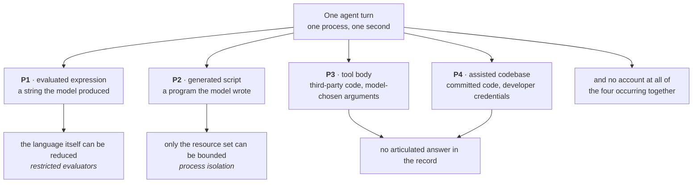
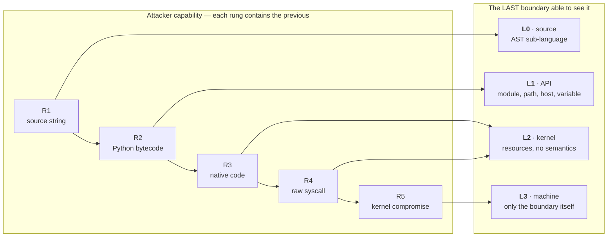
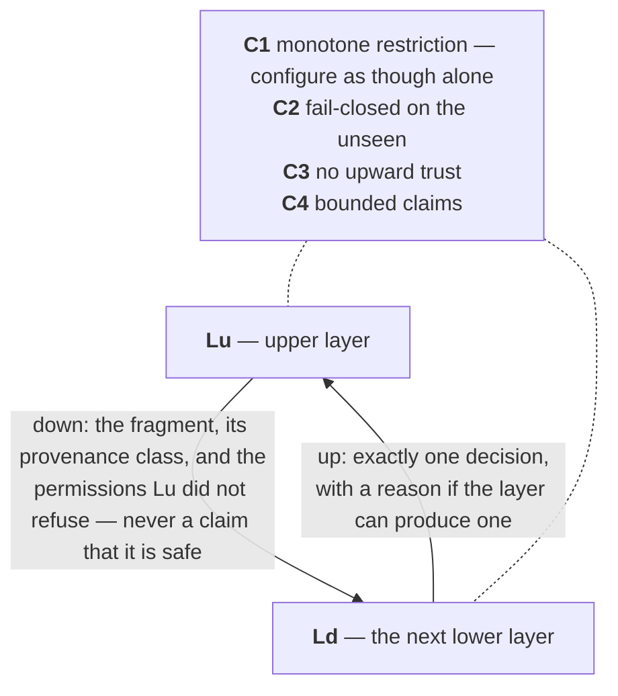
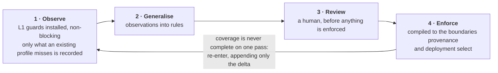
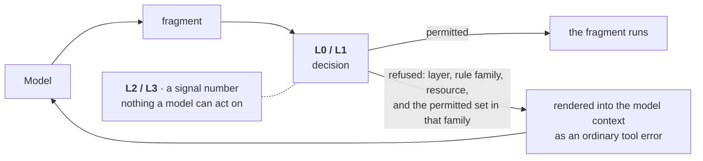

# Four Boundaries and a Contract

### Composable Confinement for Python Written by Machines — short version

**Philippe PRADOS** — [github@prados.fr](mailto:github@prados.fr) · Sept. 2026

An abridgement of `research_v3.md`, which holds the citations and the prior-art
evidence. Reference implementation:
[`py-sandboxes`](https://github.com/pprados/pysandboxes) (Apache-2.0). Paper
licensed CC BY-NC-SA 4.0.

---

## The problem

Thirty years of Python confinement produced a clear record — every mechanism
tried is defeated at some level of attacker capability, in-interpreter
confinement at a very low one — and a wrong conclusion: that one therefore wins
by picking the strongest mechanism and running everything inside it.

That fails against the workload of 2026. In one agent turn, one process, one
second, an application runs four kinds of code, and a single uniform boundary —
the fresh microVM — treats all four as equally hostile and equally opaque, so it
can neither refuse precisely nor explain why.

The code is new every time, so there is nothing to audit or pin; it arrives
mid-execution inside a process that already holds credentials, so the boundary
that matters is between *this fragment* and *the rest of the same application*;
and the dominant failure is not an attack but a model confidently doing the
wrong thing, as ordinary Python.

**Threat model.** The adversary controls fragment content and is competent at
Python; the kernel and the application's startup code are trusted. Defended:
unauthorised file access, network egress, credential reads, undeclared imports,
escape into the surrounding application. Not defended: a native-code exploit of
CPython, a kernel exploit, denial of service, semantic correctness. Out of
scope: prompt injection, supply chain, static analysis, non-Linux enforcement.

The record leaves four things open: every project picks one layer and dies
there; nobody published the interface, so "defence in depth" is an exhortation
rather than a specification; provenance is a parameter nowhere; and policy
acquisition stops inside the vocabulary of the layer that observed it.

## The reframing, and four claims

A layer is not a quantity of security. It is a *mediation boundary* with three
fixed properties — the capability class it is the last to see, the vocabulary it
can express, the way it fails — and a stack is such boundaries **plus a
contract**. Hence: there are four boundaries, characterised by capability class
rather than strength; the contract, not the layers, is the contribution; the
contract is satisfiable only from a single, observed policy; and a denial is a
typed signal that re-enters the loop which produced the code. The layer
assignment is a function of *provenance*, the backend a function of the
*deployment*.

## The stack

| | Last to see | Can say | Fails by |
|---|---|---|---|
| **L0** source | a source string (R1) | the accepted AST sub-language | permitting a construct that reaches further than it looks — silent, total |
| **L1** API | Python bytecode (R2) | module, path, host, environment variable | aliasing: the same callable under an unpatched name — silent, total |
| **L2** kernel | native code, raw syscalls (R3–R4) | resources, no semantics | configured too permissively, never bypassed — loud on refusal, silent on grant |
| **L3** machine | kernel compromise (R5) | only the boundary itself | escape, or an environment that forbids deployment — rare, absolute |

The ladder is monotone, and the "last to see" column never repeats downward:
once a class passes a boundary, no lower boundary recovers what it knew.
`ctypes.CDLL(...).unlink(path)` reaches L2 as an anonymous `unlink`; conversely
"may import `json`, not `subprocess`" is not a fact about resources and does not
exist below L1, any more than `PGPASSWORD` does. A stack with L3 but no L1 is
not strong enough to skip L1 — it has no boundary at which a module name exists.

## The composition contract

Downward flows the fragment, its provenance class, and the permissions the upper
layer did not refuse — never a claim that the fragment is safe. Upward flows
exactly one decision, with a reason if the layer can produce one.

**C1 — monotone restriction.** A layer is configured as though it were the only
layer for the class it owns, and may only remove permissions. Permitting
`subprocess` at L1 "because L2 will catch anything dangerous" delegates to a
layer structurally incapable of accepting it. Disagreements resolve by
intersection: restrictively, and loudly.

**C2 — fail-closed on the unseen.** What a layer did not explicitly permit is
refused, and an inability to decide is a refusal. This is what makes an
*incomplete* policy safe to compose.

**C3 — no upward trust.** A parent calling `pickle.loads` on a confined child's
output has negative security: the channel exists only because the boundary does.
The transport carries data, not code; tracebacks are data too.

**C4 — bounded claims.** Each layer declares the rung above which it claims
nothing, in its configuration rather than its documentation. L1's claim is: *a
fragment not attempting escape cannot reach an ungranted resource, and every
attempt is named.* No recorded escape refutes it — all are R2-or-above.

Hence a silent-total failure at L0 or L1 promotes the attacker one rung but
widens no lower policy; no layer's guarantee is conditional on another holding;
and the stack claims exactly its lowest layer's claim, never the union read as a
maximum.

## One observed artefact

Four independent configurations cannot satisfy C1: the vocabularies share no
term, so there is nothing against which the intersection can be checked, and
what operators produce is four nearly-identical sets differing where a
translation went wrong. Hence one **profile**, in resource terms, compiled
downward. Seven rule families — environment, filesystem, network, imports,
sensitive calls, dynamic code, backend selection — of which imports and dynamic
code have no kernel analogue, a fall-off that is stated rather than hidden.
Compilation **never silently downgrades**: a dropped rule reads stricter than it
is. And when a rule is expressed at one level and enforced at another, the
translation must be pinned, not repeated — resolve hostnames once at compile
time and pin the mapping inside the sandbox, or DNS and the packet filter
disagree on every load-balanced service.

Nobody can write such a profile by inspection: not the author, whose
dependencies read files he never considered; not a static analyser, because
paths are computed at runtime.

Observation runs with the weakest enforcement — one cannot learn through a wall
— and refusals must name the rule, or the operator guesses and guessing
over-grants. Acquisition is **unsound by construction**: unexercised paths are
unlearned rules, native-code accesses never cross the Python API, and learning
over hostile code learns hostile rules. None of this is fixed by observing
better. It is closed by *where enforcement sits relative to where observation
happened*: observation at L1, enforcement below it, and by C2 the lower layers
deny everything the profile does not grant — including everything observation
missed. Unsound acquisition therefore yields a profile that is too narrow, never
too wide, and too narrow fails visibly.

## Denial as a signal

Classically a denial has one consumer: a human reading a log. When the code was
generated it has a second, acting within seconds — the generator. What each
layer can hand it degrades monotonically: L0 names the construct, L1 the
resource and the permitted alternative, L2 offers `EACCES` or `SIGSYS`, L3 an
environment that simply differs from the model's assumption.

This answers the question the record leaves hanging. If the interpreter layer
cannot hold, why build it? Because some rules exist at no other boundary,
because its vocabulary is the one the profile is written in, and because it is
the layer that can say what happened. Three cautions: a refusal must project the
policy, never the environment; retries must be bounded, since a model retrying
indefinitely searches the policy boundary at machine speed; and a policy may
never be widened by the component that received the refusal.

## Provenance, deployment, and what is not claimed

| Provenance | Assumed rung | L0 | L1 | L2 | L3 |
|---|---|---|---|---|---|
| **P1** evaluated expression | R1, adversary-influenced | required | required | recommended | optional |
| **P2** generated script | R2 | n/a | required | required | by exposure |
| **P3** tool body | R3 | n/a | weak | required | recommended |
| **P4** assisted codebase | R2, non-hostile | n/a | required | recommended | rarely |

L1 is weak for P3 because a tool body carrying native code is R3 by
construction. P4 is the row the classical literature has no answer for: the
developer's machine is least willing to accept L3 and often unable to grant what
L2 wants, so the upper layers are the only layers present. No row is satisfied
by one layer. Which mechanism implements L2 or L3 is then a deployment decision
— self-restriction needs no privilege but a recent kernel *on the node*, a guest
kernel is the only answer to R5 and costs an order of magnitude, namespace
tooling buys filesystem views for capabilities many platforms refuse. **More
isolation does not mean more privilege required**, which is the argument for a
profile that outlives the decision.

Wherever a layer is a process boundary, the confined side is the untrusted side
and it speaks last; arming order is part of the contract, since imports made
after arming are charged against the profile, including the harness's own.

L0 does not claim to confine compiled code. L1 does not claim to stop an
attacker who is trying to escape. L2 does not claim language semantics, host
identity, or the environment. L3 does not claim availability or deployability.
The profile does not claim completeness: it is a lower bound on what the
workload needs and an upper bound on what it gets. No layer prevents denial of
service.

## Open tensions, and falsification

Provenance is asserted, not proven. The vocabulary gradient is also a mismatch
gradient — L1 enforces a path as written, L2 as resolved — and C1 makes each
disagreement safe without making the stack usable. C4 is checkable only if
claims are declared, and nothing validates a declared claim against behaviour.

The reference implementation establishes only that the stack is *constructible*:
six L2/L3 providers driven from one profile, published attack matrices, fourteen
samples tested against observed profiles. The claims fall, respectively, to a
lower layer enforcing alone a statement assigned here to an upper one; to a
stack satisfying C1–C4 in which one layer's failure widens another's policy; to
four independent configurations intersecting as reliably as a compiled profile;
and to measurement, if fed-back refusals do not improve the rate at which a
regenerated fragment succeeds.
