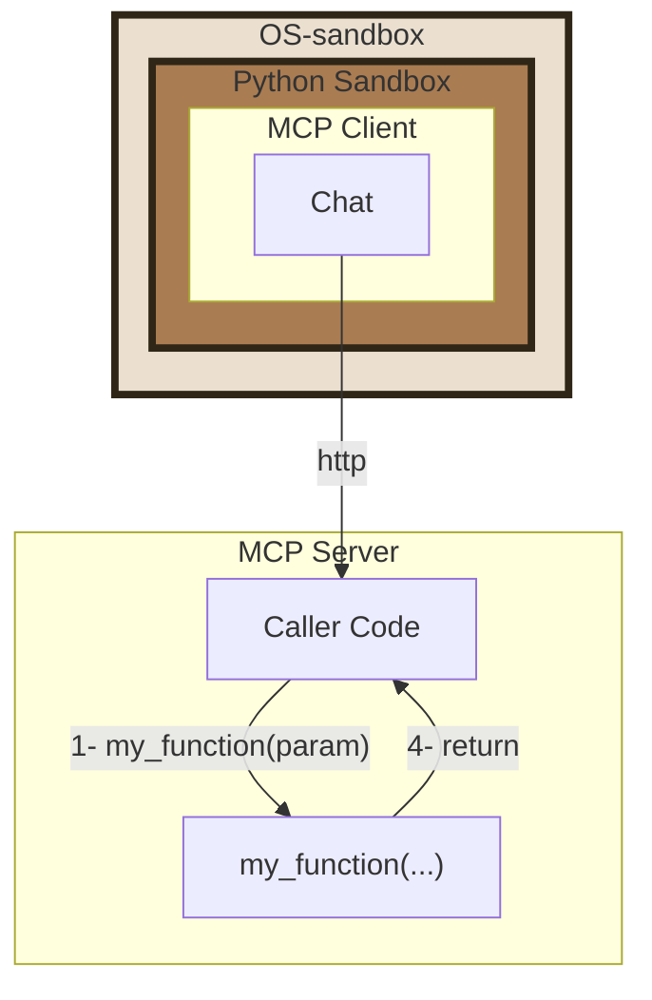
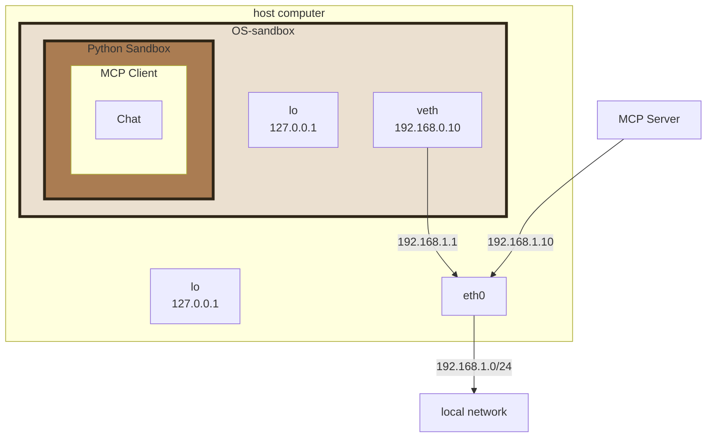
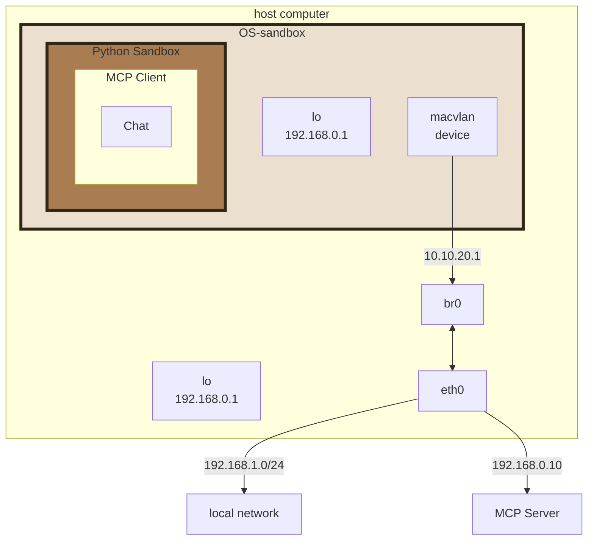

# MCP Simple Chatbot

This example demonstrates how to integrate the Model Context Protocol (MCP) into a simple CLI chatbot. It is configured to use the tools from [`../mcp-server-demo`](../mcp-server-demo/README.md) via **Py-sandboxes**.

## Installation

You must:
- Install the dependencies
- Configure the servers
- and run the MCS Client inside in a sandbox or not

### Install the dependencies:
Use uv
```bash
cd path/to/mcp-client-demo
uv sync
```
### Set up environment variables:

Create a `.env` file in the root directory and add your API key:

```plaintext
OPENAI_API_KEY=your_api_key_here
```

> **Note:** The current implementation is configured to use the [Groq API endpoint](`https://api.groq.com/openai/v1/chat/completions`) with the `llama-3.2-90b-vision-preview` model or OpenAI. If you plan to use a different LLM provider, you\'ll need to modify the `LLMClient` class in `main.py` to use the appropriate endpoint URL and model parameters and the `.env` file.

### Configure servers

The `servers_config.jsonc` follows the same structure as Claude Desktop, allowing for easy integration of multiple servers.
MCP's `stdio` mode consists of launching a child process with the MCP server. The client can then configure the launch to use different sandboxing scenarios.

Here\'s some examples. You must choice only one:

- [MCP Client use `stdio` to call MCP Server without sandboxes](#mcp-client-use-stdio-to-call-mcp-server-without-sandboxes)
- [MCP Client use `stdio` to call MCP Server with `python-sb` in complete mode](#mcp-client-use-stdio-to-call-mcp-server-with-python-sb-in-complete-mode)
- [MCP Client use `stdio` to call MCP Server in partial mode](#mcp-client-use-stdio-to-call-mcp-server-in-partial-mode)

#### MCP Client use `stdio` to call MCP Server without sandboxes

 This version allows launching the **MCP-server** in `stdio` mode, without **PY-sandboxes**.
 ```mermaid
 flowchart TD
     subgraph MCPClient ["MCP Client"]
         D[Chat]
     end

     subgraph MCPServer ["MCP Server"]

         A[Caller Code]
         C["<s>@sandbox</s><br/>my_function(...)"]
     end

     D -- "stdio" --> A
     A -- "1- my_function(param)" --> C
     C -- "4- return" --> A

 ```

Use the parameter `CONFIG='-c stdio_no_sandbox.jsonc'`

#### MCP Client use `stdio` to call MCP Server with `python-sb` in complete mode

 This version allows isolating the mcp-server in `stdio` mode, with **py-sandboxes**.

 ```mermaid
 flowchart TD
     subgraph MCPClient ["MCP Client"]
         D[Chat]
     end

     subgraph OSSandbox ["OS-sandbox"]
         direction LR
         subgraph PythonSandbox [Python Sandbox]

             subgraph MCPServer [MCP Server]
                 A[Caller Code]
                 C["<s>@sandbox</s><br/>my_function(...)"]
             end
         end
     end

     D -- "stdio" --> A
     A -- "1- my_function(param)" --> C
     C -- "4- return" --> A

     %% 🎨 Style personnalisé pour OSSandbox
     style OSSandbox fill:#ebe0d0,stroke:#2f2617,stroke-width:4px
     style PythonSandbox fill:#aa7c52,stroke:#2f2617,stroke-width:4px
 ```

Use the parameter `CONFIG='-c stdio_sandboxes_complete.jsonc'`

#### MCP Client use `stdio` to call MCP Server in partial mode

This version allows isolating a part of the **MCP server** in `stdio` mode, with **PY-sandboxes**.

 ```mermaid
 flowchart TD
     subgraph MCPClient ["MCP Client"]
         D[Chat]
     end

     subgraph MCPServer ["MCP Server"]
         subgraph WithSandboxes ["with sandboxes()"]
             A[Caller Code]
         end
     end

     subgraph OSSandbox ["OS-sandbox"]
         direction TB
         subgraph PythonSandbox [Python Sandbox]
              C["<b>@sandbox</b><br/>my_function(...)"]
         end
     end

     D -- "stdio" --> A
     A -- "1- my_function(param)" --> C
     C -- "4- return" --> A

     %% 🎨 Style personnalisé pour OSSandbox
     style OSSandbox fill:#ebe0d0,stroke:#2f2617,stroke-width:4px
     style PythonSandbox fill:#aa7c52,stroke:#2f2617,stroke-width:4px

 ```

Use the parameter `CONFIG='-c stdio_sandboxes_partial.jsonc'`

### Run the client

The client itself may or may not be in a sandbox. The configuration must allow it to invoke the server and the LLM API.

#### Without sandboxes
In this scenario, sandboxes are completely disabled for the client.

 ```mermaid
 flowchart TD
     subgraph MCPClient ["MCP Client"]
         D[Chat]
     end

     subgraph MCPServer ["MCP Server"]
        A[...]
     end

     D -- "stdio" --> A
 ```

Start with
```bash
uv run -m mcp_sample_chatbot.main ${CONFIG}
```

#### Inside a sandboxes

In this scenario, the entire MCP architecture is in an OS-sandbox. Since server invocation is done via the `stdio` protocol and subprocesses, they run in the same **OS-sandbox**. You must then configure it at the client level to keep the combined privileges of the MCP client and its MCP server.
The MCP server must be launched with `--os-sandbox=subprocess` so that there is no new encapsulated **OS-sandbox**. The MCP server can have its own **Python-sandbox** parameters if needed.
 ```mermaid
 flowchart TD
     subgraph OSSandbox ["OS-sandbox"]
         direction TB
         subgraph PythonSandbox1 [Python Sandbox]
           subgraph MCPClient ["MCP Client"]
               D[Chat]
           end
         end
         subgraph PythonSandbox2 [Python Sandbox]
             subgraph MCPServer ["MCP Server"]
                A[...]
             end
         end
     end

     D -- "stdio" --> A

     %% 🎨 Style personnalisé pour OSSandbox
     style OSSandbox fill:#ebe0d0,stroke:#2f2617,stroke-width:4px
     style PythonSandbox1 fill:#aa7c52,stroke:#2f2617,stroke-width:4px
     style PythonSandbox2 fill:#aa7c52,stroke:#2f2617,stroke-width:4px
 ```


Start with
```bash
uv run -m pysandboxes.python_sb -m mcp_sample_chatbot.main ${CONFIG}
```


### Isolated MCP client use MCP Server with `http` protocol

This version allows isolating the client with **PY-sandboxes** and invoking the MCP via the `http` protocol. The latter is isolated according to the launch parameters (see [here](../mcp-server-demo/README.md))



In this scenario, the sandbox layer must call the host ip (and not `localhost`). This is because OS-sandbox technologies isolate the environment from the host (see [here](https://firejail.wordpress.com/documentation-2/basic-usage/#direct)).



For this to work, the sandbox connects directly to your network, bypassing localhost. If your MCP server is running on the host, you need to add a bridge.

To do this:

- Run `sudo add-bridge.sh` to add a bridge named `br0`.
- Set `MY_IP` environment variable to your own *host* IP address. The `mcp_simple_chatbot/.py-sandboxes` file takes this into account.



Start with
```bash
uv run -m mcp_simple_chatbot.main -c http.jsonc
```

### Interact with the assistant

   The assistant will automatically detect available tools and can respond to queries based on the tools provided by the configured servers. Try:

   - `calc 2+3` (use tool *evaluate_expression*)
   - `load and print the <head> of www.google.fr` (use tool *fetch_webpage*)
   - `print the greating message.` (use *resource://greeting*)
   - `load and summarizes the 'readme.md' resource.` (use *resource://{path}*)

### Exit the session

   Type `quit` or `exit` to end the session.
