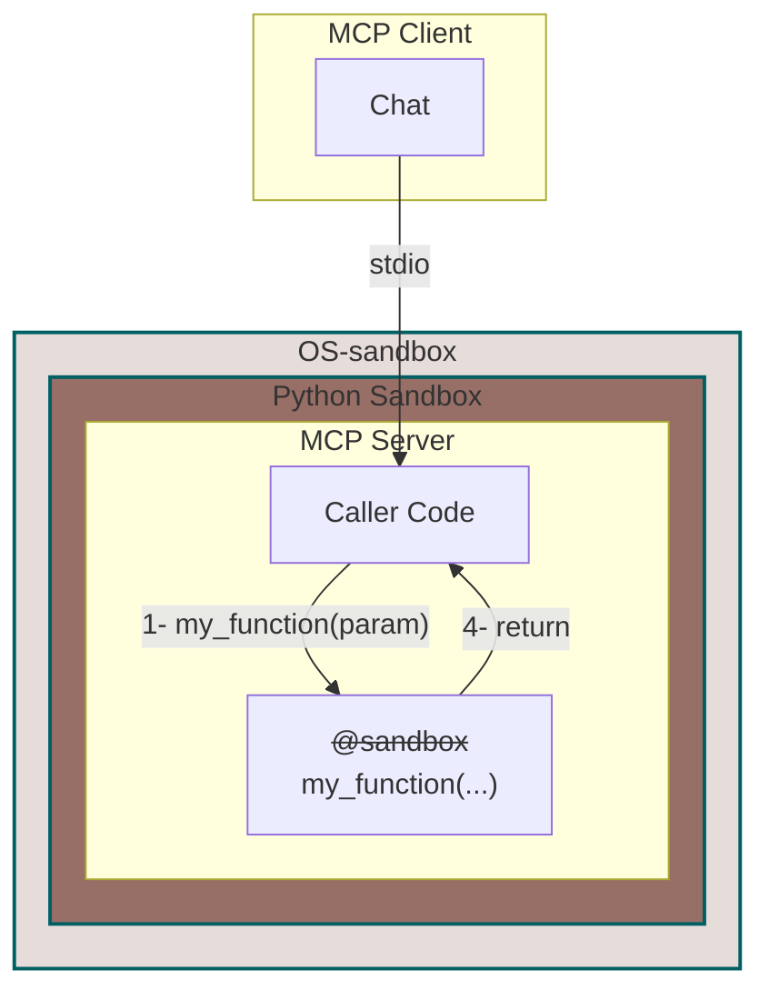
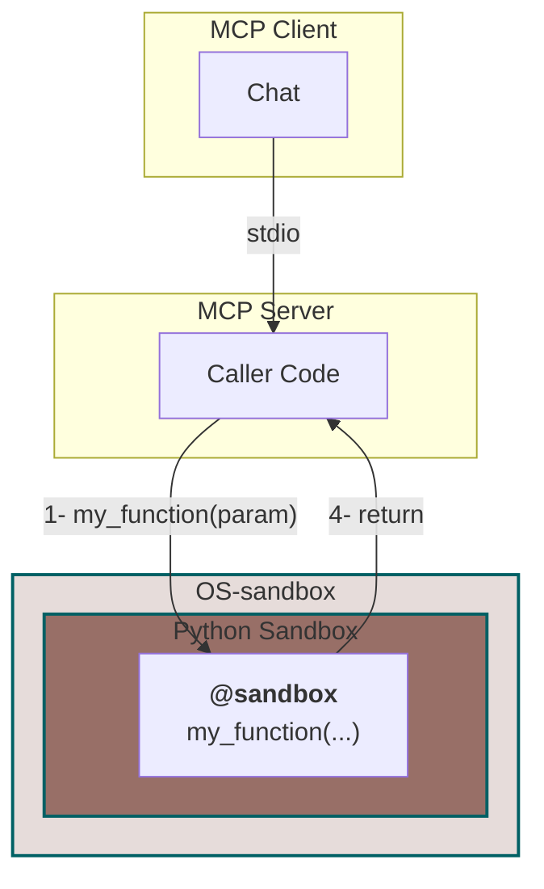
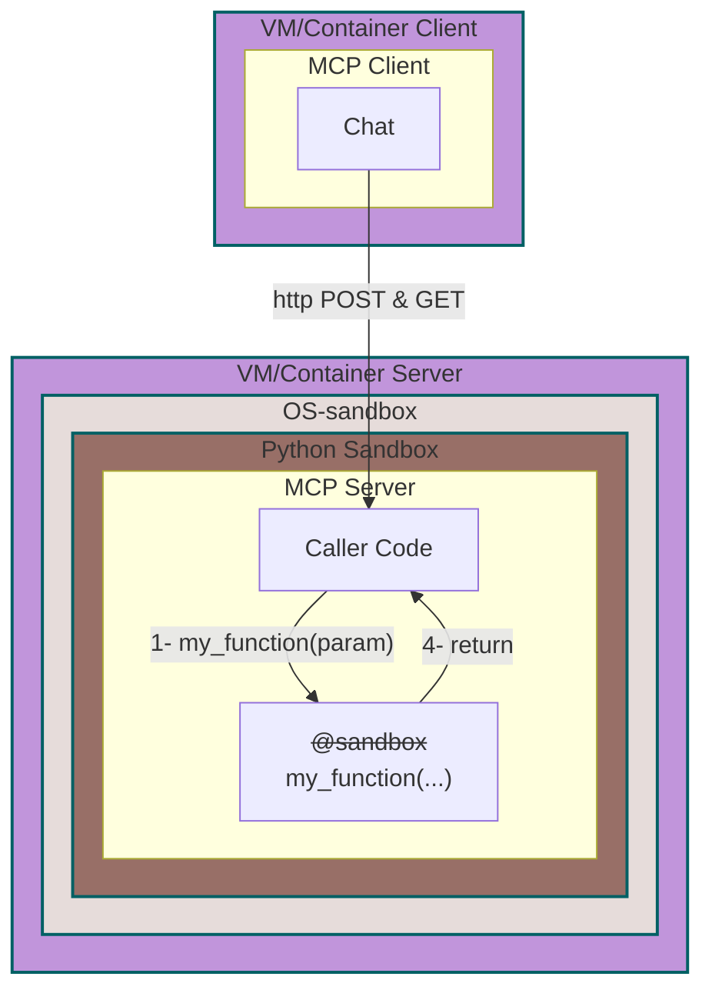
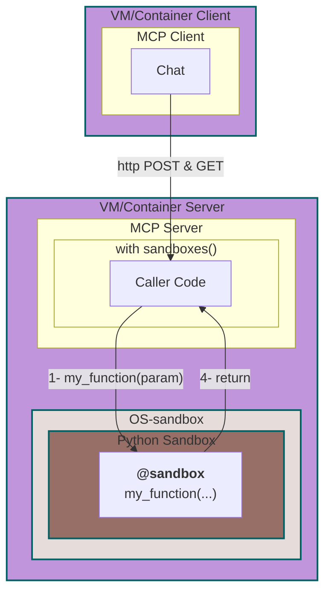

# MCP Server

Ce code est une exemple d'implémentation d'un serveur MCP
## Features

Il offrant les services suivants:
- [X] Execution de code python
- [ ] Publication de ressources venant d'un répertoire
- [ ] Navigation sur une page WEB

Cela permet de montrer la valeur ajoutée de **Py-sandboxes**. Des règles de sécurités vont permettre de limiter les capacités du serveur MCP, uniquement à l'aide d'un fichier de paramètres.

## Installation

```bash
cd path/to/mcp-server
uv sync --reinstall
```

## Usage

Comme tous serveur MCP, ce dernier peut être utilisé, soit comme un sous-processus du MCP Client (communication `stdio`), soit comme un serveur en écoute sur un port TCP.

### Complete Mode with stdio
Dans ce scénario, l'intégralité du serveur MCP est sous le controle de **Py-sandboxes**. L'annotation `@sandbox` est ignorée.

Pour lancer ce MCP serveur, ajoutez cette ligne dans les paramètres de votre client, depuis le répertoire du serveur.
```bash
# Add this command line in the paramater of the MCP client
uv run -m mcp_server.main -t stdio
```
### Partial Mode with stdio
Dans ce scénario, une partie du serveur MCP est sous le controle de **py-sandboxes**. Le client invoque le serveur MCP, dont une partie s'exécute dans un bac-à-sable (annotation `@sandbox`). 


### Complete mode with streamable-http
Dans ce scénario, le serveur doit être lancé avant le client. Il expose un end-point HTTP, pour permettre au client de s'y connecter.



```bash
cd path/to/mcp-server
uv run -m mcp_server.main -t streamable-http --port 3001
```

### Partial mode with streamable-http
Dans ce scénario, le serveur doit être lancé avant le client. Il expose un end-point HTTP, pour permettre au client de s'y connecter. Lui même est découpé en deux partie (annotation `@sandbox`).



```bash
cd path/to/mcp-server
uv run -m mcp_server.main -t streamable-http --port 3001
```

## Client
Pour le client, consultez la documentation spécifique. Par exemple, [ici](../mcp-client/README.md)
