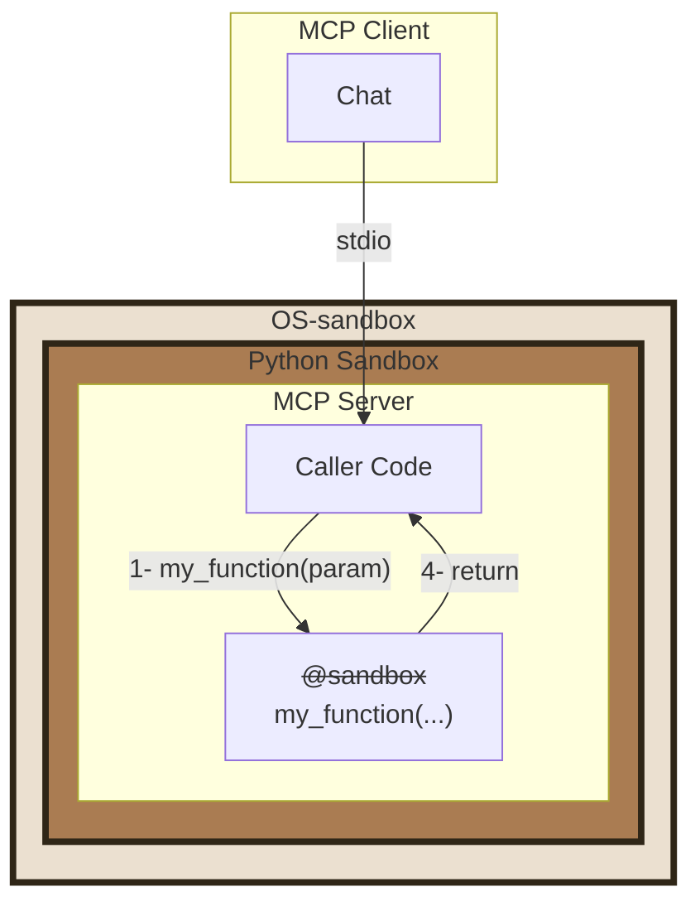
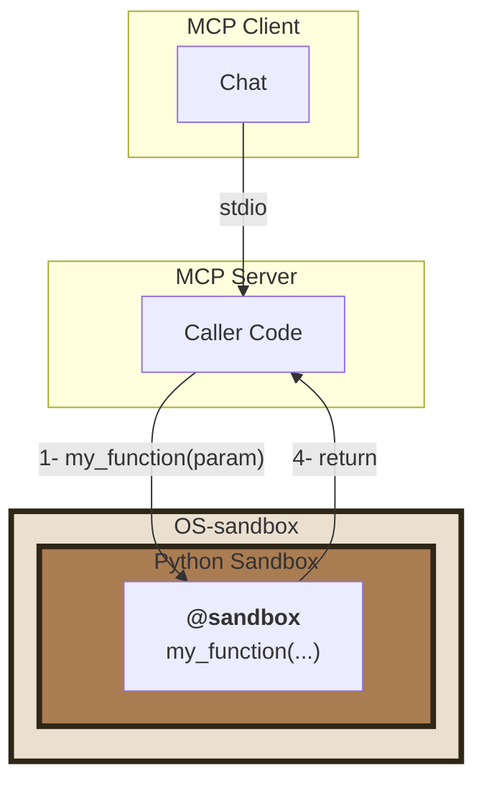
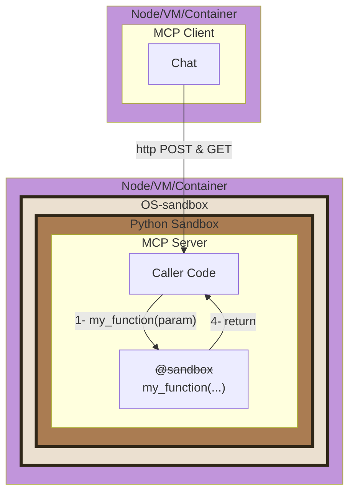
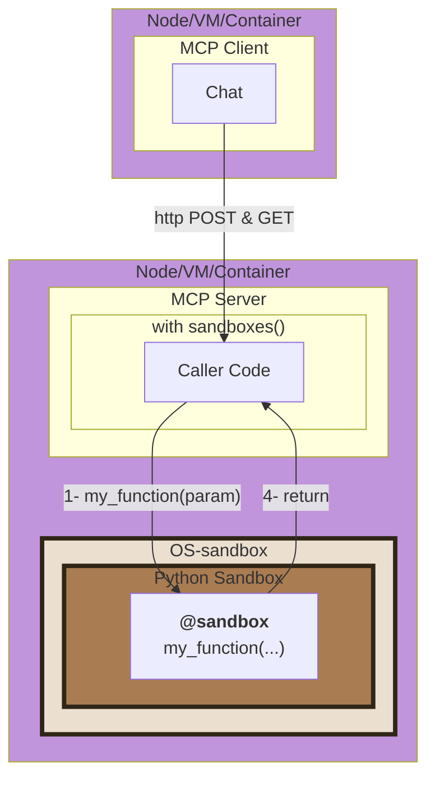
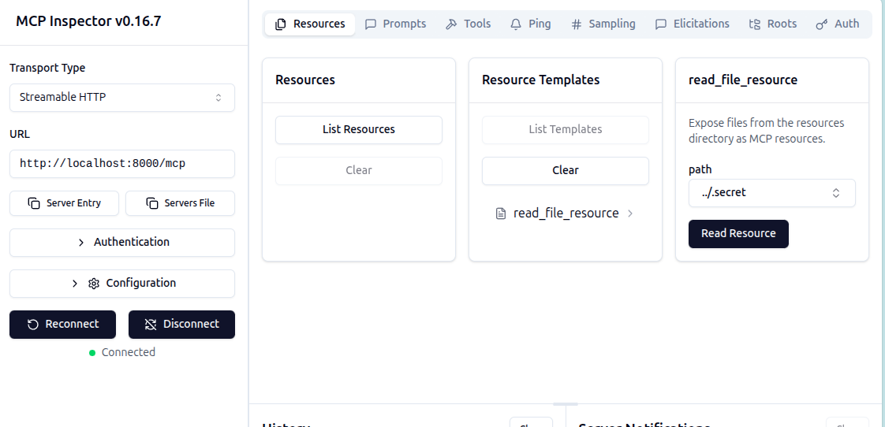
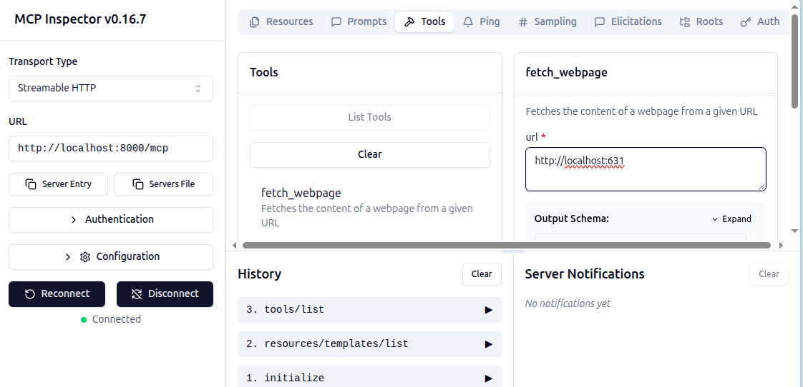
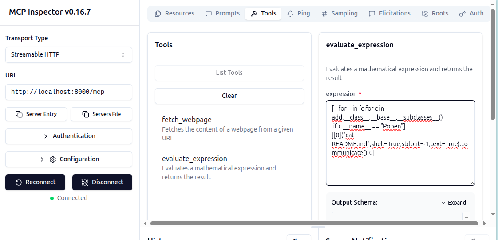
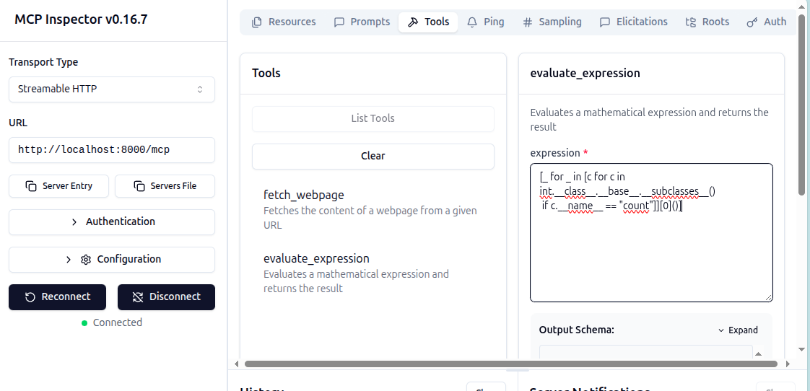

# MCP Server

This code is an example implementation of an MCP server.

## Features

It offers the following services:
- [X] Python code execution (tool `evaluate_expression`)
- [X] Browsing a WEB page (tool `fetch_webpage`)
- [X] Publishing resources from the directory  ̀./resources`
- [X] Expose a prompt (`analyze_data`)

This demonstrates the added value of **Py-sandboxes**. Security rules will limit the capabilities of the MCP server, using only a parameter file.

## Installation

```bash
cd path/to/mcp-server
uv sync --reinstall
```

## Usage

Like any MCP server, this one can be used either as a subprocess of the MCP Client (`stdio` communication) or as a server listening on a TCP port.

### Complete Mode with stdio
In this scenario, the entire MCP server is under the control of **Py-sandboxes**. The `@sandbox` annotation is ignored.

To launch this MCP server, add this line to your client's parameters, from the server's directory.
```bash
# Add this command line in the parameter of the MCP client
uv run -m mcp_server.main -t stdio
```
For example, for [claude-code](https://claude.com/product/claude-code), invoke:
```bash
claude mcp remove mcp_demo
claude mcp add mcp_demo -- uv run -m mcp_server.main -t stdio
```
or use the [MCP client](../mcp-client/README.md).

### Partial Mode with stdio
In this scenario, part of the MCP server is under the control of **py-sandboxes**. The client invokes the MCP server, part of which runs in a sandbox (`@sandbox` annotation). 


To launch this MCP server, add this line to your client's parameters, from the server's directory.
```bash
# Add this command line in the parameter of the MCP client
uv run -m mcp_server.main -t stdio
```

For example, for [claude-code](https://claude.com/product/claude-code), invoke:
```bash
claude mcp remove mcp_demo
claude mcp add mcp_demo -- uv run -m mcp_server.main -t stdio
```
or use the [MCP client](../mcp-client/README.md).

### Complete mode with http
In this scenario, the server must be started before the client. It exposes an HTTP endpoint to allow the client to connect to it.



To start the MCP server:
```bash
cd path/to/mcp-server
uv run -m pysandboxes.python_sb -m mcp_server.main -t http
```
and add the parameter in the client.
For example, for [claude-code](https://claude.com/product/claude-code), invoke:
```bash
claude mcp remove mcp_demo
claude mcp add --transport http mcp_demo http://localhost:8000/mcp
```

### Partial mode with http
In this scenario, the server must be started before the client. It exposes an HTTP endpoint to allow the client to connect to it. It is itself divided into two parts (`@sandbox` annotation).


To start the MCP server:
```bash
cd path/to/mcp-server
uv run -m mcp_server.main -t http
```
and add the parameter in the client.
For example, for [claude-code](https://claude.com/product/claude-code), invoke:
```bash
claude mcp remove mcp_demo
claude mcp add --transport http mcp_demo http://localhost:8000/mcp
```

## Client
For the client, consult the specific documentation. For example, [here](../mcp-client/README.md) or use the [MCP Inspector](https://modelcontextprotocol.io/docs/tools/inspector).

Without sandbox, you can try 

- a *Path Traversal*



`./.secret` or `file:///etc/passwd`

- a *Server-Side Request Forger*



`http://localhost:636` for cups.

- a *Remote Code Execution*



```python
[_ for _ in [c for c in add.__class__.__base__.__subclasses__()
 if c.__name__ == "Popen"]
][0]("cat README.md",shell=True,stdout=-1,text=True).communicate()[0]
```

- a *Deni of services*



```python
[_ for _ in [c for c in add.__class__.__base__.__subclasses__()
 if c.__name__ == "count"]][0]()]
```
## With claude-code
To use the tool `evaluate_expression`:
```bash
claude
> use evaluate_expression to calc 2+3 

● mcp_demo - evaluate_expression (MCP)(expression: "2+3")
  ⎿  5                                                                                                                                                                   

● 5
```

To use the prompt `analyze_data`:
```bash
claude
> /mcp_demo:analyze_data (MCP) 2+3
```
