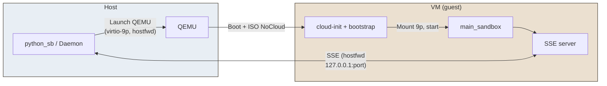
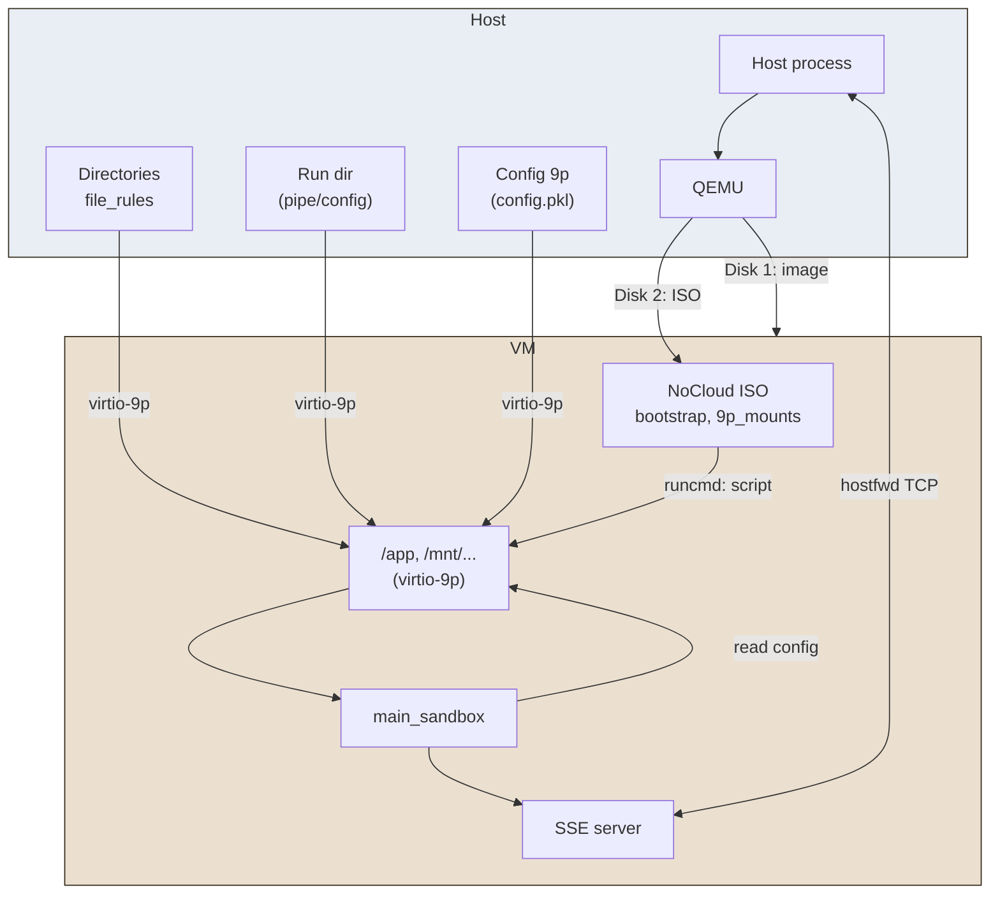

# QEMU

**QEMU** is an **OS-sandbox** provider that runs code inside a virtual machine, using KVM when available or full CPU emulation otherwise. It works in constrained environments (e.g. unprivileged containers) and does not require host privileges.

## Solution in brief

The host starts a QEMU virtual machine with a cloud image (Debian/Ubuntu) and a NoCloud ISO containing the bootstrap script. Allowed directories (file rules, Python execution environment) are exposed to the VM via **Virtio-9p**. The VM boots, mounts these shares, runs `main_sandbox` which reads the configuration (file or named pipe) and starts the SSE server. The host talks to the VM via **hostfwd** (TCP redirection) on `127.0.0.1:port`. No HTTP server or file copies on the host: everything goes through 9p and the SSE channel.

## Advantages


| Aspect                             | Detail                                                                                                                      |
| ---------------------------------- | --------------------------------------------------------------------------------------------------------------------------- |
| **Isolation**                      | Full VM: separate kernel, disk and network; usable in constrained environments (e.g. unprivileged containers).              |
| **Compatibility**                  | Works with or without KVM (CPU emulation when KVM is unavailable).                                                          |
| **No privileges**                  | No root required on the host to run QEMU (user-mode).                                                                       |
| **Disk/network rules**             | Fine-grained control via Py-sandboxes rules; disk/network access can be restricted (e.g. iptables) even inside a container. |
| **Alignment with other providers** | Same API (SSE, `call_in_sandbox`) and config flow (named pipe or 9p file) as bwrap/unshare.                                 |


## Disadvantages


| Aspect              | Detail                                                                                                                        |
| ------------------- | ----------------------------------------------------------------------------------------------------------------------------- |
| **Startup latency** | VM boot + cloud-init + bootstrap: typically **20–40 s** before the sandbox responds (vs. about a second for a subprocess).    |
| **Resources**       | Dedicated RAM for the VM (default 2 GiB), shared CPU; heavier than a namespace.                                               |
| **Dependencies**    | Cloud image to download (Debian/Ubuntu), `genisoimage` or `mkisofs` for the NoCloud ISO, QEMU binary.                         |
| **Debug**           | Kernel/cloud-init output is hidden by default; set `qemu.show_boot_console=true` and inspect the console log to troubleshoot. |


## How it works

1. **Host**: On first use (or when the daemon starts), the VM image is checked or downloaded and the NoCloud ISO is built (bootstrap script, 9p mount list, Python version, config path).
2. **QEMU launch**: The host runs QEMU with the system image, the NoCloud ISO as a second disk, and one **virtio-9p** option per directory to expose (file rules → `/app`, execution dir, run dir, optional config dir). Network: `-nic user,hostfwd=tcp::PORT:PORT` to forward the SSE port from host to VM.
3. **Inside the VM**: cloud-init runs the bootstrap script, which mounts the cidata (ISO), loads 9p modules, mounts each 9p tag at the given path, checks the Python version (no install), then runs `python -m pysandboxes.remote.main_sandbox --_named-pipe <config>` (or 9p config file path).
4. **In the guest**: `main_sandbox` loads the config (from the pipe or 9p file), applies Python guards, starts the SSE server on the expected port and waits for requests.
5. **Communication**: The host sends calls over SSE to `http://127.0.0.1:PORT/...`; traffic goes through QEMU hostfwd to the server inside the VM.

Simplified diagram (overall flow):




Detailed diagram (mounts and config flow):




In short: the host does not run an HTTP server or copy files; the VM receives everything via 9p and config via named pipe or 9p file, and the host talks to the sandbox only over SSE on the forwarded port.

For more details, see the [QEMU documentation](https://www.qemu.org/).

> Set `qemu.show_boot_console=true` in the profile to show the full VM console on the host (boot, cloud-init, bootstrap) and tee it to `PYSANDBOXES_QEMU_CONSOLE_LOG` (default: `.pysandbox-qemu-console.log`). With `qemu.show_boot_console=false` (default), the host only prints Python output between the guest sentinels. Use `PYSANDBOXES_GUEST_DIAG=1` in the guest environment for `[PYSANDBOX_DIAG]` breadcrumbs and faulthandler in `main_sandbox` (narrow where a crash happens after `main()` starts).

### Guest Python exits with segmentation fault

The guest is supposed to run the **same** interpreter as the host (path written to `python_exe` on the NoCloud image), with `PYTHONPATH` listing 9p-mounted host trees. If a 9p mount fails (see `[pysandbox-9p]` in the console) but the script fell back to the **image’s** `/usr/local/bin/python3.13`, native extensions under host `site-packages` can load with the wrong libc and **SIGSEGV**. The bootstrap script now stops with an explicit error if the recorded host `python_exe` path is missing after mounts. Fix: ensure execution-directory mounts succeed, or rebuild the QEMU image / nocloud ISO after changing mounts.

A **segfault during `import pysandboxes.remote.main_sandbox`** (before `main()` runs) was also traced to pulling the whole guard stack at import time (`daemon_parameters` importing `all_rules`, plus heavy module-level imports in `main_sandbox`). Those imports are now deferred so the guest can start the module with minimal dependencies.

## Using with Docker

The QEMU provider is compatible with Docker. The project uses **one image per OS provider**: the image for QEMU is `python-sb-qemu` (tagged e.g. `:latest` or `:3.12`). Build it from the project root with:

```bash
make build-image-qemu
```

Then run with the code mounted and the provider image. Starting a virtual machine is much longer than a simple process.

```bash
docker \
  run -it --rm \
    -v "$(pwd)":/app \
    -w /app \
    --device /dev/kvm \
    python-sb-qemu:latest \
    sh -c 'pip install -e . && OS_SANDBOX=qemu python-sb -m tests.integration_tests.tst_usage'
```

Use `--device /dev/kvm` when available for acceleration; otherwise QEMU falls back to TCG emulation.

## Using with Podman

Use the same provider image as for Docker:

```bash
make build-image-qemu
```

```bash
podman \
  run -it --rm \
    -v "$(pwd)":/app \
    -w /app \
    --device /dev/kvm \
    python-sb-qemu:latest \
    sh -c 'pip install -e . && OS_SANDBOX=qemu python-sb -m tests.integration_tests.tst_usage'
```

## Using with Kubernetes

Use the **provider image** `python-sb-qemu:latest` (built with `make build-image-qemu`). For minikube, build images in the cluster's Docker daemon: `eval $(minikube docker-env)` then `make build-images` (or `make build-image-qemu` for this provider only).

Running QEMU inside a Kubernetes pod typically requires access to KVM (`/dev/kvm`) and sufficient resources; not all clusters support nested virtualization. Example Pod: same structure as for unshare (see [unshare.md](unshare.md#using-with-kubernetes)), with `image: python-sb-qemu:latest`, and add a `device` mount for `/dev/kvm` if the node provides it. The container test suite skips the QEMU provider on Kubernetes by default (no QEMU/KVM in the test pod).

## Image and Python version

The default image is **Debian 12 (bookworm)** and provides Python 3.11. For **one image per Python version from 3.10 onward**, use **Ubuntu Cloud Images** (table below).

Set the URL of the chosen image:

```bash
export PYSANDBOXES_QEMU_IMAGE_URL="<full image URL>"
```

### Mapping: Python version → image (Ubuntu, 3.10 to 3.13)

A single source covers 3.10, 3.11, 3.12 and 3.13 with one image per version: **Ubuntu Cloud Images**.


| Python | Ubuntu            | File (.img)                               | Base URL (release)                                        |
| ------ | ----------------- | ----------------------------------------- | --------------------------------------------------------- |
| 3.10   | 22.04 LTS (Jammy) | `ubuntu-22.04-server-cloudimg-<arch>.img` | `https://cloud-images.ubuntu.com/releases/22.04/release/` |
| 3.11   | 23.04 (Lunar)     | `ubuntu-23.04-server-cloudimg-<arch>.img` | `https://cloud-images.ubuntu.com/releases/23.04/release/` |
| 3.12   | 24.04 LTS (Noble) | `ubuntu-24.04-server-cloudimg-<arch>.img` | `https://cloud-images.ubuntu.com/releases/24.04/release/` |
| 3.13   | 25.04 (Plucky)    | `ubuntu-25.04-server-cloudimg-<arch>.img` | `https://cloud-images.ubuntu.com/releases/25.04/release/` |


Replace `<arch>` with `amd64`, `arm64`, `ppc64el`, `riscv64` or `s390x` for your platform.

**Full URL examples (amd64):**

- Python 3.10: `https://cloud-images.ubuntu.com/releases/22.04/release/ubuntu-22.04-server-cloudimg-amd64.img`
- Python 3.11: `https://cloud-images.ubuntu.com/releases/23.04/release/ubuntu-23.04-server-cloudimg-amd64.img`
- Python 3.12: `https://cloud-images.ubuntu.com/releases/24.04/release/ubuntu-24.04-server-cloudimg-amd64.img`
- Python 3.13: `https://cloud-images.ubuntu.com/releases/25.04/release/ubuntu-25.04-server-cloudimg-amd64.img`

**Alternative: Debian** (project default image, 3.11 only without extra config):

- Bookworm: `https://cloud.debian.org/images/cloud/bookworm/latest/debian-12-generic-amd64.qcow2`
- For 3.9 or 3.13 with Debian: Bullseye or Trixie (see [cloud.debian.org](https://cloud.debian.org/images/cloud/)).

## Configuration parameters

You can add QEMU-specific options in `.py-sandboxes`. Any line of the form `qemu.<option>=<value>` is passed to the QEMU process as `--<option>=<value>` when the VM is started.

### Memory (qemu.memory)

The VM needs enough RAM to boot the cloud image and run Python. **Default: 2048** (2 GiB). Lower values (e.g. 512) can cause out-of-memory during boot or when starting Python.

Examples in `.py-sandboxes`:

- `qemu.memory=2048` — 2 GiB (default, recommended)
- `qemu.memory=2G`  — same, QEMU accepts `G`/`M` suffix
- `qemu.memory=4096` — 4 GiB for heavier workloads

