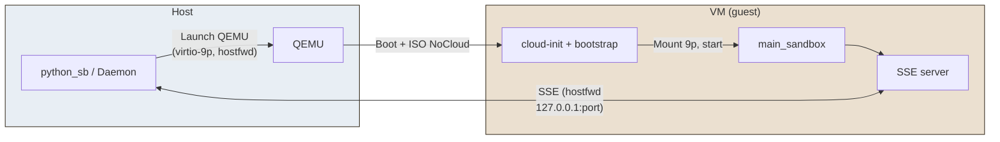
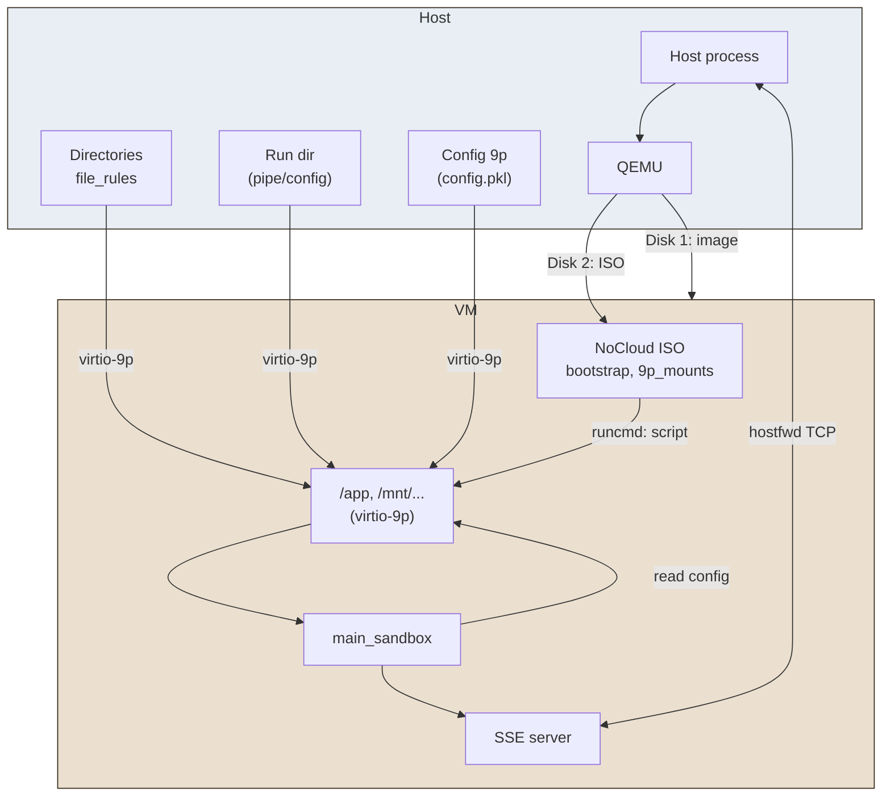

# QEMU

**QEMU** is an **OS-sandbox** provider that runs code inside a virtual machine, using KVM when available or full CPU emulation otherwise. It works in constrained environments (e.g. unprivileged containers) and does not require host privileges.

## Solution in brief

The host starts a QEMU virtual machine with a cloud image (Debian/Ubuntu) and a NoCloud ISO containing the bootstrap script. Allowed directories (file rules, Python execution environment) are exposed to the VM via **Virtio-9p**. The VM boots, mounts these shares, runs `main_sandbox` which reads the configuration (file or named pipe) and starts the SSE server. The host talks to the VM via **hostfwd** (TCP redirection) on `127.0.0.1:port`. No HTTP server or file copies on the host: everything goes through 9p and the SSE channel.

## Advantages


| Aspect                             | Detail                                                                                                                      |
| ---------------------------------- | --------------------------------------------------------------------------------------------------------------------------- |
| **Isolation**                      | Full VM: separate kernel, disk and network; usable in constrained environments (e.g. unprivileged containers).              |
| **Compatibility**                  | Works with or without KVM (CPU emulation when KVM is unavailable).                                                          |
| **No privileges**                  | No root required on the host to run QEMU (user-mode).                                                                       |
| **Disk/network rules**             | Fine-grained control via Py-sandboxes rules; disk/network access can be restricted (e.g. iptables) even inside a container. |
| **Alignment with other providers** | Same API (SSE, `call_in_sandbox`) and config flow (named pipe or 9p file) as bwrap/unshare.                                 |


## Disadvantages


| Aspect              | Detail                                                                                                                        |
| ------------------- | ----------------------------------------------------------------------------------------------------------------------------- |
| **Startup latency** | VM boot + cloud-init + bootstrap: typically **20–40 s** before the sandbox responds (vs. about a second for a subprocess).    |
| **Resources**       | Dedicated RAM for the VM (default 2 GiB), shared CPU; heavier than a namespace.                                               |
| **Dependencies**    | Cloud image to download (Debian/Ubuntu), `genisoimage` or `mkisofs` for the NoCloud ISO, QEMU binary.                         |
| **Debug**           | Kernel/cloud-init output is hidden by default; set `qemu.show_boot_console=true` and inspect the console log to troubleshoot. |


## How it works

1. **Host**: On first use (or when the daemon starts), the VM image is checked or downloaded and the NoCloud ISO is built (bootstrap script, 9p mount list, Python version, config path).
2. **QEMU launch**: The host runs QEMU with the system image, the NoCloud ISO as a second disk, and one **virtio-9p** (`-virtfs local,…`) option per directory to expose (file rules → `/app`, execution dir, run dir, optional config dir). Network: `-nic user,hostfwd=tcp::PORT-:PORT,model=virtio-net-pci` to forward the SSE port from host to VM. A **virtio-serial** + **guest-agent** port is also attached for tooling compatibility.
3. **Inside the VM**: cloud-init runs the bootstrap script, which mounts the cidata (ISO), loads 9p modules, mounts each 9p tag at the given path, checks the Python version (no install), then runs `python -m pysandboxes.remote.main_sandbox --_named-pipe <config>` (or 9p config file path).
4. **In the guest**: `main_sandbox` loads the config (from the pipe or 9p file), applies Python guards, starts the SSE server on the expected port and waits for requests.
5. **Communication**: The host sends calls over SSE to `http://127.0.0.1:PORT/...`; traffic goes through QEMU hostfwd to the server inside the VM.

Simplified diagram (overall flow):




Detailed diagram (mounts and config flow):




In short: the host does not run an HTTP server or copy files; the VM receives everything via 9p and config via named pipe or 9p file, and the host talks to the sandbox only over SSE on the forwarded port.

For more details, see the [QEMU documentation](https://www.qemu.org/).

> Set `qemu.show_boot_console=true` in the profile to show the full VM console on the host (boot, cloud-init, bootstrap) and tee it to `.pysandbox-qemu-console.log` in the process working directory. With `qemu.show_boot_console=false` (default), the host only prints Python output between the guest sentinels. The same flag enables **`[PYSANDBOX_DIAG]`** stderr breadcrumbs and **faulthandler** inside the QEMU guest’s `main_sandbox` after config load (helps narrow crashes after `main()` starts); there is no separate guest-only knob.
>
> **pytest + nested Podman:** default capture can swallow serial output that would otherwise go to the child’s stdout/stderr. The container test redirects nested `podman`/`docker` output to the **controlling TTY** when possible so QEMU lines appear live; set `CONTAINER_TEST_NO_CTTY=1` to inherit fds (e.g. CI). With `show_boot_console=true`, the forwarder also flushes on carriage returns (`\r`) so apt/cloud-init progress is not silent until the next newline.

### Guest Python exits with segmentation fault

The guest is supposed to run the **same** interpreter as the host (path written to `python_exe` on the NoCloud image), with `PYTHONPATH` listing 9p-mounted host trees. If a 9p mount fails (see `[pysandbox-9p]` in the console) but the script fell back to the **image’s** `/usr/local/bin/python3.13`, native extensions under host `site-packages` can load with the wrong libc and **SIGSEGV**. The bootstrap script now stops with an explicit error if the recorded host `python_exe` path is missing after mounts. Fix: ensure execution-directory mounts succeed, or rebuild the QEMU image / nocloud ISO after changing mounts.

A **segfault during `import pysandboxes.remote.main_sandbox`** (before `main()` runs) was also traced to pulling the whole guard stack at import time (`daemon_parameters` importing `all_rules`, plus heavy module-level imports in `main_sandbox`). Those imports are now deferred so the guest can start the module with minimal dependencies.

## Using with Docker

The QEMU provider is compatible with Docker. The project uses **one image per OS provider**: the image for QEMU is `python-sb-qemu` (tagged e.g. `:latest` or `:3.12`). Build it from the project root with:

```bash
make build-image-qemu
```

Then run with the code mounted and the provider image. Starting a virtual machine is much longer than a simple process.

```bash
docker \
  run -it --rm \
    -v "$(pwd)":/app \
    -w /app \
    --device /dev/kvm \
    python-sb-qemu:latest \
    sh -c 'pip install -e . && OS_SANDBOX=qemu python-sb -m tests.integration_tests.tst_usage'
```

Use `--device /dev/kvm` when available for acceleration; otherwise QEMU falls back to TCG emulation.

## Using with Podman

Use the same provider image as for Docker:

```bash
make build-image-qemu
```

```bash
podman \
  run -it --rm \
    -v "$(pwd)":/app \
    -w /app \
    --device /dev/kvm \
    python-sb-qemu:latest \
    sh -c 'pip install -e . && OS_SANDBOX=qemu python-sb -m tests.integration_tests.tst_usage'
```

### QEMU inside Docker/Podman (nested): overlay + virtio-9p

If **`python-sb`** runs **inside** a container (e.g. `python-sb-qemu`) and the **QEMU** guest maps the **same** interpreter and `site-packages` via **virtio-9p**, paths that live on the **container overlay** can cause **SIGSEGV** in the guest when **ELF** / **`.so`** files are **mmap**-ed (exit code **139**).

**Mitigation (default):** when the process detects a container (`/.dockerenv`, `/.containerenv`, or `container` in the environment), **pysandboxes** copies the **Python execution directories** (`pysb_exec_*` mounts only) into the run directory under **`/tmp`** (typically **tmpfs**, not overlay) before starting QEMU, then points **`-virtfs`** at those copies. **Guest paths** (`/usr/local/bin`, etc.) are unchanged. Staging can also copy **`/etc`** and the **dynamic linker closure** when needed so nested runs stay consistent. The exec-tree **copytree** skips bulky or fragile names (e.g. **`.venv`**, **`.git`**, **`samples`**, **`.cursor`**, **`.claude`**, other tool dirs) so **minikube mount** / overlay paths do not exhaust memory or hit **OSError** 526 on individual files; the guest still gets **`pysandboxes/`**, **`tests/`**, and other sources needed for typical runs.

Profile knobs **`qemu.virtfs`** and **`qemu.virtfs_security_model`** are documented in [Configuration parameters](#configuration-parameters) above.

**iptables / unprivileged Podman:** the outer Podman can stay **unprivileged**; **iptables** inside the **guest VM** (see profile rules) applies in the VM’s network namespace, not on the host. You still need **no extra capability** on the host for QEMU beyond what a normal user can use (e.g. `qemu-system-*` with `kvm` or TCG). **Nested KVM** (`--device /dev/kvm` in the container) is optional and accelerates the guest; without it, TCG is slower but staging should still avoid the segfault.

**Host-side pipe handling:** `python-sb` no longer uses `readline()` on QEMU’s serial streams (a line without `\n` could block the host forever). It reads in chunks, splits on `\n`, and runs **`asyncio.gather`** on stdout drain, stderr drain, and **`process.wait()`** so a full **PIPE** buffer cannot deadlock QEMU’s writer.

**Stdin:** QEMU is started with **`stdin` closed to `/dev/null`**. With **`-nographic`**, serial I/O is tied to stdio; if QEMU **inherited** a TTY from **`podman run -it`**, it could **block forever** waiting for console input while the guest is unattended. Closing stdin avoids that hang.

**`/lib` overlay vs. bootstrap:** staging mounts the host’s **`/lib/<triplet>`** (Debian multiarch, e.g. **`x86_64-linux-gnu`**) over the guest. By default (**`qemu.ld_closure_libs=full`**), the staged tree includes the **entire** host **`/lib/<triplet>`** and **`/usr/lib/<triplet>`** so arbitrary Python extension modules find their DSOs without maintaining a whitelist. With **`qemu.ld_closure_libs=sparse`**, only the transitive **`ldd`** closure of the interpreter and bootstrap utilities is copied, plus a small compat seed list — a **minimal** closure can still omit e.g. **`libselinux.so.1`**, **`libz.so.1`**, etc., so bootstrap or **`import`** may fail until you switch back to **`full`** or extend seeds.

For diagnosis, set **`qemu.show_boot_console=true`** and inspect bootstrap lines before any crash.

## Using with Kubernetes

Use the **provider image** `python-sb-qemu:latest` (built with `make build-image-qemu`). For minikube, build the images on the host and load them into the cluster: `make minikube-build-images` (runs `make build-images`, then `minikube image load` for each image). For this provider only: `make build-image-qemu` then `minikube image load python-sb-qemu:latest`.

**KVM vs TCG:** with the default **`qemu.use_kvm=true`**, the daemon adds **`-enable-kvm`** only when **`/dev/kvm`** exists and is readable; otherwise it omits that flag and QEMU runs in **TCG**. Use **`qemu.use_kvm=false`** only when you must never attempt KVM (e.g. policy), even if the device appears.

**KVM in the pod (optional):** same pod shape as for unshare (see [unshare.md](unshare.md#using-with-kubernetes)) with **`image: python-sb-qemu:latest`**; add a device mount for **`/dev/kvm`** if the node provides nested virtualization and policy allows it.

**`test_container_kubernetes`:** parametrized with **unshare** and **qemu** (same integration profile). Without **`/dev/kvm`**, QEMU uses TCG automatically. Exec timeout for the **qemu** case defaults to **`K8S_QEMU_EXEC_TIMEOUT=900`** (seconds); **unshare** uses **`TIMEOUT`** (default 120s). **`kubectl exec`** streams to the terminal (no captured pipes — avoids buffer deadlock and long silences during TCG). Use **`pytest -s`** for live output if pytest captures stdout; **`CONTAINER_TEST_HEARTBEAT_SEC`** (default 60) emits DEBUG heartbeats while exec runs.

## Image and Python version

The default image is **Debian 12 (bookworm)** and provides Python 3.11. For **one image per supported Python version, 3.11 through 3.14**, use **Ubuntu Cloud Images** (table below).

Image resolution uses environment variables (see `pysandboxes.remote.qemu_image`):

- **`PYSANDBOXES_QEMU_IMAGE_URL`** — full URL to a single image file (highest priority when set).
- **`PYSANDBOXES_QEMU_IMAGE_BASE_URL`** — base URL; the client completes the filename from Python version and architecture when no full URL is set.
- **`PYSANDBOXES_VM_IMAGES_DIR`** — directory where downloaded images are stored (default: `$XDG_DATA_HOME/vm-images` or `~/.local/share/vm-images`).

Example:

```bash
export PYSANDBOXES_QEMU_IMAGE_URL="<full image URL>"
```

### Mapping: Python version → image (Ubuntu, 3.11 to 3.14)

A single source covers every supported version, 3.11–3.14, with one image each: **Ubuntu Cloud Images**, all under `releases/<version>/release/`. Python 3.13 and 3.14 share **25.04**.

Only **released** images are mapped, never a development codename. Staging mounts the host's `/lib/<triplet>` over the guest (see `qemu.ld_closure_libs` above), so the guest's own coreutils and cloud-init run against the **host's** glibc: the guest release must be no newer than the host. A codename tracks the devel series and eventually ships a glibc the host lacks — **resolute** reached **2.43**, every guest binary died with ``version `GLIBC_2.43' not found``, `cloud-final.service` failed, and the bootstrap never answered its ping, so the run hung with no output at all.

The other direction binds too: where the host's libraries are not staged, the host interpreter runs against the **image's** glibc, so it must not need a newer one. The GitHub runner's `actions/setup-python` 3.11 is built against glibc **2.38**, the 23.04 image ships **2.37**, and the bootstrap's Python probe fails with ``version `GLIBC_2.38' not found``. uv's managed interpreters target an older glibc, which is why `integration.yml` uses them. The bootstrap writes such a fatal error to the run directory's `stderr` file too, so it reaches the caller without `qemu.show_boot_console`.


| Python | Ubuntu            | File (.img)                               | Base URL |
| ------ | ----------------- | ----------------------------------------- | -------- |
| 3.11   | 23.04 (Lunar)     | `ubuntu-23.04-server-cloudimg-<arch>.img` | `https://cloud-images.ubuntu.com/releases/23.04/release/` |
| 3.12   | 24.04 LTS (Noble) | `ubuntu-24.04-server-cloudimg-<arch>.img` | `https://cloud-images.ubuntu.com/releases/24.04/release/` |
| 3.13   | 25.04 (Plucky)    | `ubuntu-25.04-server-cloudimg-<arch>.img` | `https://cloud-images.ubuntu.com/releases/25.04/release/` |
| 3.14   | resolute          | `resolute-server-cloudimg-<arch>.img`     | `https://cloud-images.ubuntu.com/resolute/current/`       |


Replace `<arch>` with `amd64`, `arm64`, `ppc64el`, `riscv64` or `s390x` for your platform.

**Full URL examples (amd64):**

- Python 3.11: `https://cloud-images.ubuntu.com/releases/23.04/release/ubuntu-23.04-server-cloudimg-amd64.img`
- Python 3.12: `https://cloud-images.ubuntu.com/releases/24.04/release/ubuntu-24.04-server-cloudimg-amd64.img`
- Python 3.13: `https://cloud-images.ubuntu.com/releases/25.04/release/ubuntu-25.04-server-cloudimg-amd64.img`
- Python 3.14: `https://cloud-images.ubuntu.com/resolute/current/resolute-server-cloudimg-amd64.img`

**Alternative: Debian** (project default image, 3.11 only without extra config):

- Bookworm: `https://cloud.debian.org/images/cloud/bookworm/latest/debian-12-generic-amd64.qcow2`
- For 3.9 or 3.13 with Debian: Bullseye or Trixie (see [cloud.debian.org](https://cloud.debian.org/images/cloud/)).

## Configuration parameters

In `.py-sandboxes`, lines use the form `qemu.<key>=<value>`. The runtime stores keys **without** the `qemu.` prefix in `os_sandbox_params`. Unlike **bwrap** or **firejail**, the QEMU provider **does not** forward arbitrary keys as extra `qemu-system-*` CLI flags: only the keys below are interpreted. Any other `qemu.*` line is parsed but currently unused for launching the VM.

| Key | Role |
| --- | --- |
| **`qemu.use_kvm`** | **`true`** (default): add `-enable-kvm` when `/dev/kvm` is available; otherwise QEMU uses TCG. **`false`**: never request KVM (useful when you must avoid the KVM device). |
| **`qemu.memory`** | Guest RAM for **`-m`**. **Default: `2048`** (mebibytes if no suffix). Use a non-negative integer with an optional **single** suffix letter **`k` / `M` / `G` / `T` / `P` / `E`** (e.g. `512M`, `2G`). Forms like **`2GB`** or **`2GiB`** are **invalid** for QEMU’s `-m` parser and fall back to the default. Lower values (e.g. 512) can OOM during boot. |
| **`qemu.show_boot_console`** | **`false`** (default): on the **daemon** path, QEMU stdout/stderr are discarded so boot noise is hidden; user output still flows over SSE. On the **`python-sb`** path, the host filters serial output to lines between guest sentinels unless set to **`true`**. **`true`**: full VM console on the host and tee to **`.pysandbox-qemu-console.log`** in the process working directory; the NoCloud **`user-data`** also uses verbose cloud-init (`debug.verbosity`), bootcmd/runcmd banners, and **`set -x`** on the bootstrap script. In the **guest**, the same flag turns on **`[PYSANDBOX_DIAG]`** breadcrumbs and **faulthandler** in **`main_sandbox`**. Truthy values: `true`, `1`, `yes`. |
| **`qemu.virtfs`** | **Staging** of execution trees (and related workarounds) before **virtio-9p** to avoid **SIGSEGV** with overlay + mmap in nested containers. **`auto`** (default): stage only when the host looks like a container (`/.dockerenv`, `/.containerenv`, or `container` in the environment). **`on`** / **`off`**: force. Legacy alias: **`qemu.virtfs_stage`** (same values). Unknown values log a warning and behave like **`auto`**. |
| **`qemu.virtfs_security_model`** | **`security_model`** for **`-virtfs`** on **non-staged** mounts. **Default: `mapped-xattr`**. **`auto`** (or empty) is accepted and mapped to **`mapped-xattr`** (QEMU has no literal `auto`). Staged trees under the temp copy use **`none`** regardless of this setting. |
| **`qemu.start_timeout`** | Seconds the daemon gets to answer its first ping, boot included. The default follows the acceleration actually in use: **`90`** with KVM, ample since a whole run takes about 22s, and **`180`** when QEMU runs emulated — the same guest was measured answering at **~125s**. A container without **`/dev/kvm`**, or **`qemu.use_kvm=false`**, therefore needs nothing in the profile. Set the key only to override that, e.g. on a host slower still. The guest is pinged until this deadline and no other limit applies, so raising it is enough. Past it the start fails and the VM is killed, rather than left running. Values that are not a positive number log a warning and fall back to the default. |
| **`qemu.ld_closure_libs`** | **Nested container / virtio-9p staging only** (when **`qemu.virtfs`** triggers exec staging). **`full`** (default): after the sparse **`ldd`** copy of the interpreter + bootstrap tools, also **`copytree`** the host’s entire **`/lib/<triplet>`** and **`/usr/lib/<triplet>`** (Debian multiarch) into the staged tree so Python C extensions rarely miss a DSO (no reliance on a growing `.so` whitelist). **`sparse`** / **`minimal`** / **`ldd`**: previous behaviour — transitive **`ldd`** closure only plus a small **compat** seed list for **`mkdir`** / **`mount`** / **`libselinux`**, etc. Use **`sparse`** for faster, smaller copies when you accept the risk of another missing **`lib*.so`**. |

Examples in `.py-sandboxes`:

```text
qemu.use_kvm=true
qemu.memory=2G
qemu.show_boot_console=false
qemu.start_timeout=90
qemu.virtfs=auto
qemu.virtfs_security_model=mapped-xattr
```

See also the commented block **QEMU (os-sandbox=qemu)** in `pysandboxes/templates/py-sandboxes.template`.

