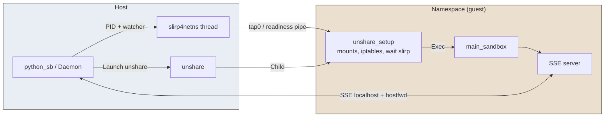

# Unshare

**Unshare** is an **OS-sandbox** provider that runs code in Linux namespaces with a **user-mode network stack** (slirp4netns) and iptables-based socket rules. It enables isolation of filesystem, network, and other resources without requiring root for the application. See the [unshare(2) documentation](https://man7.org/linux/man-pages/man2/unshare.2.html) for details.

## Solution in brief

The **host daemon** builds an `UnshareSetupConfig` (DNS, mounts, netfilter rules, named pipe path, ignore paths) and launches **unshare** with flags from the template plus `unshare.*` parameters. The command line is:

`unshare <flags> -- python -m pysandboxes.remote.unshare_setup <config_path> -- python -m pysandboxes.remote.main_sandbox ...`

There is **no intermediate `unshare_launcher` process**; the daemon owns **slirp4netns** lifecycle: after the `unshare` process starts, a **background thread** on the host runs slirp4netns (see `slirp4netns_common.py`) using a PID file, signals readiness on a pipe read inside **unshare_setup**, then optional **port forwarding** via the slirp API. **unshare_setup** brings up the namespace (tap, routes), applies bind mounts and overlay for ignore rules, writes **/etc/hosts** entries for relevant OUT ALLOW hostnames, configures **iptables** from socket rules, and **execs** into `main_sandbox` with config delivered through a **named FIFO** (same mechanism as other subprocess daemons: `DaemonParameters` written by the host for the child to read). The host talks to the sandbox via SSE on `http://localhost:PORT` (forwarded through slirp). Root is not required on the host to configure firewall rules **inside** the namespace.

## Advantages


| Aspect                             | Detail                                                                                                                                        |
| ---------------------------------- | --------------------------------------------------------------------------------------------------------------------------------------------- |
| **Isolation**                      | Full namespace stack (user, mount, network, etc.) with user-mode networking (slirp4netns) and iptables.                                       |
| **No root**                        | Unprivileged user namespaces; no root required for firewall rules inside the sandbox.                                                         |
| **Containers**                     | Works in Docker, Podman, and Kubernetes with appropriate capabilities (SYS_ADMIN, NET_ADMIN) and securityContext.                             |
| **Alignment with other providers** | Same API (SSE, `call_in_sandbox`) as bwrap/firejail; slirp watcher and host port forwards are shared with the bwrap “network filtering” path. |


## Disadvantages


| Aspect                       | Detail                                                                                                                                          |
| ---------------------------- | ----------------------------------------------------------------------------------------------------------------------------------------------- |
| **Prerequisites**            | Requires `kernel.unprivileged_userns_clone=1`, slirp4netns, iptables; AppArmor may restrict unprivileged user namespaces.                       |
| **Privileges in containers** | Docker/Podman/Kubernetes need `--privileged` or added capabilities (SYS_ADMIN, NET_ADMIN) and often `seccompProfile: Unconfined` or equivalent. |
| **Execution model**          | Code runs as local `root` inside the sandbox; some applications may behave differently.                                                         |


## How it works

1. **Host daemon**: Builds `UnshareSetupConfig` (DNS list—slirp’s resolver **10.0.2.3** is primary so resolution works through **tap0**; upstream host DNS may be merged when not in a simple container), **hosts** lines for OUT ALLOW hostnames, **mounts** (system paths, Python, file rules), **netfilter** from socket rules, **ignore_paths** for overlay, and the **named pipe** path for the sandbox runtime config.
2. **Config hand-off**: The JSON config is written to a path under the daemon’s temp directory (FIFO in normal mode, or a plain file when debug launch is enabled) so the child can read it even when the project tree is not visible after namespace setup (e.g. some Docker layouts).
3. **Launch**: `unshare [template flags + unshare.*] -- python -m pysandboxes.remote.unshare_setup <config> -- <main_sandbox argv>`. Environment includes `PYTHONPATH` pointing at the project root so the child can import `pysandboxes` after mount namespaces change, plus `SLIRP_READY_FD` / `PID_FILE` for coordination with slirp4netns.
4. **slirp4netns (host)**: The daemon writes the **unshare** PID to a pidfile and starts the **slirp watcher thread**; slirp attaches to that PID’s network namespace, creates **tap0**, and signals readiness on the pipe. `unshare_setup` blocks until readiness, then ensures the interface and default route (slirp uses **10.0.2.2** as gateway, guest address **10.0.2.100** in the shared helper constants).
5. **unshare_setup**: Applies mounts (including chroot-style layout as configured), **iptables**, **hosts**, then the daemon writes `DaemonParameters` to the FIFO for `main_sandbox`.
6. **Port forwarding**: From socket rules, **inbound ALLOW** TCP/UDP ports (plus the SSE port) are registered with slirp’s `add_hostfwd` API so host **127.0.0.1** reaches the guest on the same port (same mechanism as bwrap’s filtering mode).
7. **main_sandbox**: Loads the config from the pipe, applies Python guards, starts the SSE server and serves RPC.




## Prerequisites

### User namespaces (userns clone)

To use unshare, install [slirp4netns](https://manpages.debian.org/experimental/slirp4netns/slirp4netns.1.en.html) and [iptables](https://man7.org/linux/man-pages/man8/iptables.8.html), and ensure `kernel.unprivileged_userns_clone` is set to `1` (typically enabled by default).

```bash
# Verify permissions
sudo sysctl kernel.unprivileged_userns_clone  # Must be 1
sudo sysctl kernel.apparmor_restrict_unprivileged_userns # Must be 0

# Configure permissions
sudo sysctl -w kernel.unprivileged_userns_clone=1
sudo sysctl -w kernel.apparmor_restrict_unprivileged_userns=0

# Permanently configure permissions
echo -e "kernel.unprivileged_userns_clone = 1
kernel.apparmor_restrict_unprivileged_userns = 0" | sudo tee /etc/sysctl.d/99-userns.conf > /dev/null
sudo sysctl -p /etc/sysctl.d/99-userns.conf

# Check
unshare -U -r /bin/sh -c "whoami"

# Install slirp4netns and iptables
sudo apt install slirp4netns iptables
```

### AppArmor

If AppArmor restricts unprivileged user namespaces:

```bash
sudo sysctl -w kernel.apparmor_restrict_unprivileged_userns=0
```

```bash
echo "kernel.apparmor_restrict_unprivileged_userns = 0" | sudo tee /etc/sysctl.d/60-apparmor-unprivileged.conf
```

## Execution model

When launched, code runs as local `root` inside the sandbox. This user has no elevated privileges on the host once directory mounts and iptables rules are active.

> **Note:** Some applications may behave differently when running as the 'root' user.

## Using with Docker

Unshare is compatible with Docker, though it requires elevated privileges. The project uses **one image per OS provider**: the image for unshare is `python-sb-unshare` (tagged e.g. `:latest` or `:3.12`). Build it from the project root with:

```bash
make build-image-unshare
```

Then run with the code mounted and the provider image:

```bash
docker \
  run -it --rm \
  --privileged \
  --network bridge \
  -v "$(pwd)":/app \
  -w /app \
  python-sb-unshare:latest \
  sh -c 'pip install -e . && OS_SANDBOX=unshare python-sb -m tests.integration_tests.tst_usage'
```

## Using with Podman

Unshare is compatible with Podman, though it requires elevated privileges. Use the same provider image as for Docker:

```bash
make build-image-unshare
```

```bash
podman \
  run -it --rm \
  --privileged \
  --network bridge \
  -v "$(pwd)":/app \
  -w /app \
  python-sb-unshare:latest \
  sh -c 'pip install -e . && OS_SANDBOX=unshare python-sb -m tests.integration_tests.tst_usage'
```

## Using with Kubernetes

Use the **provider image** `python-sb-unshare:latest` (built with `make build-image-unshare`). For minikube, build the images on the host and load them into the cluster: `make minikube-build-images` (runs `make build-images`, then `minikube image load` for each image). For this provider only: `make build-image-unshare` then `minikube image load python-sb-unshare:latest`.

Example YAML configuration:

```yaml
apiVersion: v1
kind: Pod
metadata:
  name: pysandboxes-test
spec:
  containers:
    - name: pysandboxes-test
      image: python-sb-unshare:latest
      imagePullPolicy: Never   # Image loaded into minikube (make minikube-build-images)
      workingDir: /app
      securityContext:
        privileged: true      # Or add SYS_ADMIN + NET_ADMIN + seccompProfile: Unconfined
        capabilities:
          add:
            - SYS_ADMIN    # Allows unshare (namespace creation)
            - NET_ADMIN    # Allows network configuration (ip link, etc.)
        seccompProfile:
          type: Unconfined   # Disables the filter blocking unshare
      command: [ "/bin/sh", "-c", "sleep infinity" ]
      volumeMounts:
        - name: code-local
          mountPath: /app
        - name: dev-net-tun
          mountPath: /dev/net/tun   # Required by slirp4netns
  volumes:
    - name: code-local
      hostPath:
        path: /mnt/pysandboxes
        type: Directory
    - name: dev-net-tun
      hostPath:
        path: /dev/net/tun
        type: CharDevice
```

Run the tests from the host (pod stays alive; tests run via `kubectl exec`). Example with minikube:

```bash
minikube mount "$(pwd):/mnt/pysandboxes" &
make minikube-build-images
kubectl apply -f tests/containers_tests/kube-pysandboxes.yaml
# Then run the container test suite: make container-tests (or pytest tests/containers_tests/)
kubectl delete pod pysandboxes-test
```

## Configuration parameters

You can add unshare-specific options in `.py-sandboxes`. Any line of the form `unshare.<option>=<value>` is appended to the `unshare` invocation after the template flags: non-empty values become `--<option>=<value>`, empty values become `--<option>`. See `pysandboxes/templates/unshare.template` and `unshare_sse_daemon.py` for the default flag set and how they combine with overrides.