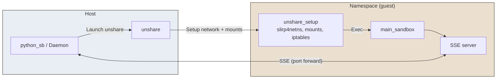

# Unshare

**Unshare** is an **OS-sandbox** provider that runs code in Linux namespaces with a **user-mode network stack** (slirp4netns) and iptables-based socket rules. It enables isolation of filesystem, network, and other resources without requiring root for the application. See the [unshare(2) documentation](https://man7.org/linux/man-pages/man2/unshare.2.html) for details.

## Solution in brief

The host runs `unshare` with flags from a template (user, mount, net, etc.), then executes `unshare_setup` which starts slirp4netns for the network, applies bind mounts and overlay for ignore rules, configures iptables from socket rules, and launches `main_sandbox` with config from a named pipe. The host talks to the sandbox via SSE on a forwarded port. Root is not required to configure firewall rules inside the namespace.

## Advantages

| Aspect | Detail |
|--------|--------|
| **Isolation** | Full namespace stack (user, mount, network, etc.) with user-mode networking (slirp4netns) and iptables. |
| **No root** | Unprivileged user namespaces; no root required for firewall rules inside the sandbox. |
| **Containers** | Works in Docker, Podman, and Kubernetes with appropriate capabilities (SYS_ADMIN, NET_ADMIN) and securityContext. |
| **Alignment with other providers** | Same API (SSE, `call_in_sandbox`) and config flow (named pipe) as bwrap/firejail. |

## Disadvantages

| Aspect | Detail |
|--------|--------|
| **Prerequisites** | Requires `kernel.unprivileged_userns_clone=1`, slirp4netns, iptables; AppArmor may restrict unprivileged user namespaces. |
| **Privileges in containers** | Docker/Podman/Kubernetes need `--privileged` or added capabilities (SYS_ADMIN, NET_ADMIN) and often `seccompProfile: Unconfined` or equivalent. |
| **Execution model** | Code runs as local `root` inside the sandbox; some applications may behave differently. |

## How it works

1. **Host**: The daemon builds an `UnshareSetupConfig` (DNS, mounts, netfilter rules, named pipe path, ignore paths) and the unshare flags from the template plus `unshare.*` params. It starts `unshare [flags] -- unshare_setup` (or equivalent) which receives the config.
2. **unshare_setup**: Starts slirp4netns for the network namespace, applies bind mounts (read-only and read-write from file rules), overlay for ignore paths, writes hosts entries for ALLOW rules, configures iptables from socket rules, then execs `main_sandbox --_named-pipe <path>`.
3. **main_sandbox**: Loads the config from the pipe, applies Python guards, starts the SSE server on the expected port and waits for requests.
4. **Communication**: The host connects to the sandbox via SSE (port forwarding through slirp4netns or published port in containers).



## Prerequisites

### User namespaces (userns clone)

To use unshare, install [slirp4netns](https://manpages.debian.org/experimental/slirp4netns/slirp4netns.1.en.html) and [iptables](https://man7.org/linux/man-pages/man8/iptables.8.html), and ensure `kernel.unprivileged_userns_clone` is set to `1` (typically enabled by default).

```bash
# Verify permissions
sudo sysctl kernel.unprivileged_userns_clone  # Must be 1
sudo sysctl kernel.apparmor_restrict_unprivileged_userns # Must be 0

# Configure permissions
sudo sysctl -w kernel.unprivileged_userns_clone=1
sudo sysctl -w kernel.apparmor_restrict_unprivileged_userns=0

# Permanently configure permissions
echo -e "kernel.unprivileged_userns_clone = 1
kernel.apparmor_restrict_unprivileged_userns = 0" | sudo tee /etc/sysctl.d/99-userns.conf > /dev/null
sudo sysctl -p /etc/sysctl.d/99-userns.conf

# Check
unshare -U -r /bin/sh -c "whoami"

# Install slirp4netns and iptables
sudo apt install slirp4netns iptables
```

### AppArmor

If AppArmor restricts unprivileged user namespaces:

```bash
sudo sysctl -w kernel.apparmor_restrict_unprivileged_userns=0
```

```bash
echo "kernel.apparmor_restrict_unprivileged_userns = 0" | sudo tee /etc/sysctl.d/60-apparmor-unprivileged.conf
```

## Execution model

When launched, code runs as local `root` inside the sandbox. This user has no elevated privileges on the host once directory mounts and iptables rules are active.

> **Note:** Some applications may behave differently when running as the 'root' user.

## Using with Docker

Unshare is compatible with Docker, though it requires elevated privileges. The project uses **one image per OS provider**: the image for unshare is `python-sb-unshare` (tagged e.g. `:latest` or `:3.12`). Build it from the project root with:

```bash
make build-image-unshare
```

Then run with the code mounted and the provider image:

```bash
docker \
  run -it --rm \
    --privileged \
    --network bridge \
    -v "$(pwd)":/app \
    -w /app \
    python-sb-unshare:latest \
    sh -c 'pip install -e . && OS_SANDBOX=unshare python-sb -m tests.integration_tests.tst_usage'
```

## Using with Podman

Unshare is compatible with Podman, though it requires elevated privileges. Use the same provider image as for Docker:

```bash
make build-image-unshare
```

```bash
podman \
  run -it --rm \
    --privileged \
    --network bridge \
    -v "$(pwd)":/app \
    -w /app \
    python-sb-unshare:latest \
    sh -c 'pip install -e . && OS_SANDBOX=unshare python-sb -m tests.integration_tests.tst_usage'
```

## Using with Kubernetes

Use the **provider image** `python-sb-unshare:latest` (built with `make build-image-unshare`). For minikube, build images in the cluster’s Docker daemon: `eval $(minikube docker-env)` then `make build-images` (or `make build-image-unshare` for this provider only).

Example YAML configuration:

```yaml
apiVersion: v1
kind: Pod
metadata:
  name: pysandboxes-test
spec:
  containers:
    - name: pysandboxes-test
      image: python-sb-unshare:latest
      imagePullPolicy: Never   # Image built locally (e.g. in minikube)
      workingDir: /app
      securityContext:
        privileged: true      # Or add SYS_ADMIN + NET_ADMIN + seccompProfile: Unconfined
        capabilities:
          add:
            - SYS_ADMIN    # Allows unshare (namespace creation)
            - NET_ADMIN    # Allows network configuration (ip link, etc.)
        seccompProfile:
          type: Unconfined   # Disables the filter blocking unshare
      command: [ "/bin/sh", "-c", "sleep infinity" ]
      volumeMounts:
        - name: code-local
          mountPath: /app
        - name: dev-net-tun
          mountPath: /dev/net/tun   # Required by slirp4netns
  volumes:
    - name: code-local
      hostPath:
        path: /mnt/pysandboxes
        type: Directory
    - name: dev-net-tun
      hostPath:
        path: /dev/net/tun
        type: CharDevice
```

Run the tests from the host (pod stays alive; tests run via `kubectl exec`). Example with minikube:

```bash
minikube mount "$(pwd):/mnt/pysandboxes" &
eval $(minikube docker-env) && make build-images
kubectl apply -f tests/containers_tests/kube-pysandboxes.yaml
# Then run the container test suite: make container-tests (or pytest tests/containers_tests/)
kubectl delete pod pysandboxes-test
```

## Configuration parameters

You can add unshare-specific options in `.py-sandboxes`. Any line of the form `unshare.<option>=<value>` is passed through to the unshare setup (e.g. as unshare flags or config). See the daemon and template for supported options.
